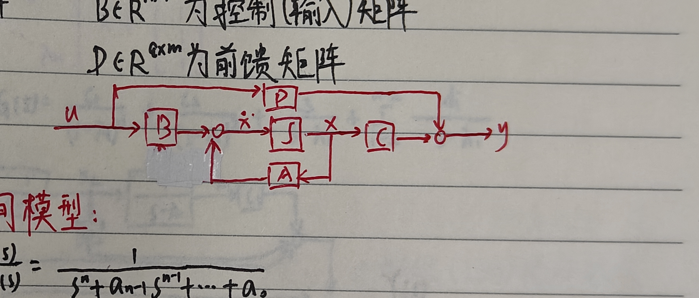
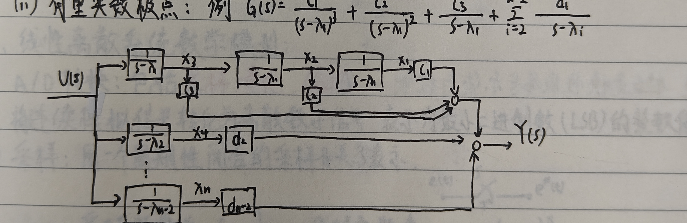

# 一、状态空间模型

## 1. 状态

状态：系统的<strong>最小一组变量</strong>。由 $t=t_0$ 时的状态变量及 $t>t_0$ 时的输入，可完全确定系统未来时刻的行为。

状态变量：确定动态系统状态的<strong>最小一组变量</strong> $x_1(t),\ldots,x_n(t)$，构成<strong>极大线性无关组</strong>。

状态向量：

$$
x(t)=[x_1(t)\ \cdots\ x_n(t)]^T.
$$

状态空间：状态向量张成的空间。

<strong>状态方程：</strong>

$$
\dot x=Ax+Bu,
$$

它是状态与输入间关系的一阶微分方程组。

<strong>输出方程：</strong>

$$
y=Cx+Du,
$$

它描述输出与状态、输入间的关系，其中 $u$ 为输入。

<strong>状态空间表达式＝状态方程＋输出方程。</strong>

## 2. 状态空间表达式

$$
\begin{cases}
\dot x(t)=Ax(t)+Bu(t),\\
y(t)=Cx(t)+Du(t),
\end{cases}
$$

其中

$$
x\in\mathbb R^n,\qquad u\in\mathbb R^m,\qquad y\in\mathbb R^q,
$$

初始条件为

$$
x_0=x(0),\qquad t>0.
$$

各矩阵含义为

$$
A\in\mathbb R^{n\times n}\text{ 为状态（系统）矩阵},
$$

$$
B\in\mathbb R^{n\times m}\text{ 为控制（输入）矩阵},
$$

$$
C\in\mathbb R^{q\times n}\text{ 为输出矩阵},
$$

$$
D\in\mathbb R^{q\times m}\text{ 为前馈矩阵}.
$$

记作

$$
\Sigma(A,B,C,D).
$$

## 3. 传递函数转换为状态空间模型

### （1）分子为常数项

设

$$
G(s)=\frac{Y(s)}{U(s)}
=\frac{1}{s^n+a_{n-1}s^{n-1}+\cdots+a_0}.
$$

由 Laplace 反变换，

$$
\frac{d^ny(t)}{dt^n}+a_{n-1}\frac{d^{n-1}y(t)}{dt^{n-1}}+\cdots+a_0y(t)=u(t).
$$

令状态变量

$$
x_1=y,quad x_2=\dot y,quad \ldots,quad x_n=y^{(n-1)},
$$

则

$$
\dot x(t)=
\begin{bmatrix}
0&1&0&\cdots&0\\
0&0&1&\cdots&0\\
\vdots&\vdots&\vdots&\ddots&\vdots\\
0&0&0&\cdots&1\\
-a_0&-a_1&-a_2&\cdots&-a_{n-1}
\end{bmatrix}x(t)
+
\begin{bmatrix}0\\0\\\vdots\\0\\1\end{bmatrix}u(t),
$$

$$
y(t)=[1\ 0\ \cdots\ 0]x(t).
$$

### （2）分子为多项式，且次数小于分母

设

$$
G(s)=\frac{Y(s)}{U(s)}
=\frac{b_ms^m+b_{m-1}s^{m-1}+\cdots+b_1s+b_0}
{s^n+a_{n-1}s^{n-1}+\cdots+a_0},\qquad n>m.
$$

令

$$
Y(s)=X_1(s)(b_ms^m+b_{m-1}s^{m-1}+\cdots+b_1s+b_0),
$$

则

$$
\frac{X_1(s)}{U(s)}=\frac{1}{s^n+a_{n-1}s^{n-1}+\cdots+a_0}.
$$

由（1），令

$$
x_1=x_i,\quad x_2=\dot x_i,\quad \ldots,\quad x_n=x_i^{(n-1)},
$$

状态方程仍为

$$
\dot x(t)=
\begin{bmatrix}
0&1&0&\cdots&0\\
0&0&1&\cdots&0\\
\vdots&\vdots&\vdots&\ddots&\vdots\\
0&0&0&\cdots&1\\
-a_0&-a_1&-a_2&\cdots&-a_{n-1}
\end{bmatrix}x(t)
+
\begin{bmatrix}0\\0\\\vdots\\0\\1\end{bmatrix}u(t).
$$

由 Laplace 反变换，

$$
y(t)=b_mx_i^{(m)}+b_{m-1}x_i^{(m-1)}+\cdots+b_0x_i,
$$

故输出方程为

$$
y(t)=[b_0\ b_1\ \cdots\ b_m\ 0\ \cdots\ 0]x(t).
$$

### （3）由部分分式展开求状态空间表达式

#### i）只有两两相异的实极点

$$
G(s)=\sum_{i=1}^n\frac{c_i}{s-\lambda_i}=\frac{Y(s)}{U(s)}.
$$

令

$$
X_i(s)=\frac{U(s)}{s-\lambda_i},\qquad i=1,\ldots,n,
$$

则

$$
y(t)=c_1x_1+\cdots+c_nx_n,\qquad y=[c_1\ c_2\ \cdots\ c_n]x.
$$

由

$$
\dot x_i=\lambda_ix_i+u,
$$

得状态方程

$$
\dot x=
\begin{bmatrix}
\lambda_1&&0\\
&\ddots&\\
0&&\lambda_n
\end{bmatrix}x+
\begin{bmatrix}1\\\vdots\\1\end{bmatrix}u.
$$

#### ii）有重复实数极点

例如

$$
G(s)=\frac{c_1}{(s-\lambda_1)^3}+\frac{c_2}{(s-\lambda_1)^2}
+\frac{c_3}{s-\lambda_1}+\sum_{i=2}^{n-2}\frac{d_i}{s-\lambda_i}.
$$

如图，

$$
X_1(s)=\frac{1}{s-\lambda_1}X_2(s),\qquad
X_2(s)=\frac{1}{s-\lambda_1}X_3(s),
$$

$$
X_3(s)=\frac{1}{s-\lambda_1}U(s),\qquad
X_4(s)=\frac{1}{s-\lambda_2}U(s),quad\ldots,quad
X_n(s)=\frac{1}{s-\lambda_{n-2}}U(s).
$$

于是可写出相应的 Jordan 型状态空间表达式。

## 4. 状态空间模型转换为传递函数

由

$$
\begin{cases}
\dot x(t)=Ax(t)+Bu(t),\\
y(t)=Cx(t)+Du(t),
\end{cases}
$$

在零初始条件下作 Laplace 变换：

$$
\begin{cases}
sX(s)=AX(s)+BU(s),\\
Y(s)=CX(s)+DU(s).
\end{cases}
$$

因此

$$
X(s)=(sI-A)^{-1}BU(s),
$$

$$
Y(s)=C(sI-A)^{-1}BU(s)+DU(s),
$$

传递函数矩阵为

$$
G(s)=C(sI-A)^{-1}B+D.
$$

### （1）等价状态空间模型

对系统 $\Sigma(A,B,C,D)$ 作线性变换

$$
\bar x=Tx,
$$

其中 $T$ 为 $n\times n$ 非奇异矩阵，则得到系统 $\bar\Sigma(\bar A,\bar B,\bar C,\bar D)$：

$$
\bar A=TAT^{-1},\qquad \bar B=TB,\qquad \bar C=CT^{-1},\qquad \bar D=D,
$$

$$
\bar x(0)=Tx(0).
$$

系统 $\bar\Sigma$ 与 $\Sigma$ 等价。

### （2）等价模型的不变量

等价的状态空间模型具有相同的<strong>传递函数、特征多项式、特征方程和极点</strong>，即 $A$ 的特征值、特征多项式和极点不变。

证明：

$$
\det(sI-\bar A)=\det\left[T(sI-A)T^{-1}\right]=\det(sI-A),
$$

$$
\begin{aligned}
\bar G(s)
&=\bar C(sI-\bar A)^{-1}\bar B+\bar D\\
&=CT^{-1}(sI-TAT^{-1})^{-1}TB+D\\
&=C(sI-A)^{-1}B+D=G(s).
\end{aligned}
$$
