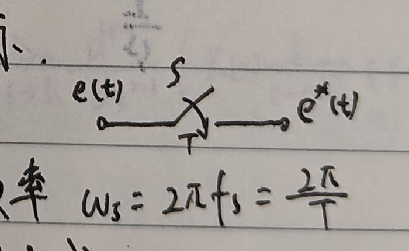
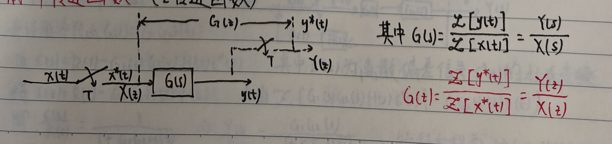
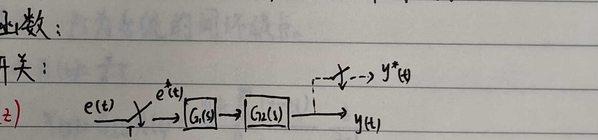
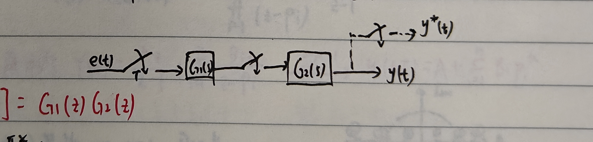
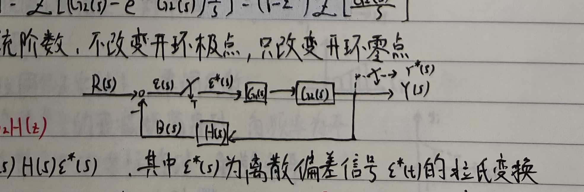

# 二、线性离散系统数学模型

## 1. A/D 转换

A/D 转换包括<strong>采样、量化、编码</strong>，将连续模拟信号转化为离散数字信号。数字信号可表示为最小二进制数（LSB）的整数倍。

### （1）采样

用一个周期性闭合的采样开关 $S$ 表示。

采样频率为

$$
f_s=\frac1T,
$$

采样角频率为

$$
\omega_s=2\pi f_s=\frac{2\pi}{T}.
$$

理想采样：采样时长 $\tau\ll T$，即瞬间完成，且

$$
e(kT)=e^*(kT).
$$

采样可看作脉冲调制过程。记

$$
\delta_T(t)=\sum_{k=0}^{\infty}\delta(t-kT),
$$

则

$$
e^*(t)=e(t)\delta_T(t).
$$

Laplace 变换：

$$
E^*(s)=\mathcal L[e^*(t)]
=e(0)+e(T)e^{-Ts}+e(2T)e^{-2Ts}+\cdots.
$$

$Z$ 变换：

$$
E^*(z)=E^*(s)\big|_{s=\frac1T\ln z}
=e(0)+e(T)z^{-1}+e(2T)z^{-2}+\cdots.
$$

### （2）将 $\delta_T(t)$ 展开为 Fourier 级数

$$
\delta_T(t)=\frac1T\sum_{n=-\infty}^{\infty}e^{jn\omega_st},
\qquad x^*(t)=x(t)\delta_T(t).
$$

作 Laplace 变换：

$$
X^*(s)=\mathcal L[x^*(t)]
=\frac1T\sum_{n=-\infty}^{\infty}X(s-jn\omega_s).
$$

极点均存在于 $s$ 平面时，有

$$
X^*(j\omega)=X^*(s)\big|_{s=j\omega}
=\frac1T\sum_{n=-\infty}^{\infty}X\bigl(j(\omega-n\omega_s)\bigr).
$$

## 2. D/A 转换

常用零阶保持器（ZOH）：

$$
g_h(t)=1(t)-1(t-T).
$$

将采样时刻的离散信号值作为常值保持到下一个相邻采样时刻。

$$
G_h(s)=\frac{1-e^{-Ts}}{s},
$$

$$
G_h(j\omega)=T\operatorname{Sa}\left(\frac{\omega T}{2}\right)e^{-j\omega T/2}
\approx Te^{-j\omega T/2}.
$$

零阶保持器相当于低通滤波器。

## 3. $Z$ 变换与 $Z$ 反变换

定义复变量

$$
z=e^{Ts}.
$$

对离散时间信号

$$
x^*(t)=\sum_{k=0}^{\infty}x(kT)\delta(t-kT),
$$

由

$$
X^*(s)=\sum_{k=0}^{\infty}x(kT)e^{-kTs},
$$

有

$$
X(z)=\mathcal Z[x^*(t)]
=\sum_{k=0}^{\infty}x(kT)z^{-k}.
$$

<strong>$Z$ 变换只针对离散系统而言，差分方程在 $Z$ 域中对应代数方程。</strong>

$X(z)$ 只对应唯一的 $x^*(t)$，不对应唯一的连续信号 $x(t)$。

### （1）$Z$ 变换方法

1. 按照定义进行等比数列级数求和；
2. 部分分式展开；
3. 留数法。若已知 $X(z)$ 的全部极点 $s_i$，$i=1,\ldots,n$，则

$$
X(z)=\sum_{i=1}^{n}\operatorname{Res}left[X(s)\frac{z}{z-e^{sT}}\right]_{s=s_i}.
$$

对非重极点 $s_i$，

$$
\operatorname{Res}\left[X(s)\frac{z}{z-e^{sT}}\right]_{s=s_i}
=\lim_{s\to s_i}\left[X(s)\frac{z}{z-e^{sT}}(s-s_i)\right].
$$

对 $r$ 重极点 $s_i$，

$$
\operatorname{Res}\left[X(s)\frac{z}{z-e^{sT}}\right]_{s=s_i}
=\frac1{(r-1)!}\lim_{s\to s_i}\frac{d^{r-1}}{ds^{r-1}}
\left[X(s)\frac{z}{z-e^{sT}}(s-s_i)^r\right].
$$

### （2）$Z$ 变换的性质和定理

#### i）线性性质

#### ii）位移性质

滞后定理：

$$
\mathcal Z[x(t-nT)]=z^{-n}X(z).
$$

超前定理：

$$
\mathcal Z[x(t+nT)]
=z^n\left[X(z)-\sum_{k=0}^{n-1}x(kT)z^{-k}\right].
$$

由定义，

$$
\begin{aligned}
\mathcal Z[x(t-nT)]
&=\sum_{k=0}^{\infty}x(kT-nT)z^{-k}\\
&=\sum_{m=-n}^{\infty}x(mT)z^{-m-n}\\
&=z^{-n}\sum_{m=0}^{\infty}x(mT)z^{-m}=z^{-n}X(z),
\end{aligned}
$$

其中 $k<0$ 时 $x(kT)=0$。

同理，

$$
\mathcal Z[x(t+nT)]
=z^n\left(\sum_{m=0}^{\infty}x(mT)z^{-m}-\sum_{m=0}^{n-1}x(mT)z^{-m}\right).
$$

#### iii）初值定理

$$
x(0)=\lim_{t\to0}x^*(t)=\lim_{k\to0}x(kT)=\lim_{z\to\infty}X(z).
$$

终值定理：若 $(z-1)X(z)$ 的全部极点均位于单位圆内，则

$$
x(\infty)=\lim_{t\to\infty}x^*(t)
=\lim_{k\to\infty}x(kT)
=\lim_{z\to1}(z-1)X(z).
$$

#### iv）卷积定理

对离散卷积

$$
y(kT)=x_1(kT)*x_2(kT)
=\sum_{m=0}^{\infty}x_1(mT)x_2(kT-mT),
$$

有

$$
X_1(z)X_2(z)
=\mathcal Z\left[\sum_{m=0}^{\infty}x_1(mT)x_2(kT-mT)\right].
$$

### （3）$Z$ 反变换方法

$X(z)\xrightarrow{\mathcal Z^{-1}}x^*(t)$ 为离散序列，对应的不是唯一的 $x(t)$。

#### i）长除法

设

$$
X(z)=\frac{N(z)}{D(z)}
=\frac{b_0+b_1z^{-1}+\cdots+b_mz^{-m}}
{a_0+a_1z^{-1}+\cdots+a_nz^{-n}},\qquad n\ge m.
$$

长除后

$$
X(z)=x(0)+x(T)z^{-1}+x(2T)z^{-2}+\cdots,
$$

故

$$
x^*(t)=x(0)\delta(t)+x(T)\delta(t-T)+\cdots.
$$

#### ii）部分分式法

若 $X(z)$ 的极点为 $z_1,\ldots,z_n$ 且无重根，将

$$
\frac{X(z)}z=\sum_{i=1}^{n}\frac{A_i}{z-z_i},
$$

则

$$
X(z)=\sum_{i=1}^{n}\frac{A_iz}{z-z_i}.
$$

#### iii）留数计算法

$$
x(kT)=\sum\operatorname{Res}[X(z)z^{k-1}],
$$

$$
x^*(t)=\sum_{k=0}^{\infty}x(kT)\delta(t-kT).
$$

## 4. 脉冲传递函数（$Z$ 传递函数）

线性离散系统有三种数学模型：<strong>差分方程（时域）、脉冲传递函数（复频域）、离散状态空间。</strong>

### （1）线性常系数差分方程

$n$ 阶后向差分方程为

$$
y(k)+a_1y(k-1)+\cdots+a_ny(k-n)
=b_0r(k)+\cdots+b_mr(k-m),\qquad n\ge m.
$$

$k$ 时刻的输出 $y(k)$ 与以前的输入和以前的输出有关。

$n$ 阶前向差分方程为

$$
y(k+n)+a_1y(k+n-1)+\cdots+a_ny(k)
=b_0r(k+m)+\cdots+b_mr(k).
$$

差分方程可用以下方法求解：

1. 迭代递推；
2. 对方程两边作 $Z$ 变换，求 $Y(z)$ 后再作逆变换。

### （2）脉冲传递函数

物理意义：已知连续系统传递函数为 $G(s)$，则通过单位脉冲响应 $g(t)$ 的采样序列 $g^*(t)$，可得脉冲传递函数

$$
G(z)=\mathcal Z[g^*(t)].
$$

输入脉冲序列为

$$
x^*(t)=\sum_{k=0}^{\infty}x(kT)\delta(t-kT),
$$

输出为脉冲响应和

$$
y(t)=\sum_{k=0}^{\infty}x(kT)g(t-kT).
$$

因 $t<0$ 时 $g(t)=0$，

$$
y(kT)=\sum_{h=0}^{k}x(hT)g((k-h)T)
=\sum_{h=0}^{\infty}x(hT)g((k-h)T).
$$

所以

$$
y^*(t)=\sum_{k=0}^{\infty}y(kT)\delta(t-kT),
\qquad
Y(z)=\sum_{k=0}^{\infty}y(kT)z^{-k}.
$$

令 $m=k-h$，则

$$
\begin{aligned}
Y(z)
&=\sum_{m=-h}^{\infty}\left(\sum_{h=0}^{\infty}x(hT)g(mT)\right)z^{-m-h}\\
&=\left(\sum_{m=0}^{\infty}g(mT)z^{-m}\right)
\left(\sum_{h=0}^{\infty}x(hT)z^{-h}\right)\\
&=G(z)X(z).
\end{aligned}
$$

因此

$$
G(z)=\frac{Y(z)}{X(z)}.
$$

性质：$G(z)$ 为关于 $z$ 的复函数，<strong>与输入、输出序列无关，仅与系统结构参数有关</strong>；它与系统差分方程一一对应，也对应 $z$ 平面零极点图。

局限性：不仅缺全部信息，只适合单输入单输出系统和线性定常离散系统。

### （3）串联环节的脉冲传递函数

#### i）串联环节间无同步采样开关

$$
G(z)=\mathcal Z[G_{11}(s)G_{12}(s)]\ne G_{11}(z)G_{12}(z).
$$

#### ii）串联环节间有同步采样开关

$$
G(z)=\mathcal Z[G_{11}(s)]\,\mathcal Z[G_{12}(s)]
=G_{11}(z)G_{12}(z).
$$

#### iii）零阶保持器与环节串联

$$
G(z)=\mathcal Z[G_h(s)G_{12}(s)]
=\mathcal Z\left[G_{12}(s)\frac{1-e^{-Ts}}s\right]
=(1-z^{-1})\mathcal Z\left[\frac{G_{12}(s)}s\right].
$$

所以 ZOH 不改变系统阶数，不改变开环极点，只改变开环零点。

#### iv）闭环脉冲传递函数

开环脉冲传递函数为

$$
G(z)=G_1G_{12}H(z).
$$

由

$$
\varepsilon(s)=R(s)-G_1(s)G_{12}(s)H(s)\varepsilon^*(s),
$$

其中 $\varepsilon^*(s)$ 为离散偏差信号 $\varepsilon^*(t)$ 的拉氏变换，有

$$
\varepsilon(z)=R(z)-G_1G_{12}H(z)\varepsilon(z),
$$

即

$$
\frac{\varepsilon(z)}{R(z)}
=\frac1{1+G_1G_{12}H(z)}.
$$

因此

$$
\frac{Y(z)}{R(z)}
=\frac{G_1G_{12}(z)}{1+G_1G_{12}H(z)},
$$

特征方程为

$$
1+G_1G_{12}H(z)=0.
$$

## 5. 离散空间状态表达

### （1）差分方程化为离散状态方程

$$
y(k+n)+a_1y(k+n-1)+\cdots+a_ny(k)=bu(k).
$$

令

$$
x_1(k)=y(k),\quad x_2(k)=y(k+1),\quad\ldots,\quad x_n(k)=y(k+n-1),
$$

则

$$
x(k+1)=
\begin{bmatrix}
0&1&0&\cdots&0\\
0&0&1&\cdots&0\\
\vdots&\vdots&\vdots&\ddots&\vdots\\
0&0&0&\cdots&1\\
-a_n&-a_{n-1}&-a_{n-2}&\cdots&-a_1
\end{bmatrix}x(k)
+
\begin{bmatrix}0\\\vdots\\0\\b\end{bmatrix}u(k),
$$

$$
y(k)=[1\ 0\ \cdots\ 0]x(k).
$$

### （2）脉冲传递函数化为离散状态方程

若

$$
G(z)=d+\sum_{i=1}^{n}\frac{k_i}{z-z_i},
$$

取

$$
X_i(z)=\frac1{z-z_i}U(z),
$$

再进行 $Z$ 反变换。
