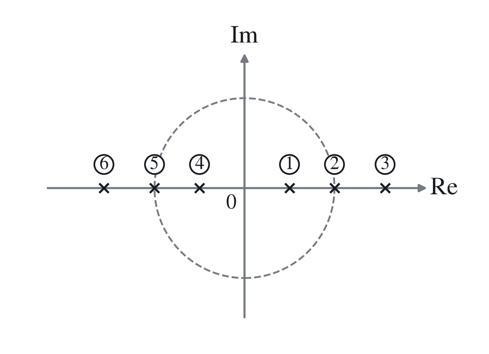
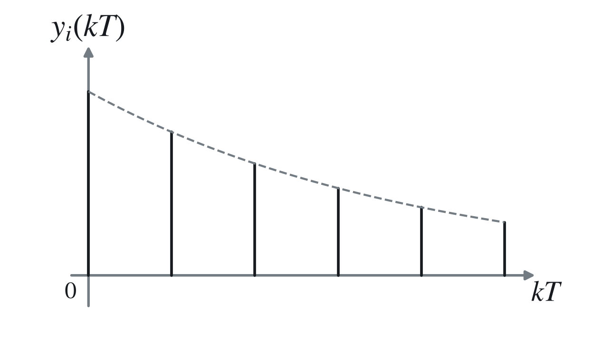
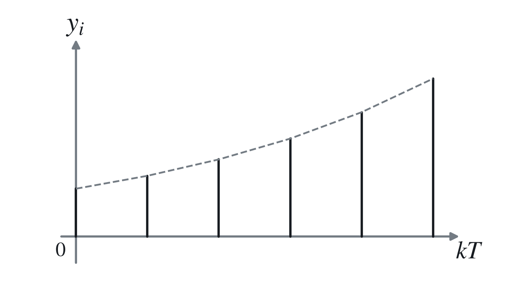
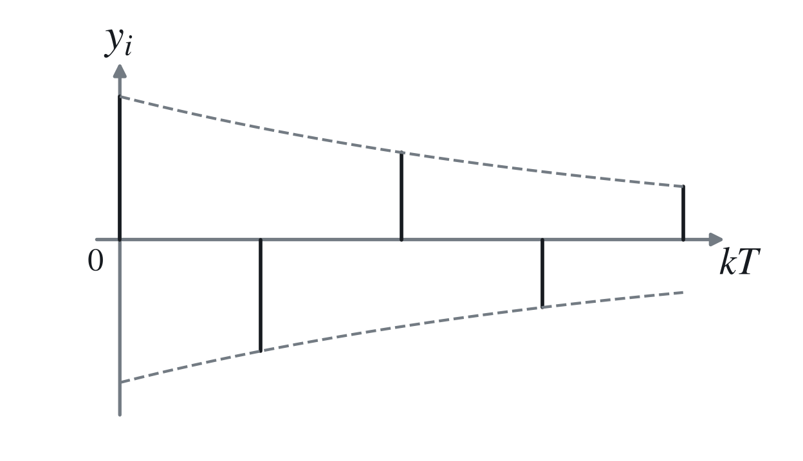
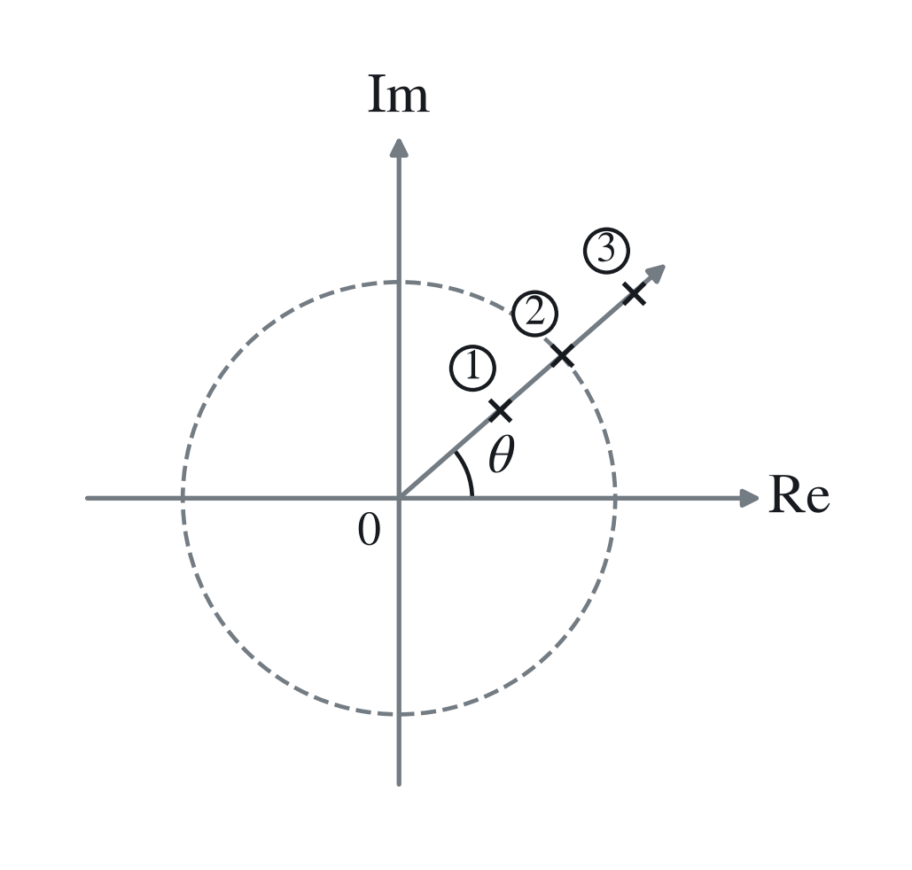
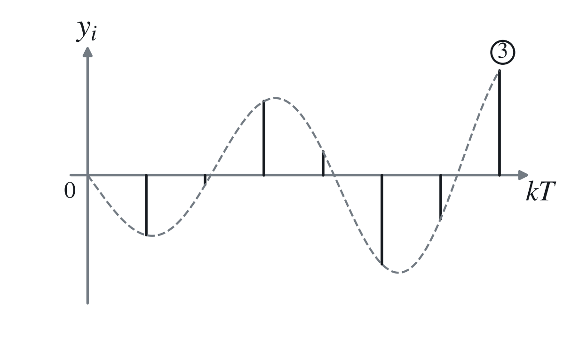

# 三、脉冲传递函数时域分析

设系统的闭环脉冲传递函数为

$$
\Phi(z)=\frac{N(z)}{D(z)}
=\frac{k\prod_{i=1}^{m}(z-z_i)}{\prod_{i=1}^{n}(z-p_i)},
\qquad n>m,
$$

其中 $z_i$ 为系统的闭环零点，$p_i$ 为系统的闭环极点。

## 1. 阶跃响应

$$
r(t)=1(t),\qquad R(z)=\frac{z}{z-1}.
$$

系统输出的 $Z$ 变换为

$$
Y(z)=\Phi(z)R(z)
=\frac{k\prod_{i=1}^{m}(z-z_i)}{\prod_{i=1}^{n}(z-p_i)}\frac{z}{z-1}.
$$

### （1）特征方程无重根

当特征方程无重根且 $p_i\ne1$ 时，展开为

$$
{\color{#c62828}
Y(z)=\frac{Az}{z-1}+\sum_{i=1}^{n}\frac{B_iz}{z-p_i},
}
$$

则

$$
{\color{#c62828}
y(kT)=A+\sum_{i=1}^{n}B_ip_i^k.
}
$$

第 $i$ 个实极点的瞬态响应分量为

$$
y_i(kT)=B_ip_i^k.
$$

1. $0<p_i<1$：极点在单位圆内正实轴上，则单调递减。

2. $p_i=1$：等幅序列；
3. $p_i>1$：则极点在单位圆外正实轴上，单调发散。

4. $-1<p_i<0$：正负交替变号的衰减振荡序列，角频率为 $\pi/T$；
5. $p_i=-1$：正负交替变号的等幅序列，角频率为 $\pi/T$；
6. $p_i<-1$：则为正负交替变号的发散序列，角频率为 $\pi/T$。

### （2）复数共轭极点

若

$$
{\color{#c62828}
p_{i,i+1}=a\pm jb,
}
$$

则对应响应分量为

$$
{\color{#c62828}
y_i(kT)=A_i\lambda_i^k\cos(k\theta_i+\varphi_i),
}
$$

其中

$$
{\color{#c62828}
\lambda_i=\sqrt{a^2+b^2}=|p_i|,
\qquad
\theta_i=\arg(a+jb)\quad\text{（由 }\arctan(b/a)\text{ 按象限确定）}.
}
$$

1. 若 $\lambda_i=|p_i|<1$，极点在单位圆内，为收敛振荡的脉冲序列，角频率为 $\theta_i/T$；
2. 若 $\lambda_i=|p_i|=1$，为等幅振荡的脉冲序列，<strong>角频率为</strong> ${\color{#c62828}\theta_i/T}$；
3. 若 $\lambda_i=|p_i|>1$，则为振荡发散的脉冲序列，角频率为 $\theta_i/T$。

由

$$
z=e^{sT}=e^{(\sigma+j\omega)T}=e^{\sigma T}e^{j\omega T},
$$

得

$$
\theta=\omega T,\qquad \omega=\frac\theta T.
$$

$\theta$ 越小，振荡频率越低；若极点在负实轴上，$\theta=\pi$，对应频率最高的振荡。
