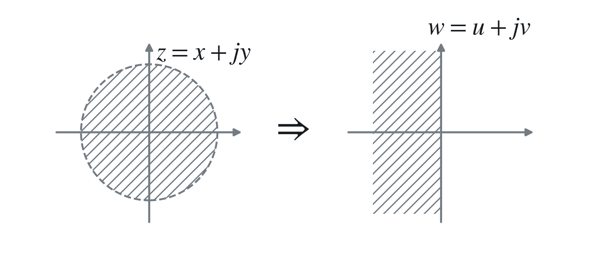

# 五、基于传递函数的稳定性分析

离散系统，对应《系统与控制》三、1。

## 1. 稳定性的基本概念

稳定性是系统自身的属性，与输入的类型、形式无关。

稳定与否取决于闭环极点，与闭环零点无关。★ 闭环零点影响动态性能，极点影响模态。

## 2. $s$ 域到 $z$ 域的映射

$$
z=e^{sT},\qquad s=\sigma+j\omega,
$$

因此

$$
z=e^{(\sigma+j\omega)T}=e^{\sigma T}e^{j\omega T},
$$

$$
|z|=e^{\sigma T},\qquad \angle z=\omega T.
$$

<strong>线性离散系统稳定的充要条件是：系统的全部特征根 $z_i$（$i=1,2,\ldots,n$）均存在于 $z$ 平面的单位圆内，即 $|z_i|<1$。</strong>

若有位于单位圆外的特征根，则闭环系统不稳定。

## 3. <strong>劳斯（Routh）稳定判据</strong>

### （1）双线性变换

从 $z$ 域到 $w$ 域的映射，使 $z$ 域单位圆内映射至 $w$ 域左半平面，再用 Routh 判据进行间接判断：

$$
{\color{#c62828}z=\frac{w+1}{w-1},
\qquad
w=\frac{z+1}{z-1}}.
$$

令

$$
z=x+jy,\qquad w=u+jv,
$$

则

$$
w=\frac{x^2+y^2-1}{(x-1)^2+y^2}
-j\frac{2y}{(x-1)^2+y^2},
$$

即

$$
u=\frac{x^2+y^2-1}{(x-1)^2+y^2},
\qquad
v=-\frac{2y}{(x-1)^2+y^2}.
$$

在 $w$ 域中再用 Routh 判据。

### （2）采样开关和零阶保持器的影响

若没有采样开关和零阶保持器，即为连续系统，则系统中不存在采样周期 $T$；系统稳定性仍可能随增益 $K$ 改变。

<strong>在通常讨论的采样反馈系统中，增大 $K$ 或 $T$ 可能降低稳定性甚至导致失稳；这不是对任意系统都成立的单调规律，应由闭环特征根判断。</strong>
