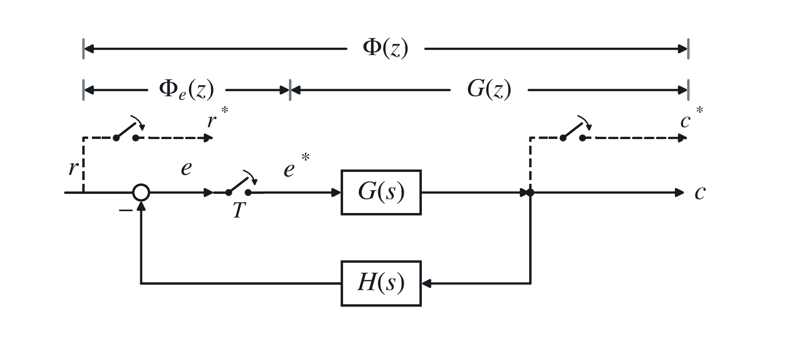

# 六、控制系统的稳态误差分析

离散系统，对应《系统与控制》三、2。

## 1. <strong>利用终值定理</strong>

设

$$
{\color{#c62828}
GH(z)=\mathcal Z[G(s)H(s)]
=\frac1{(z-1)^v}G_1H_0(z),
}
$$

并满足

$$
{\color{#c62828}
\lim_{z\to1}G_1H_0(z)=K.
}
$$

计算稳态误差的步骤：

1. 判断系统稳定性；
2. 求误差脉冲传递函数

$$
\Phi_e(z)=\frac{E(z)}{R(z)}=\frac1{1+GH(z)};
$$

3. 用终值定理

$$
{\color{#c62828}
e_{ss}^*(\infty)
=\lim_{k\to\infty}e(kT)
=\lim_{z\to1}(z-1)E(z)
=\lim_{z\to1}\frac{z-1}{1+GH(z)}R(z).
}
$$

## 2. <strong>静态误差系数法</strong>

### （1）阶跃输入

$$
r(t)=A\cdot1(t),
$$

$$
e_{ss}^*(\infty)
=\lim_{z\to1}\frac{z-1}{1+GH(z)}\frac{Az}{z-1}
=\frac{A}{1+\lim_{z\to1}GH(z)}
=\frac{A}{1+K_p}.
$$

### （2）斜坡输入

$$
r(t)=At,
$$

$$
e_{ss}^*(\infty)
=\lim_{z\to1}\frac{z-1}{1+GH(z)}\frac{ATz}{(z-1)^2}
=\frac{AT}{\lim_{z\to1}(z-1)GH(z)}
=\frac{AT}{K_v}.
$$

### （3）加速度输入

$$
r(t)=A\frac{t^2}{2},
$$

$$
e_{ss}^*(\infty)
=\lim_{z\to1}\frac{z-1}{1+GH(z)}\frac{AT^2z(z+1)}{2(z-1)^3}
=\frac{AT^2}{\lim_{z\to1}(z-1)^2GH(z)}
=\frac{AT^2}{K_a}.
$$

其中

$$
{\color{#c62828}
K_p=\lim_{z\to1}GH(z),
}
$$

$$
{\color{#c62828}
K_v=\lim_{z\to1}(z-1)GH(z),
}
$$

$$
{\color{#c62828}
K_a=\lim_{z\to1}(z-1)^2GH(z)
}
$$

为静态误差系数。

| 型别 $v$ | $K_p$ | $K_v$ | $K_a$ | $r=A1(t)$ | $r=At$ | $r=A\dfrac{t^2}{2}$ |
|---:|---:|---:|---:|---:|---:|---:|
| 0 | $K_p$ | $0$ | $0$ | $\dfrac{A}{1+K_p}$ | $\infty$ | $\infty$ |
| I | $\infty$ | $K_v$ | $0$ | $0$ | $\dfrac{AT}{K_v}$ | $\infty$ |
| II | $\infty$ | $\infty$ | $K_a$ | $0$ | $0$ | $\dfrac{AT^2}{K_a}$ |

## 3. 动态误差系数法

$$
\Phi_e(z)=\frac{E(z)}{R(z)}=\frac1{1+GH(z)}.
$$

令

$$
\Phi_e^*(s)=\Phi_e(z)\big|_{z=e^{sT}},
$$

并在 $s=0$ 处展开：

$$
\Phi_e^*(s)
=\Phi_e^*(0)+\frac1{1!}\Phi_e^{*\prime}(0)s
+\frac1{2!}\Phi_e^{*\prime\prime}(0)s^2
+\cdots
+\frac1{m!}\Phi_e^{*(m)}(0)s^m+\cdots.
$$

动态误差系数定义为

$$
c_m=\frac1{m!}\Phi_e^{*(m)}(0),
\qquad m=0,1,2,\ldots.
$$

因此

$$
\Phi_e^*(s)=\sum_{i=0}^{\infty}c_is^i,
$$

$$
E^*(s)=\Phi_e^*(s)R^*(s)=R^*(s)\sum_{i=0}^{\infty}c_is^i,
$$

其中 $R^*(s)=R(z)|_{z=e^{sT}}$。对多项式输入，在系统稳定且忽略衰减瞬态时，稳态误差为

$$
e_{ss}^*(kT)=\sum_{i=0}^{\infty}c_ir^{(i)}(kT).
$$
