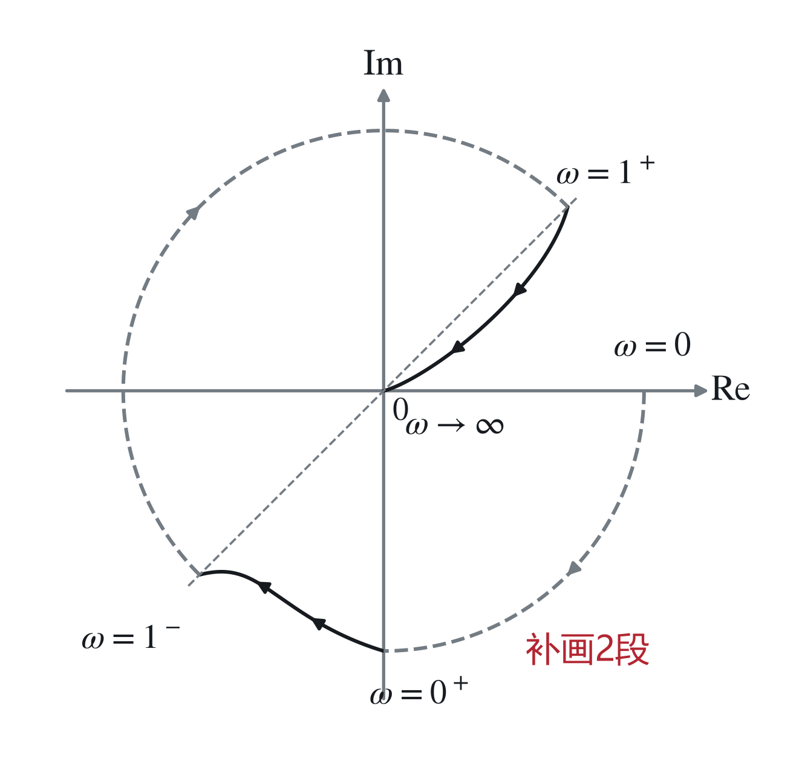
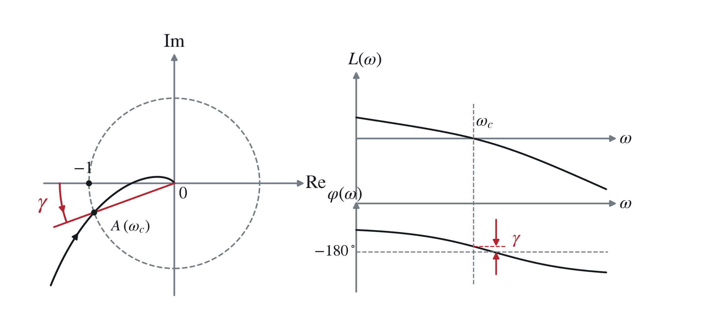
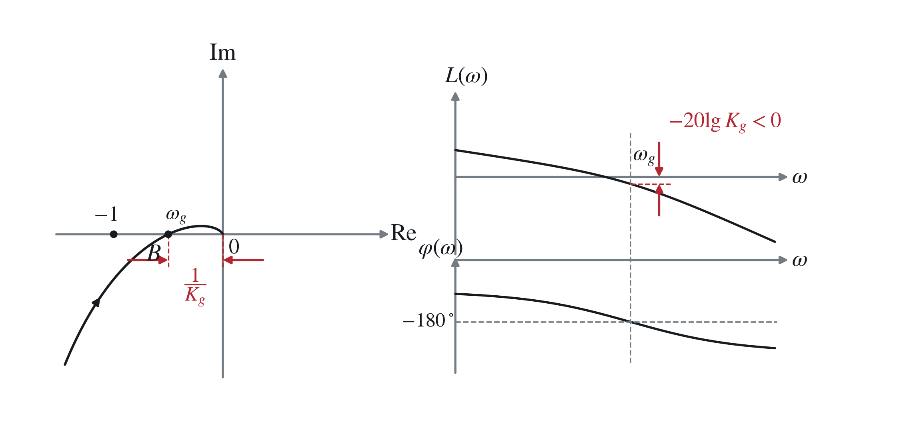
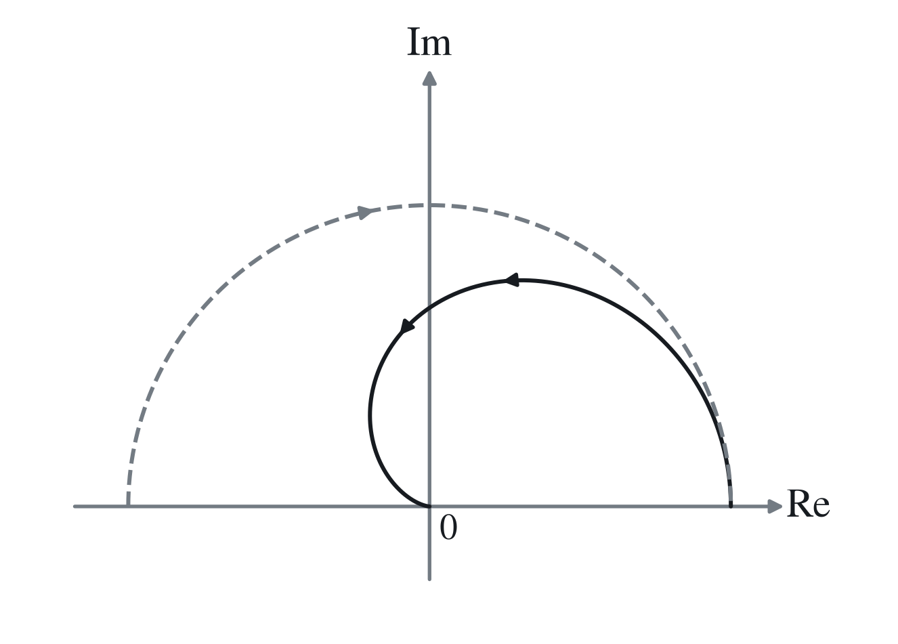
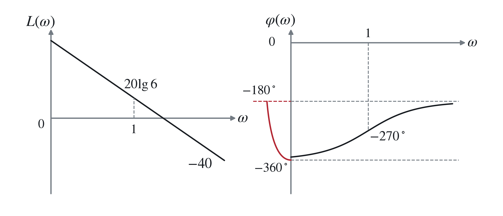

# 八、控制系统的稳定裕度

## 1. 开环幅相特性曲线（Nyquist 曲线）的绘制

参照《系统与控制》四、1（3）（4）及四、2 部分。

例：开环传递函数

$$
G(s)=\frac{10}{s(s+1)(s^2+1)}.
$$

$$
G(j\omega)=\frac{10}{j\omega(j\omega+1)(1-\omega^2)}.
$$

其相角为

$$
\angle G(j\omega)=
\begin{cases}
-90^\circ-\arctan\omega,&\omega<1,\\
-90^\circ-180^\circ-\arctan\omega,&\omega>1.
\end{cases}
$$

<strong>注意 $\omega=1$ 处 $G(j\omega)$ 不连续：</strong>

> $\omega=1$ 处为一阶极点，增补 $2\times90^\circ=180^\circ$。

$$
G(j0^+)=\infty\angle-90^\circ,
$$

$$
G(j1^-)=\infty\angle-135^\circ,
$$

$$
G(j1^+)=\infty\angle-315^\circ,
$$

$$
G(j\infty)=0\angle-360^\circ.
$$

> 最小相位系统指：传递函数在 $s$ 右半平面既无零点，又无极点（严格稳定且最小相位的通常定义还需排除虚轴零、极点）。

## 2. 对数稳定判据

### （1）Nyquist 图与 Bode 图的对应关系

Nyquist 图的单位圆与 Bode 图的 $0\ \mathrm{dB}$ 线对应：

- 单位圆外对应 $L(\omega)>0$；
- 单位圆内对应 $L(\omega)<0$。

Nyquist 图负实轴与 Bode 图 $-180^\circ$ 线对应。

因此，<strong>Nyquist 图中 $(-1,j0)$ 左侧负实轴对应</strong>

$$
{\color{#c62828}
L(\omega)>0,\qquad \varphi(\omega)=-180^\circ.
}
$$

### （2）<strong>对数频率稳定判据</strong>

$$
{\color{#c62828}
Z=P-2N,\qquad N=N^+-N^-.
}
$$

Bode 图上的正负穿越：在 $L(\omega)>0\ \mathrm{dB}$ 的范围内，当 $\omega$ 增加时，相频特性从下向上穿越 $-180^\circ$ 为正穿越，从上向下穿越 $-180^\circ$ 为负穿越。

半次穿越：Bode 图相频曲线自 $-180^\circ$ 向上为半次正穿越，自 $-180^\circ$ 向下为半次负穿越。

> 相角减小为负穿越 $N_-$；相角增大为正穿越 $N_+$。到达 $-180^\circ$ 后未穿过该线，不算一次完整穿越。

存在一个积分环节时：在相频特性曲线 $\omega=0^+$ 处由下向上补画虚线，通过相角 $90^\circ$（$v$ 个积分环节对应 $v\times90^\circ$）。

## 3. 稳定裕度

系统可能由稳定变为不稳定。应要求参数发生一定变化时系统仍是稳定的。

相对稳定性：表征控制系统稳定程度高低的概念。

通过<strong>稳定裕度</strong>定量描述，包括<strong>相角裕度、幅值裕度</strong>。

### （1）相角裕度

$$
{\color{#c62828}
\gamma=180^\circ+\angle G(j\omega_c)H(j\omega_c),
}
$$

<strong>即负实轴与 $OA$ 的夹角，逆时针为正</strong>（图中为正）。

其中 $\omega_c$ 为剪切频率，即 Nyquist 曲线穿越单位圆的频率。

物理意义：表示交点 $A$ 离 $(-1,j0)$ 的远近程度。若在 $\omega_c$ 处的相角再减小 $\gamma$，则

$$
\varphi(\omega_c)=-180^\circ,
$$

Nyquist 曲线通过 $(-1,j0)$，系统将处于临界稳定状态。

### （2）幅值裕度

$$
{\color{#c62828}
K_g=\frac1{|G(j\omega_g)H(j\omega_g)|},
}
$$

（图中为正。）其中<strong>$\omega_g$ 为相位穿越频率</strong>，即

$$
\varphi(\omega_g)=-180^\circ
$$

时的频率。

它表示 $B$ 点离 $(-1,j0)$ 的远近程度。若开环增益增大 $K_g$ 倍，则

$$
L(\omega_g)=0,
$$

Nyquist 曲线通过 $(-1,j0)$，系统处于临界稳定状态。

### （3）裕度的选取

相角裕度、幅值裕度的数值大小不能脱离开环右半平面极点数及全部穿越情况，单独作为一般系统闭环稳定性的判据。

若求出多个 $\gamma$、$K_g$，应检查各交越点，以<strong>最不利的裕度</strong>衡量距离失稳的余量；多个交越或非最小相位情形需结合完整 Nyquist 判据。

> 例：
>
> 开环传递函数为
>
> $$
> G(s)=\frac{6(s+1)}{s^2(s-1)}.
> $$
>
> Nyquist 图：
>
> $$
> G(j\omega)=\frac{6(j\omega+1)}{-\omega^2(j\omega-1)},
> $$
>
> $$
> |G(j\omega)|=\frac6{\omega^2},
> \qquad
> \angle G(j\omega)=2\arctan\omega.
> $$
>
> 当 $\omega=0^+$ 时，
>
> $$
> G(j\omega)=\infty\angle0^\circ;
> $$
>
> 当 $\omega\to\infty$ 时，
>
> $$
> G(j\omega)=0\angle180^\circ.
> $$
>
> $\omega=0$ 为二阶极点，增补
>
> $$
> 2\times90^\circ=180^\circ.
> $$
>
> 图中
>
> $$
> N^-=\frac12,\qquad N=N^+-N^-=-\frac12,
> $$
>
> $$
> Z=P-2N=2,
> $$
>
> 故系统不稳定。
>
> 
>
> Bode 图中增补部分
>
> $$
> N^-=\frac12,
> $$
>
> 其余部分无穿越，
>
> $$
> N=-\frac12,\qquad Z=2,
> $$
>
> 系统不稳定。
>
> 
>
> 补充：
>
> $$
> T_p=\frac{\pi}{\omega_n\sqrt{1-\zeta^2}}
> =\frac{\pi}{\omega_d},
> $$
>
> $$
> \sigma\%=e^{-\frac{\zeta\omega_n\pi}{\omega_d}}\times100\%,
> $$
>
> $$
> T_s(2\%)\approx\frac4{\zeta\omega_n},
> \qquad
> T_s(5\%)\approx\frac3{\zeta\omega_n}.
> $$
