# 一、控制系统的性能指标

## 1. 稳定裕度

### （1）控制系统的相对稳定性

相对稳定性表征系统稳定程度的高低，即控制系统的参数发生某些变化时，系统是否仍然稳定。定量描述相对稳定性的指标有相角裕度和幅值裕度。

### （2）相角裕度

相角裕度定义为

$$
\gamma=180^\circ+\angle G(j\omega_c)H(j\omega_c),
$$

其中，$\omega_c$ 为剪切频率，即

$$
|G(j\omega_c)H(j\omega_c)|=1.
$$

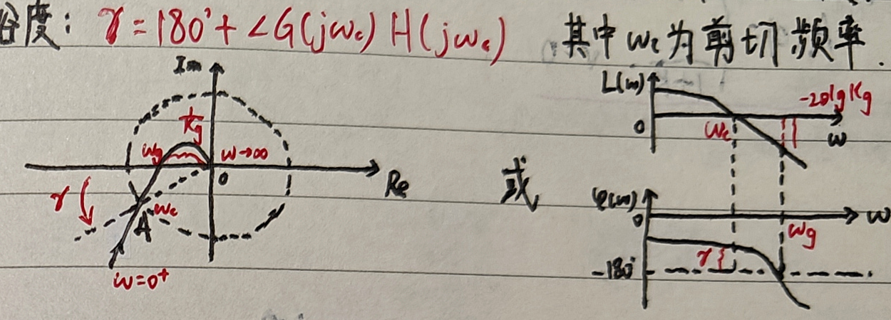

物理意义：相角裕度可以表示为开环 Nyquist 曲线与单位圆交点沿圆周到 $(-1,j0)$ 点的距离；也可以表示为 Bode 图相频特性曲线在 $\omega_c$ 处与 $-180^\circ$ 线的远近程度。

若 $\omega_c$ 处的相位再减少 $\gamma$，系统将处于临界稳定状态。

若开环 Nyquist 曲线与单位圆交于 $(-1,j0)$，则

$$
1+G(j\omega_c)H(j\omega_c)=0,
$$

$j\omega_c$ 为闭环传递函数的极点，即系统存在位于虚轴的极点，故系统临界稳定（等幅振荡）。

<strong>增加时滞环节 $e^{-\tau s}$ 会使 Nyquist 曲线顺时针旋转；在频率 $\omega$ 处附加相位为 $-\tau\omega$。</strong>

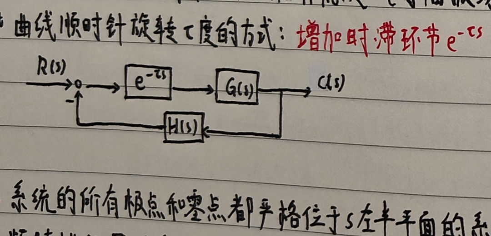

<strong>最小相位系统：系统的所有极点和零点均位于 $s$ 左半平面。</strong>

在幅频特性相同的系统中，最小相位系统的相角滞后最小。例如

$$
G_1(s)=\frac{1+Ts}{P(s)},\qquad
G_2(s)=\frac{1-Ts}{P(s)},\qquad T>0,
$$

$G_1(s)$ 的相角大于 $G_2(s)$，而二者提供的幅值增益相等。

### （3）幅值裕度

幅值裕度定义为

$$
K_g=\frac{1}{|G(j\omega_g)H(j\omega_g)|},
$$

或用分贝表示为

$$
20\lg K_g=-20\lg|G(j\omega_g)H(j\omega_g)|,
$$

其中，$\omega_g$ 为相位穿越频率，即

$$
\angle G(j\omega_g)H(j\omega_g)=-180^\circ.
$$

物理意义：幅值裕度可以表示为开环 Nyquist 曲线与负实轴的交点到 $(-1,j0)$ 点的远近程度；也可以表示为 Bode 图幅频特性曲线在 $\omega_g$ 处的值的相反数。

若开环增益增大 $K_g$ 倍，系统将处于临界稳定状态。

### （4）Nyquist 判据

Nyquist 判据参见“系统与控制”课程相关内容。

### （5）稳定裕度的局限

仅用幅值裕度或相角裕度都不足以完整说明系统的相对稳定性。例如，系统包含不稳定惯性环节 $1/(Ts-1)$ 时，即使 $\gamma>0$ 且 $20\lg K_g<0$，仍可能闭环稳定。

### （6）二阶系统的稳定裕度

对开环传递函数

$$
G(j\omega)=\frac{\omega_n^2}{j\omega(j\omega+2\zeta\omega_n)},
$$

有

$$
\omega_c=\omega_n\sqrt{\sqrt{4\zeta^4+1}-2\zeta^2},
$$

$$
\gamma=\arctan\!\left(\frac{2\zeta}{\sqrt{\sqrt{4\zeta^4+1}-2\zeta^2}}\right).
$$

$\gamma$ 只与阻尼比 $\zeta$ 有关。此时 $\omega_g=\infty$，$K_g=\infty$。

## 2. 闭环频域性能指标

闭环频率特性为

$$
\Phi(j\omega)=\frac{G(j\omega)}{1+G(j\omega)H(j\omega)},
$$

其幅频特性为

$$
A(\omega)=\left|\frac{G(j\omega)}{1+G(j\omega)H(j\omega)}\right|.
$$

### （1）闭环频域性能指标

之所以关注 $A(0)$，是因为系统对低频信号的放大能力取决于对 $\omega=0$ 信号的放大倍数。对单位负反馈系统，设

$$
G(s)=\frac{K G_1(s)}{s^\nu},\qquad G_1(0)=1,
$$

其中 $K$ 称为前向通道增益，则

$$
A(0)=
\begin{cases}
1,&\nu\ge 1,\\[2pt]
\dfrac{K}{1+K},&\nu=0.
\end{cases}
$$

常用指标包括：

- 稳态误差

    $$
    e_{ss}=\lim_{s\to0}s\frac{R(s)}{1+G(s)H(s)};
    $$

- 零频幅值 $A(0)$；
- 谐振频率

    $$
    A(\omega_r)=\max_\omega A(\omega);
    $$

- 相对谐振峰值

    $$
    M_r=\frac{\max A(\omega)}{A(0)}=\frac{A(\omega_r)}{A(0)};
    $$

- 截止频率

    $$
    A(\omega_b)=\frac{1}{\sqrt2}A(0).
    $$

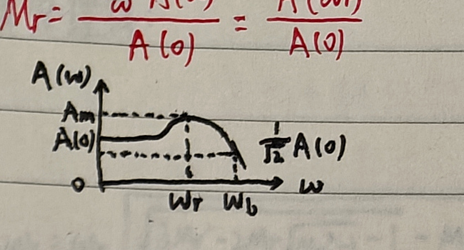

### （2）二阶系统的闭环频域性能

二阶闭环系统

$$
\Phi(j\omega)=\frac{\omega_n^2}{(j\omega)^2+2\zeta\omega_nj\omega+\omega_n^2}
$$

的幅频特性为

$$
A(\omega)=|\Phi(j\omega)|
=\frac{\omega_n^2}{\sqrt{(\omega_n^2-\omega^2)^2+4\zeta^2\omega_n^2\omega^2}}.
$$

由此得到

$$
\omega_r=\omega_n\sqrt{1-2\zeta^2},
\qquad
M_r=\frac{1}{2\zeta\sqrt{1-\zeta^2}},
$$

$$
\omega_b=\omega_n\sqrt{1-2\zeta^2+\sqrt{2-4\zeta^2+4\zeta^4}}.
$$

### （3）闭环特性图示法

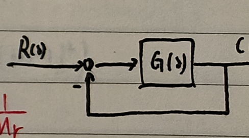

对于单位负反馈系统，令

$$
G(j\omega)=U+jV,
\qquad
M=\left|\frac{G(j\omega)}{1+G(j\omega)}\right|,
$$

整理得

$$
\left(U+\frac{M^2}{M^2-1}\right)^2+V^2
=\left(\frac{M}{M^2-1}\right)^2.
$$

因此，当 $M$ 固定时，$(U,V)$ 位于圆心在横轴上的圆上，即等 $M$ 圆。开环频率特性曲线与某一等 $M$ 圆相切时，对应的 $M$ 值就是 $M_r$，切点处的频率就是 $\omega_r$。

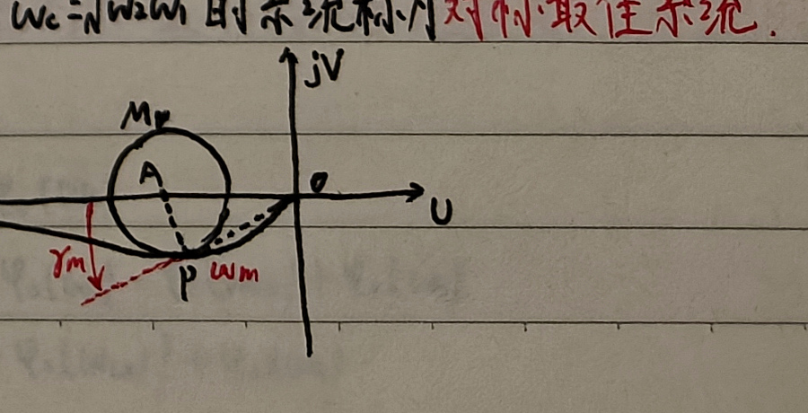

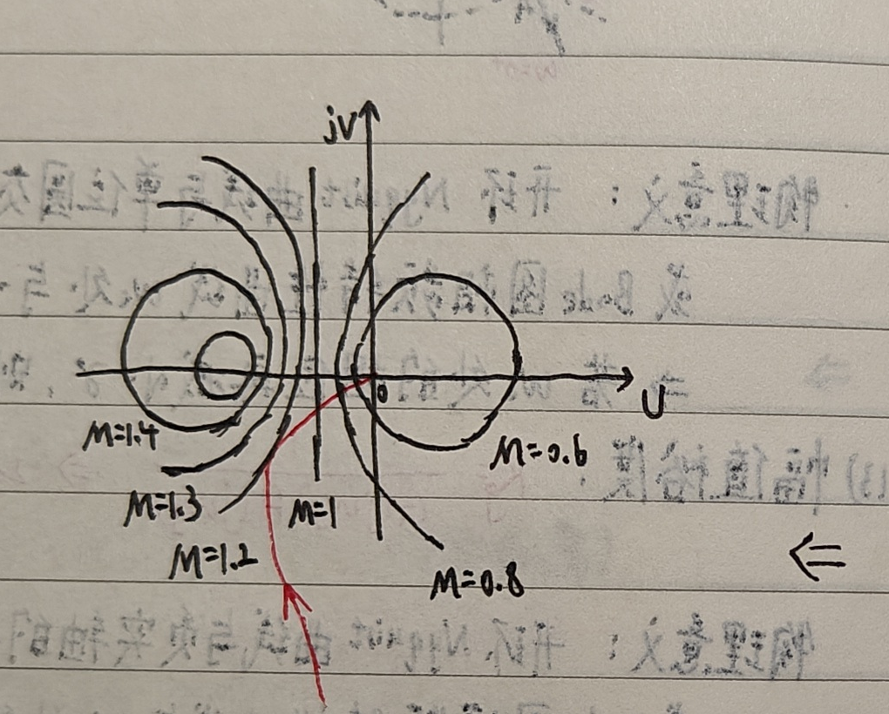

## 3. 性能指标之间的关系

### （1）闭环频域指标与开环频域指标

对于单位负反馈系统，有近似关系

$$
A_{\max}\approx\frac{1}{\sin\gamma},
$$

因而

$$
M_r\approx\frac{1}{\sin\gamma},
\qquad
\gamma\approx\arcsin\frac{1}{M_r}.
$$

证明：记

$$
B(\omega)=|G(j\omega)|,
\qquad
\varphi(\omega)=\angle G(j\omega)=-180^\circ+\gamma(\omega),
$$

则

$$
G(j\omega)=B(\omega)e^{-j[180^\circ-\gamma(\omega)]}
=B(\omega)[-\cos\gamma(\omega)-j\sin\gamma(\omega)].
$$

从而

$$
A(\omega)=\left|\frac{G(j\omega)}{1+G(j\omega)}\right|
=\frac{1}{\sqrt{\left[\frac{1}{B(\omega)}-\cos\gamma(\omega)\right]^2+\sin^2\gamma(\omega)}}.
$$

在 $A(\omega)$ 极大值附近，$\gamma(\omega)$ 变化很小，并且 $\omega_r$ 常位于 $\omega_c$ 附近，因此可取

$$
\cos\gamma(\omega_r)\approx\cos\gamma(\omega_c)=\cos\gamma,
\qquad
\sin\gamma(\omega_r)\approx\sin\gamma,
$$

故 $A_{\max}\approx1/\sin\gamma$。

开环频域指标为

$$
\omega_c=\omega_n\sqrt{\sqrt{4\zeta^4+1}-2\zeta^2},
$$

$$
\gamma=\arctan\!\left(\frac{2\zeta}{\sqrt{\sqrt{4\zeta^4+1}-2\zeta^2}}\right);
$$

闭环频域指标为

$$
M_r=\frac{1}{2\zeta\sqrt{1-\zeta^2}},
\qquad
\omega_r=\omega_n\sqrt{1-2\zeta^2},
$$

$$
\omega_b=\omega_n\sqrt{1-2\zeta^2+\sqrt{2-4\zeta^2+4\zeta^4}}.
$$

在实际设计中很难直接使用这些复杂关系，二者之间常用阻尼比 $\zeta$ 作为纽带。

还可用 $M_r,\omega_b,\omega_r$ 表示 $\gamma,\omega_c$；经过整理可得

$$
\gamma=\arctan\!\left[
\frac{\sqrt2\sqrt{M_r-\sqrt{M_r^2-1}}}
{\sqrt{3M_r^2-2M_r\sqrt{M_r^2-1}-1-M_r+\sqrt{M_r^2-1}}}
\right],
$$

$$
\omega_c=\omega_b\sqrt{
\frac{3M_r^2-2M_r\sqrt{M_r^2-1}-1-M_r+\sqrt{M_r^2-1}}
{\sqrt{M_r^2-1}+\sqrt{2M_r^2-1}}
},
$$

也可写成

$$
\omega_c=\omega_r\sqrt{
\frac{3M_r^2-2M_r\sqrt{M_r^2-1}-1-M_r+\sqrt{M_r^2-1}}
{\sqrt{M_r^2-1}}
}.
$$

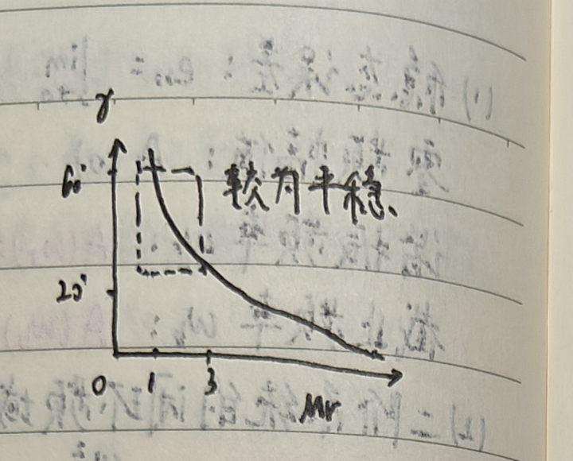

随着 $M_r$ 增大，相角裕度 $\gamma$ 减小；图中 $M_r=1\sim3$ 对应的曲线段较为平稳。

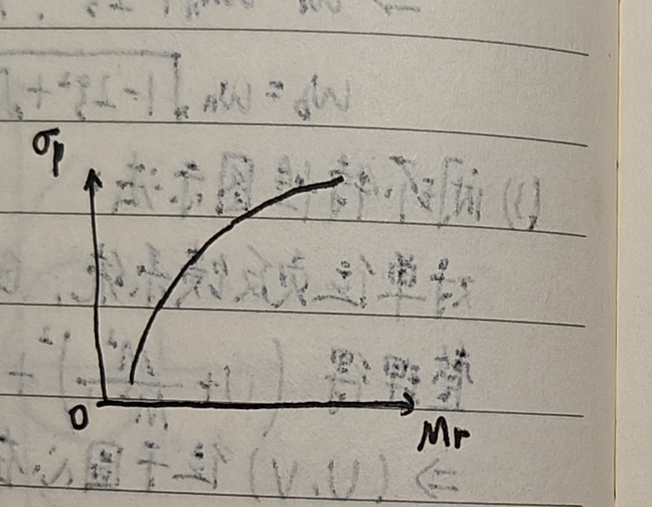

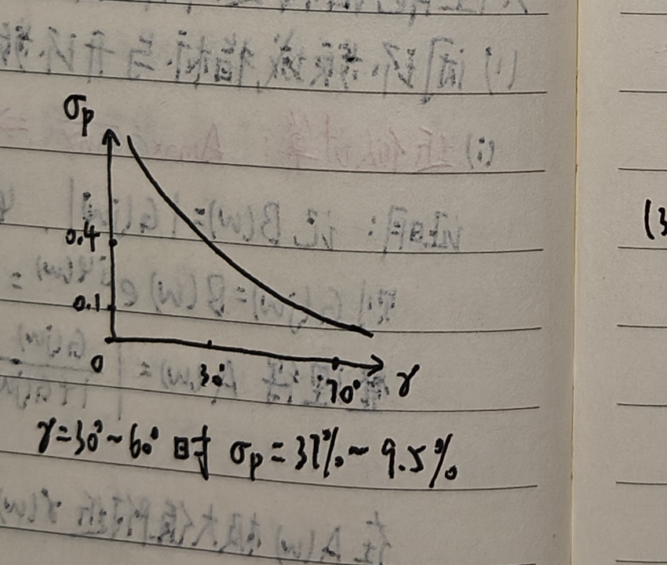

<strong>当 $\gamma=30^\circ\sim60^\circ$ 时，$\sigma_p\approx37\%\sim9.5\%$。</strong>

### （2）闭环频域指标与时域指标

二阶系统的常用时域指标为

$$
\sigma_p=e^{-\pi\zeta/\sqrt{1-\zeta^2}},
\qquad
 t_s(2\%)=\frac{4}{\zeta\omega_n},
\qquad
t_p=\frac{\pi}{\omega_n\sqrt{1-\zeta^2}}.
$$

闭环频域指标在设计中很难直接使用，二者之间的联系仍以阻尼比为纽带。用 $M_r,\omega_b,\omega_r$ 表示 $\sigma_p,t_s,t_p$，经过整理可得

$$
\sigma_p=\exp\!\left[-\frac{\pi\sqrt{M_r-\sqrt{M_r^2-1}}}{\sqrt{M_r+\sqrt{M_r^2-1}}}\right],
$$

$$
t_s=\frac{4\sqrt2\sqrt{M_r^2-1}}{\omega_r\sqrt{M_r^2-M_r\sqrt{M_r^2-1}}},
$$

$$
t_p=\frac{\sqrt2\pi}{\omega_r}
\frac{\sqrt{M_r^2-1}}{\sqrt{M_r+\sqrt{M_r^2-1}}}.
$$

经验公式为

$$
\sigma_p\approx0.16+0.4(M_r-1),\qquad 1\le M_r\le1.8,
$$

或

$$
\sigma_p\approx
\begin{cases}
M_r-1,&1\le M_r\le1.25,\\
0.25\sqrt{M_r-1},&1.25<M_r\le2,
\end{cases}
$$

$$
t_s\approx\frac{\pi}{\omega_c}\left[2+1.5(M_r-1)+2.5(M_r-1)^2\right].
$$

### （3）开环频域指标与时域指标

用 $\omega_c,\gamma$ 表示 $\sigma_p,t_s,t_p$，以阻尼比为媒介，可得

$$
\zeta=\frac{\tan\gamma}{2\sqrt[4]{1+\tan^2\gamma}}.
$$

经过整理：

$$
\sigma_p=\exp\!\left[-\frac{\pi}{\sqrt{2\sqrt{M^2-1}-1}}\right],
$$

$$
t_s=\frac{8}{\omega_c\tan\gamma},
\qquad
t_p=\frac{2\pi}{\omega_c\tan\gamma}\frac{1}{\sqrt{2\sqrt{M^2-1}-1}},
$$

其中

$$
M=\frac{2+\tan^2\gamma}{\tan\gamma}.
$$

经验公式为

$$
\sigma_p\approx0.16+0.4\left(\frac{1}{\sin\gamma}-1\right),
\qquad 34^\circ\le\gamma\le90^\circ,
$$

$$
t_s\approx\frac{\pi}{\omega_c}
\left[2+1.5\left(\frac{1}{\sin\gamma}-1\right)
+2.5\left(\frac{1}{\sin\gamma}-1\right)^2\right].
$$

例如

$$
G_1(s)=\frac{K}{s},\qquad
\gamma=180^\circ-90^\circ=90^\circ,
$$

具有足够的相角裕度；而

$$
G_2(s)=\frac{K}{s^2},\qquad
\gamma=180^\circ-180^\circ=0,
$$

处于临界稳定状态。因此，剪切频率附近采用 $-20\ \mathrm{dB/dec}$ 的斜率可以保证足够的相角裕度。

<strong>调节时间 $t_s$ 与自然频率 $\omega_n$ 成反比。</strong>

$\omega_r$、$\omega_c$、$\omega_b$ 彼此成比例，一般有

$$
\omega_r<\omega_c<\omega_b.
$$

## 4. 三频段理论

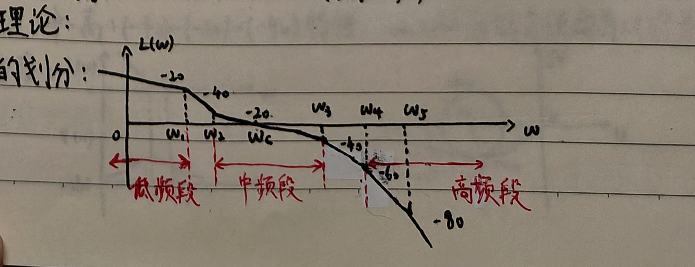

低频段：$\omega<\omega_1$ 的部分。其高度取决于开环增益 $K$，斜率取决于系统型别。低频段共同决定了系统跟踪输入信号的**稳态精度**。

中频段：$\omega_2<\omega<\omega_3$ 的部分，即包含 $\omega_c$ 的线段。令

$$
h=\frac{\omega_3}{\omega_2}
$$

为中频段宽度。

高频段：$\omega>\omega_4$ 的部分，即横轴以下快速衰减的部分。通常要求 $\omega>10\omega_c$。由于分贝值较低，高频段对系统动态性能的影响不大。又因为 $|G(j\omega)|\ll1$，有

$$
|\Phi(j\omega)|=\left|\frac{G(j\omega)}{1+G(j\omega)}\right|\approx|G(j\omega)|,
$$

故高频段可直接反映系统抑制输入端高频干扰的能力：分贝值越低，抗干扰能力越强。

一个设计合理的三频段应满足：

1. 中频段斜率以 $-20\ \mathrm{dB/dec}$ 为宜；
2. 低频段和高频段可以具有更高的斜率：<strong>低频段斜率大可提高稳态性能，高频段斜率大可提高抗干扰能力；</strong>
3. 中频段必须具有足够的带宽，以保证系统的相角裕度；<strong>带宽越大，相角裕度越大；</strong>
4. $\omega_c$ 的大小取决于系统的快速性要求：$\omega_c$ 越大，快速性越好，但抗干扰能力下降。

低频段和高频段特性会影响中频段剪切频率。对于

$$
G(s)=\frac{K(\frac{s}{\omega_1}+1)}{s^2(\frac{s}{\omega_2}+1)},
$$

相角裕度为

$$
\gamma=\arctan\frac{\omega_c}{\omega_1}-\arctan\frac{\omega_c}{\omega_2}.
$$

$\omega_1,\omega_2$ 离 $\omega_c$ 越远，相角裕度越大，即中频段越长，相角裕度越大。

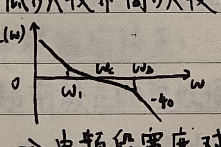

开环增益 $K$ 可以改变 $\omega_c$，但不能改变 $\omega_1,\omega_2$ 和 $h$。当 $h$ 不变时，选择 $K$ 使 $\omega_c$ 位于几何中点，可使相位裕量取得最大值：

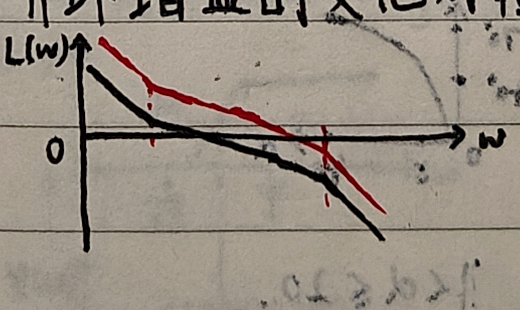

$$
\omega_c=\sqrt{\omega_1\omega_2},
$$

$$
\gamma_m=\arctan\sqrt h-\arctan\frac1{\sqrt h}
=\arctan\frac{h-1}{2\sqrt h}.
$$

具有低—中—高斜率为 $-40,-20,-40\ \mathrm{dB/dec}$ 特性且 $\omega_c=\sqrt{\omega_1\omega_2}$ 的系统，称为**对称最佳系统**。

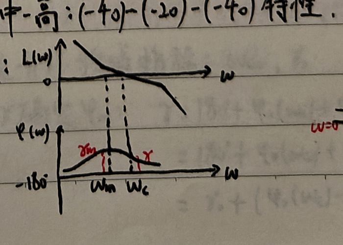

由对称最佳系统可进一步得到近似关系

$$
M_r\approx\frac{h+1}{h-1},
\qquad
h\approx\frac{M_r+1}{M_r-1},
$$

$$
\omega_2=\omega_c\frac{2}{h+1},
\qquad
\omega_3=\omega_c\frac{2h}{h+1}.
$$

因此若要求 $M_r$ 小于某个值，就需要拓宽中频带：

$$
\omega_1\le\omega_c\frac{M_r-1}{M_r},
\qquad
\omega_2\ge\omega_c\frac{M_r+1}{M_r}.
$$
