# 一、控制系统的性能指标

## 1. 稳定裕度

### （1）控制系统的相对稳定性

表征稳定程度的高低：控制系统的参数发生某些变化时应当仍是稳定的。定量描述：相角裕度、幅值裕度。

### （2）相角裕度

$$
{\color{#c62828}\gamma=180^\circ+\angle G(j\omega_c)H(j\omega_c).}
$$

其中 $\omega_c$ 为剪切频率。

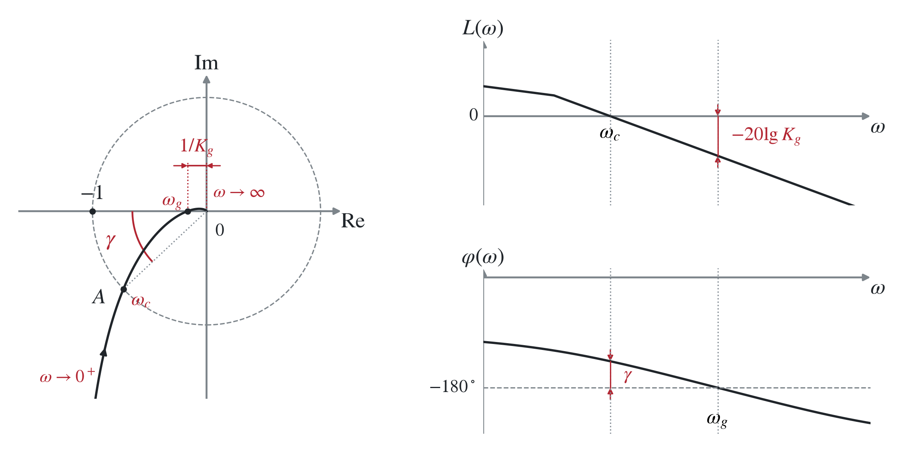

物理意义：开环 Nyquist 曲线与单位圆交点沿圆上与 $(-1,j0)$ 的距离；或 Bode 图相频特性曲线 $\omega_c$ 处与 $-180^\circ$ 线的远近程度。

⇒ 若 $\omega_c$ 处的相位再减少 $\gamma$，则系统将处于临界稳定状态。

> 若开环 Nyquist 曲线与单位圆交于 $(-1,j0)$，则：
>
> $$
> 1+G(j\omega_c)H(j\omega_c)=0.
> $$
>
> $j\omega_c$ 为闭环传递函数的极点，即系统有位于虚轴的极点，故临界稳定（等幅振荡）。
>
> 将 Nyquist 曲线顺时针旋转一定角方式：<strong>增加时滞环节 $e^{-\tau s}$</strong>（各频率处的附加相角为 $-\tau\omega$）。
>
> 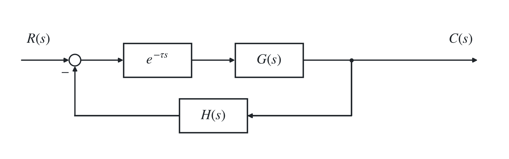

> 补充：<strong>最小相位系统</strong>：系统的所有极点和零点都严格位于 $s$ 左半面的系统。
>
> “最小相位”指幅频特性相同的系统中相角滞后最小。如
>
> $$
> G_1(s)=\frac{1+Ts}{P(s)},\qquad T>0,
> $$
>
> 的相角显然大于 $G_2(s)=(1-Ts)/P(s)$，而二者提供的增益相等。

### （3）幅值裕度

$$
{\color{#c62828}
K_g=\frac1{|G(j\omega_g)H(j\omega_g)|}
\quad\Rightarrow\quad
20\lg K_g=-20\lg|G(j\omega_g)H(j\omega_g)|.}
$$

其中 $\omega_g$ 为相位穿越频率。

物理意义：开环 Nyquist 曲线与负实轴的交点与 $(-1,j0)$ 的远近程度；或 Bode 图幅频特性曲线在 $\omega_g$ 处的值的相反数。

⇒ 若开环增益增大 $K_g$ 倍，则系统将处于临界稳定状态。

### （4）Nyquist 判据

<strong>参见“系统与控制”四、2 部分。</strong>

### （5）只用幅值裕度或相位裕度都不足以说明系统的相对稳定性

例：对有包含不稳定惯性环节 $1/(Ts-1)$ 的非最小相位系统，可能在 $\gamma>0$、$20\lg K_g<0$ 时闭环稳定，需结合完整 Nyquist 判据判断。

### （6）二阶系统的稳定裕度

$$
G(j\omega)=\frac{\omega_n^2}{j\omega(j\omega+2\zeta\omega_n)}
=\frac{\omega_n^2}{\omega\sqrt{\omega^2+4\zeta^2\omega_n^2}}
\angle\left(-90^\circ-\arctan\frac{\omega}{2\zeta\omega_n}\right).
$$

⇒

$$
\omega_c=\omega_n\sqrt{\sqrt{4\zeta^4+1}-2\zeta^2},\qquad
\gamma=\arctan\frac{2\zeta}{\sqrt{\sqrt{4\zeta^4+1}-2\zeta^2}}.
$$

只与阻尼比有关。

$$
\omega_g=\infty,\qquad
K_g=\lim_{\omega\to\infty}\frac1{|G(j\omega)|}=\infty.
$$

## 2. 闭环频域性能指标

闭环频率特性为

$$
\Phi(j\omega)=\frac{G(j\omega)}{1+G(j\omega)H(j\omega)},
$$

其幅频特性为

$$
A(\omega)=\left|\frac{G(j\omega)}{1+G(j\omega)H(j\omega)}\right|.
$$

### （1）闭环频域性能指标

稳态误差：

$$
e_{ss}=\lim_{s\to0}s\frac{R(s)}{1+G(s)H(s)}.
$$

零频幅值：$A(0)$。

> 为什么关注 $A(0)$：系统对阶跃信号的放大能力取决于对 $\omega=0$ 信号的放大倍数：
>
> $$
> R(s)=\frac1s\text{ 时},\qquad
> c(\infty)=\lim_{s\to0}s\Phi(s)\frac1s=\Phi(0).
> $$
>
> 对单位反馈系统，设 $G(s)=\frac{KG_1(s)}{s^\nu}$，其中 $G_1(s)|_{s=0}=1$，$K$ 称为前向通道增益，则：
>
> $$
> {\color{#c62828}A(0)=
> \begin{cases}
> 1,&\nu\ge1,\\
> \dfrac K{1+K},&\nu=0.
> \end{cases}}
> $$

谐振频率 $\omega_r$：

$$
{\color{#c62828}A(\omega_r)=\max_\omega A(\omega).}
$$

相对谐振峰值：

$$
{\color{#c62828}M_r=\frac{\max_\omega A(\omega)}{A(0)}=\frac{A(\omega_r)}{A(0)}.}
$$

截止频率 $\omega_b$：

$$
{\color{#c62828}A(\omega_b)=\frac1{\sqrt2}A(0).}
$$

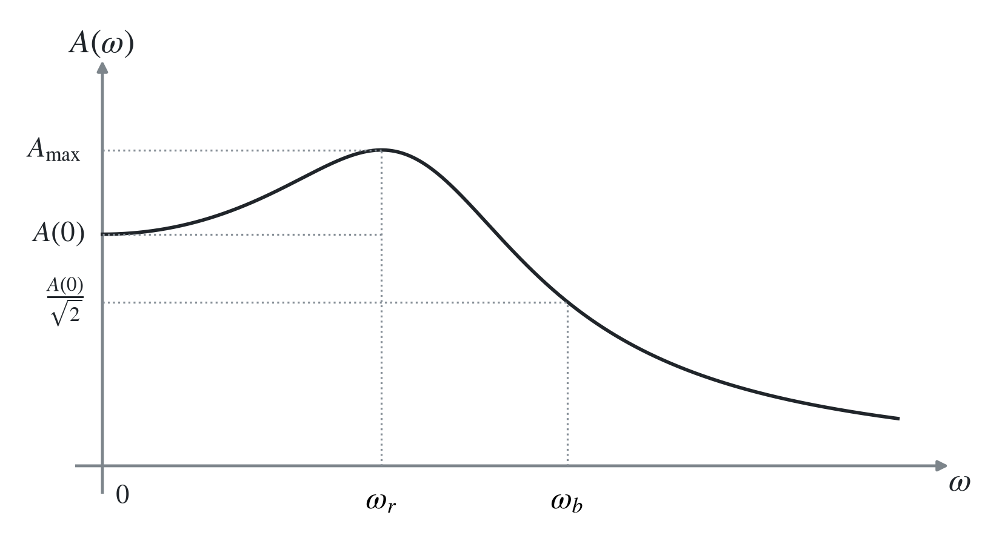

### （2）二阶系统的闭环频域性能

二阶闭环系统

$$
\Phi(j\omega)=\frac{\omega_n^2}{(j\omega)^2+2\zeta\omega_nj\omega+\omega_n^2}
$$

的幅频特性为

$$
A(\omega)=|\Phi(j\omega)|
=\frac{\omega_n^2}{\sqrt{(\omega_n^2-\omega^2)^2+4\zeta^2\omega_n^2\omega^2}}.
$$

⇒ 当 $0<\zeta<1/\sqrt2$ 时，

$$
\omega_r=\omega_n\sqrt{1-2\zeta^2},
\qquad
M_r=\frac{1}{2\zeta\sqrt{1-\zeta^2}},
$$

$$
\omega_b=\omega_n\sqrt{1-2\zeta^2+\sqrt{2-4\zeta^2+4\zeta^4}}.
$$

### （3）闭环特性图示法

对单位负反馈系统，记

$$
G(j\omega)=U+jV,
\qquad
M=\left|\frac{G(j\omega)}{1+G(j\omega)}\right|,
$$

整理得

$$
\left(U+\frac{M^2}{M^2-1}\right)^2+V^2
=\left(\frac{M}{M^2-1}\right)^2.
$$

⇒ $(U,V)$ 位于圆心在横轴的圆上（当 $M$ 固定且 $M\ne1$ 时；$M=1$ 时为直线 $U=-1/2$）。

当 $G(j\omega)$ 的曲线与某一 $M$ 圆相切时，对应的 $M/A(0)$ 即为 $M_r$（$A(0)=1$ 时二者相等），切点处的 $\omega$ 即为 $\omega_r$。

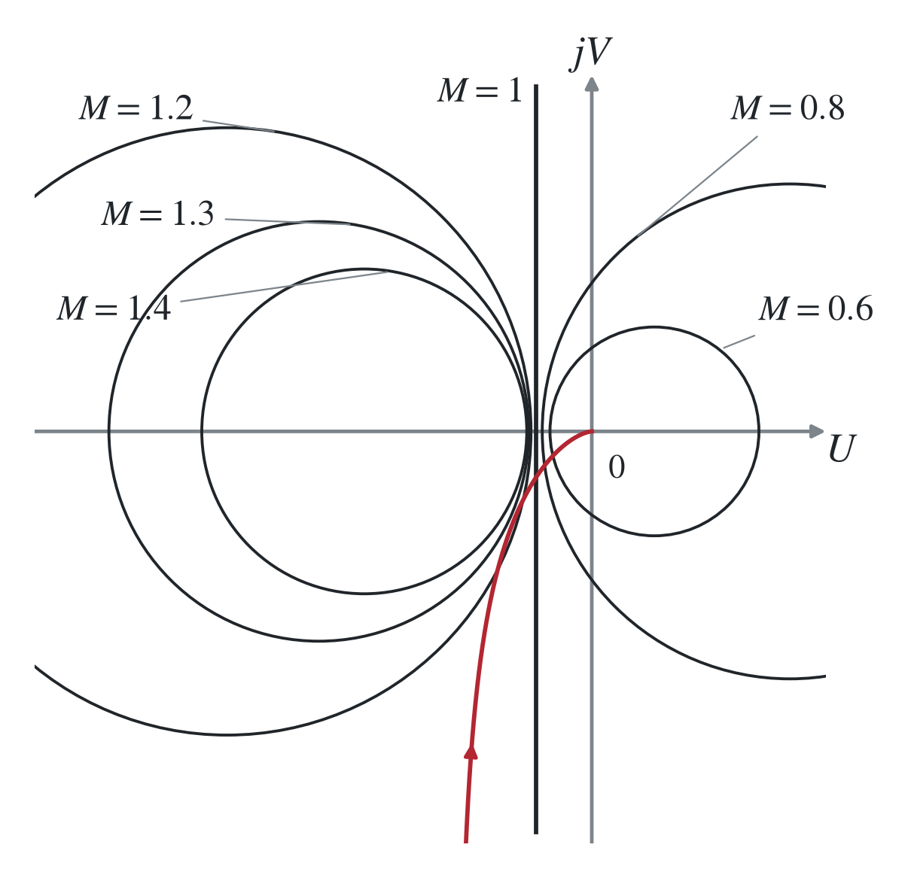

## 3. 性能指标之间的关系

### （1）闭环频域指标与开环频域指标之间的关系

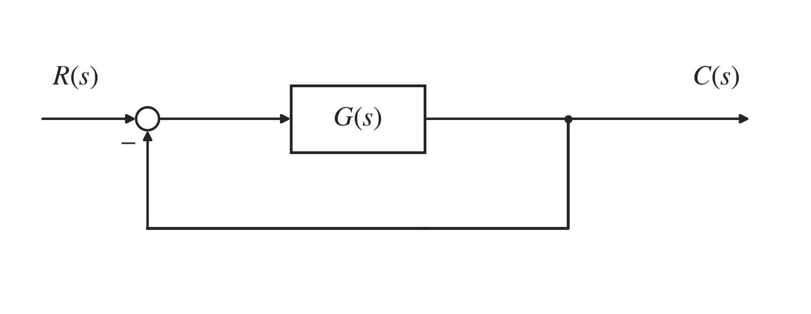

#### i）近似计算

对单位负反馈且 $A(0)=1$ 的系统，有近似关系

$$
{\color{#c62828}A_{\max}\approx\frac{1}{\sin\gamma},}
$$

因而

$$
{\color{#c62828}M_r\approx\frac{1}{\sin\gamma},\qquad\gamma\approx\arcsin\frac{1}{M_r}.}
$$

证明：记

$$
B(\omega)=|G(j\omega)|,
\qquad
\varphi(\omega)=\angle G(j\omega)=-180^\circ+\gamma(\omega),
$$

则

$$
G(j\omega)=B(\omega)e^{-j[180^\circ-\gamma(\omega)]}
=B(\omega)[-\cos\gamma(\omega)-j\sin\gamma(\omega)].
$$

从而

$$
A(\omega)=\left|\frac{G(j\omega)}{1+G(j\omega)}\right|
=\frac{1}{\sqrt{\left[\frac{1}{B(\omega)}-\cos\gamma(\omega)\right]^2+\sin^2\gamma(\omega)}}.
$$

在 $A(\omega)$ 极大值附近，$\gamma(\omega)$ 变化很小，并且 $\omega_r$ 常位于 $\omega_c$ 附近，因此可取

$$
\cos\gamma(\omega_r)\approx\cos\gamma(\omega_c)=\cos\gamma,
\qquad
\sin\gamma(\omega_r)\approx\sin\gamma,
$$

故

$$
A(\omega)\approx\frac1{\sqrt{[\frac{1}{B(\omega)}-\cos\gamma]^2+\sin^2\gamma}},
\qquad A_{\max}\approx\frac1{\sin\gamma}.
$$
#### ii）开环频域指标

$$
{\color{#c62828}\omega_c}=\omega_n\sqrt{\sqrt{4\zeta^4+1}-2\zeta^2},
$$

$$
{\color{#c62828}\gamma}=\arctan\!\left(\frac{2\zeta}{\sqrt{\sqrt{4\zeta^4+1}-2\zeta^2}}\right);
$$

更方便设计。

闭环频域指标为

$$
{\color{#c62828}M_r}=\frac{1}{2\zeta\sqrt{1-\zeta^2}},
\qquad
{\color{#c62828}\omega_r}=\omega_n\sqrt{1-2\zeta^2},
$$

$$
{\color{#c62828}\omega_b}=\omega_n\sqrt{1-2\zeta^2+\sqrt{2-4\zeta^2+4\zeta^4}}.
$$

在实际设计中很难使用，二者之间的联系纽带为<strong>阻尼比</strong>。

#### iii）用 $M_r,\omega_b,\omega_r$ 表示 $\gamma,\omega_c$

经过复杂计算整理得：

$$
\gamma=\arctan\!\left[
\frac{\sqrt2\sqrt{M_r-\sqrt{M_r^2-1}}}
{\sqrt{\sqrt{3M_r^2-2M_r\sqrt{M_r^2-1}-1}-M_r+\sqrt{M_r^2-1}}}
\right],
$$

$$
\omega_c=\omega_b\sqrt{
\frac{\sqrt{3M_r^2-2M_r\sqrt{M_r^2-1}-1}-M_r+\sqrt{M_r^2-1}}
{\sqrt{M_r^2-1}+\sqrt{2M_r^2-1}}
},
$$

也可写成

$$
\omega_c=\omega_r\sqrt{
\frac{\sqrt{3M_r^2-2M_r\sqrt{M_r^2-1}-1}-M_r+\sqrt{M_r^2-1}}
{\sqrt{M_r^2-1}}
}.
$$

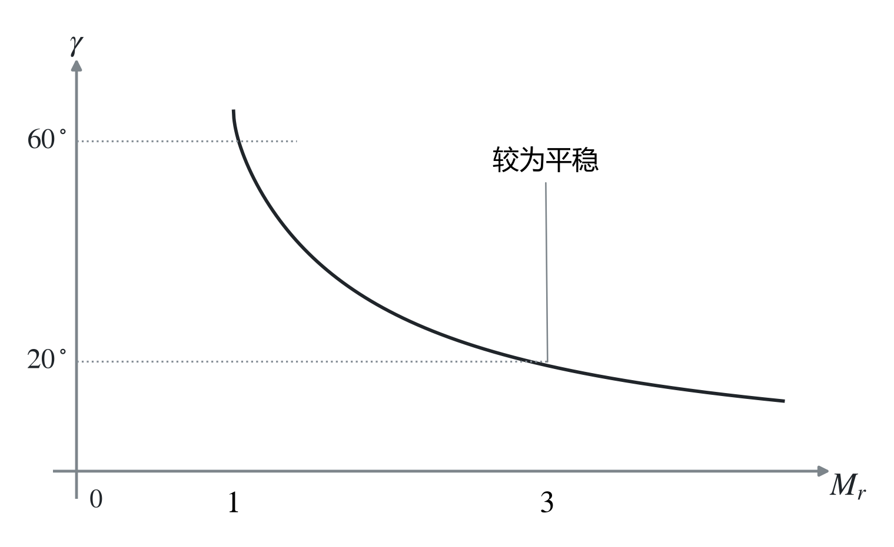

### （2）闭环频域指标与时域指标

#### i）闭环时域指标

二阶系统（$0<\zeta<1$）的常用时域指标为

$$
\sigma_p=e^{-\pi\zeta/\sqrt{1-\zeta^2}},
\qquad
 t_s(2\%)\approx\frac{4}{\zeta\omega_n},
\qquad
t_p=\frac{\pi}{\omega_n\sqrt{1-\zeta^2}}.
$$

方便设计。闭环频域指标在设计中很难使用，二者之间的联系纽带为<strong>阻尼比</strong>。

#### ii）用 $M_r,\omega_b,\omega_r$ 表示 $\sigma_p,t_s,t_p$

经过复杂计算整理得：

$$
\sigma_p=\exp\!\left[-\frac{\pi\sqrt{M_r-\sqrt{M_r^2-1}}}{\sqrt{M_r+\sqrt{M_r^2-1}}}\right],
$$

$$
t_s=\frac{4\sqrt2\sqrt[4]{M_r^2-1}}{\omega_r\sqrt{M_r-\sqrt{M_r^2-1}}}
=\frac{4\sqrt2\sqrt{\sqrt{M_r^2-1}+\sqrt{2M_r^2-1}}}
{\omega_b\sqrt{M_r-\sqrt{M_r^2-1}}}.
$$

$$
t_p=\frac{\sqrt2\pi}{\omega_b}
\frac{\sqrt{\sqrt{M_r^2-1}+\sqrt{2M_r^2-1}}}{\sqrt{M_r+\sqrt{M_r^2-1}}}
=\frac{\sqrt2\pi}{\omega_r}
\frac{\sqrt[4]{M_r^2-1}}{\sqrt{M_r+\sqrt{M_r^2-1}}}.
$$

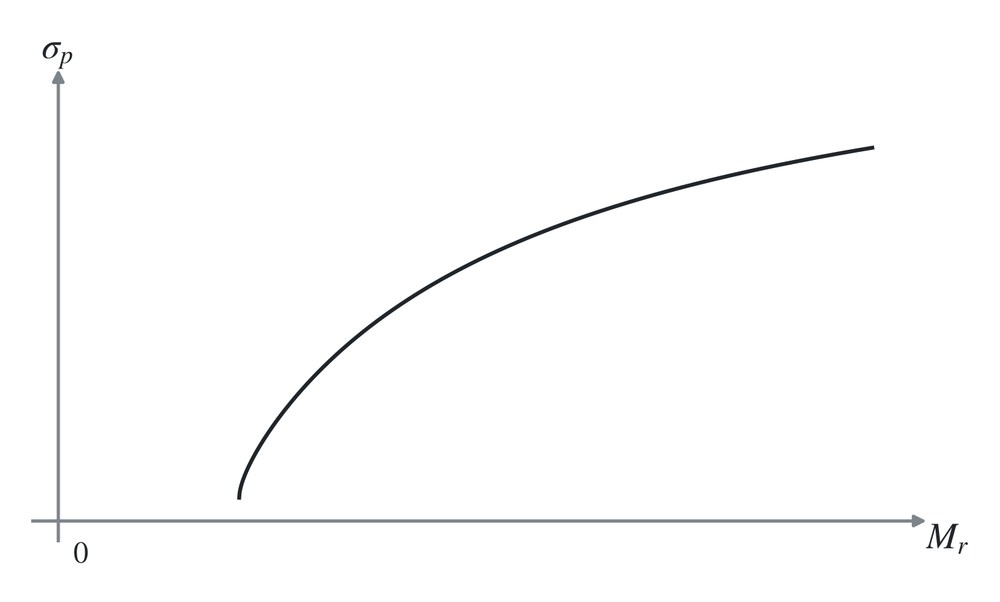

#### iii）经验公式

$$
{\color{#c62828}\sigma_p\approx0.16+0.4(M_r-1)},\qquad 1\le M_r\le1.8,
$$

或

$$
\sigma_p\approx
\begin{cases}
M_r-1,&1\le M_r\le1.25,\\
0.25\sqrt{M_r-1},&1.25<M_r\le2,
\end{cases}
$$

$$
t_s\approx\frac{\pi}{\omega_c}\left[2+1.5(M_r-1)+2.5(M_r-1)^2\right].
$$

### （3）开环频域指标和时域指标之间的关系

#### i）用 $\omega_c,\gamma$ 表示 $\sigma_p,t_s,t_p$，以阻尼比为媒介，可得

$$
{\color{#c62828}\zeta=\frac{\tan\gamma}{2\sqrt[4]{1+\tan^2\gamma}}.}
$$

经过整理：

$$
\sigma_p=\exp\!\left[-\frac{\pi}{\sqrt{2\sqrt{M^2-1}-1}}\right],
$$

$$
t_s=\frac{8}{\omega_c\tan\gamma},
\qquad
t_p=\frac{2\pi}{\omega_c\tan\gamma}\frac{1}{\sqrt{2\sqrt{M^2-1}-1}},
$$

其中（上述换算取 $0<\zeta<1$，$\gamma$ 取对应范围）

$$
M=\frac{2+\tan^2\gamma}{\tan^2\gamma}.
$$

#### ii）经验公式

$$
{\color{#c62828}\sigma_p\approx0.16+0.4\left(\frac{1}{\sin\gamma}-1\right)},
\qquad 34^\circ\le\gamma\le90^\circ,
$$

$$
t_s\approx\frac{\pi}{\omega_c}
\left[2+1.5\left(\frac{1}{\sin\gamma}-1\right)
+2.5\left(\frac{1}{\sin\gamma}-1\right)^2\right].
$$

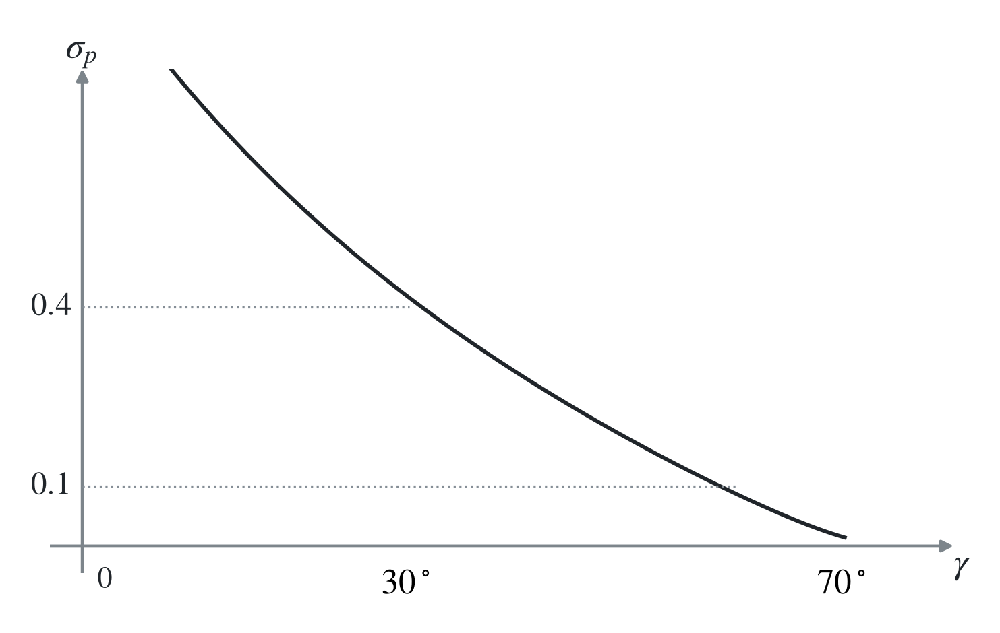

> $\gamma=30^\circ\sim60^\circ$ 时，$\sigma_p\approx37\%\sim9.5\%$。

## 4. 三频段理论

### （1）三频段的划分

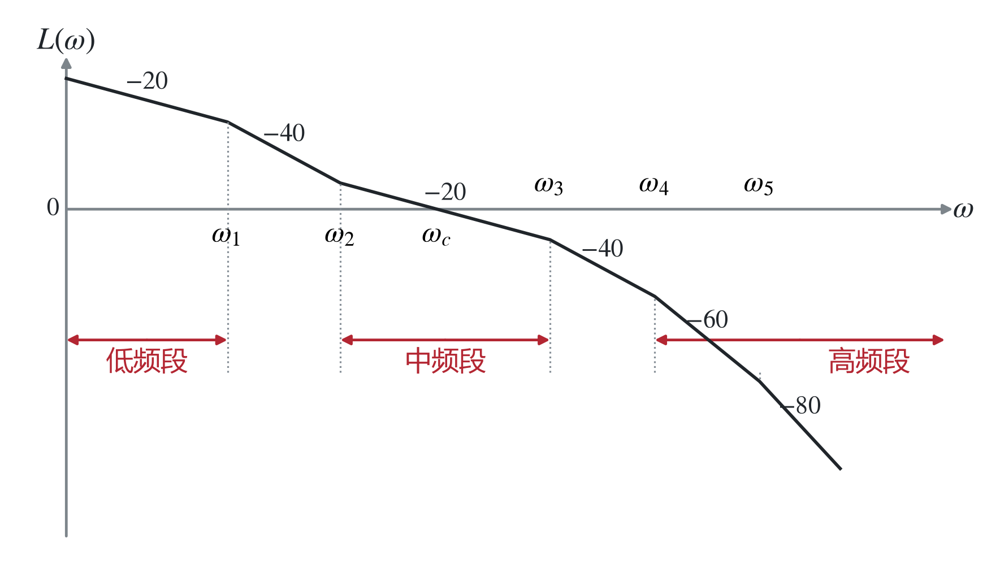

低频段：$\omega<\omega_1$ 的部分。其高度（取决于开环增益 $K$）和斜率（取决于系统型别）共同决定了系统跟踪输入信号的<strong>稳态精度</strong>。

中频段：$\omega_2<\omega<\omega_3$ 的部分，即包含 $\omega_c$ 的线段。令

$$
h=\frac{\omega_3}{\omega_2}
$$

为中频段宽度。

高频段：$\omega>\omega_4$ 的部分，即横轴以下快速衰减的部分。通常要求 $\omega>10\omega_c$。由于分贝值较低，高频段对系统动态性能的影响不大。又因为 $|G(j\omega)|\ll1$，有

$$
|\Phi(j\omega)|=\left|\frac{G(j\omega)}{1+G(j\omega)}\right|\approx|G(j\omega)|,
$$

故高频段可直接反映系统抑制输入端高频干扰的能力：分贝值越低，抗干扰能力越强。

### （2）一个设计合理的三频段

> 例：
>
> $$
> G_1(s)=\frac Ks,\qquad \gamma=180^\circ+(-90^\circ)=90^\circ,
> $$
>
> 相角裕度充足。
>
> $$
> G_2(s)=\frac K{s^2},\qquad \gamma=180^\circ+(-180^\circ)=0,
> $$
>
> 系统临界稳定。
>
> 故以 $-20\ \mathrm{dB/dec}$ 穿越<strong>可保证充足的相角裕度</strong>。

1. 中频段斜率以 $-20\ \mathrm{dB/dec}$ 为宜；
2. 低频段和高频段可以具有更高的斜率：<strong>低频段斜率大可提高稳态性能（型别），高频段斜率大可提高抗干扰能力；</strong>
3. 中频段必须具有足够的带宽，以保证系统的相角裕度；<strong>带宽越大，相角裕度越大；</strong>
4. $\omega_c$ 的大小取决于系统的快速性要求：$\omega_c$ 越大，快速性越好，但抗干扰能力下降。

> $t_s$ 与 $\omega_n$ 成反比（固定阻尼比时）。
>
> 补充：$\omega_r,\omega_c,\omega_b$ 三者成正比（固定阻尼比时）。标准无零点二阶系统在 $0<\zeta<1/\sqrt2$ 时有<strong>$\omega_r<\omega_c<\omega_b$</strong>。

### （3）低频段和高频段特性对中频段剪切频率的影响

如下图

$$
G(s)=\frac{K(\frac{s}{\omega_1}+1)}{s^2(\frac{s}{\omega_2}+1)},
$$

相角裕度为

$$
\gamma=\arctan\frac{\omega_c}{\omega_1}-\arctan\frac{\omega_c}{\omega_2}.
$$

$\omega_1,\omega_2$ 离 $\omega_c$ 越远，相角裕度越大，即中频段越长，相角裕度越大。

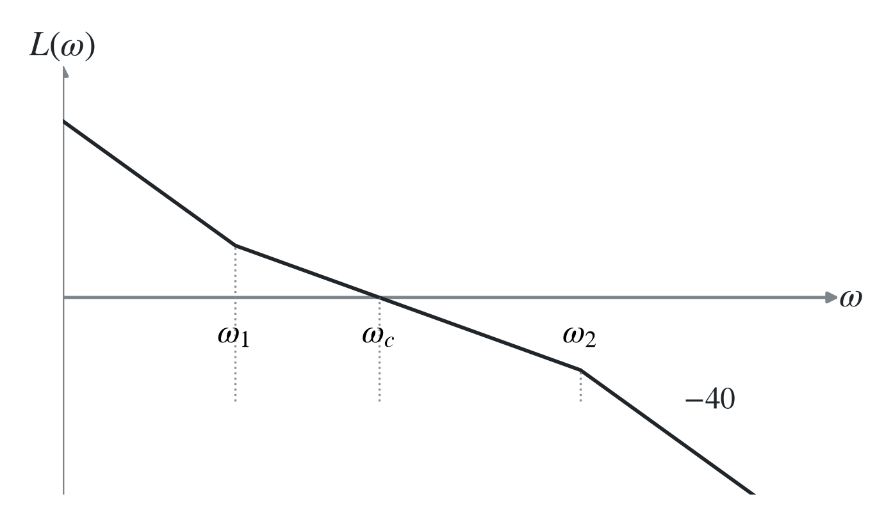

### （4）开环增益的变化对相位裕量的影响

如下图，$K$ 可以改变 $\omega_c$，但无法改变 $\omega_1,\omega_2,h$。

由（3）有

$$
\tan\gamma=\frac{\omega_2-\omega_1}{\omega_1\omega_2/\omega_c+\omega_c}.
$$

当 $\omega_c$ 取 $\sqrt{\omega_1\omega_2}$ 时，$\gamma$ 取最大值 $\gamma_m$。

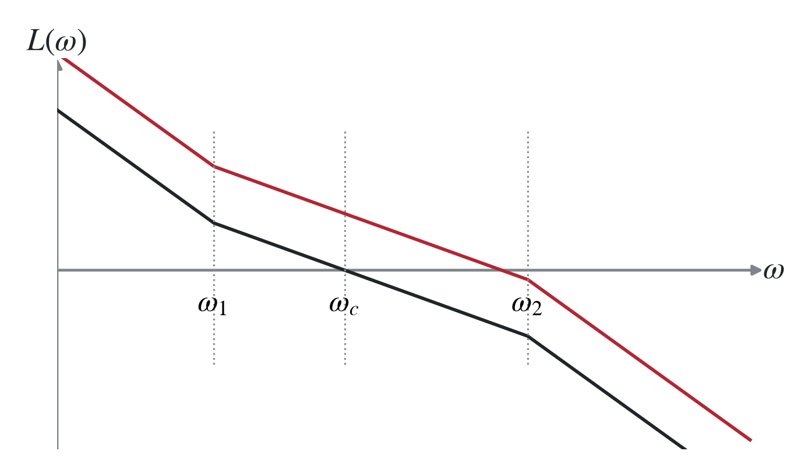

$$
\omega_c=\sqrt{\omega_1\omega_2},
$$

$$
\gamma_m=\arctan\sqrt h-\arctan\frac1{\sqrt h}
=\arctan\frac{h-1}{2\sqrt h}.
$$

⇒ 当 $h$ 不变时，选择 $K$ 使 $\omega_c$ 位于几何中点时，相位裕量有最大值。

具有低、中、高 $(-40),(-20),(-40)$ 特性，$\omega_c=\sqrt{\omega_1\omega_2}$ 的系统称<strong>对称最佳系统</strong>。

### （5）中频段宽度

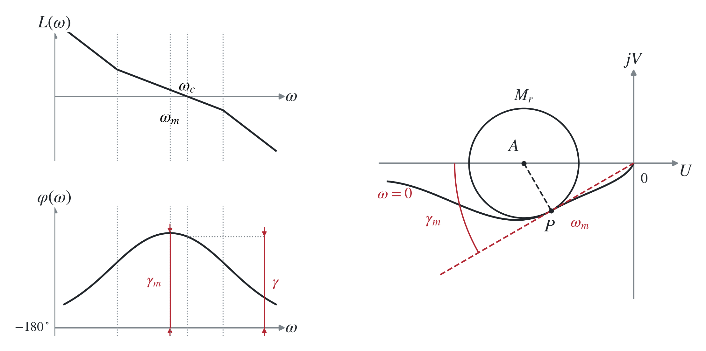

我们下面推导：当 $M_r$（或 $\gamma$）固定时，对称最佳系统的 $\omega_1,\omega_2$ 应当放在哪里。

由 $-20\ \mathrm{dB/dec}$ 穿越得：

$$
\frac{20\lg|G(j\omega_m)|-20\lg|G(j\omega_c)|}
{\lg\omega_m-\lg\omega_c}=-20
\quad\Rightarrow\quad
\frac{\omega_c}{\omega_m}=|G(j\omega_m)|.
$$

结合 $M$ 圆：

$$
|G(j\omega_m)|=|OP|=\sqrt{|AO|^2-|AP|^2}
=\sqrt{\left(\frac{M_r^2}{M_r^2-1}\right)^2-\left(\frac{M_r}{M_r^2-1}\right)^2}
=\frac{M_r}{\sqrt{M_r^2-1}}.
$$

得

$$
\frac{\omega_c}{\omega_m}=\frac{M_r}{\sqrt{M_r^2-1}}.\tag{①}
$$

由 $\gamma_m=\arctan[(h-1)/(2\sqrt h)]$，得 $1/\sin\gamma_m=(h+1)/(h-1)$，有 $1/\sin\gamma\approx(h+1)/(h-1)$。

又由 $M_r\approx1/\sin\gamma$，得

$$
{\color{#c62828}M_r\approx\frac{h+1}{h-1},\qquad h\approx\frac{M_r+1}{M_r-1}.}\tag{②}
$$

由 $\omega_m=\sqrt{\omega_1\omega_2}$、$\omega_2=h\omega_1$ 代入①整理得

$$
\omega_1\approx\omega_c\frac2{h+1},\qquad
\omega_2\approx\omega_c\frac{2h}{h+1}.
$$

在实际设计中，常要求 $M_r$ 小于某个值，因此我们需要拓宽中频带，有：

$$
{\color{#c62828}
\begin{cases}
\omega_1\le\omega_c\dfrac2{h+1},\\
\omega_2\ge\omega_c\dfrac{2h}{h+1}
\end{cases}
\quad\overset{②}{\Longrightarrow}\quad
\begin{cases}
\omega_1\le\omega_c\dfrac{M_r-1}{M_r},\\
\omega_2\ge\omega_c\dfrac{M_r+1}{M_r}.
\end{cases}}
$$
