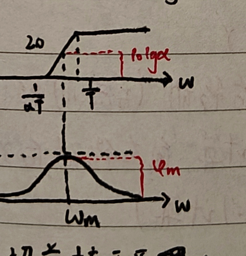
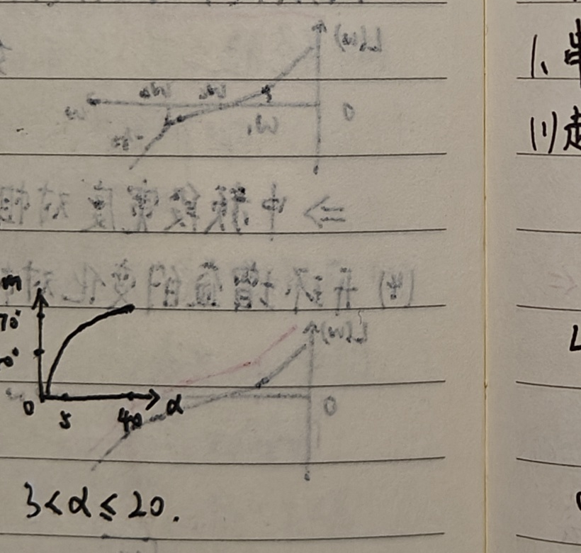
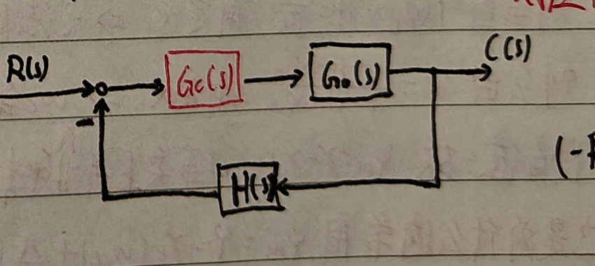
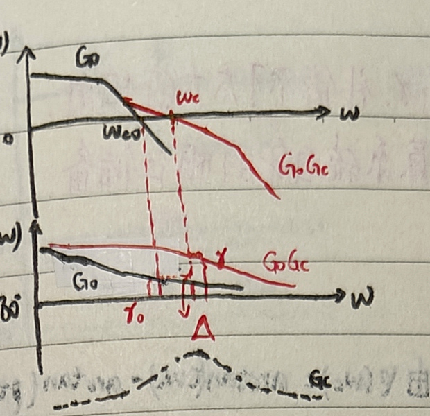
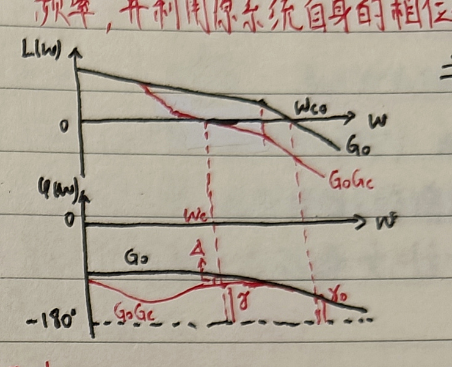
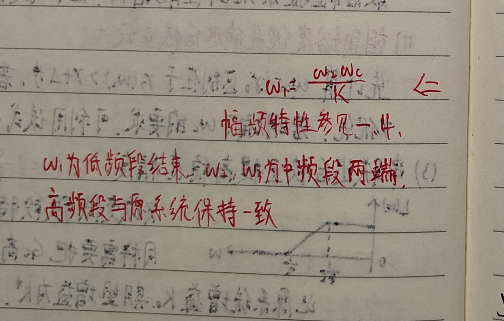
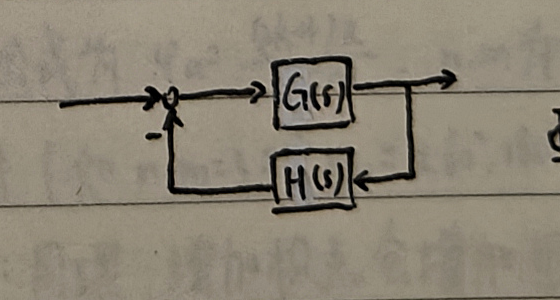
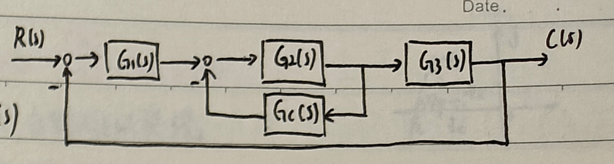

# 二、基于频率特性的校正

## 1. 串联超前校正

### （1）超前校正环节性质

超前校正环节为

$$
G_c(s)=\frac{\alpha Ts+1}{Ts+1},\qquad \alpha>1.
$$

其相频特性为

$$
\varphi_c(\omega)=\arctan(\alpha T\omega)-\arctan(T\omega)
=\arctan\frac{T(\alpha-1)\omega}{1+\alpha T^2\omega^2}.
$$

最大超前相角及其对应频率为

$$
\omega_m=\frac{1}{T\sqrt\alpha},
\qquad
\varphi_m=\arctan\frac{\alpha-1}{2\sqrt\alpha}
=\arcsin\frac{\alpha-1}{\alpha+1}.
$$

在 $\omega_m$ 处，幅值为

$$
L_c(\omega_m)=10\lg\alpha.
$$

<strong>常用范围：$3<\alpha\le20$，$30^\circ\le\varphi_m\le65^\circ$。</strong>

### （2）串联超前校正提高相角裕度

#### i）相角裕度优先

利用超前环节相频特性的峰值 $\varphi_m$，将原系统相角补偿到期望的 $\gamma$。

设原系统开环指标为 $\omega_{c0},\gamma_0$。根据期望的 $\gamma$ 确定 $\varphi_m$：

$$
\gamma=180^\circ+\varphi_0(\omega_c)+\varphi_c(\omega_c)
=\gamma_0+\bigl[\varphi_0(\omega_c)-\varphi_0(\omega_{c0})\bigr]+\varphi_c(\omega_c),
$$

所以

$$
\varphi_c(\omega_c)=\gamma-\gamma_0+
\bigl[\varphi_0(\omega_{c0})-\varphi_0(\omega_c)\bigr].
$$

使校正环节的 $\varphi_m$ 对准校正后的 $\omega_c$，即可最大限度提供超前相角。记

$$
\Delta=\varphi_0(\omega_{c0})-\varphi_0(\omega_c),
$$

则一般取

$$
\varphi_m=\gamma-\gamma_0+\Delta,
$$

其中 $\Delta$ 常取 $5^\circ\sim10^\circ$。

由

$$
\alpha=\frac{1+\sin\varphi_m}{1-\sin\varphi_m}
$$

确定 $\alpha$。为了使 $\omega_m$ 与 $\omega_c$ 对齐，原系统 $G_0$ 在 $\omega_c=\omega_m$ 处的幅值应当为校正环节在 $\omega_m$ 处幅值的相反数：

$$
20\lg|G_0(j\omega_c)|=-10\lg\alpha,
$$

即

$$
|G_0(j\omega_c)|=\frac{1}{\sqrt\alpha}.
$$

由此确定 $\omega_c=\omega_m$，再由

$$
T=\frac{1}{\omega_m\sqrt\alpha}
$$

确定 $T$。最后检验系统性能指标；若不满足要求，则调整 $\Delta$ 后重新计算。

#### ii）剪切频率优先

先计算原系统的开环指标 $\omega_{c0},\gamma_0$；根据设计要求确定期望剪切频率的下限 $\omega_{cL}$。校正环节所需提供的超前相角为

$$
\varphi_m=\gamma-\gamma_0(\omega_{cL}).
$$

再由

$$
\alpha=\frac{1+\sin\varphi_m}{1-\sin\varphi_m}
$$

以及 $|G_0(j\omega_c)|=1/\sqrt\alpha$ 确定 $\omega_c$。若 $\omega_c$ 不满足要求，则修改 $\varphi_m$。由 $T=1/(\omega_m\sqrt\alpha)$ 确定 $T$，最后检验性能指标。

由

$$
\varphi_m=\arcsin\frac{\alpha-1}{\alpha+1}
$$

计算 $\varphi_m$，并检验 $\varphi_m>\gamma-\gamma_0+\Delta$；若对 $\omega_c$ 的要求严格，则直接以 $\omega_c$ 为优先。

<strong>超前校正设计必须同时补偿相位，并把 $\omega_c$ 处的幅值拉到 $0\ \mathrm{dB}$；两项要求可能发生矛盾。</strong>

若指定 $\omega_c$，则由 $|G_0(j\omega_c)|=1/\sqrt\alpha$ 固定 $\alpha$，此时不能同时保证 $\gamma$；若指定 $\varphi_m$，则由

$$
\alpha=\frac{1+\sin\varphi_m}{1-\sin\varphi_m}
$$

固定 $\alpha$，而 $\omega_c$ 会右移，使相角裕度发生变化，因而引入 $\Delta$。通常近似取

$$
\varphi_m=\gamma-\gamma_0(\omega_{cL})+\Delta,\qquad \Delta\approx10^\circ.
$$

若后续再串联滞后环节，把右移的 $\omega_c$ 拉回，则不需要引入该 $\Delta$。

### （3）多级超前校正

当需要补偿的相角很大时，可采用两级超前校正。单级通常最多提供约 $60^\circ$ 的有效超前相角。若采用两个相同的超前环节，可写成

$$
G_c(s)=\left(\frac{\alpha Ts+1}{Ts+1}\right)^2,
$$

于是

$$
T=\frac{1}{\omega_m\sqrt\alpha},\qquad
|G_c(j\omega_m)|=\alpha,\qquad
\varphi_m=2\arcsin\frac{\alpha-1}{\alpha+1}.
$$

<strong>串联超前校正会增加相角裕度，同时提高剪切频率，并增大中、高频段幅值。</strong>

## 2. 串联滞后校正

### （1）滞后校正环节性质

滞后校正环节为

$$
G_c(s)=\frac{\tau s+1}{\beta\tau s+1},\qquad \beta>1.
$$

其相频特性为

$$
\varphi_c(\omega)=\arctan\frac{(1-\beta)\tau\omega}{1+\beta\tau^2\omega^2}.
$$

最大滞后相角及其对应频率为

$$
\omega_m=\frac{1}{\tau\sqrt\beta},
\qquad
\varphi_m=-\arcsin\frac{\beta-1}{\beta+1}.
$$

对应转折频率中点的幅值为

$$
L_c(\omega_m)=-10\lg\beta.
$$

### （2）串联滞后校正提高相角裕度

利用校正装置高频段的幅值衰减降低原系统剪切频率，并利用原系统自身的相位储备提高相角裕度。需要使校正环节的高频段对准原系统中频段；由于校正环节具有负相角，会带来少量相角损失。

#### i）剪切频率优先的滞后校正

先计算 $\omega_{c0},\gamma_0$，再确定 $\omega_c$，要求

$$
180^\circ+\angle G_0(j\omega_c)>\gamma+\Delta,
$$

其中 $\Delta$ 为校正环节附加相角的裕量，即 $\gamma_0(\omega_c)>\gamma+\Delta$。

要使 $\omega_c$ 处幅值达到 $0\ \mathrm{dB}$，取

$$
\beta=|G_0(j\omega_c)|.
$$

为使 $\Delta$ 较小，通常令

$$
\frac1\tau=\left(\frac15\sim\frac1{10}\right)\omega_c.
$$

经验上，$1/\tau=\omega_c/10$ 时，附加相角约为 $-6^\circ$。最后检验性能指标，若不满足要求则调整 $\Delta$ 后重新设计。

#### ii）相角裕度优先的滞后校正

基本流程与上式相同。区别在于：若已明确 $\gamma$ 的要求，可直接利用该要求计算 $\omega_c$，以 $\gamma$ 为优先；若已明确 $\omega_c$ 的要求，可先检查设计计算的 $\Delta$ 是否留有足够余量，以 $\omega_c$ 为优先。

### （3）串联滞后校正提高稳态精度

$$
G_c(s)=\beta\frac{\tau s+1}{\beta\tau s+1}.
$$

它只改变低频段特性，因而可在基本不改变动态特性的情况下提高稳态精度。将 $G_c$ 的高频段与原系统中频段对齐。若原系统增益为 $K$、期望增益为 $K^*$，则

$$
\beta=\frac{K^*}{K},
\qquad
\frac1\tau\approx\frac1{10}\omega_{c0}.
$$

超前环节可以增大 $\gamma$，但不能补偿过大的所需相角；其能力受原系统相位储备限制，代价是 $\omega_c$ 增大。

滞后环节在剪切频率处的相角为

$$
\varphi(\omega_c)=\arctan(\tau\omega_c)-\arctan(\beta\tau\omega_c).
$$

经验上取 $1/\tau=\omega_c/10$ 时，在 $\omega_c$ 处约附加 $6^\circ$ 的相角滞后，因此滞后环节的附加相角通常取 $\Delta=6^\circ$。

超前校正取 $\omega_c=\omega_m$ 时，$20\lg|G_c(j\omega_c)|=10\lg\alpha$；滞后校正的剪切频率位于其高频段，$20\lg|G_c(j\omega_c)|=-20\lg\beta$。

<strong>以剪切频率优先进行超前或滞后设计时，通常不再另设 $\Delta$ 步骤。</strong>

## 3. 串联滞后—超前校正

#### 滞后环节优先的滞后—超前校正

原系统稳态精度较好时，可以先降低增益 $K$ 以降低 $\omega_c$，再使用超前校正提高 $\gamma$ 和 $\omega_c$，最后用滞后环节补回稳态精度。

先进行相角裕度优先的超前校正：

$$
G_{c1}(s)=\frac{\alpha Ts+1}{Ts+1},
$$

$$
\varphi_m=\gamma-\gamma_0(\omega_c)+\Delta_1+\Delta_2,
$$

其中 $\Delta_1$ 为超前环节附加相角裕量，$\Delta_2$ 为滞后环节附加相角的补偿量。仍有

$$
\alpha=\frac{1+\sin\varphi_m}{1-\sin\varphi_m},
\qquad
T=\frac1{\omega_m\sqrt\alpha}.
$$

降增益后的系统应满足

$$
|G_1(j\omega_c)|=\frac1{\sqrt\alpha}.
$$

若为补回增益，取

$$
K_1=K\frac{|G_1(j\omega_c)|}{|G_0(j\omega_c)|},
\qquad
\beta=\frac{K}{K_1},
$$

再根据 $\Delta_2$ 选取 $1/\tau=(1/5\sim1/10)\omega_c$。

#### 超前环节优先的滞后—超前校正

<strong>先用超前环节在指定 $\omega_c$ 处提高相位储备，再用滞后环节把 $\omega_c$ 处幅频特性降至 $0\ \mathrm{dB}$：超前环节负责相角，滞后环节负责幅值。</strong>

先进行相角裕度优先的超前校正：

$$
G_{c1}(s)=\frac{\alpha Ts+1}{Ts+1},
\qquad
\varphi_m=\gamma-\gamma_0(\omega_c)+\Delta_2,
$$

再进行 $\omega_c$ 优先的滞后校正：

$$
G_{c2}(s)=\frac{\tau s+1}{\beta\tau s+1}.
$$

记 $G_1(s)=G_0(s)G_{c1}(s)$，则

$$
\beta=|G_1(j\omega_c)|,
$$

并根据 $\Delta_2$ 选择 $1/\tau=(1/5\sim1/10)\omega_c$。

#### 期望频率特性法

常用经验关系为

$$
\sigma_p\approx0.16+0.4\left(\frac1{\sin\gamma}-1\right),
$$

$$
t_s\approx\frac{\pi}{\omega_c}\left[2+1.5\left(\frac1{\sin\gamma}-1\right)+2.5\left(\frac1{\sin\gamma}-1\right)^2\right],
$$

$$
M_r\approx\frac1{\sin\gamma}\approx\frac{h+1}{h-1},
\qquad
h\approx\frac{1+\sin\gamma}{1-\sin\gamma}.
$$

确定中频段的常用方法：

- 对称最佳法：$\omega_2\le\omega_c/\sqrt h$，$\omega_3\ge\omega_c\sqrt h$；
- 剪切频率错位法：$\omega_2\le 2\omega_c/(h+1)$，$\omega_3\ge2h\omega_c/(h+1)$；
- 最小峰值法：$\omega_2\le\omega_c(M_r-1)/M_r$，$\omega_3\ge\omega_c(M_r+1)/M_r$。

根据指标确定 $\gamma,\omega_c$，再求出 $h,\omega_2,\omega_3$，即可确定中频段。

<strong>保持原系统低、高频段特性不变，本质上是设计新系统，只让校正环节完成零极点对消。</strong>

<strong>这里没有引入 $\Delta$，是因为最初选择的 $\omega_c$ 是精确的，与最终的 $\omega_c$ 相同。</strong>

幅频特性中，$\omega_1$ 为低频段结束频率；$\omega_2$、$\omega_3$ 为中频段的两端；高频段与原系统保持一致。

## 4. 反馈校正

反馈校正可改变局部结构和参数，主要功能包括：

1. 改变局部结构和参数；
2. 降低参数敏感性，提高鲁棒性；
3. 消除不希望的折点，即用零极点对消；
4. 形成等效串联反馈。

例如，若

$$
G(s)=\frac{K}{s},\qquad H(s)=\beta,
$$

则局部闭环传递函数为

$$
\Phi(s)=\frac{1/\beta}{s/(K\beta)+1},
$$

积分环节变为惯性环节。

若

$$
G(s)=\frac{K}{T_1s+1}\frac1{2\zeta Ts+1},
\qquad H(s)=\beta(\tau s+1),
$$

则反馈校正改变参数而不改变局部结构。

期望频率特性反馈校正中，前向通道为

$$
G_0(s)=G_1(s)G_2(s)G_3(s),
$$

内环闭环传递函数为

$$
G_{12}(s)=\frac{G_2(s)}{1+G_2(s)G_c(s)}.
$$

当 $20\lg|G_2G_c|\ll0$ 时，$G_{12}(s)\approx G_2(s)$；当 $20\lg|G_2G_c|\gg0$ 时，

$$
G_{12}(s)\approx\frac1{G_c(s)}.
$$

故应使 $|G_0(j\omega)|>|G_d(j\omega)|$，大得越多精度越高。由

$$
20\lg|G_2(j\omega)G_c(j\omega)|=L_0(\omega)-L(\omega)
$$

求取 $G_2G_c$，再由已知的 $G_2$ 求 $G_c$。还需检验在 $\omega_c$ 附近是否满足 $|G_2(j\omega)G_c(j\omega)|\gg1$。

