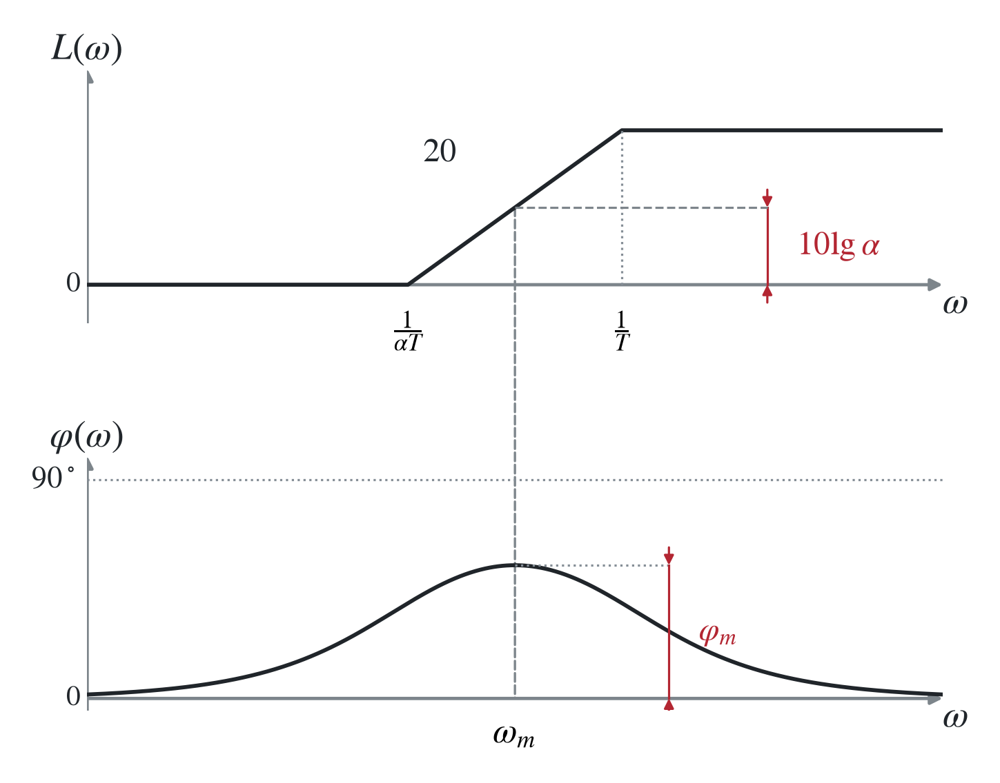
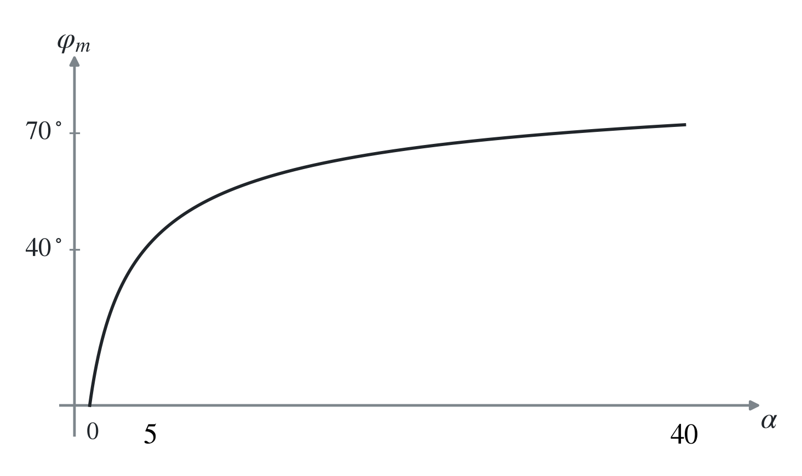
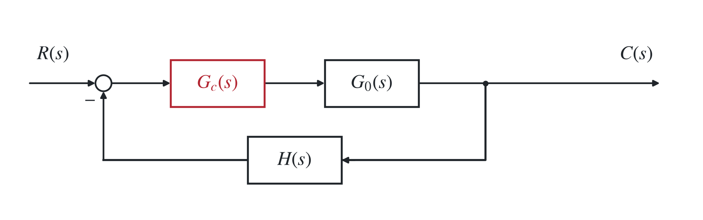
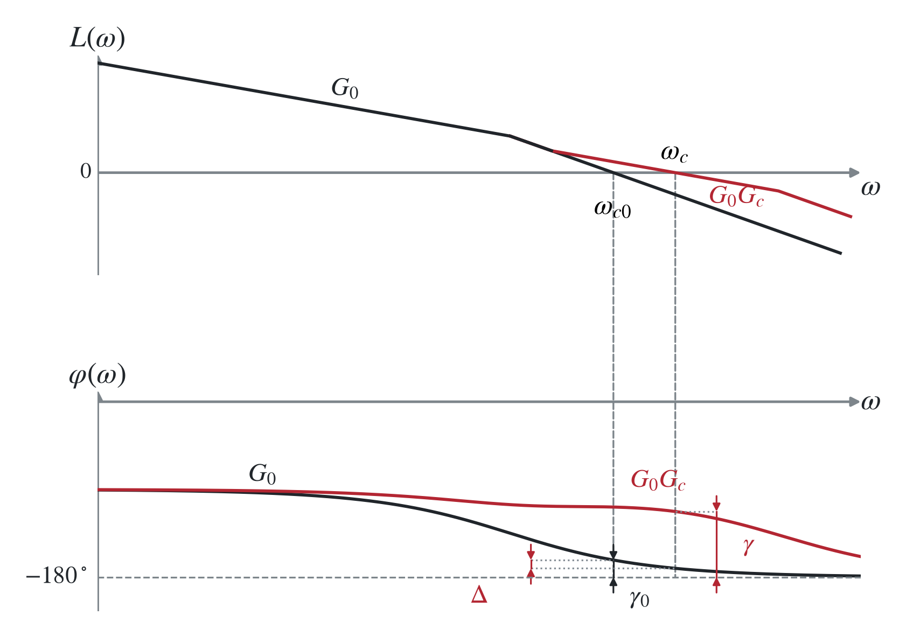
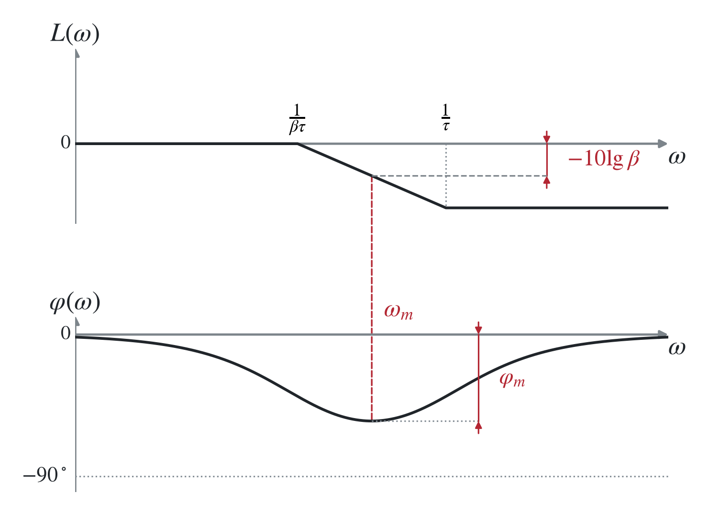
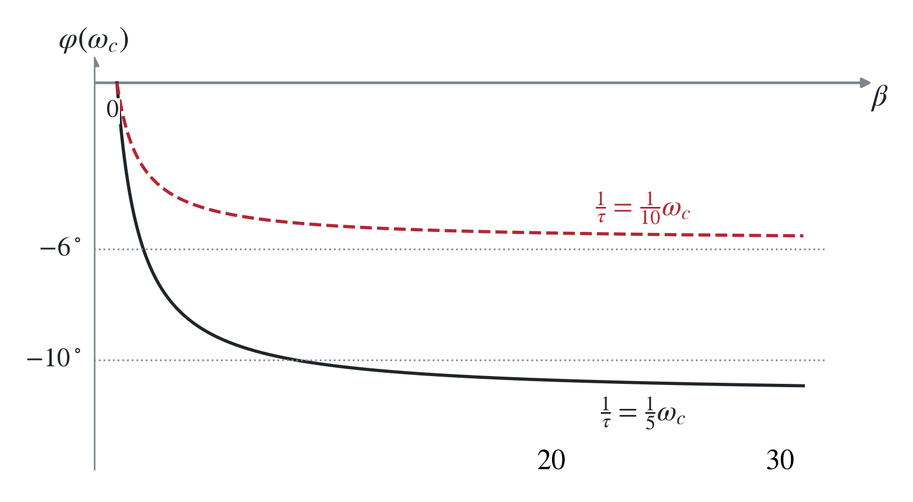
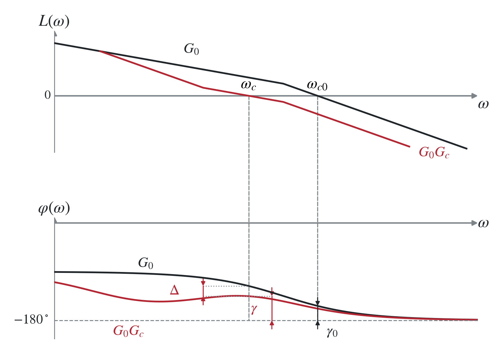
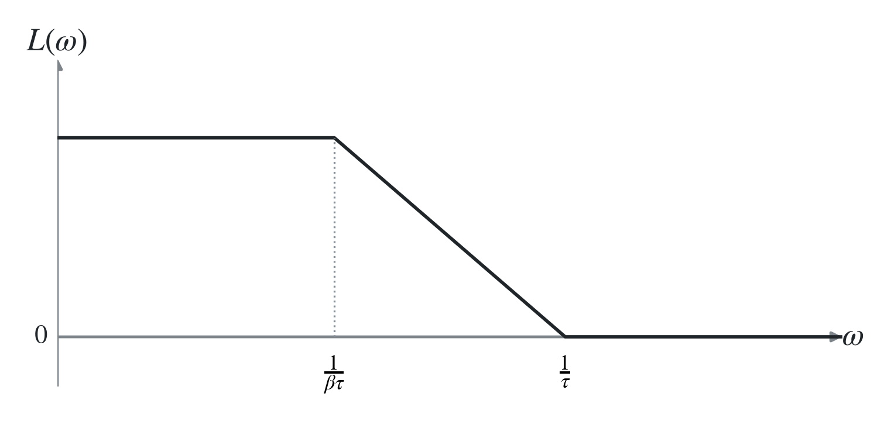
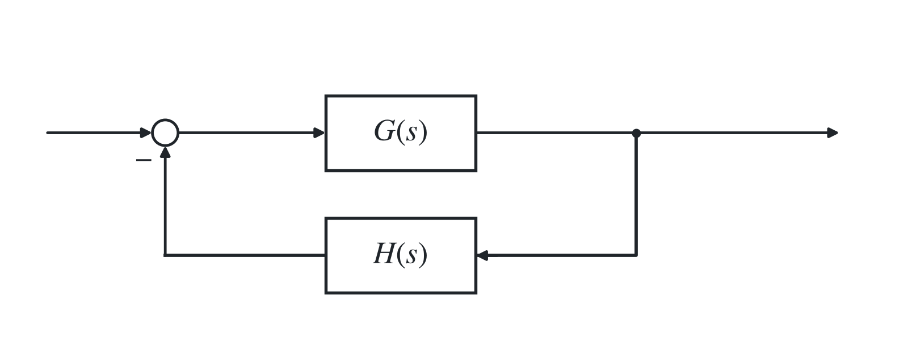
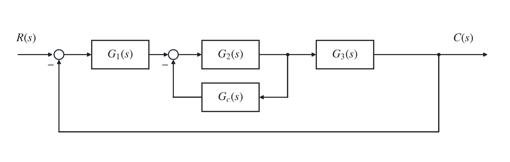

# 二、基于频率特性的校正

## 1. 串联超前校正

### （1）超前校正环节性质

$$
{\color{#c62828}G_c(s)=\frac{\alpha Ts+1}{Ts+1},\qquad\alpha>1.}
$$

⇒

$$
\varphi(\omega)=\arctan(\alpha T\omega)-\arctan(T\omega)
=\arctan\frac{T(\alpha-1)\omega}{1+\alpha T^2\omega^2}.
$$

得

$$
{\color{#c62828}\omega_m=\frac1{T\sqrt\alpha},\qquad
\varphi_m=\arctan\frac{\alpha-1}{2\sqrt\alpha}
=\arcsin\frac{\alpha-1}{\alpha+1}.}
$$

<strong>对应转折频率的中点。</strong>

代入

$$
L(\omega)=20\lg|G_c(j\omega)|
=20\lg\frac{\sqrt{\alpha^2T^2\omega^2+1}}{\sqrt{T^2\omega^2+1}},
$$

得

$$
{\color{#c62828}L(\omega_m)=10\lg\alpha.}
$$

> 
>
> 常用范围：$3<\alpha\le20$，$30^\circ\le\varphi_m\le65^\circ$。

一般为单位负反馈，$H(s)=1$。

### （2）串联超前校正原理

#### i）相角裕度优先

<strong>我们用超前环节相频特性的峰值 $\varphi_m$ 将原系统相角补至期望的 $\gamma$。</strong>

先计算原系统开环频域指标：$\omega_{c0},\gamma_0$。

再根据期望 $\gamma$ 确定 $\varphi_m$：

$$
\begin{aligned}
\gamma
&=180^\circ+\varphi_0(\omega_c)+\varphi_c(\omega_c)\\
&=180^\circ+\varphi_0(\omega_{c0})+\varphi_0(\omega_c)-\varphi_0(\omega_{c0})+\varphi_c(\omega_c)\\
&=\gamma_0+[\varphi_0(\omega_c)-\varphi_0(\omega_{c0})]+\varphi_c(\omega_c).
\end{aligned}
$$

得

$$
\varphi_c(\omega_c)=\gamma-\gamma_0+
[\varphi_0(\omega_{c0})-\varphi_0(\omega_c)].
$$

我们要让校正环节的 $\varphi_m$ 对准校正后的 $\omega_c$，这样可以最大限度地提供超前相角（如下图）。

记 $\Delta=\varphi_0(\omega_{c0})-\varphi_0(\omega_c)$，则

$$
{\color{#c62828}
\varphi_m=\gamma-\gamma_0+\Delta,\qquad
\Delta\text{ 一般取 }5^\circ\sim10^\circ
\quad\Rightarrow\quad
\alpha=\frac{1+\sin\varphi_m}{1-\sin\varphi_m}.}
$$

为了使 $\omega_m$ 与 $\omega_c$ 对齐，原系统 $G_0$ 在 $\omega_c=\omega_m$ 处的幅值应当为校正环节 $\omega_m$ 处幅值的相反数：

$$
20\lg|G_0(j\omega_c)|=-10\lg\alpha.
$$

得

$$
{\color{#c62828}|G_0(j\omega_c)|=\frac1{\sqrt\alpha}.}
$$

<strong>由此确定出 $\omega_c,\omega_m$。</strong>

$$
{\color{#c62828}T=\frac1{\omega_m\sqrt\alpha}.}
$$

<strong>由此确定 $T$，即可确定超前校正环节。</strong>

最后检验系统的性能指标，若不满足要求可增大 $\Delta$ 的值重新计算。

#### ii）剪切频率优先

<strong>我们用超前环节幅频特性的 $\omega_m$ 处幅值将原系统期望 $\omega_c$ 处的分贝数抬至 $0\ \mathrm{dB}$。</strong>

先计算原系统的开环频域指标：$\omega_{c0},\gamma_0$。

根据设计要求确定期望的校正后 $\omega_c$，并令校正环节的 $\omega_m$ 对准 $\omega_c$。

<strong>由 $|G_0(j\omega_c)|=1/\sqrt\alpha$ 确定 $\alpha$，再由 $T=1/(\omega_m\sqrt\alpha)$ 确定 $T$，最后检验系统的性能指标。</strong>

若不满足要求可修改 $\omega_c$ 重新计算。

> 可由 $\varphi_m=\arcsin[(\alpha-1)/(\alpha+1)]$ 计算 $\varphi_m$，通过验证 $\varphi_m>\gamma-\gamma_0+\Delta$ 检验是否满足相角指标。
>
> 事实上若对 $\omega_c$ 要求较为严格，可直接考虑 $\omega_c$ 优先。

#### iii）相角裕度优先的超前校正修正设计

<strong>依据 $\omega_c$ 确定 $\varphi_m$（与 i）的区别）。</strong>

先计算原系统的开环频域指标：$\omega_{c0},\gamma_0$。

取 $\omega_{cL}$ 为所要求的剪切频率的下界，则校正环节需提供的超前相角

$$
{\color{#c62828}\varphi_m=\gamma-\gamma_0(\omega_{cL}).}
$$

⇒

$$
\alpha=\frac{1+\sin\varphi_m}{1-\sin\varphi_m}.
$$

再由 $|G_0(j\omega_c)|=1/\sqrt\alpha$ 确定 $\omega_c$。若 $\omega_c$ 不满足要求需修改 $\varphi_m$。

⇒ 由 $T=1/(\omega_m\sqrt\alpha)$ 确定 $T$，最后检验系统的性能指标。

> <strong>☆ 注意超前校正中 $\alpha$ 需同时承担“补偿相角”和“拉回 $\omega_c$ 处幅频至 $0\ \mathrm{dB}$”的任务。</strong>
>
> <strong>若定死 $\omega_c$，则会由 $|G_0(j\omega_c)|=1/\sqrt\alpha$ 确定 $\alpha$ ⇒ 无法顾及 $\gamma$。</strong>
>
> <strong>若定死 $\varphi_m$，则会由 $\alpha=(1+\sin\varphi_m)/(1-\sin\varphi_m)$ 确定 $\alpha$ ⇒ $\omega_c$ 会向右移动（方法 iii）中的 $G_c$ 在 $\varphi_m$ 处提供正的幅值，故 $\varphi_m=\gamma-\gamma_0(\omega_{cL})$ 事实上非常粗略计算，向右移动后 $\gamma(\omega)$ 会减小并产生 $\Delta$。这也是为什么通常用 $\varphi_m=\gamma-\gamma_0(\omega_{cL})+\Delta$（约 $10^\circ$）计算）。</strong>
>
> 若再串联滞后环节，将右移的 $\omega_c$ 拉回来，就不需要加这个 $\Delta$ 了（见 3.（3））。

### （3）多级超前校正设计

若需要补偿的相角很大，则需要采用两级超前校正（工程上单级大约采用<strong>最大 $60^\circ$ 的超前相角</strong>）。

可以分别设计：

$$
G_{c1}(s)=\frac{\alpha_1T_1s+1}{T_1s+1},\qquad
G_{c2}(s)=\frac{\alpha_2T_2s+1}{T_2s+1}.
$$

也可以一次性设计：

$$
G_c(s)=\left(\frac{\alpha Ts+1}{Ts+1}\right)^2
\quad\Rightarrow\quad
T=\frac1{\omega_m\sqrt\alpha},\qquad
|G_0(j\omega_c)|=\frac1\alpha,\qquad
\varphi_m=2\arcsin\frac{\alpha-1}{\alpha+1}.
$$

### （4）使用串联超前校正

<strong>相角裕度增加、剪切频率增加、中高频段幅值增加。</strong>

## 2. 串联滞后校正

### （1）滞后校正环节性质

$$
{\color{#c62828}G_c(s)=\frac{\tau s+1}{\beta\tau s+1},\qquad\beta>1.}
$$

⇒

$$
\varphi(\omega)=\arctan\frac{(1-\beta)\tau\omega}{1+\beta\tau^2\omega^2}.
$$

得

$$
{\color{#c62828}\omega_m=\frac1{\tau\sqrt\beta},\qquad
\varphi_m=\arcsin\frac{1-\beta}{1+\beta},\qquad
L(\omega_m)=-10\lg\beta.}
$$

<strong>对应转折频率的中点。</strong>

### （2）串联滞后校正提高相角裕度

原理：<strong>利用校正装置高频段的幅值衰减降低原系统剪切频率，并利用原系统自身的相位储备提高相角裕度。</strong>

⇒ 我们需要让校正环节的高频段对齐原系统的中频段。由于校正环节均为负相角，故会带来少量相角损失。

> 由 $\varphi(\omega_c)=\arctan(\tau\omega_c)-\arctan(\beta\tau\omega_c)$ 绘制，可见<strong>$1/\tau=\omega_c/10$ 时，$\omega_c$ 处滞后环节带来的相角滞后约 $6^\circ$，故常取滞后附加相角 $\Delta=6^\circ$。</strong>

> <strong>超前环节靠 $G_c$ 提高 $\gamma$，补偿不了太大的相角；而滞后环节利用原系统自身的相位储备，但代价是牺牲 $\omega_c$。</strong>

#### i）剪切频率优先的滞后校正设计

先计算 $\omega_{c0},\gamma_0$，再确定 $\omega_c$，需满足

$$
180^\circ+\angle G_0(j\omega_c)>\gamma+\Delta.
$$

其中 $\gamma$ 为期望相角裕度，$\Delta$ 为校正装置相位滞后的附加相角（如图），即

$$
{\color{#c62828}\gamma_0(\omega_c)>\gamma+\Delta.}
$$

为使 $\omega_c$ 处到达 $0\ \mathrm{dB}$，按高频渐近线近似，需要 $20\lg|G_0(j\omega_c)|-20\lg\beta\approx0$，即

$$
{\color{#c62828}\beta=|G_0(j\omega_c)|.}
$$

从而确定 $\beta$。

并使 $\Delta$ 较小（$6^\circ\sim12^\circ$ 以下），需要

$$
{\color{#c62828}\frac1\tau=\left(\frac15\sim\frac1{10}\right)\omega_c.}
$$

<strong>通常 $1/\tau=\omega_c/10$ 对应 $\Delta=6^\circ$，如上图所示。</strong>

最后检验系统的性能指标，若不满足要求可以改变 $\Delta$ 重新计算。

#### ii）相角裕度优先的滞后校正设计

流程与 i）一致，区别在于 $\gamma_0(\omega_c)>\gamma+\Delta$ 时，若明确了 $\gamma$ 的要求，可直接利用该式计算 $\omega_c$，为 $\gamma$ 优先。若明确了 $\omega_c$ 的要求，可利用该式计算 $\Delta$ 是否留出充足余量，为 $\omega_c$ 优先。

> 注意超前校正中 $\omega_c=\omega_m$，对应 $20\lg|G_c(j\omega_c)|=10\lg\alpha$。
>
> 而滞后校正 $\omega_c$ 对齐 $G_c$ 高频段，因此 $20\lg|G_c(j\omega_c)|\approx-20\lg\beta$。
>
> <strong>超前、滞后校正的 $\omega_c$ 优先事实上都省略了带 $\Delta$ 的一步。</strong>

### （3）串联滞后校正提高稳态精度

$$
{\color{#c62828}G_c(s)=\beta\frac{\tau s+1}{\beta\tau s+1}.}
$$

只改变低频段特性 ⇒ <strong>可维持动态特性基本不变，提高稳态精度。</strong>

同样需要把 $G_c$ 高频段与原系统中频段对齐。记原系统增益 $K$，期望增益为 $K^*$，则

$$
{\color{#c62828}\beta=\frac{K^*}{K},\qquad
\frac1\tau=\frac1{10}\omega_{c0}.}
$$

约 $\Delta=6^\circ$ 附加相角。

## 3. 串联滞后—超前校正

### （1）滞后环节优先的滞后—超前校正设计

原理：<strong>期望剪切频率 $\omega_c$ 小于原系统的 $\omega_{c0}$，故应采用滞后校正。但原系统相位储备 $\gamma_0(\omega_c)$ 不够，故应采用超前校正提高相角。由于超前校正会抬高剪切频率，故滞后校正选定的目标 $\omega_{c1}$ 应当小于 $\omega_c$。</strong>

⇒ 先采用剪切频率优先的滞后校正，再采用剪切频率／相角裕度优先的超前校正。

### （2）超前环节优先的滞后—超前校正设计 1

原理：<strong>原系统稳态精度好，可以先降低增益 $K$ 以拉低 $\omega_c$</strong>（类似（1）中的滞后校正），<strong>再使用超前校正提高 $\gamma,\omega_c$，最后用滞后环节 $G_c(s)=\beta(\tau s+1)/(\beta\tau s+1)$ 补回稳态精度。</strong>

⇒ 例：先进行 $\gamma$ 优先的超前校正：

$$
G_{c1}(s)=\frac{\alpha Ts+1}{Ts+1},\qquad
\varphi_m=\gamma-\gamma_0(\omega_c)+\Delta_1+\Delta_2.
$$

其中 $\Delta_1$ 为超前环节附加相角（约 $10^\circ$），$\Delta_2$ 为滞后环节附加相角（约 $6^\circ$）。

$$
\alpha=\frac{1+\sin\varphi_m}{1-\sin\varphi_m},\qquad
T=\frac1{\omega_m\sqrt\alpha}.
$$

降增益的系统需满足 $|G_1(j\omega_c)|=1/\sqrt\alpha$，故降低后的增益为

$$
{\color{#c62828}K_1=K\frac{|G_1(j\omega_c)|}{|G_0(j\omega_c)|}.}
$$

为补回增益，令 $\beta=K/K_1$，再按照前面的 $\Delta_2$ 选择 $1/\tau=(1/5\sim1/10)\omega_c$。

### （3）超前环节优先的滞后—超前校正设计 2（常用）

原理：<strong>使用超前环节在指定 $\omega_c$ 处提高相位储备，再用滞后环节将 $\omega_c$ 处幅频降至 $0\ \mathrm{dB}$，即超前环节负责相角，滞后环节负责幅值。</strong>

⇒ 例：先进行 $\gamma$ 优先的超前校正：

$$
G_{c1}(s)=\frac{\alpha Ts+1}{Ts+1},\qquad
\varphi_m=\gamma-\gamma_0(\omega_c)+\Delta_2.
$$

其中 $\Delta_2$ 为滞后环节附加相角。

$$
\alpha=\frac{1+\sin\varphi_m}{1-\sin\varphi_m},\qquad T=\frac1{\omega_m\sqrt\alpha}.
$$

再进行 $\omega_c$ 优先的滞后校正：

$$
G_{c2}(s)=\frac{\tau s+1}{\beta\tau s+1}.
$$

记 $G_1(s)=G_0(s)G_{c1}(s)$，则 $\beta=|G_1(j\omega_c)|$，根据 $\Delta_2$ 选择 $1/\tau=(1/5\sim1/10)\omega_c$。

> 注意之所以没有 $\Delta_1$，是因为这里的 $\omega_c$ 是精确的，与最后的 $\omega_c$ 一样。

## 4. 期望频率特性法（常用）

经验公式：

$$
\sigma_p\approx0.16+0.4\left(\frac1{\sin\gamma}-1\right),
$$

$$
t_s\approx\frac{\pi}{\omega_c}
\left[2+1.5\left(\frac1{\sin\gamma}-1\right)+2.5\left(\frac1{\sin\gamma}-1\right)^2\right],
\qquad
M_r\approx\frac1{\sin\gamma}\approx\frac{h+1}{h-1}.
$$

$$
{\color{#c62828}h\approx\frac{1+\sin\gamma}{1-\sin\gamma}.}
$$

对称最佳法确定中频段：

$$
{\color{#c62828}\omega_2\le\frac{\omega_c}{\sqrt h},\qquad\omega_3\ge\omega_c\sqrt h.}
$$

剪切频率错位确定中频段：

$$
{\color{#c62828}\omega_2\le\omega_c\frac2{h+1},\qquad\omega_3\ge\omega_c\frac{2h}{h+1}.}
$$

最小峰值法确定中频段：

$$
{\color{#c62828}\omega_2\le\omega_c\frac{M_r-1}{M_r},\qquad\omega_3\ge\omega_c\frac{M_r+1}{M_r}.}
$$

以上推导过程见一、4。根据指标确定 $\gamma,\omega_c$，再求出 $h,\omega_2,\omega_3$ 确定出中频段即可。

注意保持原系统低、高频段特性不变 ⇒ 事实上为<strong>设计新系统</strong>，仅靠校正环节做<strong>零极点对消</strong>。

> $$
> {\color{#c62828}\omega_1=\frac{\omega_2\omega_c}{K}.}
> $$
>
> <strong>中频特性参见一、4。$\omega_1$ 为低频段结束，$\omega_2,\omega_3$ 为中频段两端，高频段与原系统保持一致。</strong>
>

## 5. 反馈校正（了解）

### （1）反馈校正的功能

$$
\Phi(s)=\frac{G(s)}{1+G(s)H(s)}.
$$

#### i）改变局部结构和参数

例：

$$
G(s)=\frac Ks,\qquad H(s)=\beta\quad\text{（位置反馈）}
\quad\Rightarrow\quad
\Phi(s)=\frac{1/\beta}{s/(K\beta)+1}.
$$

积分环节 ⇒ 惯性环节。

$$
G(s)=\frac K{T^2s^2+2\zeta Ts+1},\qquad H(s)=\beta(\tau s+1).
$$

⇒ 改变参数，但不改变结构。

#### ii）降低参数敏感性（提高鲁棒性）

#### iii）等效串联反馈

#### iv）消除不希望折点（零极点对消）

### （2）期望频率特性反馈校正

前向通道：

$$
G_0(s)=G_1(s)G_2(s)G_3(s).
$$

开环传递函数：

$$
G(s)=\frac{G_0(s)}{1+G_2(s)G_c(s)}.
$$

当 $20\lg|G_2G_c|\ll0$ 时，有 $G(s)\approx G_0(s)$；当 $20\lg|G_2G_c|\gg0$ 时，有

$$
G(s)\approx\frac{G_0(s)}{G_2(s)G_c(s)},\qquad
G_2(s)G_c(s)\approx\frac{G_0(s)}{G(s)}.
$$

故应使 $|G_0(j\omega)|>|G(j\omega)|$，大得越多精度越高。

⇒ 由 $20\lg|G_2(j\omega)G_c(j\omega)|=L_0(\omega)-L(\omega)$ 求 $G_2(s)G_c(s)$，其中 $L_0,L$ 为原系统、期望的开环幅频特性。

⇒ 再用已知的 $G_2$ 求 $G_c$，检验性能指标（需检验 $|G_2(j\omega)G_c(j\omega)|$ 是否 $\gg1$，在 $\omega_c$ 附近）。
