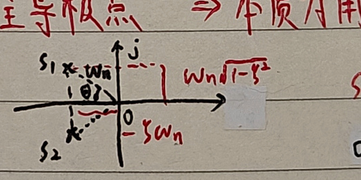
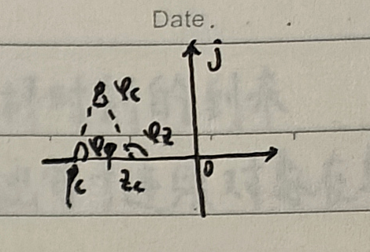

# 三、基于根轨迹的校正

## 1. 基本思想

### （1）性能指标的转换

根轨迹的幅值条件和相角条件分别为

$$
|G(s)H(s)|
=K\frac{\prod_i(s-z_i)}{\prod_j(s-p_j)}=1,
$$

$$
\sum_i\angle(s-z_i)-\sum_j\angle(s-p_j)=\pm(2l+1)\pi.
$$

根轨迹是开环增益 $K$ 变化时闭环系统极点的运动轨迹。

若 $z_c$ 与 $p_c$ 十分接近，则

$$
\angle(s-z_c)-\angle(s-p_c)\approx0.
$$

这种零、极点对称为偶极子。超前和滞后环节不是偶极子，但形式相同。

1. 性能指标转换：当给出时域指标 $\zeta,\omega_n,\sigma_p,t_s$ 时，适合用根轨迹法校正。
2. 设计时一般由性能指标确定主导极点，设计校正环节，使校正后的根轨迹通过期望主导极点。
3. 原有用二阶系统近似高阶系统。

期望主导极点为

$$
s_{1,2}=-\zeta\omega_n\pm j\omega_n\sqrt{1-\zeta^2},
$$

并有

$$
\theta=\arccos\zeta,
\qquad |s_{1,2}|=\omega_n,
$$

$$
\sigma_p=e^{-\pi\zeta/\sqrt{1-\zeta^2}}\times100\%,
\qquad
t_s\approx\frac{3.5}{\zeta\omega_n}.
$$

### （2）零点对根轨迹的影响

增加零点会使系统根轨迹整体左移，动态特性变好。因为幅角条件为

$$
\sum\varphi_z-\sum\varphi_p=\pm(2k+1)\pi,
$$

增加零点相当于引入正相角。原极点 $p_1,\ldots,p_n$ 引起负相角，使根轨迹整体右移。

根轨迹渐近线与实轴夹角为

$$
\varphi_a=\frac{(2k+1)\pi}{n-m},
$$

其中 $n,m$ 分别为极点数和零点数。随着 $m$ 增大，分母减小，渐近线更接近竖直，系统动态特性变好。

### （3）开环偶极子对根轨迹的影响

$$
G_c(s)=K_c\frac{s-z_c}{s-p_c}.
$$

超前校正满足 $p_c<z_c<0$；滞后校正满足 $z_c<p_c<0$。若 $z_c$ 与 $p_c$ 足够接近，则它们贡献的相角近似抵消，对动态性能的影响很小，但开环增益会发生变化。

## 2. 超前校正

超前校正环节写为

$$
G_c(s)=K_c\alpha\frac{s-z_c}{s-p_c},
\qquad
\alpha=\frac{|p_c|}{|z_c|}>1,
\qquad p_c<z_c<0.
$$

它使系统根轨迹向左移动。

### i）最小零极比法

先根据性能指标确定期望主导极点 $s_1$。若期望闭环主导极点在原根轨迹左侧，则采用超前校正。

由

$$
\varphi=(2k+1)180^\circ-\angle G_0(s_1)
$$

确定校正环节需要提供的相角。又有

$$
\angle(s_1-z_c)-\angle(s_1-p_c)=\varphi.
$$

几何作图可求一组零极点，并由幅值条件确定校正环节增益。

<strong>由几何关系确定的 $\alpha=|p_c|/|z_c|$ 最小，故称为最小零极比法。</strong>

### ii）幅值确定法

若

$$
G_0(s)=K\frac{\prod_{i=1}^{m}(s-z_i)}{s^v\prod_{i=1}^{n}(s-p_i)},
\qquad
G_c(s)=\alpha\frac{s-z_c}{s-p_c},
$$

可利用期望极点处的幅值、相角条件联合求解。记

$$
M=|s_1|^v\frac{\prod_{i=1}^{n}|s_1-p_i|}{\prod_{i=1}^{m}|s_1-z_i|},
$$

则由 $|G_0(s_1)G_c(s_1)|=1$ 和相角条件可求得 $z_c,p_c$。若相关角度记为 $\eta,\phi,\delta$，则

$$
|z_c|=\omega_c\frac{\sin\eta}{\sin\delta},
\qquad
|p_c|=\omega_c\frac{\sin(\phi+\eta)}{\sin(\delta-\phi)},
\qquad
\delta=180^\circ-\eta-\theta.
$$

滞后校正只能放大稳态增益；滞后—超前校正则使用超前校正改善动态性能，使用滞后校正减小稳态误差。
