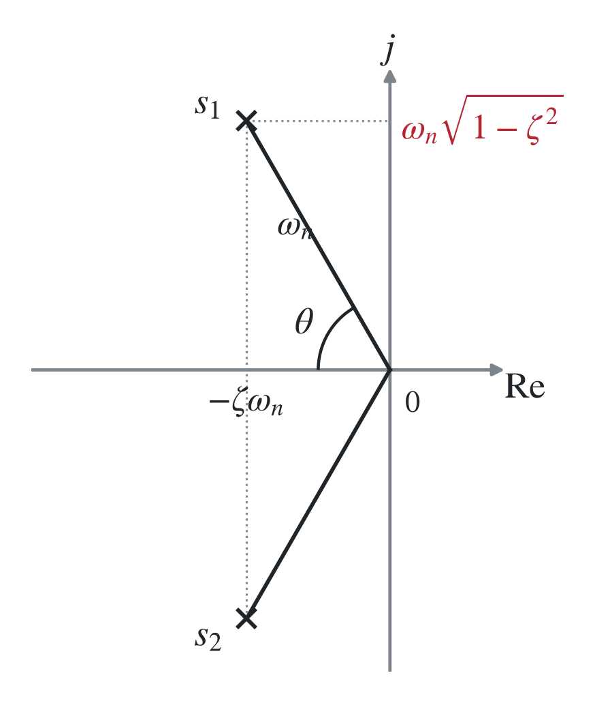
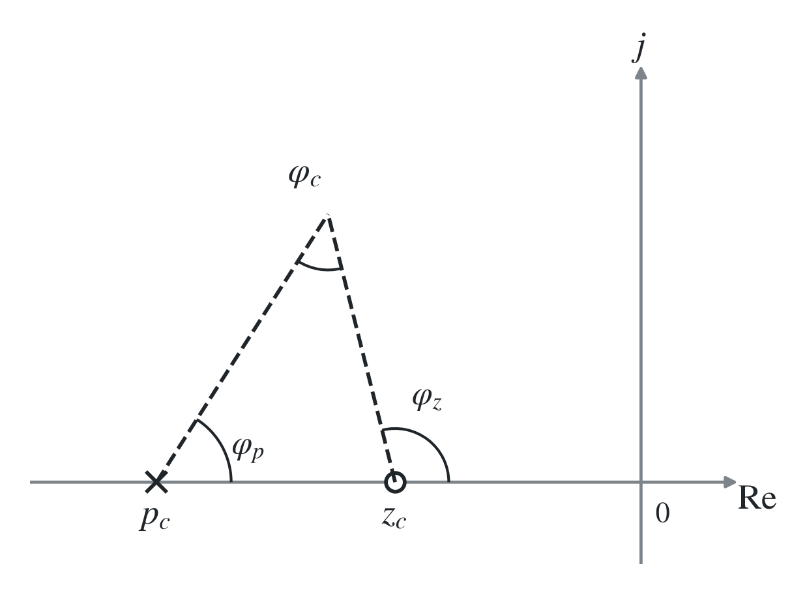

# 三、基于根轨迹的校正（了解）

## 1. 基本思想

### （1）性能指标的转换

性能指标以<strong>时域量 $\zeta,\omega_n,\sigma_p,t_s$</strong> 给出时，适合用根轨迹法校正。

<strong>设计时一般根据性能指标要求确定主导极点，设计校正环节使校正后根轨迹通过闭环主导极点。⇒ 本质为用二阶系统近似高阶系统。</strong>

> 根轨迹的幅角条件：
>
> $$
> |G(s)H(s)|=K\frac{\prod_{i=1}^{m}|s-z_i|}{\prod_{j=1}^{n}|s-p_j|}=1,
> $$
>
> $$
> \angle G(s)H(s)=\sum_{i=1}^{m}\angle(s-z_i)-\sum_{j=1}^{n}\angle(s-p_j)
> =\pm(2l+1)\pi,\qquad l=0,1,2,\ldots
> $$
>
> 根轨迹定义：开环增益 $K$ 变化时，闭环系统极点的轨迹。

$$
{\color{#c62828}s_{1,2}=-\zeta\omega_n\pm j\omega_n\sqrt{1-\zeta^2},\qquad
\theta=\arccos\zeta,\qquad |s_{1,2}|=\omega_n.}
$$

$$
\sigma_p=e^{-\pi\zeta/\sqrt{1-\zeta^2}}\times100\%,\qquad
t_s\approx\frac{3.5}{\zeta\omega_n}.
$$

### （2）零点对根轨迹的影响

增加适当的左半平面实零点，通常使根轨迹向左偏移，动态特性变好。

由幅角条件中的 $\sum\varphi_z-\sum\varphi_p=\pm(2l+1)\pi$，若引入零点，相当于引入正相角，因此我们需要增加原极点 $p_1,\ldots,p_n$ 的负相角，因此根轨迹通常向左偏移。

渐近线与实轴夹角公式为

$$
\varphi_a=\frac{(2k+1)\pi}{n-m}.
$$

$n,m$ 为极、零点数。$m$ 增大，分母变小，渐近线方向改变，可能使动态特性变好（如 $n-m=3$ 时 $\varphi_a=\pm60^\circ,180^\circ$；$n-m=2$ 时 $\varphi_a=\pm90^\circ$）。

极点对根轨迹的影响：同理，增加极点会增加根轨迹分支，通常使根轨迹向右偏移，动态特性变差。

### （3）开环偶极子对根轨迹的影响

$$
{\color{#c62828}G_c(s)=K_c\frac{s-z_c}{s-p_c}.}
$$

<strong>对于超前校正，有 $p_c<z_c<0$；对于滞后校正，有 $z_c<p_c<0$。</strong>

$z_c$ 与 $p_c$ 需要互相接近，并相对于原主导极点靠近原点；新闭环极点可能靠近虚轴，但与零点近似相消，其响应留数很小。因此 $\angle(s-z_c)-\angle(s-p_c)\approx0$，<strong>对系统的动态特性几乎无影响。</strong>

设开环增益为 $K$，加入 $G_c$ 后的开环增益为

$$
K^*=KK_c\frac{z_c}{p_c}.
$$

<strong>即系统的开环增益发生了变化，适当选择能够提高系统稳态性能。</strong>

> “偶极子”指 $z_c,p_c$ 离得很近，才有 $\angle(s-z_c)-\angle(s-p_c)\approx0$。超前、滞后环节不是偶极子，它们只是形式一致。

## 2. 超前校正

$$
{\color{#c62828}G_c(s)=K_c\alpha\frac{s-z_c}{s-p_c},\qquad
\alpha=\frac{|p_c|}{|z_c|},\qquad p_c<z_c<0.}
$$

记 $\varphi_c=\varphi_z-\varphi_p>0$。$\varphi_c$ 不宜太大，否则难以实现。

⇒ 超前校正会使系统根轨迹向左移动。

### i）最小零极比法

先根据性能指标确定 $s_1$ 的位置。若该期望闭环主导极点在原根轨迹左侧，则采用超前校正。

由

$$
\phi=(2l+1)180^\circ-\angle G_0(s_1)
$$

确定 $G_c$ 应提供的相角 $\phi$（即 $\varphi_c$）。由 $\angle(s_1-z_c)-\angle(s_1-p_c)=\phi$ 可算得一组零极点为

$$
{\color{#c62828}
p_c=-|s_1|\frac{\cos\frac12(\phi-\theta)}{\cos\frac12(\phi+\theta)},\qquad
z_c=-|s_1|\frac{\cos\frac12(\phi+\theta)}{\cos\frac12(\phi-\theta)}.}
$$

再以此确定校正环节增益（幅值条件）：

$$
{\color{#c62828}
K_c=\frac{|z_c|}{|p_c|}\frac{|s_1-p_c|}{|s_1-z_c|}
\frac1{|G_0(s_1)|}.}
$$

> 由此确定的 $\alpha=|p_c|/|z_c|$ 最小，可通过几何方法证明，故为最小零极比。

### ii）幅值确定法

$$
G_0(s)=K\frac{\prod_{i=1}^{m}(s-z_i)}{s^\nu\prod_{j=1}^{n-\nu}(s-p_j)},
\qquad
G_c(s)=\alpha\frac{s-z_c}{s-p_c}.
$$

记 $n$ 为总极点数，$\nu$ 为原点极点数。在期望点 $s_1$ 处，

$$
M=|s_1|^\nu\frac{\prod_{j=1}^{n-\nu}|s_1-p_j|}{\prod_{i=1}^{m}|s_1-z_i|},
\qquad
\frac1{\tan\eta}=\frac{M}{K}\frac1{\sin\phi}-\frac1{\tan\phi}.
$$

⇒

$$
|z_c|=|s_1|\frac{\sin\eta}{\sin\delta},\qquad
|p_c|=|s_1|\frac{\sin(\phi+\eta)}{\sin(\delta-\phi)}.
$$

其中

$$
\delta=180^\circ-\eta-\theta,\qquad
\alpha=\frac{|p_c|}{|z_c|}.
$$

## 3. 滞后校正

只能放大稳态增益（见二、2.（3））。将 $s^\nu$ 处增益 $K_0$ 放大至 $K$，有

$$
\beta=\frac{K}{K_0}=\frac{z_c}{p_c}.
$$

## 4. 滞后—超前校正

使用超前校正改善系统的动态性能，使用滞后校正减小稳态误差。

## 5. 反馈校正
