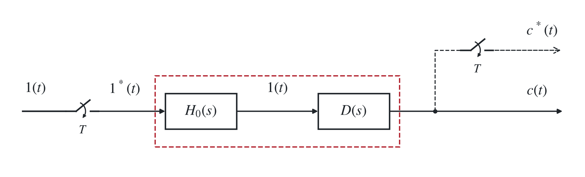
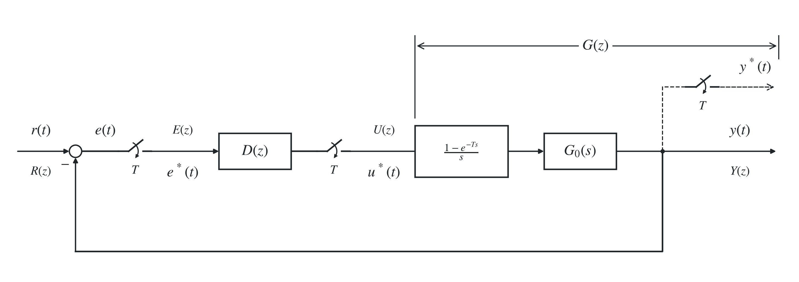

# 四、离散控制系统的校正

## 1. 模拟化设计（了解）

> <strong>$z$ 变换：$z=e^{sT}$。可将 $s$ 域的微积分运算变为利用 $z^{-1}$ 算子的简单代数运算。</strong>

### （1）离散系统模拟化校正的思路

根据指标，考虑零阶保持器，用连续系统理论设计校正装置 $D(s)$，然后将其离散化为脉冲传递函数 $D(z)$；检验是否满足性能要求后，写出 $D(z)$ 的差分方程并编程实现相应控制律，最后检验设计的正确性。

### （2）连续控制器的离散化方法

#### i）阶跃响应不变法

$$
{\color{#c62828}D(z)=\mathcal Z\!\left[\frac{1-e^{-Ts}}{s}D(s)\right]
=(1-z^{-1})\mathcal Z\!\left[\frac{D(s)}s\right].}
$$

零阶保持器的传递函数为

$$
H_0(s)=\frac{1-e^{-Ts}}{s}.
$$

零阶保持器可以把离散时刻的值保持到下一个采样时刻。带有 ZOH 的连续对象在单位阶跃序列 $1^*(t)$ 作用下的输出，等于连续对象在单位阶跃信号 $1(t)$ 作用下的输出。

<strong>带有 ZOH 的变换保证：$1^*(t)$ 经 $D(z)$ 的输出，在离散采样点上与 $1(t)$ 经 $D(s)$ 的输出一致。</strong>

#### ii）替换法

一阶差分：近似导数。用 $s$ 域到 $z$ 域的近似映射关系替换 $s$：

后向差分：

$$
\frac{de(t)}{dt}\approx\frac{e(k)-e(k-1)}{T},
\qquad
{\color{#c62828}s=\frac{1-z^{-1}}{T},\qquad
D(z)=\left.D(s)\right|_{s=(1-z^{-1})/T}.}
$$

后向差分把整个左半平面映射到 $z$ 平面的单位圆内，因此稳定的连续系统经该变换后仍稳定。

> 后向差分中
>
> $$
> s=\frac{1-z^{-1}}{T},\qquad
> s=\sigma + j\omega,\qquad
> 得\quad |z|=\frac{1}{\sqrt{(1-\sigma T)^2+(\omega T)^2}}.
> $$
>
> $s$ 域稳定时 $\sigma<0$、$T>0$，故分母大于 $1$，从而 $|z|<1$，稳定性得到保持。
>

前向差分：

$$
s=\frac{z-1}{T}.
$$

前向差分不能保证稳定性不变。

> 前向差分中
>
> $$
> s=\frac{z-1}{T},\qquad
> |z|=\sqrt{(1+\sigma T)^2+(\omega T)^2}.
> $$
>
> $|z|<1$ 要求 $(\sigma,\omega)$ 位于圆心 $(-1/T,0)$、半径 $1/T$ 的圆内，故前向差分不一定保持稳定性。
>

双线性变换：

$$
{\color{#c62828}s=\frac2T\frac{1-z^{-1}}{1+z^{-1}}.}
$$

由

$$
z=e^{sT}=\frac{e^{sT/2}}{e^{-sT/2}}
\approx\frac{1+sT/2}{1-sT/2}=\frac{2/T+s}{2/T-s}
$$

得到上述关系。双线性变换把 $s$ 左半平面映射到 $z$ 平面单位圆内，把 $s$ 平面虚轴映射到单位圆上。

> 双线性变换中，数字频率 $\Omega$ 与模拟频率 $\omega$ 的关系：
>
> $$
> e^{j\Omega}=z=\frac{1+j\omega T/2}{1-j\omega T/2},
> $$
>
> 因此
>
> $$
> \Omega=2\arctan\frac{\omega T}{2},\qquad
> \omega=\frac{2}{T}\tan\frac{\Omega}{2}.
> $$
>

#### iii）根匹配法

实数零极点按

$$
{\color{#c62828}s+a\quad\longleftrightarrow\quad1-e^{-aT}z^{-1}}
$$

匹配；共轭复数零极点按

$$
{\color{#c62828}(s+a)^2+b^2
\quad\longleftrightarrow\quad
1-2e^{-aT}\cos(bT)z^{-1}+e^{-2aT}z^{-2}}
$$

匹配。

数字控制器增益 $K_z$ 还应满足

$$
\lim_{s\to0}D(s)=\lim_{z\to1}D(z).
$$

#### iv）脉冲响应不变法

$$
D(z)=\mathcal Z[D(s)].
$$

## 2. 离散化设计（最少拍控制 ☆）

直接设计期望闭环传递函数 $\Phi(z)$、期望误差传递函数 $\Phi_e(z)$，再反推 $D(z)$。优点是目标明确，可以实现有限拍响应；风险是可能非因果、不稳定、控制量剧烈或产生纹波。

### （1）数字校正设计思路

#### i）期望特性校正法

设期望传递函数和期望误差传递函数分别为

$$
{\color{#c62828}\Phi(z)=\frac{G(z)D(z)}{1+G(z)D(z)},
\qquad
\Phi_e(z)=\frac1{1+G(z)D(z)}=1-\Phi(z).}
$$

于是

$$
{\color{#c62828}G(z)D(z)=\frac{\Phi(z)}{\Phi_e(z)},
\qquad
D(z)=\frac{\Phi(z)}{\Phi_e(z)G(z)}.}
$$

要求：$\Phi(z),\Phi_e(z)$ 均表示为 $z^{-1}$ 的有限次多项式，校正环节 $D(z)$ 物理可实现且稳定。

#### ii）最小拍设计

<strong>定义：对典型信号能在有限拍内结束过渡过程，即误差信号脉冲序列 $e^*(t)$ 只含有最少的几项。</strong>

典型输入信号为

$$
{\color{#c62828}\mathcal Z[1(t)]=\frac1{1-z^{-1}},
\qquad
\mathcal Z[t]=\frac{Tz^{-1}}{(1-z^{-1})^2},}
$$

$$
{\color{#c62828}\mathcal Z\!\left[\frac{t^2}{2}\right]
=\frac{T^2z^{-1}(1+z^{-1})}{2(1-z^{-1})^3}.}
$$

因此可统一写成

$$
{\color{#c62828}R(z)=\frac{A(z)}{(1-z^{-1})^r}.}
$$

稳态误差描述：

$$
{\color{#c62828}E(z)=\Phi_e(z)R(z),}
$$

$$
{\color{#c62828}e_{ss}^*(\infty)=\lim_{z\to1}(1-z^{-1})E(z)
=\lim_{z\to1}(1-z^{-1})\frac{A(z)}{(1-z^{-1})^r}\Phi_e(z).}
$$

要求 $e_{ss}^*(\infty)=0$，设

$$
{\color{#c62828}\Phi_e(z)=(1-z^{-1})^rF(z).}
$$

则有 $E(z)=A(z)F(z)$，$Y(z)=R(z)-A(z)F(z)$。

若经过 $N$ 拍过渡过程结束，无稳态误差，则误差脉冲序列为

$$
E(z)=e(0)+e(T)z^{-1}+\cdots+e(NT)z^{-N},
$$

$$
e^*(t)=e(0)\delta(t)+e(T)\delta(t-T)+\cdots+e(NT)\delta(t-NT).
$$

### （2）最少拍控制系统的设计

若广义脉冲传递函数 $G(z)$ 不含纯延迟环节 $z^{-1}$，并且在单位圆上和单位圆外都没有零极点，取 $F(z)=1$，则

$$
\Phi_e(z)=(1-z^{-1})^r,
\qquad
\Phi(z)=1-\Phi_e(z)=1-(1-z^{-1})^r,
$$

$$
D(z)=\frac{\Phi(z)}{\Phi_e(z)G(z)}
=\frac{1-(1-z^{-1})^r}{(1-z^{-1})^rG(z)}.
$$

若 $G(z)$ 有<strong>纯延迟 $z^{-L}$，在单位圆上或单位圆外有零点 $b_i$、极点 $a_i$</strong>，可写为

$$
G(z)=z^{-L}
\frac{\prod_{i=1}^{u}(1-b_iz^{-1})}
{\prod_{i=1}^{v}(1-a_iz^{-1})}\,G_1(z).
$$

由

$$
D(z)=\frac{\Phi(z)}{\Phi_e(z)G(z)}
=\frac{\Phi(z)\prod_{i=1}^{v}(1-a_iz^{-1})}
{\Phi_e(z)z^{-L}\prod_{i=1}^{u}(1-b_iz^{-1})G_1(z)},
$$

若不加处理，会造成 $D(z)$ 含有超前项 $z^L$（物理上不可实现，违反因果性），以及零点 $a_1,\ldots,a_v$、极点 $b_1,\ldots,b_u$。圆上或圆外的控制器极点不稳定；用控制器零点抵消原对象的不稳定极点也不能保证内部稳定。

即不能用 $D(z)$ 去抵消原系统中的这些环节。故我们需要：

$$
{\color{#c62828}\Phi(z)\text{ 包含 }z^{-L}\prod_{i=1}^{u}(1-b_iz^{-1}),}
$$

$$
{\color{#c62828}\Phi_e(z)\text{ 包含 }\prod_{i=1}^{v}(1-a_iz^{-1}),}
$$

再利用

$$
\Phi(z)+\Phi_e(z)=1
$$

确定 $\Phi(z),\Phi_e(z)$。<strong>二者为阶数相同的关于 $z^{-1}$ 的多项式。</strong>

> 例如
>
> $$
> G(z)=\frac{z^{-1}(1+0.9z^{-1})(1+3z^{-1})}
> {(1-z^{-1})(1+0.5z^{-1})},\qquad
> R(z)=\frac{1}{1-z^{-1}}.
> $$
>
> $\Phi_e(z)$ 应包含 $(1-z^{-1})$，$\Phi(z)$ 应包含 $z^{-1}(1+3z^{-1})$。按同阶参数选择
>
> $$
> \Phi_e(z)=(1-z^{-1})(1+nz^{-1}),\qquad
> \Phi(z)=mz^{-1}(1+3z^{-1}).
> $$
>
> 由 $\Phi(z)+\Phi_e(z)=1$ 得
>
> $$
> m=\frac14,\qquad n=\frac34.
> $$
>
> 于是
>
> $$
> E(z)=\Phi_e(z)R(z)=1+0.75z^{-1},
> $$
>
> 误差在两拍内结束。

### （3）对于最少拍设计：以单位斜坡输入为例

以单位斜坡输入为例：

准确性：对阶跃、斜坡输入，仅在采样时刻上无稳态误差，在非采样时刻有波动。对加速度输入，采样时刻上的误差为常量。

动态性能：对阶跃输入超调很大，适应性差。

平稳性：一般存在纹波。

⇒ 该设计方法事实上只有理论意义，并不实用。

<strong>考察是否存在纹波需考察 $U(z)$，若 $u(nT)$ 非常值脉冲而是上下波动则会产生纹波。</strong>
