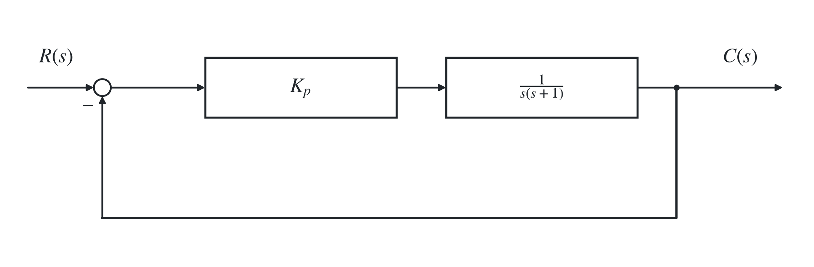
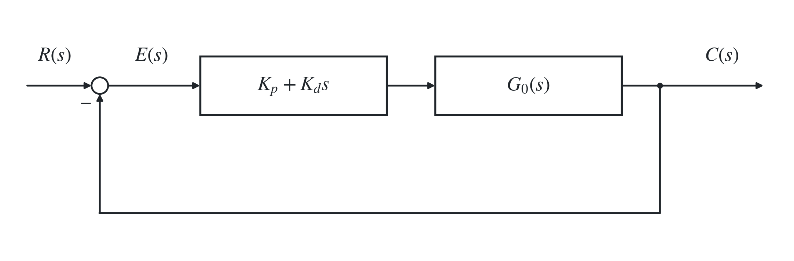
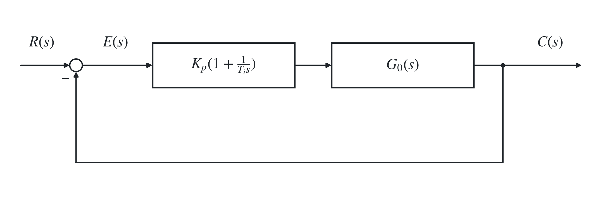
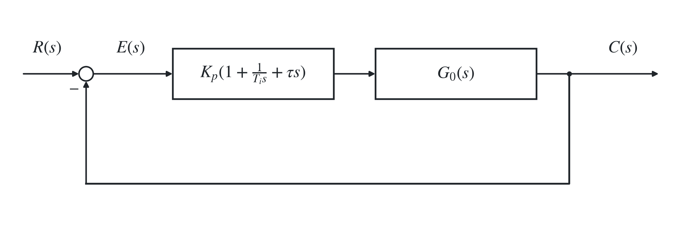
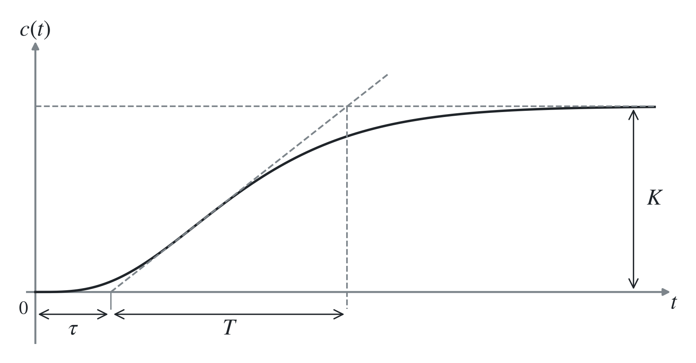

# 五、PID 控制器

## 1. PID 类控制器概述及基本作用

### （1）比例控制器

提高稳态精度，提高系统快速性，降低稳定裕度。

$$
\Phi(s)=\frac{K_p}{s^2+s+K_p}
\quad\Rightarrow\quad
2\zeta\omega_n=1,\qquad \omega_n^2=K_p.
$$

$$
t_p=\frac{\pi}{\omega_n\sqrt{1-\zeta^2}}\downarrow,\qquad
\sigma_p=e^{-\pi\zeta/\sqrt{1-\zeta^2}}\uparrow,\qquad
t_s\approx\frac4{\zeta\omega_n}\text{ 不变}.
$$

由于 $K_p\uparrow,\omega_n\uparrow,\zeta\downarrow$。（以上峰值时间与超调量公式适用于欠阻尼情形 $K_p>1/4$。）

> $$
> \sigma_p\approx0.16+0.4\left(\frac1{\sin\gamma}-1\right).
> $$
>
> $\sigma_p\uparrow$ 导致 $\gamma\downarrow$。

### （2）比例微分（PD）控制器

能够改变系统的自然频率和阻尼比，提高系统的动态性能：

$$
G_0(s)=\frac{K_0}{s(Ts+1)}
\quad\Rightarrow\quad
\Phi(s)=\frac{K_0K_p(\tau s+1)}{Ts^2+(K_0K_p\tau+1)s+K_0K_p},
\qquad {\color{#c62828}\tau=\frac{K_d}{K_p}.}
$$

> 给闭环传递函数引入了零点。PD 校正也在开环中引入零点，将根轨迹向左平面拉，提高了响应速度和稳定性（详见三、1）。

### （3）比例积分（PI）控制器

能够提高系统的型别，以消除或减弱稳态误差。引入零点，可以提高系统的动态性能。

⇒ 若系统不变部分 $G_0(s)$ 已有积分环节，再采用单一的积分控制可能导致系统不稳定。

### （4）PID 控制器

提高系统的型别，通过合理选择参数，还将引入两个开环零点，在提高系统动态性能方面具有更大的优越性。

## 2. PID 参数整定

### （1）动态响应法

先求取原系统阶跃响应曲线，一般接近 S 形。

则可用

$$
G(s)=\frac{Ke^{-\tau s}}{Ts+1}
$$

来近似该 S 形曲线（通过读图得到 $K,\tau,T$）。

通过查表（齐格勒—尼柯尔斯 Ziegler–Nichols 调整法则表）可确定 PID 参数 $K_p,T_i,T_d$，代入

$$
G_c(s)=K_p\left(1+\frac1{T_is}+T_ds\right)
$$

即可。

注意：<strong>开环</strong>测出阶跃响应，曲线应为 S 形（故<strong>被控对象有积分环节、复数极点时不适用</strong>），可微调。

> 设
>
> $$
> G_0(s)=\frac K{(T_1s+1)\cdots(T_ns+1)},\qquad
> T_1\gg T_2\ge\cdots\ge T_n,
> $$
>
> 即主导时间常数为 $T_1$，则
>
> $$
> G_0(s)=\frac K{T_1s+1}\prod_{i=2}^{n}\frac1{T_is+1}.
> $$
>
> 将后面在 $s=0$ 处 Taylor 展开：
>
> $$
> \prod_{i=2}^{n}(T_is+1)=1+\left(\sum_{i=2}^{n}T_i\right)s+O(s^2).
> $$
>
> 由 $e^{\tau s}=1+\tau s+\tau^2s^2/2+\cdots$，有 $e^{-\tau s}\approx1/(1+\tau s)$（当 $s$ 较小时）。
>
> 令 $\tau=\sum_{i=2}^{n}T_i$，则有
>
> $$
> e^{-\tau s}\approx\prod_{i=2}^{n}\frac1{T_is+1}.
> $$
>
> 故 $G_0(s)\approx Ke^{-\tau s}/(T_1s+1)$。不过事实上这种形式的 $G_0(s)$ 的阶跃响应为
>
> $$
> c(t)=K\left(1-e^{-(t-\tau)/T_1}\right)u(t-\tau),
> $$
>
> 并不是 S 形。

### （2）临界增益法

先只保留 $K_p$（比例控制），令 $T_i=\infty,K_d=0$。将 $K_p$ 从 $0$ 增大，首次出现等幅振荡时，记录增益 $K_p$ 和振荡周期 $T_s$，查表求出 PID 参数即可。

> $K_p\downarrow,\omega_c\downarrow,\gamma\uparrow$，减小 $K_p$ 可稳定系统。
>
> $1+1/(T_is)$ 对应 $-\arctan[1/(T_i\omega)]$，故增大 $T_i$ 可稳定系统。

## 3. 离散 PID

### （1）位置式 PID

时间 $t\to k$，积分 $\int\to\sum$，对误差的累加；微分 $\mathrm d/\mathrm dt\to\Delta/T$，误差差值除以采样时间。

$$
\begin{aligned}
u(k)
&=K_p\left[e(k)+\frac1{T_i}\sum_{i=1}^{k}e(i)T
+\tau\frac{e(k)-e(k-1)}T\right]\\
&=K_pe(k)+\frac{K_pT}{T_i}\sum_{i=1}^{k}e(i)
+\frac{K_p\tau}T[e(k)-e(k-1)].
\end{aligned}
$$

记为

$$
u(k)=K_pe(k)+K_i\sum_{i=1}^{k}e(i)+K_d[e(k)-e(k-1)]
=u_p(k)+u_i(k)+u_d(k),
$$

其中

$$
K_i=\frac{K_pT}{T_i},\qquad K_d=\frac{K_p\tau}T.
$$

### （2）增量式 PID

记 $\Delta u(k)=u(k)-u(k-1)$，$\Delta e(k)=e(k)-e(k-1)$，则：

$$
\Delta u(k)=K_p\Delta e(k)+K_ie(k)
+K_d[\Delta e(k)-\Delta e(k-1)].
$$
