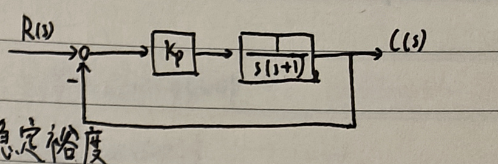
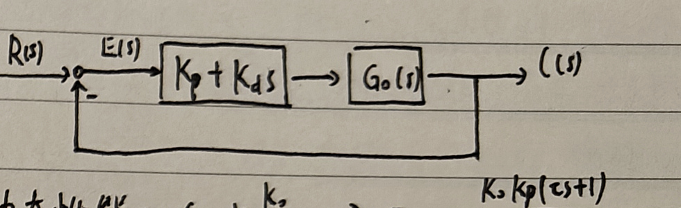
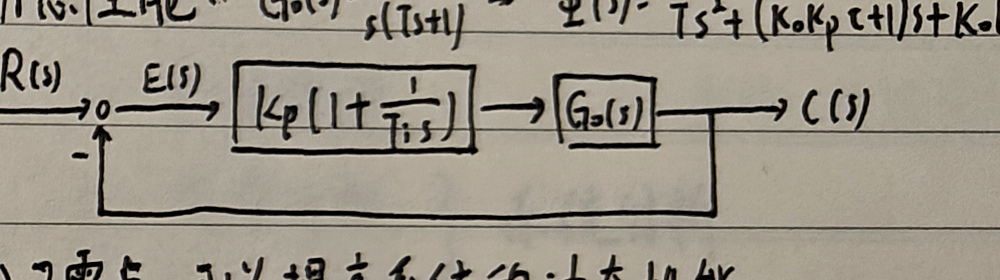
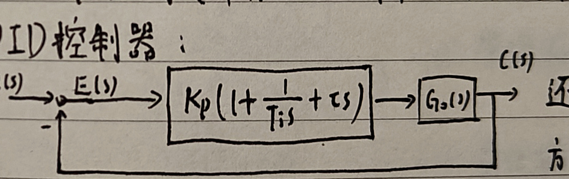
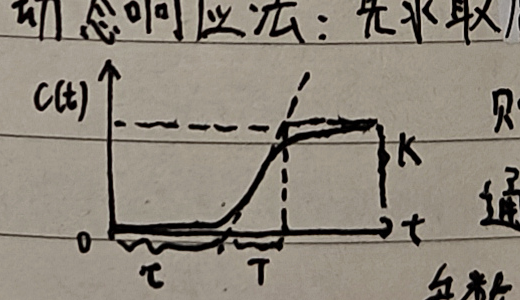

# 五、PID 控制器

$$
\sigma_p\approx0.16+0.4\left(\frac1{\sin\gamma}-1\right).
$$

因此 $\sigma_p$ 增大时，$\gamma$ 减小。向闭环传递函数增加零点会使根轨迹左移，从而提高响应速度和稳定性。

对高阶过程

$$
G_0(s)=\frac{K}{(T_1s+1)(T_2s+1)\cdots(T_ns+1)},
\qquad T_1\gg T_2\gg\cdots\gg T_n,
$$

以 $T_1$ 为主导时间常数。其余因子在 $s=0$ 附近作展开，可近似为时滞

$$
\tau=\sum_{i=2}^nT_i,
$$

于是

$$
G_0(s)\approx\frac{Ke^{-\tau s}}{T_1s+1}.
$$

该近似模型的阶跃响应为

$$
c(t)=K\left(1-e^{-(t-\tau)/T_1}\right)u(t-\tau),
$$

它并不是 S 形曲线。

<strong>$K_p\downarrow\Rightarrow\omega_c\downarrow、\gamma\uparrow$，因此减小 $K_p$ 可使系统趋于稳定。</strong>

因子 $1-1/(T_is)$ 对应附加相角 $-\arctan[1/(T_i\omega)]$；增大 $T_i$ 可使系统趋于稳定。

## 1. PID 类控制器概述及基本作用

### （1）比例控制器

比例控制器可提高稳态精度和系统快速性，但会降低稳定裕度。对一类典型系统，闭环传递函数为

$$
\Phi(s)=\frac{K_p}{s^2+s+K_p}.
$$

因此 $K_p$ 增大时，$\omega_n$ 增大、$\zeta$ 减小，峰值时间减小而超调量增大；调节时间并不一定改善。

### （2）比例微分（PD）控制器

PD 控制器为

$$
G_c(s)=K_p+K_ds=K_p(1+\tau s),
\qquad
\tau=\frac{K_d}{K_p}.
$$

它能改变系统的自然频率和阻尼比，提高系统动态性能。

### （3）比例积分（PI）控制器

PI 控制器为

$$
G_c(s)=K_p\left(1+\frac1{T_is}\right).
$$

积分作用能够提高系统型别，消除或减弱稳态误差；引入零点也可能提高动态性能。若被控对象本身已经含有积分环节，继续采用单一积分控制可能导致系统不稳定。

### （4）PID 控制器

PID 控制器为

$$
G_c(s)=K_p\left(1+\frac1{T_is}+\tau s\right).
$$

通过合理选择参数，它既可提高系统型别，又能引入两个开环零点，在提高系统动态性能方面具有更大的优越性。

## 2. PID 参数整定

### （1）动态响应法

先获取原系统阶跃响应曲线，并用

$$
G(s)=\frac{Ke^{-\tau s}}{Ts+1}
$$

近似该 S 形曲线，由读图获得 $K,\tau,T$。再查 Ziegler–Nichols 调整法则表，确定 PID 参数 $K_p,T_i,T_d$，代入

$$
G_c(s)=K_p\left(1+\frac1{T_is}+T_ds\right).
$$

<strong>开环测试得到的阶跃响应曲线应为 S 形；对含积分环节、复数极点的对象不适用。</strong>

### （2）临界增益法

先只保留比例环节，即令 $T_i=\infty,K_d=0$。逐渐增大 $K_p$，直到系统首次出现等幅振荡；记录临界增益 $K_u$ 和振荡周期 $T_u$，再查表求出 PID 参数。

## 3. 离散 PID

### （1）位置式 PID

将时间 $t$ 离散为 $k$，将积分替换为求和、微分替换为差分。误差差值除以采样时间 $T$，得到

$$
u(k)=K_p\left[e(k)+\frac{T}{T_i}\sum_{i=1}^{k}e(i)
+\frac{\tau}{T}\bigl(e(k)-e(k-1)\bigr)\right].
$$

记

$$
K_i=\frac{K_pT}{T_i},
\qquad
K_d=\frac{K_p\tau}{T},
$$

则

$$
u(k)=K_pe(k)+K_i\sum_{i=1}^{k}e(i)+K_d[e(k)-e(k-1)]
=u_p(k)+u_i(k)+u_d(k).
$$

### （2）增量式 PID

定义

$$
\Delta u(k)=u(k)-u(k-1),
\qquad
\Delta e(k)=e(k)-e(k-1),
$$

则

$$
\Delta u(k)=K_p\Delta e(k)+K_ie(k)
+K_d[\Delta e(k)-\Delta e(k-1)].
$$
