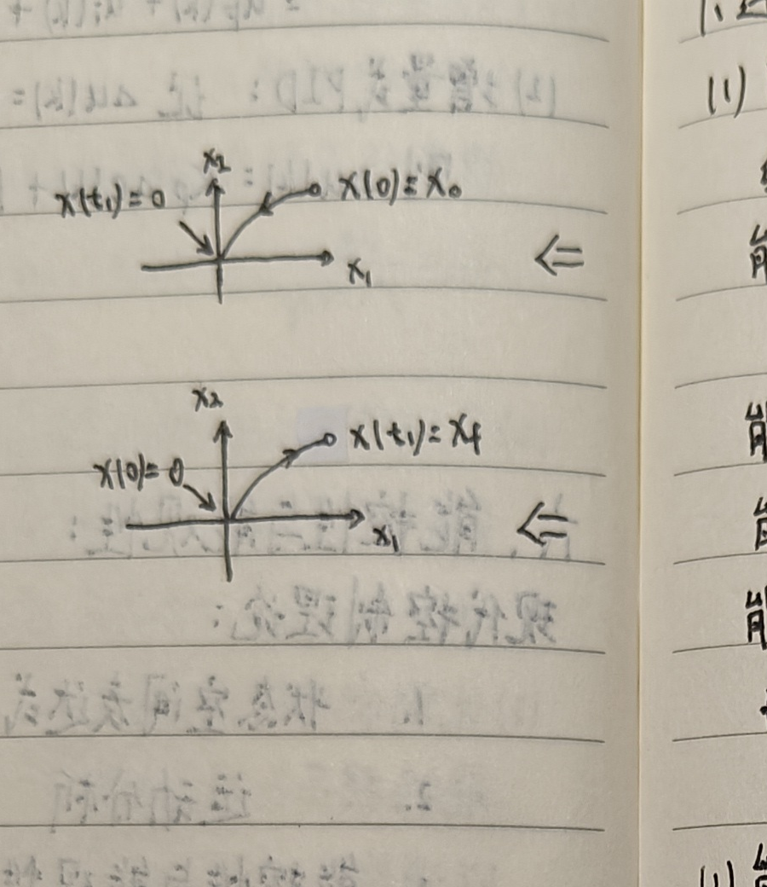
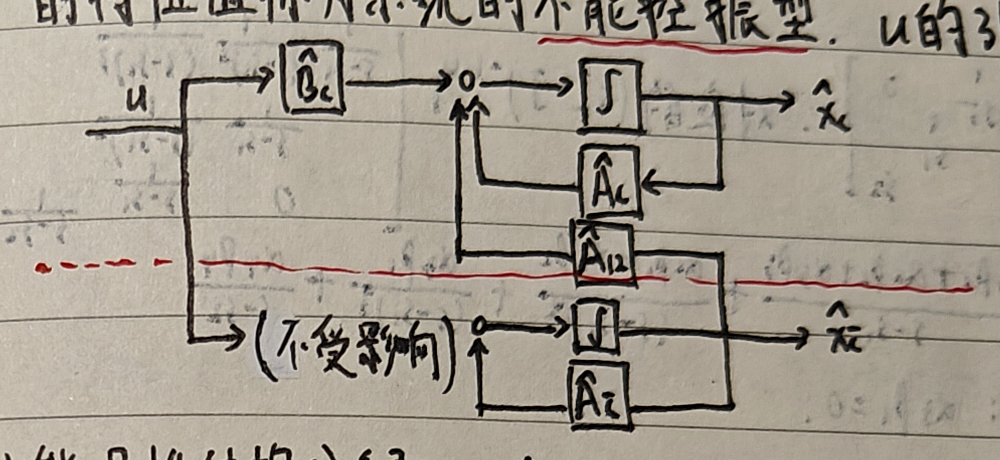
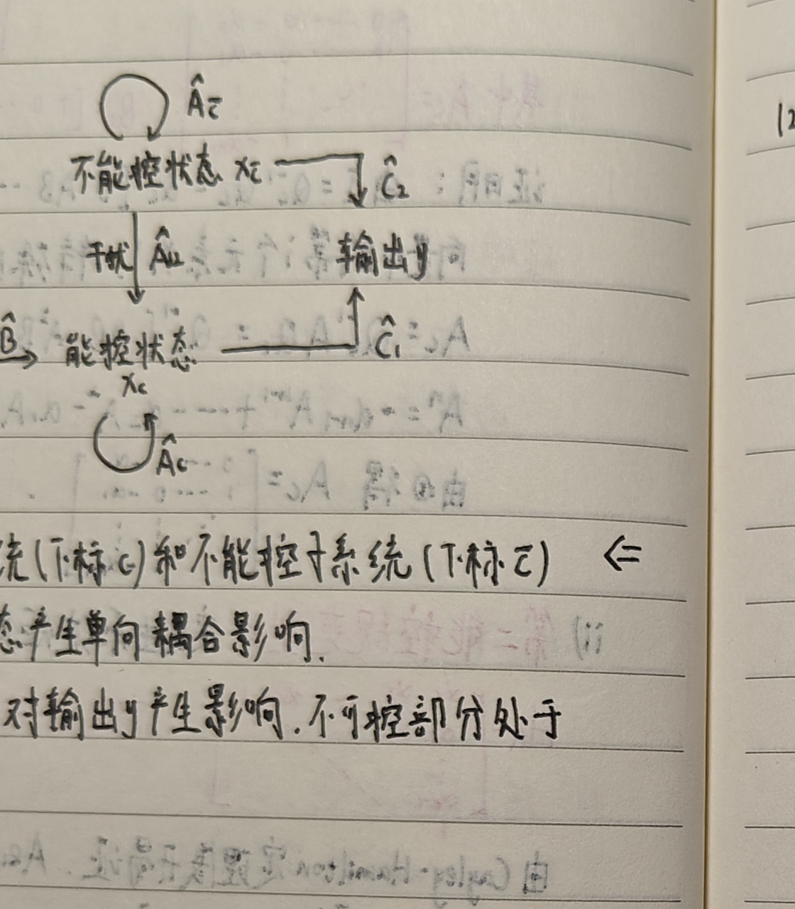
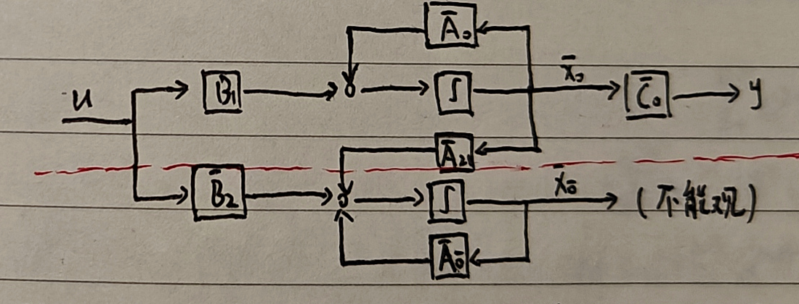
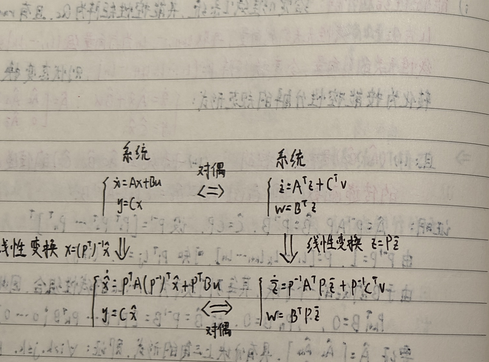

# 六、能控性与能观性

## 现代控制理论

现代控制理论的主要内容包括：

1. 状态空间表达式：数学描述；
2. 运动分析：定量分析；
3. 能控性与能观性、Lyapunov 稳定性：定性分析，即系统分析；
4. 状态观测器设计、状态反馈设计：常规综合，即系统综合；
5. 最优估计、最优控制：最优综合。

由于状态的引入，控制理论从关注输入、输出关系的经典控制理论阶段，过渡到以状态空间模型为基础、关注内部状态的现代控制理论阶段。

线性定常非齐次系统为

$$
\begin{cases}
\dot x(t)=Ax(t)+Bu(t),&x(t_0)=x_0,\\
y(t)=Cx(t)+Du(t).
\end{cases}
$$

其状态方程的解为

$$
x(t)=e^{A(t-t_0)}x(t_0)+\int_{t_0}^{t}e^{A(t-\tau)}Bu(\tau)\,d\tau.
$$

右侧分别是零输入响应和零状态响应。

**能控性**是控制作用 $u(t)$ 支配系统状态向量 $x(t)$ 的能力，即能否使 $x(t)$ 作任意转移；**能观性**是系统输出 $y(t)$ 反映系统状态向量 $x(t)$ 的能力，即能否通过 $y(t)$ 唯一确定 $x(t)$。

经典控制理论中，输入与输出的关系只由传递函数确定，并认为输出量都可测。<strong>实际系统即使稳定，也可能存在能控、能观问题。</strong>

## 1. 连续系统的能控性

### （1）能控性与能达性

对线性时不变系统

$$
\dot x(t)=Ax(t)+Bu(t),
$$

能控性与能达性和系统初始状态有关；但对于连续 LTI 系统，能控性与能达性等价。

能控状态：若存在 $t_1>0$ 和一个无约束的允许控制 $u(t)$，$t\in[0,t_1]$，使系统由 $x_0$ 出发在 $t_1$ 时转移到 $x(t_1)=0$，则称 $x_0$ 为一个能控状态。

能控性：若状态空间中所有非零状态均为能控状态，则称系统是能控的。

能达状态：对给定作用，从零初始状态出发，经 $t_1$ 转移到 $x(t_1)=x_f$，则称 $x_f$ 为一个能达状态。

能达性：若所有状态均为能达状态，则称系统是能达的。

能控性是一种定性性质，仅由系统参数决定，是固有属性；轨迹没有限制。

<strong>连续 LTI 系统的能控性与能达性等价；离散时间系统中二者一般不等价。</strong>

### （2）能控性判据

#### i）Cayley–Hamilton 定理

设 $A\in\mathbb R^{n\times n}$，其特征多项式为

$$
f(\lambda)=|\lambda I-A|
=\lambda^n+a_{n-1}\lambda^{n-1}+\cdots+a_1\lambda+a_0.
$$

Cayley–Hamilton 定理指出，矩阵 $A$ 满足自身的特征方程：

$$
f(A)=A^n+a_{n-1}A^{n-1}+\cdots+a_1A+a_0I=0.
$$

推论 1：矩阵 $A$ 的 $k$ 次幂（$k\ge n$）都可以表示为 $A$ 的至多 $n-1$ 次多项式：

$$
A^k=\sum_{m=0}^{n-1}\alpha_mA^m.
$$

推论 2：矩阵指数也可以表示为 $A$ 的至多 $n-1$ 次多项式：

$$
e^{At}=\sum_{m=0}^{n-1}\alpha_m(t)A^m.
$$

证明要点：由

$$
(\lambda I-A)\operatorname{adj}(\lambda I-A)=|\lambda I-A|I
$$

以及伴随矩阵中每个元素关于 $\lambda$ 的次数不超过 $n-1$，令

$$
\operatorname{adj}(\lambda I-A)
=B_{n-1}\lambda^{n-1}+\cdots+B_1\lambda+B_0,
$$

比较等式两边同次幂系数，再将所得等式依次左乘 $A^n,A^{n-1},\ldots,A,I$ 并相加，即得 $f(A)=0$。

另一种证明：对任意 $k\ge n$，多项式带余除法给出

$$
\lambda^k=q(\lambda)f(\lambda)+r(\lambda),
\qquad \deg r<n.
$$

用 $A$ 替换 $\lambda$，由 $f(A)=0$ 得

$$
A^k=r(A)=\sum_{m=0}^{n-1}\alpha_mA^m.
$$

#### ii）能控性 Gram 判据

能控 Gram 矩阵为

$$
W_c(t_1)=\int_0^{t_1}e^{-At}BB^Te^{-A^Tt}\,dt.
$$

LTI 系统能控，当且仅当存在 $t_1>0$，使 $W_c(t_1)$ 非奇异。

充分性：若 $W_c(t_1)$ 非奇异，则对任意 $x_0$，取

$$
u(t)=-B^Te^{-A^Tt}W_c^{-1}(t_1)x_0,
$$

代入状态解可得 $x(t_1)=0$，因此系统能控。

必要性可用反证法。若系统能控而 $W_c(t_1)$ 奇异，则存在非零向量 $z$ 使

$$
W_c(t_1)z=0.
$$

于是

$$
z^TW_c(t_1)z
=\int_0^{t_1}\|B^Te^{-A^Tt}z\|_2^2\,dt=0,
$$

故

$$
B^Te^{-A^Tt}z=0,\qquad \forall t\in[0,t_1].
$$

另一方面，由系统能控，对非零初始状态 $x_0=z$ 存在 $t_2<t_1$ 和控制 $u(t)$，满足

$$
x(t_2)=e^{At_2}z+\int_0^{t_2}e^{A(t_2-t)}Bu(t)\,dt=0,
$$

即

$$
z=-\int_0^{t_2}e^{-At}Bu(t)\,dt.
$$

左乘 $z^T$ 后利用 $B^Te^{-A^Tt}z=0$，得到 $\|z\|_2^2=0$，与 $z\ne0$ 矛盾。

#### iii）能达性 Gram 判据

连续 LTI 系统能达的条件与能控 Gram 判据一致。证明同理。因此：

<strong>对于连续定常线性系统，能控性与能达性等价。</strong>

#### vi）能控性秩判据

能控性矩阵为

$$
Q_c=[B\ AB\ \cdots\ A^{n-1}B].
$$

LTI 系统能控，当且仅当

$$
\operatorname{rank}Q_c=n.
$$

充分性：若 $\operatorname{rank}Q_c=n$，反设系统不能控。由 Gram 判据，对任意 $t_1>0$，$W_c(t_1)$ 奇异，存在 $\alpha\ne0$ 使

$$
\alpha^TW_c(t_1)\alpha=0.
$$

因此 $\alpha^Te^{-At}B=0$。对 $t$ 连续求导 $n-1$ 次并令 $t=0$，得到

$$
\alpha^TB=0,\quad \alpha^TAB=0,\quad\ldots,\quad\alpha^TA^{n-1}B=0,
$$

即 $\alpha^TQ_c=0$，这与 $Q_c$ 满行秩矛盾。

必要性：若 $\operatorname{rank}Q_c<n$，则存在 $\alpha\ne0$ 使 $\alpha^TQ_c=0$，进而

$$
\alpha^TA^iB=0,qquad i=0,1,\ldots,n-1.
$$

由 Cayley–Hamilton 定理，对所有 $i\in\mathbb N$ 都成立。因此

$$
\alpha^Te^{-At}B=0,
$$

从而 $W_c(t_1)$ 奇异，系统不能控。

#### v）能控性 PBH 判据

LTI 系统能控，当且仅当矩阵 $A$ 的所有特征值 $\lambda_i$ 都满足

$$
\operatorname{rank}[\lambda_iI-A\ \ B]=n.
$$

等价地，

$$
\operatorname{rank}[sI-A\ \ B]=n,qquad \forall s\in\mathbb C.
$$

必要性：若系统能控，反设存在特征值 $\lambda_k$ 使

$$
\operatorname{rank}[\lambda_kI-A\ \ B]<n,
$$

则存在 $\alpha\ne0$ 使

$$
\alpha^T(\lambda_kI-A)=0,qquad \alpha^TB=0.
$$

于是 $\alpha^TA=\lambda_k\alpha^T$，继而

$$
\alpha^TA^iB=\lambda_k^i\alpha^TB=0,
$$

从而 $\alpha^TQ_c=0$，与系统能控矛盾。

充分性：若系统不能控，则存在非零 $z$ 使

$$
z^T[B\ AB\ \cdots\ A^{n-1}B]=0.
$$

从左零空间中构造关于 $A^T$ 的最大线性无关组，可得到 $A$ 的某个特征值 $\lambda_0$ 及非零向量 $\psi$，满足

$$
\psi^T(A-\lambda_0I)=0,qquad \psi^TB=0,
$$

因此

$$
\operatorname{rank}[A-\lambda_0I\ \ B]<n.
$$

#### vi）状态变量的线性变换

通过非奇异线性变换联系起来的两个状态空间模型是等价的。对系统 $\Sigma(A,B,C,D)$，引入

$$
x=P\bar x,
$$

其中 $P$ 为 $n\times n$ 非奇异矩阵，可得到等价系统

$$
\bar A=P^{-1}AP,
\qquad
\bar B=P^{-1}B,
\qquad
\bar C=CP,
\qquad
\bar D=D.
$$

令 $x=P\bar x$，则 $\dot x=P\dot{\bar x}$。代入状态空间表达式可得

$$
\dot{\bar x}=P^{-1}AP\bar x+P^{-1}Bu,
\qquad
y=CP\bar x+Du,
$$

故

$$
\bar A=P^{-1}AP,\quad
\bar B=P^{-1}B,\quad
\bar C=CP,\quad
\bar D=D.
$$

线性变换可将状态方程化为对角型或 Jordan 标准型。等价系统具有相同的传递函数、特征多项式、特征根和极点。

而且

$$
\operatorname{rank}[\bar B\ \bar A\bar B\ \cdots\ \bar A^{n-1}\bar B]
=\operatorname{rank}[B\ AB\ \cdots\ A^{n-1}B],
$$

所以等价系统的能控性相同。

#### vii）能控性 Jordan 判据

设 $A$ 的互异特征值为 $\lambda_1,\ldots,\lambda_l$。把 $A$ 写成 Jordan 标准型，并把输入矩阵写成与各 Jordan 块对应的分块形式：

$$
A=\operatorname{diag}(J_{11},\ldots,J_{1q_1},J_{21},\ldots,J_{lq_l}).
$$

其中 $q_i$ 为特征值 $\lambda_i$ 对应的 Jordan 块个数，即 $\lambda_i$ 的几何重数。

<strong>系统完全能控，当且仅当对每个特征值 $\lambda_i$，输入矩阵中与其各 Jordan 块对应分块的最后一行所构成的行向量组线性无关。</strong>

相关结论：

1. 若 $A$ 有 $n$ 个互不相同的特征值，则其特征向量线性无关；
2. $A$ 可相似对角化，当且仅当 $A$ 有 $n$ 个线性无关的特征向量；
3. 特征值 $\lambda_i$ 的几何重数为

    $$
    GM(\lambda_i)=\dim\ker(A-\lambda_iI),
    $$

    代数重数为特征多项式中 $\lambda_i$ 的重数 $AM(\lambda_i)$，且

    $$
    GM(\lambda_i)\le AM(\lambda_i);
    $$

4. $A$ 可相似对角化，当且仅当对所有 $\lambda_i$ 都有

    $$
    GM(\lambda_i)=AM(\lambda_i).
    $$

代数重数为 $3$、几何重数为 $3$ 时，对应三个 $1\times1$ Jordan 块；若 Jordan 块的阶数为 $2+1$，则几何重数为 $2$。

若

$$
v_i\in\ker(A-\lambda_iI),\qquad
\dim\ker(A-\lambda_iI)=q_i,
$$

则 $q_i$ 是 $\lambda_i$ 的几何重数。特征向量 $v_i$ 的选择不唯一；每个 Jordan 块可从相应零空间中选取一个向量作为起点。

对 $\lambda_i$，Jordan 块的个数等于 $GM(\lambda_i)$。若记

$$
n_k=\dim\ker(A-\lambda_iI)^k,
\qquad n_0=0,
$$

则恰好为 $k$ 阶的 Jordan 块个数为

$$
2n_k-n_{k-1}-n_{k+1}.
$$

在一个 Jordan 块中，若控制作用能够到达最后一个广义特征向量 $v_k$，则通过幂零矩阵的逐级作用可控制该块内全部状态。

若同一特征值对应的两个 Jordan 块末行线性相关，则它们所接受的控制作用成比例；如同一个方向盘同时控制两辆车，会损失一个自由度，因而系统不能控。

## 2. 连续系统的能观性

### （1）能观性概念

对 LTI 系统，

$$
y(t)=Ce^{A(t-t_0)}x_0+C\int_{t_0}^{t}e^{A(t-\tau)}Bu(\tau)\,d\tau+Du(t).
$$

定义辅助输出

$$
\bar y(t)=y(t)-C\int_{t_0}^{t}e^{A(t-\tau)}Bu(\tau)\,d\tau-Du(t)
=Ce^{A(t-t_0)}x_0.
$$

它只依赖初始状态 $x_0$。若能由 $\bar y(t)$ 唯一估计出 $x_0$，则系统能观。问题可简化为考察零输入系统

$$
\dot x(t)=Ax(t),\qquad y(t)=Cx(t)
$$

能否由 $y(t)$ 唯一确定 $x_0$。

能观状态：对于某一非零初始状态 $x_0$，若在时间区间 $[0,t_1]$ 上系统输出 $y(t)$ 能唯一确定 $x_0$，则称 $x_0$ 为能观状态。

能观性：若状态空间中所有非零状态均为能观状态，则系统能观。

<strong>对 LTI 系统，只要在某个非零时间区间上能观，就在任意非零时间区间上能观。</strong>

### （2）能观性判据

#### i）能观性 Gram 判据

能观 Gram 矩阵为

$$
W_o(t_1)=\int_0^{t_1}e^{A^Tt}C^TCe^{At}\,dt.
$$

LTI 系统能观，当且仅当存在 $t_1>0$，使 $W_o(t_1)$ 非奇异。

若 $W_o(t_1)$ 非奇异，则

$$
\int_0^{t_1}e^{A^Tt}C^Ty(t)\,dt=W_o(t_1)x_0,
$$

因此

$$
x_0=W_o^{-1}(t_1)\int_0^{t_1}e^{A^Tt}C^Ty(t)\,dt,
$$

可由 $y(t)$ 唯一确定 $x_0$。

反之，若对任意 $t_1$，$W_o(t_1)$ 都奇异，则存在非零 $\bar x_0$ 使

$$
\bar x_0^TW_o(t_1)\bar x_0=0.
$$

即

$$
\int_0^{t_1}\|Ce^{At}\bar x_0\|_2^2\,dt=0,
$$

从而 $Ce^{At}\bar x_0=0$，存在非零状态对应恒零输出，系统不能观。

#### ii）能观性秩判据

能观性矩阵为

$$
Q_o=\begin{bmatrix}
C\\CA\\\vdots\\CA^{n-1}
\end{bmatrix}.
$$

LTI 系统能观，当且仅当

$$
\operatorname{rank}Q_o=n.
$$

若 $Q_o$ 不满秩，则存在 $z\ne0$ 使 $Q_oz=0$，即

$$
CA^kz=0,qquad k=0,1,\ldots,n-1.
$$

由 Cayley–Hamilton 定理可得 $Ce^{At}z=0$，故 $z$ 为不能观状态。

反之，若系统不能观，则存在 $\bar x_0\ne0$ 使 $Ce^{At}\bar x_0=0$。将 $e^{At}$ 展开并在 $t=0$ 连续求导，可得

$$
C\bar x_0=0,\quad CA\bar x_0=0,\quad\ldots,\quad CA^{n-1}\bar x_0=0,
$$

所以 $Q_o$ 不满列秩。

#### iii）能观性 PBH 判据

LTI 系统能观，当且仅当对 $A$ 的所有特征值 $\lambda_i$，都有

$$
\operatorname{rank}
\begin{bmatrix}
\lambda_iI-A\\C
\end{bmatrix}=n.
$$

等价地，

$$
\operatorname{rank}
\begin{bmatrix}
sI-A\\C
\end{bmatrix}=n,qquad\forall s\in\mathbb C.
$$

等价系统的能观性相同。

#### iv）等价系统的能观性

非奇异线性变换不改变系统的能观性。

#### v）能观性 Jordan 判据

把 $A$ 写为 Jordan 标准型，并把输出矩阵 $C$ 写为相应分块矩阵。

<strong>系统完全能观，当且仅当对每个特征值 $\lambda_i$，输出矩阵中与其各 Jordan 块对应分块的第一列所构成的列向量组线性无关。</strong>

### （3）对偶性原理

系统

$$
\dot x=Ax+Bu,qquad y=Cx
$$

的对偶系统为

$$
\dot z=A^Tz+C^Tv,qquad w=B^Tz.
$$

若原系统 $(A,C)$ 能观，则对偶系统 $(A^T,C^T)$ 能控；若原系统 $(A,B)$ 能控，则对偶系统 $(A^T,B^T)$ 能观。

因此，一个系统的能观性判据可由对偶系统的能控性判据获得，反之亦然。

## 3. 连续系统结构分解

### （1）规范型

#### i）第一能控规范型

考虑单输入单输出能控系统，其特征多项式为

$$
\alpha(s)=s^n+a_{n-1}s^{n-1}+\cdots+a_1s+a_0=|sI-A|,
$$

能控性矩阵为

$$
Q_c=[B\ AB\ \cdots\ A^{n-1}B].
$$

若 $\operatorname{rank}Q_c=n$，取非奇异变换

$$
x=Q_c\bar x,
$$

系统可化为第一能控规范型

$$
\dot{\bar x}=A_c\bar x+B_cu,
\qquad
y=C_c\bar x,
$$

其中

$$
A_c=
\begin{bmatrix}
0&0&\cdots&0&-a_0\\
1&0&\cdots&0&-a_1\\
0&1&\cdots&0&-a_2\\
\vdots&\vdots&\ddots&\vdots&\vdots\\
0&0&\cdots&1&-a_{n-1}
\end{bmatrix},
\qquad
B_c=\begin{bmatrix}1&0&\cdots&0\end{bmatrix}^T,
$$

$$
C_c=[\beta_0\ \beta_1\ \cdots\ \beta_{n-1}],
\qquad
\beta_i=CA^iB.
$$

证明中利用

$$
Q_c^{-1}A^iB
=\begin{bmatrix}0&\cdots&0&1&0&\cdots&0\end{bmatrix}^T,
$$

以及 Cayley–Hamilton 定理

$$
A^nB=-a_{n-1}A^{n-1}B-\cdots-a_1AB-a_0B.
$$

#### ii）第二能控规范型

定义由特征多项式系数构成的 Hankel 矩阵 $H_A$，取

$$
P=Q_cH_A,
$$

即可将原系统变换为第二能控规范型。

#### iii）推论

其传递函数为

$$
G(s)=\frac{\beta_{n-1}s^{n-1}+\beta_{n-2}s^{n-2}+\cdots+\beta_0}
{s^n+a_{n-1}s^{n-1}+\cdots+a_0}.
$$

#### vi）利用对偶原理求能观规范型

第一能观规范型可通过对偶原理由能控规范型得到。

### （2）连续系统结构分解

#### i）能控性结构分解

若 $n$ 维 LTI 系统的能控性矩阵 $Q_c$ 满足

$$
\operatorname{rank}Q_c=k<n,
$$

从 $Q_c$ 中选取 $k$ 个线性无关列向量 $l_1,\ldots,l_k$，再用 $n-k$ 个向量补成全空间的一组基：

$$
P=[l_1\ \cdots\ l_k\ l_{k+1}\ \cdots\ l_n].
$$

令 $x=P\hat x$，则系统可化为按能控性分解的形式

$$
\dot{\hat x}=\hat A\hat x+\hat Bu,
\qquad
y=\hat C\hat x,
$$

其中

$$
\hat A=
\begin{bmatrix}
\hat A_c&\hat A_{12}\\
0&\hat A_{\bar c}
\end{bmatrix},
\qquad
\hat B=\begin{bmatrix}\hat B_c\\0\end{bmatrix},
\qquad
\hat C=[\hat C_1\ \hat C_2].
$$

其中 $(\hat A_c,\hat B_c)$ 完全能控；子系统 $\Sigma(\hat A_c,\hat B_c,\hat C_1)$ 的传递函数等于整个系统的传递函数：

$$
\hat C_1(sI-\hat A_c)^{-1}\hat B_c
=\hat C(sI-\hat A)^{-1}\hat B.
$$

证明要点：$\hat B=P^{-1}B$ 的后 $n-k$ 行为零；能控子空间对 $A$ 不变，所以 $\hat A$ 具有分块上三角形式。状态变换不改变能控性，且

$$
k=\operatorname{rank}Q_c
=\operatorname{rank}[\hat B\ \hat A\hat B\ \cdots\ \hat A^{n-1}\hat B],
$$

从而 $(\hat A_c,\hat B_c)$ 完全能控。

系统可分为能控子系统 $(\hat A_c,\hat B_c,\hat C_1)$ 与不能控子系统 $(\hat A_{\bar c},0,\hat C_2)$。$\hat A_{12}$ 表示不能控状态对能控状态的单向耦合影响；输入 $u$ 无法进入不能控部分。

$l_1,\ldots,l_k$ 的具体选取可通过初等行变换求出 $Q_c$ 的一组基。

分块逆矩阵公式为

$$
\begin{bmatrix}X&Y\\0&Z\end{bmatrix}^{-1}
=\begin{bmatrix}X^{-1}&-X^{-1}YZ^{-1}\\0&Z^{-1}\end{bmatrix},
$$

从而变换后的输入矩阵具有形式

$$
\begin{bmatrix}X^{-1}\hat B_c\\0\end{bmatrix}.
$$

#### ii）能控性分解的模态含义

在能控性分解中，系统分为完全能控和完全不能控的两个子系统：

$$
\begin{cases}
\dot{\hat x}_c=\hat A_c\hat x_c+\hat A_{12}\hat x_{\bar c}+\hat B_cu,\\
y_1=\hat C_1\hat x_c,
\end{cases}
$$

$$
\begin{cases}
\dot{\hat x}_{\bar c}=\hat A_{\bar c}\hat x_{\bar c},\\
y_2=\hat C_2\hat x_{\bar c},
\end{cases}
\qquad y=y_1+y_2.
$$

系统特征多项式满足

$$
\det(sI-A)=\det(sI-\hat A_c)\det(sI-\hat A_{\bar c}).
$$

$\hat A_c$ 的特征值称为系统的能控振型，$\hat A_{\bar c}$ 的特征值称为系统的不能控振型。输入 $u$ 只能改变能控振型的位置。

#### iii）能观性结构分解

若

$$
\operatorname{rank}Q_o=k<n,
$$

取 $Q_o$ 中 $k$ 个线性无关行向量 $v_1^T,\ldots,v_k^T$，再补成全空间的基，构造

$$
P=[v_1\ \cdots\ v_k\ v_{k+1}\ \cdots\ v_n]^T.
$$

令 $x=P^{-1}\bar x$，可得到按能观性分解的规范型

$$
\begin{bmatrix}
\dot{\bar x}_o\\
\dot{\bar x}_{\bar o}
\end{bmatrix}
=
\begin{bmatrix}
\bar A_o&0\\
\bar A_{21}&\bar A_{\bar o}
\end{bmatrix}
\begin{bmatrix}
\bar x_o\\
\bar x_{\bar o}
\end{bmatrix}
+
\begin{bmatrix}
\bar B_1\\
\bar B_2
\end{bmatrix}u,
$$

$$
y=[\bar C_o\ 0]
\begin{bmatrix}
\bar x_o\\
\bar x_{\bar o}
\end{bmatrix}.
$$

其中 $(\bar A_o,\bar C_o)$ 完全能观；能观子系统的传递函数等于整个系统的传递函数。

图示数值例中，$x_2$ 不能控，$x_1$ 能观。

#### vi）能控—能观结构分解

当系统既不完全能控又不完全能观时，可以分解为四部分：

1. 既能控又能观；
2. 能控但不能观；
3. 不能控但能观；
4. 既不能控又不能观。

系统传递函数只由既能控又能观部分决定：

$$
\bar\Phi(s)=\bar C_{co}(sI-\bar A_{co})^{-1}\bar B_{co}.
$$

#### v）基于 Jordan 型的结构分解

基于 Jordan 型的结构分解，可先利用 Jordan 判据判断各状态的能控、能观性，再按上述四部分重新排列。

### （3）状态空间实现

设 SISO 系统传递函数为

$$
G(s)=\frac{\beta_{n-1}s^{n-1}+\cdots+\beta_1s+\beta_0}
{s^n+a_{n-1}s^{n-1}+\cdots+a_1s+a_0}.
$$

若极点 $s_1,\ldots,s_n$ 互不相等，将其写成部分分式

$$
G(s)=\sum_{i=1}^{n}\frac{\bar\alpha_i}{s-s_i},
\qquad
\bar\alpha_i=\left.G(s)(s-s_i)\right|_{s=s_i}.
$$

可取状态空间实现

$$
A=\operatorname{diag}(s_1,s_2,\ldots,s_n),
$$

$$
B=[\bar\alpha_1\ \bar\alpha_2\ \cdots\ \bar\alpha_n]^T,
\qquad
C=[\hat\beta_1\ \hat\beta_2\ \cdots\ \hat\beta_n],
$$

使

$$
G(s)=C(sI-A)^{-1}B
=\sum_{i=1}^{n}\frac{\bar\alpha_i\hat\beta_i}{s-s_i}.
$$

由 Jordan 判据：

$$
\text{能控}\iff\bar\alpha_i\ne0,
\qquad
\text{能观}\iff\hat\beta_i\ne0,
$$

$$
\text{既能控又能观}\iff\bar\alpha_i\hat\beta_i\ne0.
$$

若传递函数在 $s_i$ 处发生零极点对消，则

$$
\bar\alpha_i\hat\beta_i=0,
$$

这表示系统在对应模态下要么不能控，要么不能观。

<strong>对 SISO 系统，一个传递函数的实现既能控又能观，当且仅当传递函数无零极点对消。</strong>

实现 $(A,B,C)$ 为 $G(s)$ 的最小实现，当且仅当 $(A,B)$ 能控且 $(A,C)$ 能观。任意两个最小实现彼此等价。对任一实现作结构分解，其中既能控又能观的部分就是最小实现。

当系统含重极点时，可采用 Jordan 实现。若 $s=s_1$ 对应三阶 Jordan 块、$s=s_2$ 对应一阶块，则传递函数中 $s_1$ 处发生约消的条件包含 $\alpha_3\beta_1=0$，$s_2$ 处发生约消的条件为 $\alpha_4\beta_4=0$。

对不可约二次因子

$$
g_i(s)=\frac{as+b}{(s-\sigma)^2+\omega^2},
$$

可取实数状态空间实现

$$
A_i=\begin{bmatrix}\sigma&\omega\\-\omega&\sigma\end{bmatrix},\qquad
B_i=\begin{bmatrix}0\\1\end{bmatrix},\qquad
C_i=\begin{bmatrix}\dfrac{a\sigma+b}{\omega}&a\end{bmatrix}.
$$

## 4. 离散系统能控能观性

### （1）能控性

离散系统为

$$
x(k+1)=Gx(k)+Hu(k),
$$

其状态为

$$
x(k)=G^kx_0+\sum_{i=0}^{k-1}G^{k-1-i}Hu(i).
$$

能控 Gram 判据：系统能控，当且仅当存在 $k_1>0$，使

$$
W_c(k_1)=\sum_{i=0}^{k_1-1}G^{-1-i}HH^T(G^{-1-i})^T
$$

非奇异。该表达式要求 $G$ 可逆。

能达 Gram 判据：系统能达，当且仅当存在 $k_1>0$，使

$$
W_r(k_1)=\sum_{i=0}^{k_1-1}G^{k_1-1-i}HH^T(G^{k_1-1-i})^T
$$

非奇异。

能达性秩判据：

$$
\operatorname{rank}[H\ GH\ \cdots\ G^{n-1}H]=n.
$$

若 $G$ 可逆，能控性与能达性等价，且上式也是能控性的秩判据。

### （2）最少拍控制

对单输入系统，当系统完全能控且 $G$ 可逆时，可以构造

$$
\begin{bmatrix}u(0)&\cdots&u(n-1)\end{bmatrix}^T
=-[G^{-1}H\ G^{-2}H\ \cdots\ G^{-n}H]^{-1}x_0,
$$

使系统从任意非零初始状态在 $n$ 拍内转移到原点；这组控制称为最少拍控制。

### （3）能观性

离散零输入系统为

$$
x(k+1)=Gx(k),\qquad y(k)=Cx(k).
$$

能观 Gram 判据：系统能观，当且仅当存在 $k_1>0$，使

$$
W_o(k_1)=\sum_{i=0}^{k_1}(G^T)^iC^TCG^i
$$

非奇异。

能观性秩判据：

$$
Q_{od}=
\begin{bmatrix}
C\\CG\\\vdots\\CG^{n-1}
\end{bmatrix},
\qquad
\operatorname{rank}Q_{od}=n.
$$

对单输出系统，若系统完全能观，则可用 $n$ 拍输出构造初始状态：

$$
x_0=
\begin{bmatrix}
C\\CG\\\vdots\\CG^{n-1}
\end{bmatrix}^{-1}
\begin{bmatrix}
y(0)\\y(1)\\\vdots\\y(n-1)
\end{bmatrix}.
$$

### （4）离散化系统对能控、能观性的保持

连续系统离散化后

$$
G=e^{AT},
\qquad
H=\left(\int_0^Te^{A\tau}\,d\tau\right)B.
$$

<strong>若连续系统不完全能控或不完全能观，则其离散化系统也不能控或不能观。</strong>

反之不总成立。设连续系统能控或能观，$\lambda_1,\ldots,\lambda_k$ 为 $A$ 的特征值。当存在不同特征值 $\lambda_i\ne\lambda_j$ 满足

$$
\operatorname{Re}(\lambda_i-\lambda_j)=0,
$$

应避免选择使

$$
T=\frac{2l\pi}{\operatorname{Im}(\lambda_i-\lambda_j)},
\qquad l=\pm1,\pm2,\ldots
$$

成立的采样周期，否则离散化可能破坏能控性或能观性。
