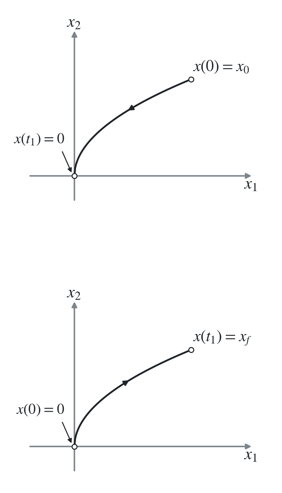
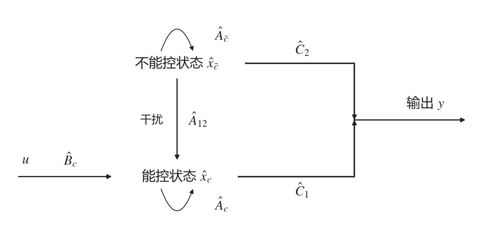
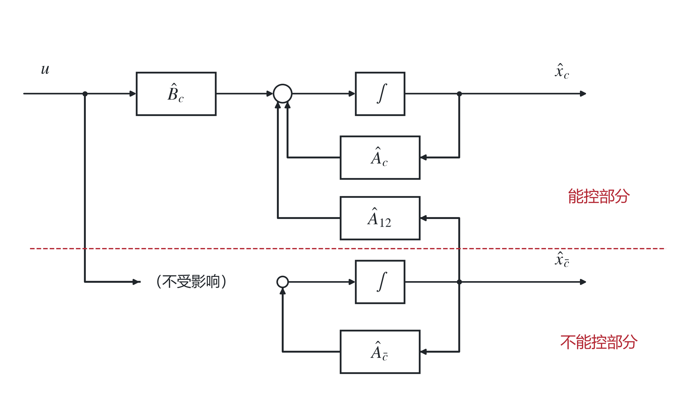
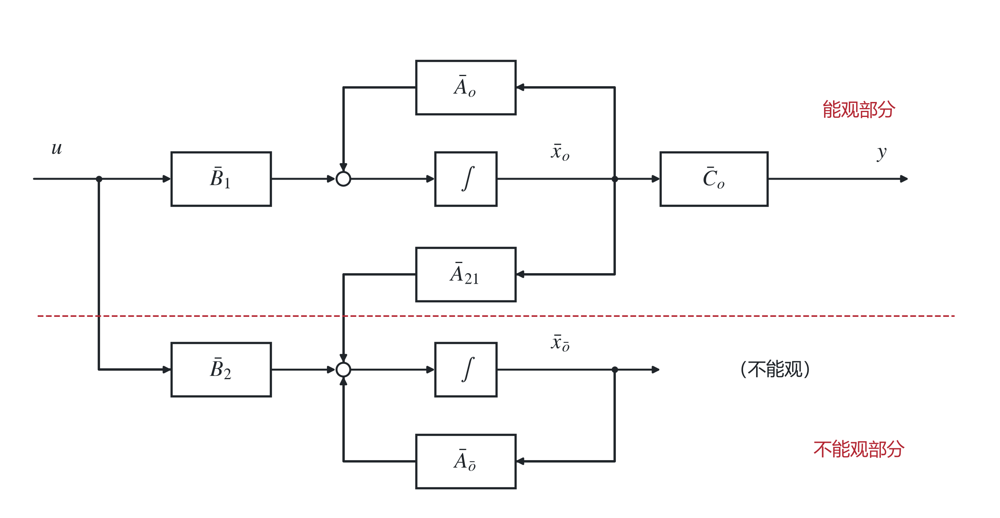
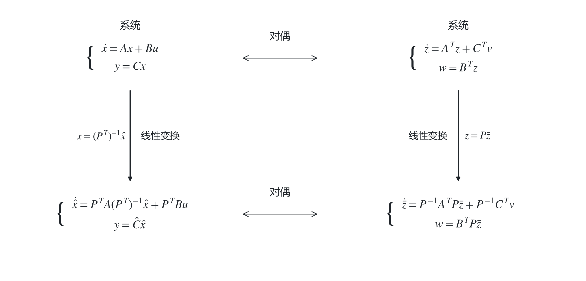

# 六、能控性与能观性

## 现代控制理论

1. 状态空间表达式 → 数学描述。
2. 运动分析 → 定量分析。
3. 能控性与能观性 → 定性分析。
4. Lyapunov 稳定性 → 定性分析。
5. 状态观测器设计 → 常规综合。
6. 状态反馈设计 → 常规综合。
7. 最优估计 → 最优综合。
8. 最优控制 → 最优综合。

定量分析、定性分析属于系统分析；常规综合、最优综合属于系统综合。

### 基于状态空间的时域分析

由于状态的引入，从关注输入输出的古典控制理论阶段过渡至以状态空间模型为基础的、关注内部状态的现代控制理论阶段。

<strong>线性定常非齐次系统状态方程的解：</strong>

$$
\begin{cases}
\dot x(t)=Ax(t)+Bu(t),&x(t_0)=x_0,\\
y(t)=Cx(t)+Du(t).
\end{cases}
$$

其状态方程的解为

$$
{\color{#c62828}x(t)=e^{A(t-t_0)}x(t_0)+\int_{t_0}^{t}e^{A(t-\tau)}Bu(\tau)\,d\tau.}
$$

右侧分别是零输入响应和零状态响应。

<strong>能控性是控制作用 $u(t)$ 支配系统的状态向量 $x(t)$ 的能力</strong>，表征 $u(t)$ 是否能使 $x(t)$ 作任意转移。

<strong>能观性是系统输出 $y(t)$ 反映系统的状态向量 $x(t)$ 的能力</strong>，表征能否通过 $y(t)$ 确定状态 $x(t)$。

⇒ 经典控制理论中输入与输出的关系唯一地由传递函数所确定，输出量为被控量，对于实际系统可以观测。系统稳定不意味着能控，仍须讨论能控能观问题。

状态向量 $x(t)$ 作为被控量时不一定是可实际观测到的物理量，因此有能观性问题。

## 1. 连续系统的能控性

### （1）能控性与能达性

对线性时不变系统

$$
\dot x(t)=Ax(t)+Bu(t),
$$

时变系统的能控性和系统初始时刻有关，而<strong>线性时不变（LTI）</strong>系统的能控性与初始时刻无关。

能控状态：对于 LTI 系统，若存在 $t_1>0$ 和一个无约束的允许控制 $u(t)$，$t\in[0,t_1]$，使系统由 $x_0$ 出发在 $t_1$ 时转移到 $x(t_1)=0$，则称 $x_0$ 为系统的一个能控状态。

能控性：若状态空间中所有非零状态均为能控状态，则称系统是能控的。

能达状态：若存在 $t_1>0$ 和一个无约束的允许控制 $u(t)$，使系统从零初始状态出发，经 $t_1$ 转移到 $x(t_1)=x_f$，则称 $x_f$ 为一个能达状态。

能达性：若所有状态均为能达状态，则称系统是能达的。

说明：能控性为一种定性性质；仅由系统参数决定，有固有属性；轨迹无限制。

<strong>连续 LTI 系统的能控性与能达性等价；离散时间系统中二者一般不等价。</strong>

### （2）能控性判据

$$
{\color{#c62828}\dot x=Ax+Bu,\qquad
x\in\mathbb R^n,\quad A\in\mathbb R^{n\times n},\quad
B\in\mathbb R^{n\times r},\quad u\in\mathbb R^r.}
$$

$A,B$ 为常矩阵。

#### i）凯莱–哈密顿（Cayley–Hamilton）定理

设 $A\in\mathbb R^{n\times n}$，其特征多项式为

$$
f(\lambda)=|\lambda I-A|
=\lambda^n+a_{n-1}\lambda^{n-1}+\cdots+a_1\lambda+a_0.
$$

Cayley–Hamilton 定理指出，矩阵 $A$ 满足自身的特征方程：

$$
{\color{#c62828}f(A)=A^n+a_{n-1}A^{n-1}+\cdots+a_1A+a_0I=0.}
$$

推论 1：矩阵 $A$ 的 $k$ 次幂（$k\ge n$）都可以表示为 $A$ 的至多 $n-1$ 次多项式：

$$
{\color{#c62828}A^k=\sum_{m=0}^{n-1}\alpha_mA^m.}
$$

推论 2：矩阵指数也可以表示为 $A$ 的至多 $n-1$ 次多项式：

$$
{\color{#c62828}e^{At}=\sum_{m=0}^{n-1}\alpha_m(t)A^m.}
$$

证明：由

$$
(\lambda I-A)\operatorname{adj}(\lambda I-A)=|\lambda I-A|I,
$$

其中 $\operatorname{adj}$ 为伴随矩阵（Adjugate Matrix），得 $f(\lambda)I=(\lambda I-A)\operatorname{adj}(\lambda I-A)$。

由于 $\lambda I-A$ 每个元素为 $\lambda$ 的一次多项式或常数，可推得 $\operatorname{adj}(\lambda I-A)$ 的每个元素为 $\lambda I-A$ 的 $(n-1)\times(n-1)$ 阶代数余子式，即关于 $\lambda$ 的最高 $n-1$ 阶多项式。

因此可记

$$
\operatorname{adj}(\lambda I-A)=B_{n-1}\lambda^{n-1}+\cdots+B_1\lambda+B_0,
$$

其中 $B_i$ 为 $n\times n$ 常矩阵。代入得

$$
\begin{aligned}
f(\lambda)I
&=(\lambda I-A)(B_{n-1}\lambda^{n-1}+\cdots+B_0)\\
&=B_{n-1}\lambda^n+(B_{n-2}-AB_{n-1})\lambda^{n-1}
+\cdots+(B_0-AB_1)\lambda-AB_0.
\end{aligned}
$$

与 $f(\lambda)I=I\lambda^n+a_{n-1}I\lambda^{n-1}+\cdots+a_1I\lambda+a_0I$ 对比系数，得

$$
B_{n-1}=I,\quad B_{n-2}-AB_{n-1}=a_{n-1}I,\quad\ldots,\quad
B_0-AB_1=a_1I,\quad-AB_0=a_0I.
$$

上述等式左右两侧分别左乘 $A^n,A^{n-1},\ldots,A,I$，得

$$
A^nB_{n-1}=A^n,\quad
A^{n-1}B_{n-2}-A^nB_{n-1}=a_{n-1}A^{n-1},\quad\ldots,
$$

$$
AB_0-A^2B_1=a_1A,\qquad-AB_0=a_0I.
$$

依次相加，得 $0=A^n+a_{n-1}A^{n-1}+\cdots+a_1A+a_0I$，即 $f(A)=0$。证毕。

推论 1 证明：对任意 $k\ge n$，多项式带余除法给出

$$
\lambda^k=q(\lambda)f(\lambda)+r(\lambda),
\qquad \deg r<n.
$$

其中 $f(\lambda)$ 为特征多项式，$r(\lambda)$ 为余式，其最高次数小于 $n$。因此可设

$$
r(\lambda)=\alpha_{n-1}\lambda^{n-1}+\cdots+\alpha_0.
$$

用 $A$ 替换 $\lambda$，由 $f(A)=0$ 得

$$
A^k=q(A)f(A)+r(A)=r(A)=\sum_{m=0}^{n-1}\alpha_mA^m.
$$

推论 2 由推论 1 易证。

#### ii）能控性 Gram 判据

能控 Gram 矩阵为

$$
W_c(t_1)=\int_0^{t_1}e^{-At}BB^Te^{-A^Tt}\,dt.
$$

LTI 系统能控，当且仅当存在 $t_1>0$，使 $W_c(t_1)$ 非奇异。

证明：充分性：若 $W_c(t_1)$ 非奇异，则对任意 $x_0$，取

$$
u(t)=-B^Te^{-A^Tt}W_c^{-1}(t_1)x_0,
$$

代入状态解：

$$
\begin{aligned}
x(t_1)&=e^{At_1}\left[x_0+\int_0^{t_1}e^{-At}Bu(t)\,dt\right]\\
&=e^{At_1}\left[x_0-\int_0^{t_1}e^{-At}BB^Te^{-A^Tt}\,dt\,W_c^{-1}(t_1)x_0\right]\\
&=e^{At_1}[x_0-W_c(t_1)W_c^{-1}(t_1)x_0]=0.
\end{aligned}
$$

因此系统能控。

必要性可用反证法。若系统能控而 $W_c(t_1)$ 奇异，则存在非零向量 $z$ 使

$$
W_c(t_1)z=0.
$$

于是

$$
z^TW_c(t_1)z
=\int_0^{t_1}\|B^Te^{-A^Tt}z\|_2^2\,dt=0,
$$

故

$$
B^Te^{-A^Tt}z=0,\qquad \forall t\in[0,t_1].
$$

矩阵指数关于 $t$ 为解析函数，所以上式在非零时间区间上恒成立，就对所有 $t$ 成立。另一方面，由系统能控，对非零初始状态 $x_0=z$ 存在 $t_2>0$ 和控制 $u(t)$，满足

$$
x(t_2)=e^{At_2}z+\int_0^{t_2}e^{A(t_2-t)}Bu(t)\,dt=0,
$$

即

$$
z=-\int_0^{t_2}e^{-At}Bu(t)\,dt.
$$

故

$$
\begin{aligned}
\|z\|_2^2=z^Tz
&=-\left(\int_0^{t_2}e^{-At}Bu(t)\,dt\right)^Tz\\
&=-\int_0^{t_2}u^T(t)B^Te^{-A^Tt}z\,dt=0.
\end{aligned}
$$

与 $z\ne0$ 矛盾！□

#### iii）能达性 Gram 判据

连续 LTI 系统能达的条件与能控 Gram 判据一致。证明同理。因此：

<strong>对于连续定常线性系统，能控性与能达性等价。</strong>

#### iv）能控性秩判据

能控性矩阵为

$$
{\color{#c62828}Q_c=[B\ AB\ \cdots\ A^{n-1}B].}
$$

LTI 系统能控，当且仅当

$$
{\color{#c62828}\operatorname{rank}Q_c=n.}
$$

其中 $n$ 为矩阵 $A$ 的维数。

证明：充分性：若 $\operatorname{rank}Q_c=n$，反设系统不能控。由 Gram 判据，对任意 $t_1>0$，$W_c(t_1)$ 奇异，存在 $\alpha\ne0$ 使

$$
\alpha^TW_c(t_1)\alpha=0.
$$

因此 $\alpha^Te^{-At}B=0$，即

$$
\alpha^T\left[I-At+\frac{1}{2!}A^2t^2-\frac{1}{3!}A^3t^3+\cdots\right]B=0.
$$

对 $t$ 连续求导 $n-1$ 次并令 $t=0$（$\frac{d}{dt}e^{-At}=-Ae^{-At}$），得到

$$
\alpha^TB=0,\quad \alpha^TAB=0,\quad\ldots,\quad\alpha^TA^{n-1}B=0,
$$

即 $\alpha^TQ_c=0$，这与 $Q_c$ 满行秩矛盾。

必要性：若 LTI 系统能控，反证。若 $\operatorname{rank}Q_c<n$，则存在 $\alpha\ne0$ 使 $\alpha^TQ_c=0$，进而

$$
\alpha^TA^iB=0,\qquad i=0,1,\ldots,n-1.
$$

由 Cayley–Hamilton 定理，对所有 $i\in\mathbb N$ 都成立。因此

$$
\alpha^Te^{-At}B=0,
$$

从而

$$
\alpha^T\left(\int_0^{t_1}e^{-At}BB^Te^{-A^Tt}\,dt\right)\alpha=0,
\qquad\forall t_1>0,
$$

$W_c(t_1)$ 奇异，系统不能控，与假设矛盾！□

#### v）能控性 PBH 判据

> Popov–Belevitch–Hautus 判据。

<strong>LTI 系统能控，当且仅当矩阵 $A$ 的所有特征值 $\lambda_i$ 都满足</strong>

$$
{\color{#c62828}\operatorname{rank}[\lambda_iI-A\ \ B]=n.}
$$

等价地，

$$
{\color{#c62828}\operatorname{rank}[sI-A\ \ B]=n,\qquad \forall s\in\mathbb C.}
$$

证明：必要性：若系统能控，反设存在特征值 $\lambda_k$ 使

$$
\operatorname{rank}[\lambda_kI-A\ \ B]<n,
$$

即行线性相关。则存在 $\alpha\ne0$ 使

$$
\alpha^T(\lambda_kI-A)=0,\qquad \alpha^TB=0.
$$

于是 $\alpha^TA=\lambda_k\alpha^T$，继而

$$
\begin{aligned}
\alpha^TAB&=\lambda_k\alpha^TB=0,\\
\alpha^TA^2B&=\lambda_k\alpha^TAB=\lambda_k^2\alpha^TB=0,\\
&\vdots\\
\alpha^TA^{n-1}B&=\lambda_k^{n-1}\alpha^TB=0.
\end{aligned}
$$

从而 $\alpha^TQ_c=0$，与系统能控矛盾。

充分性：反证。设 PBH 秩条件成立，若系统不能控，则存在非零 $z$ 使

$$
z^T[B\ AB\ \cdots\ A^{n-1}B]=0.
$$

我们构造最大线性无关组：$(z^TA^i)^T$，$i=0,1,\ldots,n-1$，均为 $B$ 的左零空间中的元素，即 $(z^TA^i)^T\in N(B^T)$。

故存在最大的 $k$，使向量组 $z^T,z^TA,\ldots,z^TA^{k-1}$ 线性无关。由于 $\dim N(B^T)=n-\operatorname{rank}B\le n-1$（此处 $B\ne0$；$B=0$ 时结论直接成立），有 $k\le n-1$。

存在系数 $\alpha_0,\ldots,\alpha_{k-1}$，使得

$$
z^TA^k+\alpha_{k-1}z^TA^{k-1}+\cdots+\alpha_1z^TA+\alpha_0z^T=0.
$$

即用 $z^T,\ldots,z^TA^{k-1}$ 表示 $z^TA^k$。

记多项式 $f(\lambda)=\lambda^k+\alpha_{k-1}\lambda^{k-1}+\cdots+\alpha_0$，则有 $z^Tf(A)=0$。

设 $f(\lambda)$ 的一个零点为 $\lambda_0$，重新分解为

$$
f(\lambda)=(\lambda^{k-1}+\beta_{k-2}\lambda^{k-2}+\cdots+\beta_0)(\lambda-\lambda_0).
$$

⇒

$$
z^Tf(A)=z^T(A^{k-1}+\beta_{k-2}A^{k-2}+\cdots+\beta_0I)(A-\lambda_0I)=0.
$$

进一步令 $\psi^T=z^T(A^{k-1}+\beta_{k-2}A^{k-2}+\cdots+\beta_0I)$，则 $\psi^TB=0$，$\psi\ne0$（由 $z^T,\ldots,z^TA^{k-1}$ 线性无关）。

故 $\psi^T(A-\lambda_0I)=0$，进而 $\psi^T[A-\lambda_0I\ \ B]=0$。

故 $\operatorname{rank}[A-\lambda_0I\ \ B]<n$，矛盾！（由 $\psi^T(A-\lambda_0I)=0$ 知 $\lambda_0$ 事实上为 $A$ 的特征值。）□

#### vi）状态变量的线性变换

通过<strong>非奇异线性变换</strong>联系起来的两个状态空间模型是<strong>等价的</strong>。对系统 $\Sigma(A,B,C,D)$，引入线性变换：

$$
x=P\bar x,
$$

其中 $P$ 为 $n\times n$ 非奇异矩阵，可得到等价系统 $\bar{\Sigma}(\bar A,\bar B,\bar C,\bar D)$，$\Sigma$ 与 $\bar \Sigma$ 等价：

$$
{\color{#c62828}\bar A=P^{-1}AP,
\qquad
\bar B=P^{-1}B,
\qquad
\bar C=CP,
\qquad
\bar D=D.}
$$

> 令 $x=P\bar x$，则 $\dot x=P\dot{\bar x}$。代入状态空间表达式
>
> $$
> \dot x=Ax+Bu,\qquad y=Cx+Du,
> $$
>
> 得
>
> $$
> P\dot{\bar x}=AP\bar x+Bu,\qquad y=CP\bar x+Du.
> $$
>
> 因而
>
> $$
> \dot{\bar x}=P^{-1}AP\bar x+P^{-1}Bu,
> \qquad
> y=CP\bar x+Du,
> $$
>
> 故
>
>
> $$
> \bar A=P^{-1}AP,\quad
> \bar B=P^{-1}B,\quad
> \bar C=CP,\quad
> \bar D=D.
> $$
>

线性变换可将状态方程化为对角型或 Jordan 标准型。易证等价系统具有相同的传递函数、特征多项式、特征根和极点。

而且

$$
{\color{#c62828}\operatorname{rank}[\bar B\ \bar A\bar B\ \cdots\ \bar A^{n-1}\bar B]
=\operatorname{rank}[B\ AB\ \cdots\ A^{n-1}B],}
$$

所以等价系统的能控性相同。

#### vii）能控性 Jordan 判据

设 $A$ 的互异特征值为 $\lambda_1,\ldots,\lambda_l$。把 $A$ 写成 Jordan 标准型，并把输入矩阵写成与各 Jordan 块对应的分块形式：

$$
A=\operatorname{diag}(J_{11},\ldots,J_{1q_1},J_{21},\ldots,J_{lq_l}).
$$

$$
B=\begin{bmatrix}
B_{11}\\ \vdots\\ B_{1q_1}\\ B_{21}\\ \vdots\\ B_{lq_l}
\end{bmatrix}.
$$

其中 $q_i$ 为特征值 $\lambda_i$ 对应的 Jordan 块个数，即 $\lambda_i$ 的几何重数。

<strong>系统完全能控，当且仅当对每个特征值 $\lambda_i$，输入矩阵中与其各 Jordan 块对应分块的最后一行所构成的行向量组线性无关。</strong>

相关结论（线性代数补充内容）：

① 若 $A$ 有 $n$ 个互不相同的特征值，则其特征向量线性无关；
② $A$ 可相似对角化，当且仅当 $A$ 有 $n$ 个线性无关的特征向量：

$$
P^{-1}AP=J=\operatorname{diag}(\lambda_1,\ldots,\lambda_n).
$$

③ 特征值 $\lambda_i$ 的几何重数为

$$
GM(\lambda_i)=\dim\ker(A-\lambda_iI),
$$

代数重数 $AM(\lambda_i)$ 为 $\det(A-\lambda I)=0$ 中根 $\lambda_i$ 的重数，且

$$
GM(\lambda_i)\le AM(\lambda_i);
$$

$A$ 可相似对角化，当且仅当对所有 $\lambda_i$ 都有

$$
GM(\lambda_i)=AM(\lambda_i).
$$

以上证明参考《自控 A》《线代》。

④ 将 $A$ 化为 Jordan 标准型：$A=PJP^{-1}$。其中 $J_{ik}$ 为特征值 $\lambda_i$ 对应的 Jordan 块，具有形式

$$
J_{ik}=\begin{bmatrix}
\lambda_i&1& &0\\
 &\lambda_i&\ddots&\\
 &&\ddots&1\\
0&&&\lambda_i
\end{bmatrix}.
$$

Jordan 块的确定方式为：$AM(\lambda_i)$ 决定 $J_{i1},\ldots,J_{iq_i}$ 对角线上共有多少个 $\lambda_i$，$GM(\lambda_i)=q_i$。

记 $n_k=\dim N((A-\lambda_iI)^k)$、$n_0=0$，则恰好为 $k$ 阶的 Jordan 块的数量为

$$
2n_k-n_{k-1}-n_{k+1}.
$$

该式不予证明。

> 例：$AM(\lambda_i)=5$，$GM(\lambda_i)=3$。
>
> 第一种情形：$J_3(\lambda_i)\oplus J_1(\lambda_i)\oplus J_1(\lambda_i)$，为 $3+1+1$。
>
> 第二种情形：$J_2(\lambda_i)\oplus J_2(\lambda_i)\oplus J_1(\lambda_i)$，为 $2+2+1$。
>
> $$
> J^{(1)}=\begin{bmatrix}
> \lambda_i&1&0&0&0\\0&\lambda_i&1&0&0\\0&0&\lambda_i&0&0\\
> 0&0&0&\lambda_i&0\\0&0&0&0&\lambda_i
> \end{bmatrix},\quad
> J^{(2)}=\begin{bmatrix}
> \lambda_i&1&0&0&0\\0&\lambda_i&0&0&0\\0&0&\lambda_i&1&0\\
> 0&0&0&\lambda_i&0\\0&0&0&0&\lambda_i
> \end{bmatrix}.
> $$
>
> 具体为哪个需计算 $n_k$。

证明：先记满足 $A=PJP^{-1}$ 的 $J$ 中的 Jordan 块为

$$
J_{ik}=\begin{bmatrix}
\lambda_i&1& &0\\
 &\lambda_i&\ddots&\\
 &&\ddots&1\\
0&&&\lambda_i
\end{bmatrix}.
$$

令 $N=A-\lambda_iI$，$\lambda_i$ 对应的特征向量为 $v_1$，则有 $Nv_1=0$。

设该特征向量对应 Jordan 块阶数为 $k$，定义 $v_2,v_3,\ldots,v_k$ 为满足 $Nv_2=v_1,\ldots,Nv_k=v_{k-1}$ 的向量，即<strong>广义特征向量</strong>。

可以证明这样的 $v_2,\ldots,v_k$ 是可以找到的，此处不展开证明。

有

$$
A[v_1\ v_2\ \cdots\ v_k]
=[\lambda_iv_1\ \lambda_iv_2+v_1\ \cdots\ \lambda_iv_k+v_{k-1}]
=[v_1\ v_2\ \cdots\ v_k]J_{ik}.
$$

令 $P_i=[v_1\ \cdots\ v_k]$，则有 $AP_i=P_iJ_{ik}$。只需证明这些列线性无关。

注意到 $N^{k-1}v_k=v_1\ne0$、$N^kv_k=Nv_1=0$。假设存在标量 $c_1,\ldots,c_k$，使得

$$
c_1v_1+c_2v_2+\cdots+c_kv_k=0.
$$

左乘 $N^{k-1}$ 得 $c_kv_1=0$，故 $c_k=0$。

左乘 $N^{k-2}$ 得 $c_{k-1}v_1+c_kv_2=c_{k-1}v_1=0$，故 $c_{k-1}=0$。同理得 $c_1=\cdots=c_k=0$。

故广义特征向量组线性无关；各块的广义特征向量合成完整变换矩阵后，$A$ 与 $J$ 相似。证毕。□

> $v_i\in N(A-\lambda_iI)$，$\dim N(A-\lambda_iI)=q_i$，所以线性无关的 $v_i$ 的取法有很多，对应 $q_i$ 个 Jordan 块。此处只以一个 $v_i$ 为例。

再证：$GM(\lambda_i)=q_i$。设 $J_{ik}$ 为 $\lambda_i$ 对应的 Jordan 块，阶数为 $r$。

由于 $A$ 与 $J$ 相似，我们可以考察 $\dim N(J-\lambda_iI)$。

$$
J_{ik}-\lambda_iI=
\begin{bmatrix}0&1&&0\\&0&\ddots&\\&&\ddots&1\\0&&&0\end{bmatrix},
\qquad
\operatorname{rank}(J_{ik}-\lambda_iI)=r-1.
$$

$$
\dim N(J_{ik}-\lambda_iI)=r-(r-1)=1.
$$

同参见《控代》。由 $J_i=\operatorname{diag}(J_{i1},\ldots,J_{iq_i})$，得

$$
\dim N(J_i-\lambda_iI)=\text{该分块矩阵阶数}
-\sum_{k=1}^{q_i}\operatorname{rank}(J_{ik}-\lambda_iI)=q_i.
$$

即每个 Jordan 块会贡献 $1$ 的零空间维数，对 $j\ne i$，$J_j$ 不会贡献 $\dim N(J-\lambda_iI)$。

故 $\dim N(J-\lambda_iI)=\dim N(J_i-\lambda_iI)=q_i$。证毕。□

> 因此可以理解 Jordan 判据为：
>
> 在一个 Jordan 块中，若能控制这条广义特征向量组的最后一个 $v_k$，则可以通过乘 $N$“逐级”控制，最终控制整个块中的所有状态。
>
> 若 $\lambda_i$ 的两个 Jordan 块最后一行线性相关，则这两个块对于 $u$ 收到的是成比例的控制信号。像用一个方向盘开 2 辆车，会导致丧失 1 个自由度，不能控。

## 2. 连续系统的能观性

### （1）能观性概念

对 LTI 系统，

$$
y(t)=Ce^{A(t-t_0)}x_0+C\int_{t_0}^{t}e^{A(t-\tau)}Bu(\tau)\,d\tau+Du(t).
$$

定义辅助输出

$$
\bar y(t)=y(t)-C\int_{t_0}^{t}e^{A(t-\tau)}Bu(\tau)\,d\tau-Du(t)
=Ce^{A(t-t_0)}x_0.
$$

它只依赖初始状态 $x_0$。若能由 $\bar y(t)$ 唯一估计出 $x_0$，则系统能观。该问题等价于 $u=0$ 时能否通过 $y(t)$ 推出 $x_0$，即可简化为分析零输入系统

$$
{\color{#c62828}
\begin{cases}
\dot x(t)=Ax(t),&x(t_0)=x_0,\\
y(t)=Cx(t).
\end{cases}}
$$

能否由 $y(t)$ 唯一确定 $x_0$。其中 $x\in\mathbb R^n$、$A\in\mathbb R^{n\times n}$、$C\in\mathbb R^{m\times n}$，$A,C$ 为常矩阵。

能观状态：对于 LTI 系统，若对于初始时刻 $t=0$ 的一个非零初始状态 $x_0$，存在时间区间 $[0,t_1]$，使得由 $[0,t_1]$ 上系统的输出 $y(t)$ 可以唯一地确定初始状态 $x_0$，则称该状态 $x_0$ 是能观的。

能观性：对于 LTI 系统，若状态空间中的所有状态都是能观状态，则该系统是能观的。

<strong>能观性与时间区间无关：LTI 系统若在某个非零时间区间上能观，则在任意非零时间区间上都能观。</strong>

### （2）能观性判据

#### i）能观性 Gram 判据

能观 Gram 矩阵为

$$
W_o(t_1)=\int_0^{t_1}e^{A^Tt}C^TCe^{At}\,dt.
$$

LTI 系统能观，当且仅当存在 $t_1>0$，使 $W_o(t_1)$ 非奇异。

证明：充分性。若 $W_o(t_1)$ 非奇异，对 $y(t)=Ce^{At}x_0$ 两边左乘 $e^{A^Tt}C^T$ 并从 $0$ 到 $t_1$ 积分，有

$$
\int_0^{t_1}e^{A^Tt}C^TCe^{At}x_0\,dt
=W_o(t_1)x_0
=\int_0^{t_1}e^{A^Tt}C^Ty(t)\,dt,
$$

因此

$$
x_0=W_o^{-1}(t_1)\int_0^{t_1}e^{A^Tt}C^Ty(t)\,dt,
$$

可由 $y(t)$ 唯一确定 $x_0$。

必要性：若能观，反证。若对任意 $t_1>0$，$W_o(t_1)$ 都奇异，则存在非零 $\bar x_0$ 使

$$
\bar x_0^TW_o(t_1)\bar x_0=0.
$$

即

$$
\int_0^{t_1}\bar x_0^Te^{A^Tt}C^TCe^{At}\bar x_0\,dt
=\int_0^{t_1}\|Ce^{At}\bar x_0\|_2^2\,dt
=\int_0^{t_1}\|y(t)\|_2^2\,dt=0,
$$

从而 $Ce^{At}\bar x_0=0$，存在非零状态对应恒零输出，即 $\bar x_0$ 为不能观状态，矛盾！□

#### ii）能观性秩判据

能观性矩阵为

$$
{\color{#c62828}Q_o=\begin{bmatrix}
C\\CA\\\vdots\\CA^{n-1}
\end{bmatrix}.}
$$

LTI 系统能观，当且仅当

$$
{\color{#c62828}\operatorname{rank}Q_o=n.}
$$

其中 $n$ 为矩阵 $A$ 的维数。

证明：必要性。若能观，反证。若 $Q_o$ 不满秩，则存在 $z\ne0$ 使 $Q_oz=0$，即

$$
CA^kz=0,\qquad k=0,1,\ldots,n-1.
$$

由 Cayley–Hamilton 定理可得 $Ce^{At}z=0$，故 $z$ 为不能观状态，矛盾！

充分性：若 $\operatorname{rank}Q_o=n$，反证。若系统不能观，则 $W_o(t_1)$ 奇异，存在 $\bar x_0\ne0$，使 $\bar x_0^TW_o(t_1)\bar x_0=0$。得

$$
y(t)=Ce^{At}\bar x_0=0,\qquad \forall t\in[0,t_1].
$$

由

$$
e^{At}=\sum_{k=0}^{\infty}\frac{1}{k!}A^kt^k,
$$

在 $t=0$ 连续求导，可得

$$
C\bar x_0=0,\quad CA\bar x_0=0,\quad\ldots,\quad CA^{n-1}\bar x_0=0,
$$

所以 $Q_o$ 不满列秩，矛盾！□

#### iii）能观性 PBH 判据

LTI 系统能观，当且仅当对 $A$ 的所有特征值 $\lambda_i$，都有

$$
{\color{#c62828}\operatorname{rank}
\begin{bmatrix}
C\\\lambda_iI-A
\end{bmatrix}=n.}
$$

等价地，

$$
{\color{#c62828}\operatorname{rank}
\begin{bmatrix}
C\\sI-A
\end{bmatrix}=n,\qquad\forall s\in\mathbb C.}
$$

#### iv）等价系统的能观性

对于 LTI 系统，经过非奇异线性变换 $x=P\bar x$ 后的系统（等价系统）能观性相同：

$$
\operatorname{rank}\begin{bmatrix}\bar C\\\bar C\bar A\\\vdots\\\bar C\bar A^{n-1}\end{bmatrix}
=\operatorname{rank}\begin{bmatrix}C\\CA\\\vdots\\CA^{n-1}\end{bmatrix}.
$$

#### v）能观性 Jordan 判据

$A$ 的互异特征值为 $\lambda_1,\ldots,\lambda_l$。把 $A$ 写为 Jordan 标准型，并把输出矩阵 $C$ 写为相应分块矩阵：

$$
A=\operatorname{diag}(J_{11},\ldots,J_{1q_1},\ldots,J_{l1},\ldots,J_{lq_l}),
$$

$$
C=[C_{11}\ \cdots\ C_{1q_1}\ C_{21}\ \cdots\ C_{lq_l}].
$$

$q_i$ 为 $\lambda_i$ 对应 Jordan 块的个数。

<strong>系统完全能观，当且仅当对每个特征值 $\lambda_i$，输出矩阵中与其各 Jordan 块对应分块的第一列所构成的列向量组线性无关。</strong>

### （3）对偶性原理

系统

$$
\dot x=Ax+Bu,\qquad y=Cx
$$

的对偶系统为

$$
\dot z=A^Tz+C^Tv,\qquad w=B^Tz.
$$

易证：若

$$
\begin{cases}\dot x=Ax,\\y=Cx\end{cases}
$$

能观，则对偶系统 $\dot z=A^Tz+C^Tv$ 能控；若 $\dot x=Ax+Bu$ 能控，则对偶系统

$$
\begin{cases}\dot z=A^Tz,\\w=B^Tz\end{cases}
$$

能观。

因此，一个系统的能观性判据可由对偶系统的能控性判据获得，反之亦然。

## 3. 连续系统结构分解

### （1）规范型

#### i）第一能控规范型

<strong>给定单输入单输出 SISO 能控系统</strong>，其特征多项式为

$$
\alpha(s)=s^n+\alpha_{n-1}s^{n-1}+\cdots+\alpha_1s+\alpha_0=|sI-A|,
$$

能控性矩阵为

$$
{\color{#c62828}Q_c=[B\ AB\ \cdots\ A^{n-1}B].}
$$

若 $\operatorname{rank}Q_c=n$，取非奇异变换

$$
x=Q_c\bar x,
$$

系统可化为第一能控规范型

$$
\dot{\bar x}=A_c\bar x+B_cu,
\qquad
y=C_c\bar x,
$$

其中 $A\in\mathbb R^{n\times n}$、$B\in\mathbb R^{n\times1}$、$C\in\mathbb R^{1\times n}$，原系统为 $\dot x=Ax+Bu,\ y=Cx$。

$$
{\color{#c62828}A_c=
\begin{bmatrix}
0&0&\cdots&0&-\alpha_0\\
1&0&\cdots&0&-\alpha_1\\
0&1&\cdots&0&-\alpha_2\\
\vdots&\vdots&\ddots&\vdots&\vdots\\
0&0&\cdots&1&-\alpha_{n-1}
\end{bmatrix},
\qquad
B_c=\begin{bmatrix}1&0&\cdots&0\end{bmatrix}^T,}
$$

$$
{\color{#c62828}C_c=[\beta_0\ \beta_1\ \cdots\ \beta_{n-1}],
\qquad
\beta_i=CA^iB.}
$$

证明：由

$$
I=Q_c^{-1}Q_c=Q_c^{-1}[B\ AB\ \cdots\ A^{n-1}B]
$$

得

$$
Q_c^{-1}A^iB
=\begin{bmatrix}0&\cdots&0&1&0&\cdots&0\end{bmatrix}^T,\qquad i=0,\ldots,n-1,
$$

向量中的第 $i+1$ 个元素为 $1$。特别地，

$$
B_c=Q_c^{-1}B=[1\ 0\ \cdots\ 0]^T.
$$

$$
A_c=Q_c^{-1}AQ_c=Q_c^{-1}[AB\ A^2B\ \cdots\ A^nB].
$$

由 Cayley–Hamilton 定理，

$$
A^n=-\alpha_{n-1}A^{n-1}-\cdots-\alpha_1A-\alpha_0I,
$$

得

$$
A^nB=-\alpha_{n-1}A^{n-1}B-\cdots-\alpha_1AB-\alpha_0B.
$$

代入即得上式的 $A_c$。且

$$
C_c=CQ_c=[CB\ CAB\ \cdots\ CA^{n-1}B].
$$

□

#### ii）第二能控规范型

定义由系统矩阵 $A$ 的特征多项式系数构成的 <strong>Hankel 矩阵</strong>：

$$
{\color{#c62828}
H_A=\begin{bmatrix}
\alpha_1&\alpha_2&\cdots&\alpha_{n-1}&1\\
\alpha_2&\alpha_3&\cdots&1&0\\
\vdots&\vdots&⋰&\vdots&\vdots\\
\alpha_{n-1}&1&\cdots&0&0\\
1&0&\cdots&0&0
\end{bmatrix},\quad
P=Q_cH_A=[e_1\ e_2\ \cdots\ e_n].}
$$

由 Cayley–Hamilton 定理较易证：

$$
Ae_1=-\alpha_0e_n,\qquad Ae_2=e_1-\alpha_1e_n,\quad\ldots,\quad
Ae_n=e_{n-1}-\alpha_{n-1}e_n.
$$

故

$$
AP=P\begin{bmatrix}
0&1&&0\\
&0&\ddots&\\
&&0&1\\
-\alpha_0&-\alpha_1&\cdots&-\alpha_{n-1}
\end{bmatrix},\qquad
B=e_n=P\begin{bmatrix}0\\\vdots\\0\\1\end{bmatrix}.
$$

在非奇异线性变换 $x=P\bar x$ 下，原系统转为第二能控规范型：

$$
{\color{#c62828}
\begin{cases}\dot{\bar x}=A_c\bar x+B_cu,\\y=C_c\bar x,\end{cases}
\quad
A_c=\begin{bmatrix}0&1&&0\\&0&\ddots&\\&&0&1\\-\alpha_0&-\alpha_1&\cdots&-\alpha_{n-1}\end{bmatrix},
\quad B_c=\begin{bmatrix}0\\\vdots\\0\\1\end{bmatrix},
\quad C_c=CP=[\beta_0\ \beta_1\ \cdots\ \beta_{n-1}].}
$$

参数 $\beta_0,\ldots,\beta_{n-1}$ 由下式确定：

$$
{\color{#c62828}
\begin{aligned}
\beta_{n-1}&=CB,\\
\beta_{n-2}&=CAB+\alpha_{n-1}CB,\\
&\vdots\\
\beta_1&=CA^{n-2}B+\alpha_{n-1}CA^{n-3}B+\cdots+\alpha_2CB,\\
\beta_0&=CA^{n-1}B+\alpha_{n-1}CA^{n-2}B+\cdots+\alpha_1CB.
\end{aligned}}
$$

#### iii）推论

设 SISO 系统能控，$\beta_0,\ldots,\beta_{n-1}$ 如第二能控规范型给出，则其传递函数为

$$
{\color{#c62828}G(s)=\frac{\beta_{n-1}s^{n-1}+\beta_{n-2}s^{n-2}+\cdots+\beta_0}
{s^n+\alpha_{n-1}s^{n-1}+\cdots+\alpha_0}.}
$$

注意分母 $s^n$ 系数为 $1$。

#### iv）利用对偶原理求能观规范型

第一能观规范型：SISO，$x=Q_o^{-1}\tilde x$。

$$
\dot{\tilde x}=
\begin{bmatrix}
0&1&&0\\
&0&\ddots&\\
&&0&1\\
-\alpha_0&-\alpha_1&\cdots&-\alpha_{n-1}
\end{bmatrix}\tilde x+
\begin{bmatrix}\beta_0\\\beta_1\\\vdots\\\beta_{n-1}\end{bmatrix}u,
\qquad y=[1\ 0\ \cdots\ 0]\tilde x,\qquad\beta_i=CA^iB.
$$

第二能观规范型：SISO，$Q=H_AQ_o$，$x=Q^{-1}\tilde x$。

$$
\dot{\tilde x}=
\begin{bmatrix}
0&0&\cdots&-\alpha_0\\
1&0&\cdots&-\alpha_1\\
&\ddots&\ddots&\vdots\\
0&&1&-\alpha_{n-1}
\end{bmatrix}\tilde x+
\begin{bmatrix}\beta_0\\\beta_1\\\vdots\\\beta_{n-1}\end{bmatrix}u,
\qquad y=[0\ \cdots\ 0\ 1]\tilde x.
$$

其中 $\beta_{n-1}=CB$，$\beta_{n-2}=CAB+\alpha_{n-1}CB$，$\ldots$，$\beta_0=CA^{n-1}B+\alpha_{n-1}CA^{n-2}B+\cdots+\alpha_1CB$。

### （2）连续系统结构分解

#### i）能控性结构分解

若 $n$ 维 LTI 系统的能控性矩阵 $Q_c$ 满足

$$
\operatorname{rank}Q_c=k<n,
$$

从 $Q_c$ 中选取 $k$ 个线性无关列向量 $l_1,\ldots,l_k$，再用 $n-k$ 个向量补成全空间的一组基：

$$
{\color{#c62828}P=[l_1\ \cdots\ l_k\ l_{k+1}\ \cdots\ l_n].}
$$

令 $x=P\hat x$，则系统可化为按能控性分解的形式

$$
\dot{\hat x}=\hat A\hat x+\hat Bu,
\qquad
y=\hat C\hat x,
$$

其中

$$
{\color{#c62828}\hat A=
\begin{bmatrix}
\hat A_c&\hat A_{12}\\
0&\hat A_{\bar c}
\end{bmatrix},
\qquad
\hat B=\begin{bmatrix}\hat B_c\\0\end{bmatrix},
\qquad
\hat C=[\hat C_1\ \hat C_2].}
$$

其中 $(\hat A_c,\hat B_c)$ 完全能控；子系统 $\Sigma(\hat A_c,\hat B_c,\hat C_1)$ 的传递函数等于整个系统的传递函数：

$$
\hat C_1(sI-\hat A_c)^{-1}\hat B_c
=\hat C(sI-\hat A)^{-1}\hat B.
$$

证明：$\hat A=P^{-1}AP$，$\hat B=P^{-1}B$，$\hat C=CP$。设 $P^{-1}=[p_1\ p_2\ \cdots\ p_n]^T$。

由 $P^{-1}P=I$、$P=[l_1\ \cdots\ l_n]$，可知 $p_i^Tl_j=0$（$i\ne j$）。

由于 $B$ 为 $Q_c$ 的一个子块，其每列可表示为 $l_1,\ldots,l_k$ 的线性组合，因此有

$$
p_{k+1}^TB=0,\quad\ldots,\quad p_n^TB=0,
\qquad
\hat B=P^{-1}B=
\begin{bmatrix}p_1^TB\\\vdots\\p_k^TB\\0\\\vdots\\0\end{bmatrix}
=\begin{bmatrix}\hat B_c\\0\end{bmatrix}.
$$

要证 $\hat A$ 具有分块上三角形式，即证 $\forall i>k,j\le k$，$p_i^TAl_j=0$。

由于 $l_1,\ldots,l_k$ 为 $Q_c=[B\ AB\ \cdots\ A^{n-1}B]$ 中的列向量，对 $\forall j\le k$，$Al_j$ 能由 $l_1,\ldots,l_k$ 线性表示。

若 $l_j$ 为 $B,\ldots,A^{n-2}B$ 的某列，$Al_j$ 仍位于 $Q_c$ 中。若 $l_j$ 为 $A^{n-1}B$ 的列，由 Cayley–Hamilton 定理，$Al_j$ 为 $A^nB$ 的一列，而 $A^nB$ 为 $B,\ldots,A^{n-1}B$ 的线性组合，也回到了 $Q_c$ 中。

故对 $\forall i>k,j\le k$，有 $p_i^TAl_j=0$，$\hat A$ 具有分块上三角的形式。

（1）由于状态变换不改变能控性：

$$
\begin{aligned}
k&=\operatorname{rank}Q_c=\operatorname{rank}\hat Q_c\\
&=\operatorname{rank}
\begin{bmatrix}
\hat B_c&\hat A_c\hat B_c&\cdots&\hat A_c^{n-1}\hat B_c\\
0&0&\cdots&0
\end{bmatrix}\\
&=\operatorname{rank}[\hat B_c\ \hat A_c\hat B_c\ \cdots\ \hat A_c^{k-1}\hat B_c].
\end{aligned}
$$

即该矩阵满行秩，$(\hat A_c,\hat B_c)$ 完全能控。

（2）由于状态变换不改变传递函数：

$$
\begin{aligned}
C(sI-A)^{-1}B
&=\hat C(sI-\hat A)^{-1}\hat B\\
&=[\hat C_1\ \hat C_2]
\begin{bmatrix}sI-\hat A_c&-\hat A_{12}\\0&sI-\hat A_{\bar c}\end{bmatrix}^{-1}
\begin{bmatrix}\hat B_c\\0\end{bmatrix}\\
&=\hat C_1(sI-\hat A_c)^{-1}\hat B_c.
\end{aligned}
$$

□

> 我们把系统拆成了能控子系统（下标 $c$）和不能控子系统（下标 $\bar c$）。$\hat A_{12}$ 代表了不能控状态会对能控状态产生单向耦合影响。
>
> 但 $u$ 无法进入不可控部分，它也不会对输出 $y$ 产生由输入激励的影响，不可控部分处于“隐身”状态。
>

> $l_1,\ldots,l_k$ 具体找法可通过初等行变换求出 $Q_c$ 的一组列空间基，详见《控代》。

> 分块逆矩阵公式为
>
> $$
>\begin{bmatrix}X&Y\\0&Z\end{bmatrix}^{-1}
> =\begin{bmatrix}X^{-1}&-X^{-1}YZ^{-1}\\0&Z^{-1}\end{bmatrix},
>$$
>
>从而变换后的输入矩阵具有形式
>
> $$
> \begin{bmatrix}X^{-1}&-X^{-1}YZ^{-1}\\0&Z^{-1}\end{bmatrix}
> \begin{bmatrix}\hat B_c\\0\end{bmatrix}
>=\begin{bmatrix}X^{-1}\hat B_c\\0\end{bmatrix}.
> $$
>

#### ii）能控性分解的模态含义

在能控性分解中，系统分为完全能控和完全不能控的两个子系统：

$$
\begin{cases}
\dot{\hat x}_c=\hat A_c\hat x_c+\hat A_{12}\hat x_{\bar c}+\hat B_cu,\\
y_1=\hat C_1\hat x_c,
\end{cases}
$$

$$
\begin{cases}
\dot{\hat x}_{\bar c}=\hat A_{\bar c}\hat x_{\bar c},\\
y_2=\hat C_2\hat x_{\bar c},
\end{cases}
\qquad y=y_1+y_2.
$$

系统特征多项式满足

$$
\det(sI-A)=\det(sI-\hat A_c)\det(sI-\hat A_{\bar c}).
$$

$\hat A_c$ 的特征值称为系统的**能控振型**，$\hat A_{\bar c}$ 的特征值称为系统的**不能控振型**。引入状态反馈只能改变能控振型的位置。

#### iii）能观性结构分解

若

$$
\operatorname{rank}Q_o=k<n,
$$

取 $Q_o$ 中 $k$ 个线性无关行向量 $v_1^T,\ldots,v_k^T$，再补成全空间的基，构造

$$
P=[v_1\ \cdots\ v_k\ v_{k+1}\ \cdots\ v_n]^T.
$$

令 $x=P^{-1}\bar x$，可得到按能观性分解的规范型

$$
\begin{bmatrix}
\dot{\bar x}_o\\
\dot{\bar x}_{\bar o}
\end{bmatrix}
=
\begin{bmatrix}
\bar A_o&0\\
\bar A_{21}&\bar A_{\bar o}
\end{bmatrix}
\begin{bmatrix}
\bar x_o\\
\bar x_{\bar o}
\end{bmatrix}
+
\begin{bmatrix}
\bar B_1\\
\bar B_2
\end{bmatrix}u,
$$

$$
y=[\bar C_o\ 0]
\begin{bmatrix}
\bar x_o\\
\bar x_{\bar o}
\end{bmatrix}.
$$

其中 $(\bar A_o,\bar C_o)$ 完全能观；能观子系统的传递函数等于整个系统的传递函数。

$$
\bar C_o(sI-\bar A_o)^{-1}\bar B_1=C(sI-A)^{-1}B.
$$

#### iv）能控—能观结构分解

当系统既不完全能控又不完全能观时，可以分解为四部分：

1. 既能控又能观；
2. 能控但不能观；
3. 不能控但能观；
4. 既不能控又不能观。

可写为

$$
\begin{bmatrix}
\dot{\bar x}_{co}\\\dot{\bar x}_{c\bar o}\\
\dot{\bar x}_{\bar c o}\\\dot{\bar x}_{\bar c\bar o}
\end{bmatrix}
=
\begin{bmatrix}
\bar A_{co}&0&\bar A_{13}&0\\
\bar A_{21}&\bar A_{c\bar o}&\bar A_{23}&\bar A_{24}\\
0&0&\bar A_{\bar c o}&0\\
0&0&\bar A_{43}&\bar A_{\bar c\bar o}
\end{bmatrix}
\begin{bmatrix}\bar x_{co}\\\bar x_{c\bar o}\\\bar x_{\bar c o}\\\bar x_{\bar c\bar o}\end{bmatrix}
+
\begin{bmatrix}\bar B_{co}\\\bar B_{c\bar o}\\0\\0\end{bmatrix}u,
$$

$$
y=[\bar C_{co}\ 0\ \bar C_{\bar c o}\ 0]
\begin{bmatrix}\bar x_{co}\\\bar x_{c\bar o}\\\bar x_{\bar c o}\\\bar x_{\bar c\bar o}\end{bmatrix}.
$$

系统传递函数与系统的既能控又能观部分的传递函数一致：

$$
\bar\Phi(s)=\bar C_{co}(sI-\bar A_{co})^{-1}\bar B_{co}.
$$

> 例：
>
> $$
> \begin{bmatrix}\dot x_1\\\dot x_2\end{bmatrix}
> =\begin{bmatrix}-4&1\\0&-4\end{bmatrix}
> \begin{bmatrix}x_1\\x_2\end{bmatrix}
> +\begin{bmatrix}4&3\\0&0\end{bmatrix}
> \begin{bmatrix}u_1\\u_2\end{bmatrix},
> \qquad
> \begin{bmatrix}y_1\\y_2\end{bmatrix}
> =\begin{bmatrix}0&5\\0&2\end{bmatrix}
> \begin{bmatrix}x_1\\x_2\end{bmatrix}.
> $$
>
> 则 $x_2$ 能观，$x_1$ 不能观；$x_2$ 不能控，$x_1$ 能控。
>
> $$
> \bar x_{co}=0,\qquad \bar x_{c\bar o}=x_1,\qquad
> \bar x_{\bar c o}=x_2,\qquad\bar x_{\bar c\bar o}=0.
> $$
>
> 这是因为 $\dot x_1=-4x_1+x_2+4u_1+3u_2$，$x_1$ 与 $u$ 有关；$\dot x_2=-4x_2$ 与 $u$ 无关。能观性同理。

#### v）基于 Jordan 型的结构分解

基于 Jordan 型的结构分解，可先利用 Jordan 判据判断各状态的能控、能观性，再按上述四部分重新排列。

### （3）状态空间实现

设 SISO 系统传递函数为

$$
G(s)=\frac{\beta_{n-1}s^{n-1}+\cdots+\beta_1s+\beta_0}
{s^n+\alpha_{n-1}s^{n-1}+\cdots+\alpha_1s+\alpha_0}.
$$

若极点 $s_1,\ldots,s_n$ 互不相等，将其写成部分分式

$$
G(s)=\sum_{i=1}^{n}\frac{\bar\alpha_i}{s-s_i},
\qquad
\bar\alpha_i=\left.G(s)(s-s_i)\right|_{s=s_i}.
$$

可取状态空间实现

$$
A=\operatorname{diag}(s_1,s_2,\ldots,s_n),
$$

$$
B=[\hat\alpha_1\ \hat\alpha_2\ \cdots\ \hat\alpha_n]^T,
\qquad
C=[\hat\beta_1\ \hat\beta_2\ \cdots\ \hat\beta_n],
$$

取 $\hat\alpha_i\hat\beta_i=\bar\alpha_i$，使

$$
\begin{cases}
\dot x=\operatorname{diag}(s_1,\ldots,s_n)x+
\begin{bmatrix}\hat\alpha_1\\\vdots\\\hat\alpha_n\end{bmatrix}u,\\
y=[\hat\beta_1\ \cdots\ \hat\beta_n]x.
\end{cases}
$$

$$
G(s)=C(sI-A)^{-1}B
=\sum_{i=1}^{n}\frac{\hat\alpha_i\hat\beta_i}{s-s_i}.
$$

由 $(sI-A)^{-1}=\operatorname{diag}\left(\frac1{s-s_1},\ldots,\frac1{s-s_n}\right)$。

由 Jordan 判据：

$$
\text{能控}\iff\hat\alpha_i\ne0,
\qquad
\text{能观}\iff\hat\beta_i\ne0,
$$

$$
\text{既能控又能观}\iff\hat\alpha_i\hat\beta_i\ne0.
$$

若传递函数在 $s_i$ 处发生零极点对消，则

$$
G(s)=\frac{(s-s_i)P(s)}{(s-s_1)(s-s_2)\cdots(s-s_n)},
$$

$$
\hat\alpha_i\hat\beta_i=0,
$$

这意味着该系统在对应模态 $s_i$ 下，要么不能控（$\hat\alpha_i=0$），要么不能观（$\hat\beta_i=0$）。

<strong>对 SISO 系统，一个传递函数的实现既能控又能观，当且仅当传递函数无零极点对消。</strong>

i）SISO 系统的实现：能控规范型实现／能观规范型实现／Jordan 标准型实现。

ii）最小实现：对 $G(s)$ 的实现并不唯一，其维数最小的实现称为最小实现。

实现 $(A,B,C)$ 为 $G(s)$ 的最小实现，当且仅当 $(A,B)$ 能控且 $(A,C)$ 能观。任意两个最小实现彼此等价。对任一实现作结构分解，其中既能控又能观的部分就是最小实现。

> 若有重根：
>
> $$
> J=\begin{bmatrix}s_1&1&0&0\\0&s_1&1&0\\0&0&s_1&0\\0&0&0&s_2\end{bmatrix},
> \qquad
> (sI-J)^{-1}=
> \begin{bmatrix}
> \frac1{s-s_1}&\frac1{(s-s_1)^2}&\frac1{(s-s_1)^3}&0\\
> 0&\frac1{s-s_1}&\frac1{(s-s_1)^2}&0\\
> 0&0&\frac1{s-s_1}&0\\
> 0&0&0&\frac1{s-s_2}
> \end{bmatrix}.
> $$
>
> $$
> G(s)=C(sI-J)^{-1}B
> =\frac{\alpha_1\beta_1+\alpha_2\beta_2+\alpha_3\beta_3}{s-s_1}
> +\frac{\alpha_2\beta_1+\alpha_3\beta_2}{(s-s_1)^2}
> +\frac{\alpha_3\beta_1}{(s-s_1)^3}
> +\frac{\alpha_4\beta_4}{s-s_2}.
> $$
>
> 若 $s-s_1$ 与零点发生约消，则 $\alpha_3\beta_1=0$；若 $s-s_2$ 与零点对消，则 $\alpha_4\beta_4=0$。
>
> Jordan 型实现如上所述。若有共轭复根：
>
> $$
> g_i(s)=\frac{as+b}{(s-\sigma)^2+\omega^2},
> $$
>
> 对应
>
> $$
> A_i=\begin{bmatrix}\sigma&\omega\\-\omega&\sigma\end{bmatrix},\quad
> B_i=\begin{bmatrix}0\\1\end{bmatrix},\quad
> C_i=\begin{bmatrix}(a\sigma+b)/\omega&a\end{bmatrix}.
> $$
>

## 4. 离散系统能控能观性

### （1）能控性

离散系统为

$$
x(k+1)=Gx(k)+Hu(k),
$$

其状态为

$$
x(k)=G^kx_0+\sum_{i=0}^{k-1}G^{k-1-i}Hu(i).
$$

能控 Gram 判据：系统能控，当且仅当存在 $k_1>0$，使

$$
W_c(k_1)=\sum_{i=0}^{k_1-1}G^{-1-i}HH^T(G^{-1-i})^T
$$

非奇异。该表达式要求 $G$ 可逆。

能达 Gram 判据：系统能达，当且仅当存在 $k_1>0$，使

$$
W_r(k_1)=\sum_{i=0}^{k_1-1}G^{k_1-1-i}HH^T(G^{k_1-1-i})^T
$$

非奇异。

能达性秩判据：

$$
\operatorname{rank}[H\ GH\ \cdots\ G^{n-1}H]=n.
$$

能控性秩判据：

$$
\operatorname{rank}[H\ GH\ \cdots\ G^{n-1}H]
=\operatorname{rank}[H\ GH\ \cdots\ G^{n-1}H\ G^n].
$$

若 $G$ 可逆，该条件等价于 $\operatorname{rank}[H\ GH\ \cdots\ G^{n-1}H]=n$。

### （2）最小拍控制

考虑 SISO LTI 系统，$G$ 可逆。当系统完全能控时，可构造输入

$$
\begin{bmatrix}u(0)&\cdots&u(n-1)\end{bmatrix}^T
=-[G^{-1}H\ G^{-2}H\ \cdots\ G^{-n}H]^{-1}x_0,
$$

使系统必可在 $n$ 拍内由任意非零初始状态 $x(0)=x_0$ 转移到状态空间原点，这组控制称为最小拍控制。

### （3）能观性

离散零输入系统为

$$
x(k+1)=Gx(k),\qquad y(k)=Cx(k).
$$

能观 Gram 判据：系统能观，当且仅当存在 $k_1>0$，使

$$
W_o(k_1)=\sum_{i=0}^{k_1}(G^T)^iC^TCG^i
$$

非奇异。

能观性秩判据：

$$
Q_{od}=
\begin{bmatrix}
C\\CG\\\vdots\\CG^{n-1}
\end{bmatrix},
\qquad
\operatorname{rank}Q_{od}=n,
$$

或

$$
\operatorname{rank}[C^T\ G^TC^T\ \cdots\ (G^T)^{n-1}C^T]=n.
$$

最小拍观测：对单输出系统，若系统完全能观，可用 $n$ 拍输出构造相应初始状态 $x_0$：

$$
x_0=
\begin{bmatrix}
C\\CG\\\vdots\\CG^{n-1}
\end{bmatrix}^{-1}
\begin{bmatrix}
y(0)\\y(1)\\\vdots\\y(n-1)
\end{bmatrix}.
$$

### （4）离散化系统对能控、能观性的保持

连续系统及其离散化系统分别为

$$
{\color{#c62828}
\begin{cases}
\dot x=Ax+Bu,&x(0)=x_0,\\
y=Cx+Du,&t\ge0,
\end{cases}
\quad\Longrightarrow\quad
\begin{cases}
x(k+1)=Gx(k)+Hu(k),&x(0)=x_0,\\
y(k)=Cx(k)+Du(k),&k=0,1,\ldots.
\end{cases}}
$$

其中

$$
{\color{#c62828}G=e^{AT},
\qquad
H=\left(\int_0^Te^{A\tau}\,d\tau\right)B.}
$$

<strong>若连续系统不完全能控或不完全能观，则其离散化系统也不能控或不能观。</strong>

设连续系统能控或能观，令 $\lambda_1,\ldots,\lambda_k$ 为 $A$ 的所有互异特征值（$i\ne j$ 时有 $\lambda_i\ne\lambda_j$）。离散化系统保持能控或能观的一个充分条件为：采样周期 $T$ 的数值对一切满足

$$
\operatorname{Re}(\lambda_i-\lambda_j)=0,
$$

的不同特征值，均满足

$$
{\color{#c62828}T\ne\frac{2l\pi}{\operatorname{Im}(\lambda_i-\lambda_j)},
\qquad l=\pm1,\pm2,\ldots,}
$$

则离散化系统仍保持相应的能控性或能观性。
