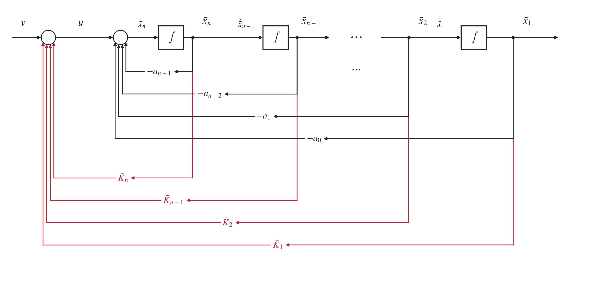
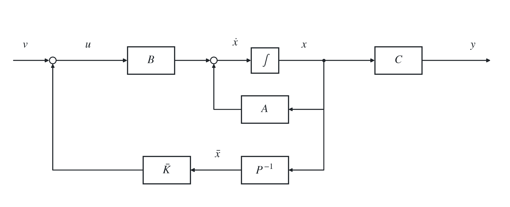
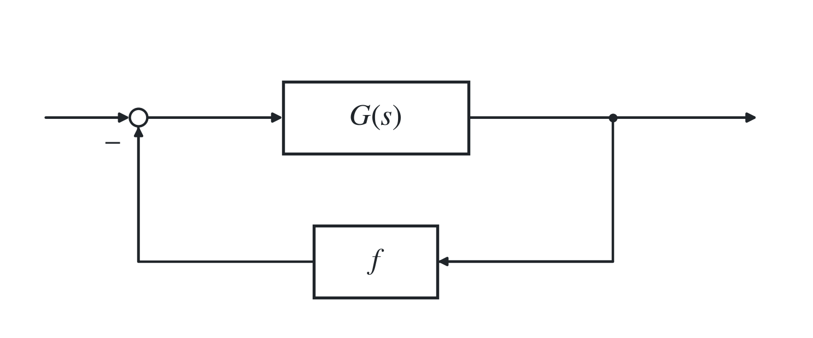
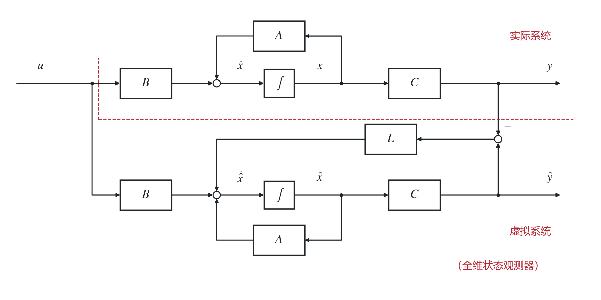
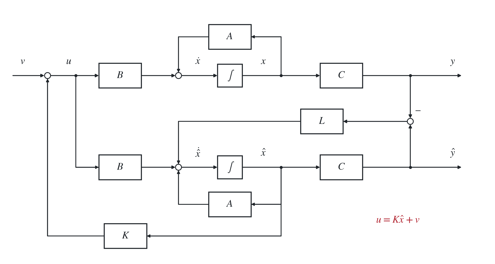

# 七、状态空间综合

## 1. 状态反馈

> 关于开环传递函数/闭环传递函数：
>
> <strong>被控对象本身的传递函数 $G(s)$，指未加入控制器、也没有反馈线的原始系统，即开环传递函数。</strong>
>
> $C(sI-A)^{-1}B$ 只是将 $(A,B,C)$ 翻译为传递函数；若 $(A,B,C)$ 是原始系统的状态空间模型，由它得到的就是开环传递函数。设计状态反馈 $u=Kx+v$ 后，由
>
> $$
> C\bigl[sI-(A+BK)\bigr]^{-1}B
> $$
>
> 得到的则是闭环传递函数。

### （1）状态反馈极点配置

#### i）给定 LTI 系统

被控对象为

$$
{\color{#c62828}\dot x=Ax+Bu.}
$$

设计状态反馈

$$
{\color{#c62828}u=Kx+v,}
$$

得到闭环系统

$$
{\color{#c62828}\dot x=(A+BK)x+Bv.}
$$

给定 LTI 系统，$A\in\mathbb R^{n\times n}$、$B\in\mathbb R^{n\times r}$。若对任意一组关于共轭封闭的复数 $s_1,\ldots,s_n$，都存在反馈增益矩阵 $K\in\mathbb R^{r\times n}$，使闭环系统矩阵 $A+BK$ 的所有特征值为 $s_1,\ldots,s_n$，则系统是能控的。

证明：反证。若不能控，则可进行能控性结构分解 $x=P\bar x$，得到 $\dot{\bar x}=\bar A\bar x+\bar Bu$：

$$
\bar A=P^{-1}AP=
\begin{bmatrix}
\bar A_c&\bar A_{12}\\
0&\bar A_{\bar c}
\end{bmatrix},
\qquad
\bar B=P^{-1}B=
\begin{bmatrix}
\bar B_c\\0
\end{bmatrix}.
$$

记 $\bar K=KP=[\bar K_1\ \bar K_2]$，则

$$
u=Kx+v=KP\bar x+v=\bar K\bar x+v.
$$

闭环系统的特征方程：

$$
\begin{aligned}
\det[sI-(A+BK)]
&=\det(sI-\bar A-P^{-1}BKP)\\
&=\det(sI-\bar A-\bar B\bar K)\\
&=\det\begin{bmatrix}
sI-\bar A_c-\bar B_c\bar K_1&-\bar A_{12}-\bar B_c\bar K_2\\
0&sI-\bar A_{\bar c}
\end{bmatrix}\\
&=\det(sI-\bar A_c-\bar B_c\bar K_1)\det(sI-\bar A_{\bar c}).
\end{aligned}
$$

可见状态反馈不能改变不能控部分的极点，即不可能配置全部极点，矛盾！□

#### ii）给定单输入 LTI 系统

给定<strong>单输入 LTI 系统</strong>，对任意一组给定的关于共轭封闭的复数 $s_1,\ldots,s_n$，都存在反馈增益矩阵 $K\in\mathbb R^{1\times n}$，使闭环系统矩阵 $A+BK$ 的所有特征值为 $s_1,\ldots,s_n$，<strong>当且仅当系统能控。</strong>

证明：必要性见 i）；充分性：若能控，作变换 $x=P\bar x$，变换为第二能控规范型：

$$
\dot{\bar x}=A_c\bar x+B_cu,\qquad A_c=P^{-1}AP,\qquad B_c=P^{-1}B.
$$

$$
A_c=
\begin{bmatrix}
0&1&&0\\
&0&\ddots&\\
&&0&1\\
-\alpha_0&-\alpha_1&\cdots&-\alpha_{n-1}
\end{bmatrix},
\qquad
B_c=\begin{bmatrix}0\\\vdots\\0\\1\end{bmatrix}.
$$

令 $\bar K=KP=[\bar K_1\ \cdots\ \bar K_n]$，$u=Kx+v=\bar K\bar x+v$。引入状态反馈后，变换后的系统矩阵为

$$
P^{-1}(A+BK)P=A_c+B_c\bar K
=\begin{bmatrix}
0&1&&0\\
&0&\ddots&\\
&&0&1\\
-\alpha_0+\bar K_1&-\alpha_1+\bar K_2&\cdots&-\alpha_{n-1}+\bar K_n
\end{bmatrix}.
$$

其特征多项式为

$$
\det[sI-(A_c+B_c\bar K)]
=s^n+(\alpha_{n-1}-\bar K_n)s^{n-1}+\cdots+(\alpha_1-\bar K_2)s+(\alpha_0-\bar K_1).
$$

其 $n$ 个系数可通过 $\bar K_1,\ldots,\bar K_n$ 任意独立配置，意味着极点可任意配置。□

能控标准型视角下的结构框图：

实际系统框图：事实上使用的物理状态为 $x$ 而不是 $\bar x$。

$\bar KP^{-1}=K$，$u=Kx+v$。分开写以体现 $\bar x$。

#### iii）状态反馈极点配置直接法

<strong>由期望的闭环极点，写出期望闭环特征多项式：</strong>

$$
{\color{#c62828}\alpha^*(s)=\prod_{i=1}^{n}(s-s_i)
=s^n+\alpha_{n-1}s^{n-1}+\cdots+\alpha_0.}
$$

由

$$
{\color{#c62828}\det(sI-A-BK)=\alpha^*(s)}
$$

<strong>比较系数即可确定 $K=[K_1\ \cdots\ K_n]$。</strong>

#### iv）状态反馈不改变能控性

<strong>若系统能控，则对任意状态反馈增益 $K$，闭环系统也是能控的。</strong>由 PBH 判据，

$$
\operatorname{rank}[sI-A-BK\ \ B]
=\operatorname{rank}\left([sI-A\ \ B]
\begin{bmatrix}I&0\\-K&I\end{bmatrix}\right)
=\operatorname{rank}[sI-A\ \ B].
$$

### （2）状态反馈镇定

对给定系统 $\dot x=Ax+Bu$，若存在状态反馈增益 $K$ 使得闭环系统 $\dot x=(A+BK)x$ 是渐近稳定的，则称原系统或矩阵对 $(A,B)$ 是<strong>可镇定的</strong>。

若系统能控，则通过状态反馈可以配置其全部极点，因此一定可镇定。若系统不能控，则不能控部分的极点无法配置；所以

$$
{\color{#c62828}\text{连续 LTI 系统可镇定}
\iff
\text{其所有不能控振型均位于左半平面}.}
$$

## 2. 输出反馈

对 SISO 系统取

$$
u=fy+v,
$$

则

$$
\dot x=(A+BfC)x+Bv.
$$

闭环传递函数为

$$
G_{cf}(s)=C(sI-A-BfC)^{-1}B.
$$

闭环特征多项式为

$$
\begin{aligned}
\alpha_f(s)
&=\det(sI-A-BfC)\\
&=\det\bigl[(sI-A)(I-(sI-A)^{-1}BfC)\bigr]\\
&=\det(sI-A)\det[I-(sI-A)^{-1}BfC]\\
&=\det(sI-A)\det[1-fC(sI-A)^{-1}B]\\
&=\det(sI-A)\bigl[1-fC(sI-A)^{-1}B\bigr].
\end{aligned}
$$

若开环传递函数为

$$
G(s)=C(sI-A)^{-1}B=\frac{\beta(s)}{\alpha(s)},
$$

则 $\det(sI-A)=\alpha(s)$ 为开环特征多项式。故

$$
\alpha_f(s)=\alpha(s)-f\beta(s),
$$

闭环特征方程为

$$
1-f\frac{\beta(s)}{\alpha(s)}=0.
$$

> 若前向通道传递函数为 $G(s)=B(s)/A(s)$，在图示反馈增益为 $f$ 的负反馈结构下，则
>
> $$
> 1+f\frac{B(s)}{A(s)}=0
> $$
>
> 为闭环系统的特征方程。
>
> 

它具有根轨迹形式。因此输出反馈只能将闭环极点配置在以 $-f$ 为增益参数的根轨迹上，不能任意配置全部极点。

## 3. 状态观测器

### （1）全维状态观测器

#### i）全维状态观测器

系统为

$$
\dot x=Ax+Bu,\quad x(0)=x_0,\qquad y=Cx,\quad t\geq0.
$$

因为在实际系统中，所有状态变量 $x$ 很难全部用传感器观测，我们能测量的往往只有 $y$。为了做状态反馈控制，我们需要用 $y$ 估计 $x$，即 $\hat x$。由于模型有偏差，我们引入 $L$ 矩阵作修正：

$$
{\color{#c62828}\dot{\hat x}=A\hat x+Bu+L(C\hat x-y)
=(A+LC)\hat x-Ly+Bu.}
$$

目的是使估计误差趋于零：

$$
{\color{#c62828}\lim_{t\to\infty}\bigl[\hat x(t)-x(t)\bigr]=0.}
$$

$A\in\mathbb R^{n\times n}$、$C\in\mathbb R^{m\times n}$。矩阵对 $(A,C)$ 或系统称为<strong>可检测的，如果存在实矩阵 $L$，使矩阵 $A+LC$ 渐近稳定。</strong>

令估计误差

$$
\tilde x=x-\hat x,
$$

则

$$
\dot{\tilde x}=\dot x-\dot{\hat x}
=A(x-\hat x)+LC(x-\hat x)=(A+LC)\tilde x.
$$

只要 $A+LC$ 是 Hurwitz 矩阵，便有 $\tilde x(t)\to0$。

#### ii）可检测性与可镇定性

LTI 系统可检测，当且仅当其对偶系统可镇定，即<strong>矩阵对 $(A,C)$ 可检测，当且仅当 $(A^T,C^T)$ 可镇定。</strong>由于 $A+LC$ 渐近稳定意味着所有特征值位于 $s$ 左半平面，可检测即为可通过 $L$ 将 $A+LC$ 所有特征值配置到 $s$ 左半平面，由对偶性原理等价于 $(A^T,C^T)$ 可镇定，所以

$$
\text{连续 LTI 系统可检测}
\iff
\text{其所有不能观振型均稳定}.
$$

#### iii）全维状态观测器的存在条件

<strong>存在矩阵 $L$ 使</strong>

$$
{\color{#c62828}\dot{\hat x}=(A+LC)\hat x-Ly+Bu}
$$

<strong>构成原系统的一个全维状态观测器，当且仅当矩阵对 $(A,C)$ 可检测。此时只需选择 $L$ 使得 $A+LC$ 渐近稳定即可。</strong>

#### iv）直接设计

<strong>直接设计：</strong>令

$$
{\color{#c62828}\det(sI-A-LC)=\prod_{i=1}^{n}(s-\lambda_i^*),}
$$

其中 $\lambda_i^*$ 为各期望特征值（极点）。

定理：<strong>可通过 $L$ 任意配置 $A+LC$ 的全部特征值，当且仅当 $(A,C)$ 能观。</strong>

（注意为全部特征值，所以条件是能观，而不是 iii）中的“可检测”！）

> 选取方法：若 $(A,C)$ 能观，则其对偶矩阵对 $(A^T,C^T)$ 能控。对任意一组期望观测器极点 $\lambda_1^*,\ldots,\lambda_n^*$，先按状态反馈极点配置方法求矩阵 $K$，使
>
> $$
> A^T+C^TK
> $$
>
> 的特征值为 $\lambda_1^*,\ldots,\lambda_n^*$；再令
>
> $$
> L=K^T.
> $$
>
> 由于
>
> $$
> A+LC=(A^T+C^TK)^T,
> $$
>
> $A+LC$ 具有相同的期望特征值。

### （2）降维状态观测器（了解）

设 $C$ 为满行秩 $m$，取 $(n-m)\times n$ 矩阵 $R$，使

$$
P=\begin{bmatrix}C\\R\end{bmatrix}
$$

非奇异。令 $x=P^{-1}\bar x$，并分块记为

$$
\bar A=PAP^{-1}
=\begin{bmatrix}
\bar A_{11}&\bar A_{12}\\
\bar A_{21}&\bar A_{22}
\end{bmatrix},
\qquad
\bar B=PB=
\begin{bmatrix}
\bar B_1\\\bar B_2
\end{bmatrix},
$$

$$
\bar C=CP^{-1}=[I_m\ 0].
$$

其中 $\bar A_{11}\in\mathbb R^{m\times m}$，$\bar B_1\in\mathbb R^{m\times r}$。矩阵对 $(\bar A_{22},\bar A_{12})$ 能观，当且仅当 $(A,C)$ 能观。

设 $(\bar A_{22},\bar A_{12})$ 能观，选取 $\bar L$，使 $\bar A_{22}+\bar L\bar A_{12}$ 渐近稳定。则

$$
\begin{cases}
\dot z=(\bar A_{22}+\bar L\bar A_{12})z\\
\qquad\quad+
\left[(\bar A_{21}+\bar L\bar A_{11})
-(\bar A_{22}+\bar L\bar A_{12})\bar L\right]y\\
\qquad\quad+(\bar B_2+\bar L\bar B_1)u,\\[4pt]
\hat{\bar x}_2=z-\bar Ly
\end{cases}
$$

构成状态分量 $\bar x_2$ 的降维观测器。对任意 $\bar x_0,z(0)$ 和 $u(t)$，均有

$$
\lim_{t\to\infty}\bigl[\hat{\bar x}_2(t)-\bar x_2(t)\bigr]=0.
$$

## 4. 基于观测器的状态反馈

当状态不可直接测量时，采用

$$
{\color{#c62828}u=K\hat x+v.}
$$

系统与观测器分别满足

$$
\dot x=Ax+Bu=Ax+BK\hat x+Bv,
$$

$$
\dot{\hat x}=A\hat x+Bu+L(C\hat x-y)
=(A+BK)\hat x+Bv+LC(\hat x-x)
=(A+LC+BK)\hat x-LCx+Bv.
$$

令

$$
z=\begin{bmatrix}x\\\hat x\end{bmatrix},
$$

则

$$
\dot z=
\begin{bmatrix}
A&BK\\
-LC&A+LC+BK
\end{bmatrix}z
+\begin{bmatrix}B\\B\end{bmatrix}v,
\qquad
y=[C\ 0]z.
$$

设 $\tilde x=x-\hat x$，进行线性变换：

$$
\bar z=P^{-1}z,\qquad
P=\begin{bmatrix}I&0\\I&-I\end{bmatrix},
\qquad P^{-1}=\begin{bmatrix}I&0\\I&-I\end{bmatrix},
\qquad
\bar z=\begin{bmatrix}x\\x-\hat x\end{bmatrix}
=\begin{bmatrix}x\\\tilde x\end{bmatrix}.
$$

得

$$
\begin{bmatrix}\dot x\\\dot{\tilde x}\end{bmatrix}
=
\begin{bmatrix}
A+BK&-BK\\
0&A+LC
\end{bmatrix}
\begin{bmatrix}x\\\tilde x\end{bmatrix}
+\begin{bmatrix}B\\0\end{bmatrix}v,
$$

$$
y=[C\ 0]
\begin{bmatrix}x\\\tilde x\end{bmatrix}.
$$

复合系统的特征多项式为

$$
\det\begin{bmatrix}sI-A-BK&BK\\0&sI-A-LC\end{bmatrix}
=\det[sI-(A+BK)]\det[sI-(A+LC)].
$$

复合系统传递函数仍为

$$
[C\quad0]\left(sI-
\begin{bmatrix}A+BK&-BK\\0&A+LC\end{bmatrix}\right)^{-1}
\begin{bmatrix}B\\0\end{bmatrix}
=C[sI-(A+BK)]^{-1}B,
$$

与<strong>状态反馈子系统</strong>相同，<strong>与观测器设计无关。</strong>

<strong>由状态反馈子系统与全维状态观测器组合而成的复合系统，其状态反馈子系统极点和观测器极点相互独立。</strong>

<strong>分离定理：若被控系统 $(A,B,C)$ 可控可观，基于状态观测器设计状态反馈时，$K$ 和 $L$ 的设计可分别独立进行，即系统极点设计和观测器设计可分别独立进行。</strong>
