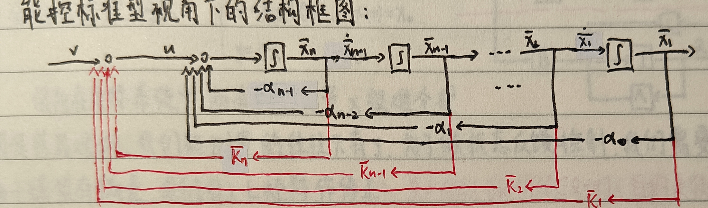
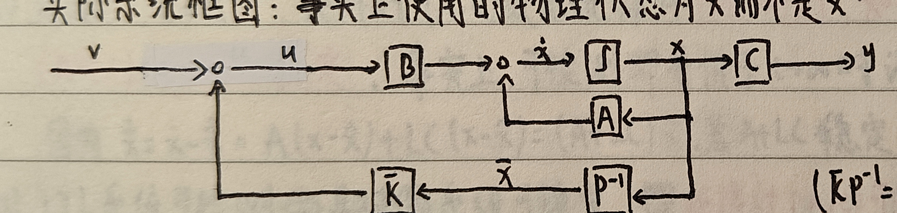
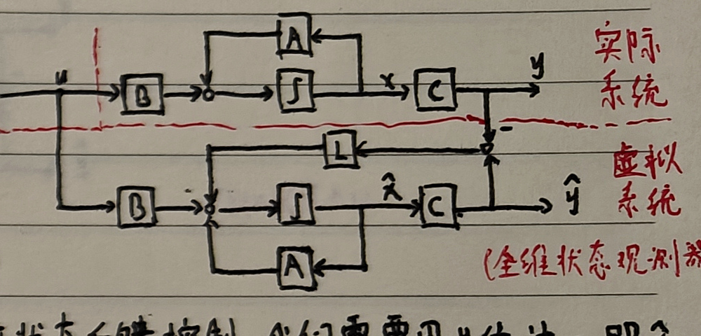
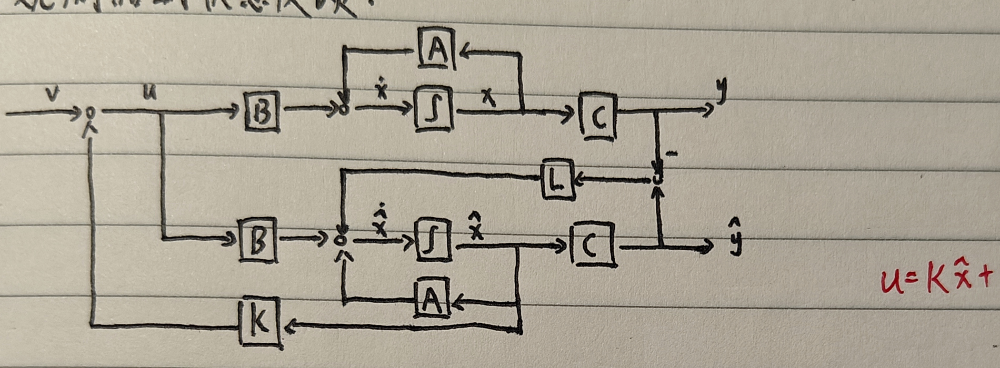

# 七、状态空间综合

## 1. 状态反馈

<strong>被控对象本身的传递函数 $G(s)$，指未加入控制器、也没有反馈线的原始系统，即开环传递函数。</strong>

$C(sI-A)^{-1}B$ 只是将 $(A,B,C)$ 翻译为传递函数；若 $(A,B,C)$ 是原始系统的状态空间模型，由它得到的就是开环传递函数。设计状态反馈 $u=Kx+v$ 后，由

$$
C\bigl[sI-(A+BK)\bigr]^{-1}B
$$

得到的则是闭环传递函数。

### （1）状态反馈极点配置

#### i）给定 LTI 系统

被控对象为

$$
\dot x=Ax+Bu.
$$

设计状态反馈

$$
u=Kx+v,
$$

得到闭环系统

$$
\dot x=(A+BK)x+Bv.
$$

对于 $n$ 维 LTI 系统，若对任意一组关于共轭封闭的复数 $s_1,\ldots,s_n$，都存在反馈增益矩阵 $K$，使 $A+BK$ 的全部特征值为 $s_1,\ldots,s_n$，则系统必能控。

反之，若系统不能控，作能控性结构分解：

$$
\bar A=P^{-1}AP=
\begin{bmatrix}
\bar A_c&\bar A_{12}\\
0&\bar A_{\bar c}
\end{bmatrix},
\qquad
\bar B=P^{-1}B=
\begin{bmatrix}
\bar B_c\\0
\end{bmatrix}.
$$

令 $\bar K=KP=[\bar K_1\ \bar K_2]$，则

$$
\det[sI-(A+BK)]
=\det[sI-(\bar A_c+\bar B_c\bar K_1)]\det(sI-\bar A_{\bar c}).
$$

可见状态反馈不能改变不能控部分的极点，因此不能任意配置全部极点。

#### ii）给定单输入 LTI 系统

对于单输入能控系统，把系统变换为能控规范型：

$$
A_c=
\begin{bmatrix}
0&1&\cdots&0\\
0&0&\cdots&0\\
\vdots&\vdots&\ddots&1\\
-a_0&-a_1&\cdots&-a_{n-1}
\end{bmatrix},
\qquad
B_c=\begin{bmatrix}0\\\vdots\\0\\1\end{bmatrix}.
$$

令 $\bar K=KP=[\bar K_1\ \cdots\ \bar K_n]$，则引入状态反馈后的特征多项式为

$$
\det[sI-(A_c+B_c\bar K)]
=s^n+(a_{n-1}-\bar K_n)s^{n-1}+\cdots+(a_1-\bar K_2)s+(a_0-\bar K_1).
$$

这 $n$ 个系数可由 $\bar K_1,\ldots,\bar K_n$ 独立配置，因此极点可任意配置。

#### iii）状态反馈极点配置直接法

直接设计法：根据期望闭环极点写出

$$
\alpha^*(s)=\prod_{i=1}^{n}(s-s_i)
=s^n+\alpha_{n-1}s^{n-1}+\cdots+\alpha_0.
$$

由

$$
\det(sI-A-BK)=\alpha^*(s)
$$

比较系数，即可确定 $K$。

#### vi）状态反馈不改变能控性

状态反馈不改变系统能控性。由 PBH 判据，

$$
\operatorname{rank}[sI-A-BK\ \ B]
=\operatorname{rank}\left([sI-A\ \ B]
\begin{bmatrix}I&0\\K&I\end{bmatrix}\right)
=\operatorname{rank}[sI-A\ \ B].
$$

### （2）状态反馈镇定

若存在状态反馈增益 $K$，使闭环矩阵 $A+BK$ 稳定，则称原系统或矩阵对 $(A,B)$ 是可镇定的。

若系统能控，则通过状态反馈可以配置其全部极点，因此一定可镇定。若系统不能控，则不能控部分的极点无法配置；所以

$$
\text{连续 LTI 系统可镇定}
\iff
\text{其所有不能控振型均位于左半平面}.
$$

若开环传递函数为 $G(s)=B(s)/A(s)$，则

$$
1+\frac{B(s)}{A(s)}=0
$$

为闭环系统的特征方程。

## 2. 输出反馈

对 SISO 系统取

$$
u=fy+v,
$$

则

$$
\dot x=(A+BfC)x+Bv.
$$

闭环特征多项式为

$$
\begin{aligned}
\alpha_f(s)
&=\det(sI-A-BfC)\\
&=\det(sI-A)\det[I-(sI-A)^{-1}BfC]\\
&=\det(sI-A)\bigl[1-fC(sI-A)^{-1}B\bigr].
\end{aligned}
$$

若开环传递函数为

$$
G(s)=C(sI-A)^{-1}B=\frac{\beta(s)}{\alpha(s)},
$$

则

$$
\alpha_f(s)=\alpha(s)-f\beta(s),
$$

闭环特征方程为

$$
1-f\frac{\beta(s)}{\alpha(s)}=0.
$$

它具有根轨迹形式。因此输出反馈只能把闭环极点配置在由 $f$ 产生的根轨迹上，不能任意配置全部极点。

## 3. 状态观测器

### （1）全维状态观测器

#### i）全维状态观测器

系统为

$$
\dot x=Ax+Bu,\qquad y=Cx.
$$

实际系统中并非所有状态变量都能由传感器测量。为了实现状态反馈，需要利用 $u,y$ 估计状态 $x$。引入矩阵 $L$ 修正模型偏差：

$$
\dot{\hat x}=A\hat x+Bu+L(C\hat x-y)
=(A+LC)\hat x-Ly+Bu.
$$

目标是

$$
\lim_{t\to\infty}\hat x(t)=\lim_{t\to\infty}x(t).
$$

令估计误差

$$
\tilde x=x-\hat x,
$$

则

$$
\dot{\tilde x}=(A+LC)\tilde x.
$$

只要 $A+LC$ 是 Hurwitz 矩阵，便有 $\tilde x(t)\to0$。

#### ii）可检测性与可镇定性

LTI 系统可检测，当且仅当其对偶系统可镇定，即矩阵对 $(A,C)$ 可检测，当且仅当 $(A^T,C^T)$ 可镇定。由于 $A+LC$ 稳定意味着可以用 $L$ 将全部不稳定特征值配置到左半平面，所以

$$
\text{连续 LTI 系统可检测}
\iff
\text{其所有不能观振型均稳定}.
$$

#### iii）全维状态观测器的存在条件

存在矩阵 $L$ 使

$$
\dot{\hat x}=(A+LC)\hat x-Ly+Bu
$$

构成全维状态观测器，当且仅当 $(A,C)$ 可检测。设计时选择 $L$，使 $A+LC$ 的极点为期望观测器极点。

若要求任意配置 $A+LC$ 的全部特征值，则必须满足 $(A,C)$ 能观。

#### vi）直接设计

直接设计时，若 $(A,C)$ 能观，则其对偶矩阵对 $(A^T,C^T)$ 能控。对任意一组期望观测器极点 $\lambda_1^*,\ldots,\lambda_n^*$，先按状态反馈极点配置方法求矩阵 $K$，使

$$
A^T+C^TK
$$

的特征值为 $\lambda_1^*,\ldots,\lambda_n^*$；再令

$$
L=K^T.
$$

由于

$$
A+LC=(A^T+C^TK)^T,
$$

$A+LC$ 具有相同的期望特征值。

### （2）降维状态观测器

设 $C$ 为满行秩 $m$，取 $(n-m)\times n$ 矩阵 $R$，使

$$
P=\begin{bmatrix}C\\R\end{bmatrix}
$$

非奇异。令 $x=P^{-1}\bar x$，并分块记为

$$
\bar A=PAP^{-1}
=\begin{bmatrix}
\bar A_{11}&\bar A_{12}\\
\bar A_{21}&\bar A_{22}
\end{bmatrix},
\qquad
\bar B=PB=
\begin{bmatrix}
\bar B_1\\\bar B_2
\end{bmatrix},
$$

$$
\bar C=CP^{-1}=[I_m\ 0].
$$

其中 $\bar A_{11}\in\mathbb R^{m\times m}$，$\bar B_1\in\mathbb R^{m\times r}$。矩阵对 $(\bar A_{22},\bar A_{12})$ 能观，当且仅当 $(A,C)$ 能观。

设 $(\bar A_{22},\bar A_{12})$ 能观，选取 $\bar L$，使 $\bar A_{22}+\bar L\bar A_{12}$ 稳定。则

$$
\begin{cases}
\dot z=(\bar A_{22}+\bar L\bar A_{12})z\\
\qquad\quad+
\left[(\bar A_{21}+\bar L\bar A_{11})
-(\bar A_{22}+\bar L\bar A_{12})\bar L\right]y\\
\qquad\quad+(\bar B_2+\bar L\bar B_1)u,\\[4pt]
\hat{\bar x}_2=z-\bar Ly
\end{cases}
$$

构成状态分量 $\bar x_2$ 的降维观测器。对任意 $\bar x_0,z(0)$ 和 $u(t)$，均有

$$
\lim_{t\to\infty}\bigl[\hat{\bar x}_2(t)-\bar x_2(t)\bigr]=0.
$$

可测的 $y=\bar x_1$ 不必重复估计，因此观测器阶数由 $n$ 降为 $n-m$。

## 4. 基于观测器的状态反馈

当状态不可直接测量时，采用

$$
u=K\hat x+v.
$$

系统与观测器分别满足

$$
\dot x=Ax+Bu=Ax+BK\hat x+Bv,
$$

$$
\dot{\hat x}=A\hat x+Bu+L(C\hat x-y)
=(A+LC+BK)\hat x-LCx+Bv.
$$

令

$$
z=\begin{bmatrix}x\\\hat x\end{bmatrix},
$$

则

$$
\dot z=
\begin{bmatrix}
A&BK\\
-LC&A+LC+BK
\end{bmatrix}z
+\begin{bmatrix}B\\B\end{bmatrix}v,
\qquad
y=[C\ 0]z.
$$

再令 $\tilde x=x-\hat x$，作线性变换，可得

$$
\begin{bmatrix}\dot x\\\dot{\tilde x}\end{bmatrix}
=
\begin{bmatrix}
A+BK&-BK\\
0&A+LC
\end{bmatrix}
\begin{bmatrix}x\\\tilde x\end{bmatrix}
+\begin{bmatrix}B\\0\end{bmatrix}v,
$$

$$
y=[C\ 0]
\begin{bmatrix}x\\\tilde x\end{bmatrix}.
$$

复合系统的特征多项式为

$$
\det[sI-(A+BK)]\det[sI-(A+LC)].
$$

复合系统传递函数仍为

$$
C[sI-(A+BK)]^{-1}B,
$$

与直接状态反馈子系统相同，与观测器设计无关。

<strong>由状态反馈子系统与全维状态观测器组合而成的复合系统，其控制器极点和观测器极点彼此独立。</strong>

分离定理：若被控系统 $(A,B,C)$ 能控且能观，则基于状态观测器设计状态反馈时，$K$ 与 $L$ 的设计可以分别独立进行，即系统极点配置与观测器设计可以分别独立进行。
