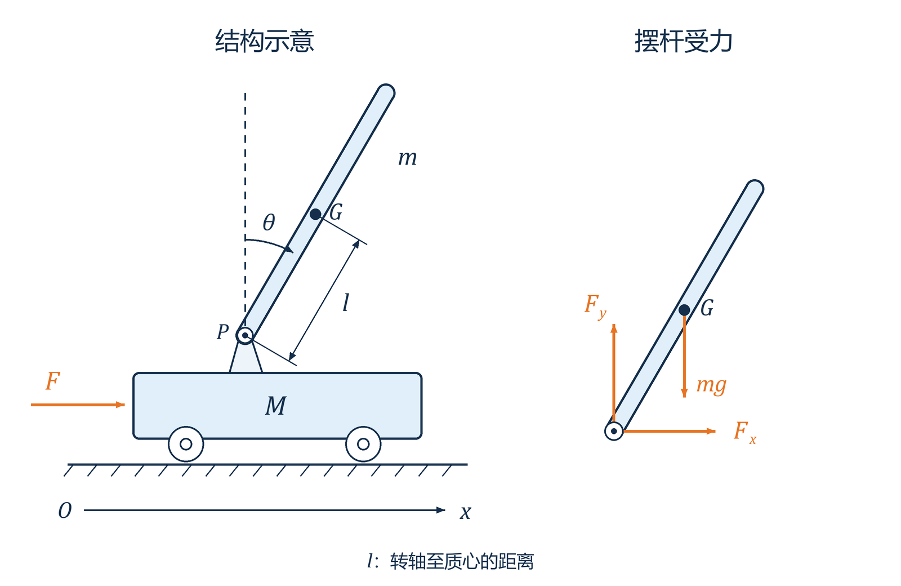

# 系统建模与仿真（六）：一级倒立摆建模与 LQR 控制

## 八、一级倒立摆的建模与 LQR 控制

### 1. 一级倒立摆建模

*图 4　一级倒立摆结构与摆杆受力。*

记：

- $M$：小车质量。
- $m$：摆杆质量。
- $b$：小车黏性摩擦系数。
- $l$：摆杆转动轴心到杆质心的长度。
- $J$：摆杆绕自身质心的转动惯量。
- $F$、$x$、$\theta$ 如图所示：$F$、$x$ 向右为正，$\theta$ 从竖直向上方向顺时针为正。

$F_x$、$F_y$ 为小车作用于摆杆的水平、竖直作用力；小车受到相反的反作用力。

则有：

① 摆杆绕质心的转动方程：

$$
J\ddot\theta=F_y l\sin\theta-F_x l\cos\theta.
$$

② 摆杆质心的水平运动：

$$
F_x=m\frac{\mathrm d^2}{\mathrm dt^2}(x+l\sin\theta).
$$

③ 摆杆质心的垂直运动：

$$
F_y-mg=m\frac{\mathrm d^2}{\mathrm dt^2}(l\cos\theta).
$$

④ 小车水平方向的运动：

$$
F-F_x-b\dot x=M\ddot x.
$$

将 $F_x$、$F_y$ 联立消去，有

$$
(M+m)\ddot x+b\dot x+ml\ddot\theta\cos\theta
-ml\dot\theta^2\sin\theta=F,
$$

$$
(J+ml^2)\ddot\theta-mgl\sin\theta=-ml\ddot x\cos\theta.
$$

在直立平衡点附近作一阶线性化：$\cos\theta\approx1$、$\sin\theta\approx\theta$，忽略二阶及以上小量。这里不将 $\dot\theta$ 直接置零。

取 $u=F$，得

$$
(M+m)\ddot x+b\dot x+ml\ddot\theta=u,
$$

$$
(J+ml^2)\ddot\theta-mgl\theta=-ml\ddot x.
$$

取状态变量

$$
\boldsymbol x=[x_1\ x_2\ x_3\ x_4]^{\mathrm T}
=[\theta\ \dot\theta\ x\ \dot x]^{\mathrm T},
\qquad\boldsymbol y=[\theta\ x]^{\mathrm T}.
$$

$$
\begin{cases}
\dot{\boldsymbol x}=A\boldsymbol x+Bu,\\
\boldsymbol y=C\boldsymbol x.
\end{cases}
$$

记

$$
D=J(M+m)+Mml^2,
$$

得

$$
A=\begin{bmatrix}
0&1&0&0\\[2pt]
\dfrac{mgl(M+m)}D&0&0&\dfrac{mlb}D\\[6pt]
0&0&0&1\\[2pt]
-\dfrac{m^2gl^2}D&0&0&-\dfrac{b(J+ml^2)}D
\end{bmatrix},
\qquad
B=\begin{bmatrix}
0\\[2pt]-\dfrac{ml}D\\[6pt]0\\[2pt]\dfrac{J+ml^2}D
\end{bmatrix},
$$

$$
C=\begin{bmatrix}1&0&0&0\\0&0&1&0\end{bmatrix}.
$$

### 2. LQR 控制

#### （1）LQ（Linear Quadratic）问题

线性系统二次型性能指标的最优控制问题，即线性系统性能指标为状态变量和／或控制变量的二次型函数的积分。

#### （2）LQR（LQ Regulator）

线性二次型调节器，对象为状态空间形式的线性系统。

特殊情况：

- 状态调节器问题：用不大的控制能量使状态 $x(t)$ 保持在 $0$ 值附近。
- 输出调节器问题：用不大的控制量使系统输出 $y(t)$ 在 $0$ 值附近。
- 跟踪问题：用不大的控制量使系统输出 $y(t)$ 紧跟 $y_r(t)$ 的变化。
