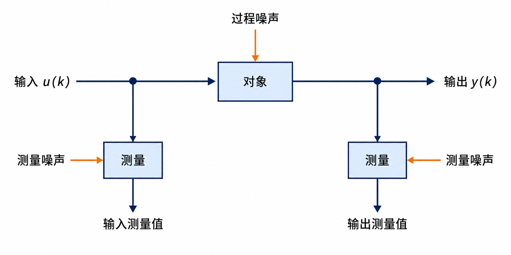
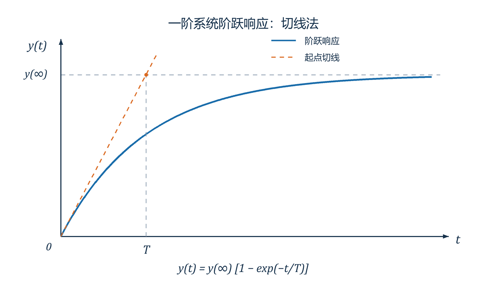
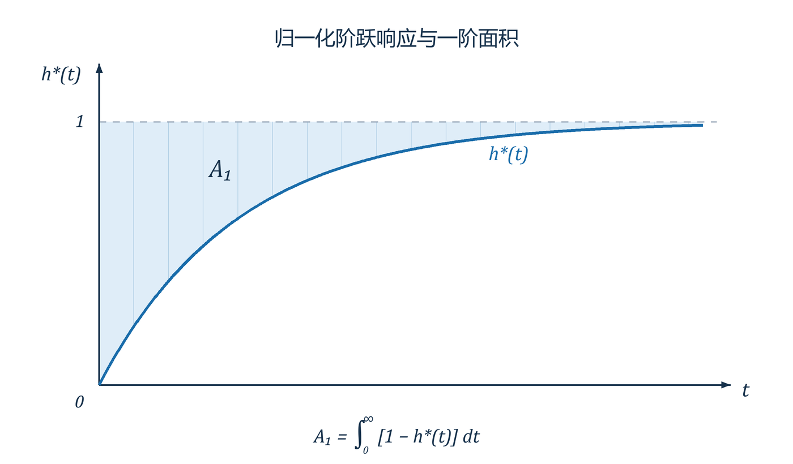

# 系统建模与仿真（二）：经典辨识

## 四、系统辨识——经典辨识

### 1. 系统辨识的定义

三个要素：数据、模型类、准则。

辨识就是按照一个准则，在一组模型类中选择一个与数据拟合最好的模型。



*图 1　系统辨识中的对象、输入输出测量及噪声。*

### 2. 系统辨识内容

1. 线性系统辨识、非线性系统辨识。
2. 集中参数／分布参数辨识。
3. 系统结构／系统参数辨识。
4. 开环系统／闭环系统辨识。
5. 离线辨识：通常允许较大的计算量，不要求实时；在线辨识：需要满足实时计算要求。精度取决于数据、模型及算法，不能仅由离线或在线决定。
6. 经典辨识：非参数，不必确定具体结构；现代辨识：参数，需假设一种模型结构。

### 3. 经典辨识法

#### （1）典型输入

脉冲输入、阶跃输入、正弦输入。

#### （2）动态特性的表示

传递函数、频率响应、脉冲响应、阶跃响应。

#### （3）经典辨识方法

脉冲响应法、相关分析法、阶跃响应法、频率响应法、谱分析法。

#### （4）系统辨识误差准则

$$
J(\theta)=\sum_{k=1}^{N}f\bigl(\varepsilon(k)\bigr)
=\sum_{k=1}^{N}\varepsilon^2(k),
$$

使用输出误差 $\varepsilon(k)=y(k)-y_m(k)$。

### 4. 随机过程

#### （1）基本概念

大量样本 $x_1(t),x_2(t),\ldots$ 所构成的总体，具有统计意义上的规律性。

一维概率密度 $p_1(x,t)$；二维概率密度 $p_2(x_1,x_2;t_1,t_2)$；……

与 $p_1(x,t)$ 有关：

均值：

$$
\mu_x(t)=E[x(t)]=\int_{-\infty}^{\infty}x p_1(x,t)\,\mathrm dx.
$$

方差：

$$
\sigma_x^2(t)=E\bigl[(x(t)-\mu_x(t))^2\bigr]
=\int_{-\infty}^{\infty}(x-\mu_x(t))^2p_1(x,t)\,\mathrm dx.
$$

与 $p_2(x_1,x_2;t_1,t_2)$ 有关（同一过程、不同时刻）：

自相关函数：

$$
R_x(t_1,t_2)=E[x(t_1)x(t_2)]
=\int_{-\infty}^{\infty}\int_{-\infty}^{\infty}
x_1x_2p_2(x_1,x_2;t_1,t_2)\,\mathrm dx_1\mathrm dx_2.
$$

协方差函数：

$$
\begin{aligned}
C_x(t_1,t_2)
&=E\bigl[(x(t_1)-\mu_x(t_1))(x(t_2)-\mu_x(t_2))\bigr]\\
&=\int_{-\infty}^{\infty}\int_{-\infty}^{\infty}
(x_1-\mu_x(t_1))(x_2-\mu_x(t_2))
p_2(x_1,x_2;t_1,t_2)\,\mathrm dx_1\mathrm dx_2.
\end{aligned}
$$

若为不同随机过程，则为互相关函数、互协方差函数。

#### （2）平稳随机过程

这里指宽平稳随机过程：均值不随时间改变，自相关函数只与时间间隔有关。

不同时刻：

$$
\mu_x(t_1)=\mu_x(t_2)=\cdots=\mu_x.
$$

相等间隔 $t_2-t_1=t_4-t_3=\tau$，有

$$
R_x(t_1,t_2)=R_x(t_3,t_4)=\cdots=R_x(\tau).
$$

#### （3）各态遍历性

$\mu_x(t)$、$R_x(t_1,t_2)$ 为集合平均值，为固定时刻取多个传感器数据平均。

定义时间平均值：

$$
\bar x=\lim_{T\to\infty}\frac{1}{2T}\int_{-T}^{T}x_i(t)\,\mathrm dt,
$$

$$
\overline{x(t)x(t+\tau)}
=\lim_{T\to\infty}\frac{1}{2T}\int_{-T}^{T}x_i(t)x_i(t+\tau)\,\mathrm dt.
$$

满足 $\bar x=\mu_x$、$\overline{x(t)x(t+\tau)}=R_x(\tau)$ 的平稳随机过程，具有均值和相关函数的各态遍历性。

只用持续观测一个传感器便可得到相应统计性质。

$$
\mu_x=\bar x\approx\frac1N\sum_{k=1}^{N}x(k),
\qquad
R_x(\tau)\approx\frac{1}{N-\tau}\sum_{k=1}^{N-\tau}x(k)x(k+\tau).
$$

这里离散序列的滞后 $\tau$ 为满足 $0\leq\tau<N$ 的整数。

#### （4）两个互相关的随机过程

对 $x(t)$、$y(t)$，定义互相关函数：

$$
R_{xy}(\tau)=E[x(t)y(t+\tau)].
$$

互协方差函数：

$$
\begin{aligned}
C_{xy}(\tau)
&=\operatorname{Cov}(x(t),y(t+\tau))\\
&=E[(x(t)-\mu_x)(y(t+\tau)-\mu_y)]\\
&=R_{xy}(\tau)-\mu_x\mu_y.
\end{aligned}
$$

若对所有 $\tau$ 均有 $C_{xy}(\tau)=0$，则称 $x(t)$、$y(t)$ 互不相关。

### 5. 白噪声及其产生方法

#### （1）白噪声

白噪声是由一系列不相关的随机变量组成的一种理想化平稳随机过程。

若连续时间随机过程 $w(t)$ 满足

$$
\mu_w=0,\qquad R_w(\tau)=\sigma^2\delta(\tau),
\qquad\int_{-\infty}^{\infty}\delta(\tau)\,\mathrm d\tau=1,
$$

则 $w(t)$ 为零均值白噪声过程。$\delta$ 为 Dirac 冲激，$\sigma^2$ 在这里表示噪声强度。

$w(t)$ 均值为 $0$，自相关函数为脉冲，功率谱密度为

$$
S_w(\omega)=\mathcal F[R_w]=\sigma^2.
$$

#### （2）白噪声序列的产生方法

伪随机数：计算机按照一定算法模拟产生的，结果确定、可预测。

常用乘同余法：

① 先产生正整数序列：

$$
x_i=Ax_{i-1}\pmod M,\qquad i=1,2,3,\ldots
$$

其中 $A$、$M$ 自己选定。对 $M=2^k$、$k\geq3$，若 $A\equiv3\pmod8$ 或 $A\equiv5\pmod8$，并令 $x_0$ 为正奇数，如 $x_0=1$，则可达到最大周期 $2^{k-2}$。

② 若产生 $[0,1)$ 上的近似均匀分布序列，令

$$
u_i=\frac{x_i}{M}.
$$

若产生 $[-1,1)$ 上的近似均匀分布序列，令

$$
v_i=2(u_i-0.5).
$$

生成 $[-1,1)$ 的伪白噪声序列：

```matlab
A = 5; x0 = 1; M = 256; f = 2; N = 100;
for k = 1:N
    x2 = A * x0;
    x1 = mod(x2, M);
    v1 = x1 / M;           % 归一化到 [0,1)
    v(1,k) = (v1-0.5)*f;   % 变换至 [-1,1)
    x0 = x1;
end
```

#### （3）生成正态分布的随机数

正态分布函数的反函数没有初等函数形式，但可以数值计算，因而可以使用数值逆变换法。

统计近似抽样法：利用中心极限定理，生成 $(0,1)$ 均匀分布的独立序列后求和。

$$
x_i\sim U(0,1),\quad i=1,2,\ldots,n,\qquad
\bar x=\frac1n\sum_{i=1}^{n}x_i.
$$

$$
\mu=E[x_i]=\frac12,\qquad
\sigma^2=E[x_i^2]-(E[x_i])^2=\frac1{12}.
$$

当 $n$ 足够大时，

$$
\bar x\approx N\left(\mu,\frac{\sigma^2}{n}\right),
\qquad\frac{\bar x-\mu}{\sigma}\sqrt n\approx N(0,1).
$$

### 6. 相关分析法求取系统的脉冲响应

#### （1）维纳—霍夫方程

对 SISO 系统 $x(t)\longrightarrow G(s)\longrightarrow y(t)$，$g(\tau)$ 为待求的脉冲响应函数。

由

$$
y(t)=\int_0^\infty g(\sigma)x(t-\sigma)\,\mathrm d\sigma,
$$

设 $x(t)$ 为 $\mu_x=0$ 的平稳随机过程，系统稳定，则 $y(t)$ 也为 $\mu_y=0$ 的平稳随机过程。

选时刻 $t_2$，有

$$
y(t_2)=\int_0^\infty g(\sigma)x(t_2-\sigma)\,\mathrm d\sigma.
$$

再选一时刻 $t_1$，有

$$
x(t_1)y(t_2)=\int_0^\infty g(\sigma)x(t_1)x(t_2-\sigma)\,\mathrm d\sigma.
$$

让 $\tau=t_2-t_1$，取期望，有

$$
E[x(t_1)y(t_2)]
=\int_0^\infty g(\sigma)E[x(t_1)x(t_2-\sigma)]\,\mathrm d\sigma.
$$

即

$$
R_{xy}(\tau)=\int_0^\infty g(\sigma)R_x(\tau-\sigma)\,\mathrm d\sigma,
$$

即维纳—霍夫方程。

当功率谱密度为有理函数时，可借助谱分解等方法求解；一般情形也可用数值方法求解，并非只有有理谱才可解。

如 $x(t)$ 为白噪声时：

$$
R_x(\tau-\sigma)=K\delta(\tau-\sigma)
\ \Longrightarrow\ R_{xy}(\tau)=Kg(\tau)
\ \Longrightarrow\ g(\tau)=\frac{R_{xy}(\tau)}{K}.
$$

在各态遍历条件下，若 $T_m$ 足够大，有

$$
R_{xy}(\tau)\approx\frac1{T_m}\int_0^{T_m}x(t)y(t+\tau)\,\mathrm dt.
$$

若 $x$、$y$ 为数据序列，则

$$
\hat R_{xy}(\tau)=\frac1N\sum_{i=0}^{N-1}x_i y_{i+\tau}.
$$

这里需有相应的 $N$ 对样本；周期数据的下标按周期延拓。

#### （2）M 序列的产生及其性质

① 实际工程上常用 M 序列来代替白噪声输入信号，其自相关函数接近脉冲函数。

最长线性移位寄存器序列（M 序列）易于实现，为二进制伪随机码序列。

② 由 $r$ 级线性反馈移位寄存器生成，周期 $N_p=2^r-1$。

初始寄存器不全为 $0$，反馈逻辑可适当选择。例如：

$r=4$，$\mathrm{rg}=[1\ 1\ 1\ 1]$；第 $3$、$4$ 位反馈：$\mathrm{rg}(3)$、$\mathrm{rg}(4)$ 异或得到 $\mathrm{fb}$，设定 $\mathrm{out}=\mathrm{rg}(4)$。

$$
\mathrm{rg}=[\mathrm{fb},\mathrm{rg}(1\!:\!3)],
\qquad M=[M,\mathrm{out}].
$$

反复操作 $N_p$ 次，得到 $M=[1\ 1\ 1\ 1\ 0\ 0\ 0\ 1\ 0\ 0\ \cdots]$。

③ 性质：

- 周期 $N_p$。
- $0$ 的个数为 $(N_p-1)/2$，$1$ 的个数为 $(N_p+1)/2$。
- 游程特性：游程是连续相同码段。对 $1\leq n\leq r-2$，长度为 $n$ 的游程占总游程数的 $2^{-n}$，有 $2^{r-n-1}$ 个；另有一个长度为 $r-1$ 的 $0$ 游程、一个长度为 $r$ 的 $1$ 游程。

将二进制序列映射为幅值 $\pm a$ 后，周期自相关函数为

$$
R_M(k)=
\begin{cases}
a^2,&k=0,\pm N_p,\pm2N_p,\ldots,\\
-a^2/N_p,&\text{其他整数滞后}.
\end{cases}
$$

一个周期内可写为

$$
R_M(k)=
\begin{cases}
a^2,&k=0,\\
-a^2/N_p,&1\leq k\leq N_p-1.
\end{cases}
$$

移位相加特性：M 序列与其非零循环移位后的序列相加（模 $2$）后，仍为其某一循环移位序列。

#### （3）用 M 序列辨识线性系统的脉冲响应函数

连续维纳—霍夫方程：

$$
R_{xy}(\tau)=\int_0^\infty g(\sigma)R_x(\tau-\sigma)\,\mathrm d\sigma.
$$

$\tau\to\mu\Delta$、$\sigma\to k\Delta$，$\Delta$ 为时间离散精度。截断尾部响应后，离散近似为

$$
R_{xy}(\mu\Delta)\approx
\sum_{k=0}^{N_p-1}\Delta\,g(k\Delta)R_x(\mu\Delta-k\Delta).
$$

记 $R_{xy}(\mu)=R_{xy}(\mu\Delta)$（下式中函数自变量略去 $\Delta$），

$$
\boldsymbol R_{xy}=
\begin{bmatrix}R_{xy}(0)\\\vdots\\R_{xy}(N_p-1)\end{bmatrix},
\qquad
\boldsymbol g=\begin{bmatrix}g(0)\\\vdots\\g(N_p-1)\end{bmatrix},
$$

$$
R=\begin{bmatrix}
R_x(0)&R_x(-1)&\cdots&R_x(-N_p+1)\\
R_x(1)&R_x(0)&\cdots&R_x(-N_p+2)\\
\vdots&\vdots&\ddots&\vdots\\
R_x(N_p-1)&R_x(N_p-2)&\cdots&R_x(0)
\end{bmatrix}.
$$

则有

$$
\boldsymbol R_{xy}=\Delta R\boldsymbol g
\quad\Longrightarrow\quad
\boldsymbol g=\frac1\Delta R^{-1}\boldsymbol R_{xy}.\tag{1}
$$

当输入 M 序列时，有

$$
R_x(k)=\begin{cases}a^2,&k=0,\\-a^2/N_p,&1\leq k\leq N_p-1.\end{cases}
$$

解得

$$
\frac{R^{-1}}{\Delta}
=\frac{N_p}{a^2(N_p+1)\Delta}
\begin{bmatrix}
2&1&\cdots&1\\
1&2&\cdots&1\\
\vdots&\vdots&\ddots&\vdots\\
1&1&\cdots&2
\end{bmatrix}.\tag{2}
$$

实际中输入 $r$ 个周期的 M 序列，长度 $rN_p$。利用时间平均，有

$$
\hat R_{xy}(\mu)=\frac1{rN_p}\bigl[
x(-\mu)y(0)+x(1-\mu)y(1)+\cdots+
x(rN_p-1-\mu)y(rN_p-1)\bigr].
$$

这里 $r$ 表示重复周期数，与寄存器级数的记号按上下文区分。

记

$$
X=\begin{bmatrix}
x(0)&x(1)&\cdots&x(rN_p-1)\\
x(-1)&x(0)&\cdots&x(rN_p-2)\\
\vdots&\vdots&\ddots&\vdots\\
x(-N_p+1)&x(-N_p+2)&\cdots&x(rN_p-N_p)
\end{bmatrix},
\qquad
Y=\begin{bmatrix}y(0)\\y(1)\\\vdots\\y(rN_p-1)\end{bmatrix}.
$$

则有

$$
\hat{\boldsymbol R}_{xy}=\frac1{rN_p}XY.\tag{3}
$$

将式 $(2)$、$(3)$ 代入式 $(1)$，得

$$
\hat{\boldsymbol g}
=\frac1{a^2r(N_p+1)\Delta}
\begin{bmatrix}
2&1&\cdots&1\\1&2&\cdots&1\\
\vdots&\vdots&\ddots&\vdots\\1&1&\cdots&2
\end{bmatrix}XY.
$$

进一步，由

$$
\begin{bmatrix}2&1&\cdots&1\\1&2&\cdots&1\\\vdots&\vdots&\ddots&\vdots\\1&1&\cdots&2\end{bmatrix}
=I+\begin{bmatrix}1&1&\cdots&1\\1&1&\cdots&1\\\vdots&\vdots&\ddots&\vdots\\1&1&\cdots&1\end{bmatrix},
$$

可将式 $(1)$ 写作

$$
g(k)=\frac{N_p}{a^2(N_p+1)\Delta}\bigl(R_{xy}(k)+c\bigr),\tag{4}
$$

其中 $c=\sum_{k=0}^{N_p-1}R_{xy}(k)$。

若为稳定系统，且周期长度足以使 $g(N_p-1)\approx0$，代入式 $(4)$ 得

$$
c\approx-R_{xy}(N_p-1).
$$

#### （4）用脉冲响应求取传递函数

假设传递函数

$$
G(s)=K\frac{b_ms^m+\cdots+b_1s+1}{a_ns^n+\cdots+a_1s+1},
$$

化为微分方程：

$$
a_ng^{(n)}(t)+\cdots+a_1g'(t)+g(t)
=K\bigl(b_m\delta^{(m)}(t)+\cdots+b_1\delta'(t)+\delta(t)\bigr).
$$

$t>0$ 时，$\delta^{(m)}(t)=\cdots=\delta(t)=0$。

可用差分近似导数，由采样数据估计微分方程的系数 $a_1,\ldots,a_n$。连续时间导数不能直接换成同阶延时样本。

另一种写法是先拟合离散递推关系

$$
g(k)+\alpha_1g(k-1)+\cdots+\alpha_ng(k-n)=0,
$$

求离散极点 $z_i$，再按采样周期 $\Delta$ 换算连续极点 $s_i=\log(z_i)/\Delta$（需结合采样和频率范围选择对数分支）。

得极点 $s_1,\ldots,s_n$。在互异极点情形，记

$$
g(t)=\sum_{i=1}^{n}c_i e^{s_it},
$$

利用 $g(t_1),\ldots,g(t_m)$ 可解出 $c_1,\ldots,c_n$，得 $g(t)$。重极点需使用 $t^je^{s_it}$ 项。

离散系统方法类似。

### 7. 阶跃响应法

一种常用的非参数模型辨识方法。

测取过程的阶跃响应，由阶跃响应求过程的传递函数。

常用方法：近似法、切线法、两点法、面积法、半对数法等。

#### （1）阶跃响应曲线的实验测定

输入阶跃信号一般取正常输入信号的 $5\%\sim15\%$，输入前对象须处于平衡工况。

也可使用矩形脉冲输入，转换为阶跃响应曲线。

宽为 $a$ 的矩形脉冲

$$
x(t)=x_1(t)-x_1(t-a),
$$

输出响应为 $y^*(t)=y(t)-y(t-a)$，可得阶跃响应为

$$
y(t)=y^*(t)+y(t-a).
$$

#### （2）近似法

以一阶系统为例：

$$
G(s)=\frac{K}{Ts+1}.
$$

$y(t)\approx0.63y(\infty)$ 对应的 $t$ 即时间常数 $T$。

单位阶跃输入时，

$$
y(t)=K(1-e^{-t/T}).
$$

输入阶跃量为 $x_0$，则 $K=y(\infty)/x_0$。

#### （3）切线法

以 $G(s)=K/(Ts+1)$ 为例，有

$$
Ty'(t)+y(t)=Ku(t).
$$

取 $t\to\infty$，有

$$
Ku(\infty)=Kx_0=Ty'(\infty)+y(\infty)=y(\infty),
$$

故 $K=y(\infty)/x_0$。

取 $t=0^+$，在零初始条件下，有

$$
Ty'(0^+)+y(0^+)=Ty'(0^+)=Ku(0^+)=y(\infty),
$$

故 $y'(0^+)=y(\infty)/T$。

作 $t=0^+$ 处切线，与 $y(\infty)$ 交点横坐标为 $T$。



*图 2　一阶系统阶跃响应的切线法。*

若以加滞后环节的

$$
G(s)=\frac{K}{1+Ts}e^{-\tau s}
$$

为例，则在响应开始点 $t=\tau^+$ 处作切线；对于高阶 S 形响应的一阶惯性加纯滞后近似，则在拐点处作切线。

#### （4）两点法

以 $G(s)=Ke^{-\tau s}/(1+Ts)$ 为例，单位阶跃输入下，在 $t\geq\tau$ 时，

$$
y(t)=K\left(1-e^{-(t-\tau)/T}\right).
$$

得

$$
-\frac{t-\tau}{T}=\ln\left(1-\frac{y(t)}K\right)\triangleq M,
$$

则有 $MT-\tau=-t$。在响应曲线上取两点 $t_1,t_2$，解方程即可。

#### （5）面积法

实际应用时先求 $M_i$，再用 $M_i$ 来求 $A_i$。

① 对

$$
G(s)=K\frac{b_ms^m+\cdots+b_1s+1}{a_ns^n+\cdots+a_1s+1},
$$

定义

$$
P(s)=\frac{a_ns^n+\cdots+a_1s+1}{b_ms^m+\cdots+b_1s+1}
=1+\sum_{i=1}^{\infty}c_is^i,
$$

则 $G(s)=K/P(s)$。

$$
1+\sum_{i=1}^{n}a_is^i
=\left(1+\sum_{i=1}^{\infty}c_is^i\right)
\left(1+\sum_{i=1}^{m}b_is^i\right).
$$

得

$$
a_1=c_1+b_1,\qquad a_2=c_2+b_2+b_1c_1,\qquad\cdots,
$$

$$
a_i=c_i+b_i+\sum_{j=1}^{i-1}b_jc_{i-j}.\tag{5}
$$

$i=1,2,\ldots,n+m$；当 $i>n$ 时 $a_i=0$，当 $i>m$ 时 $b_i=0$。

② 计算一阶面积 $A_1$。

定义 $h^*(t)=h(t)/h(\infty)$ 用于归一化，则 $A_1$ 表示的面积为：



*图 3　归一化阶跃响应与一阶面积 $A_1$。*

输入单位阶跃时，$h(\infty)=K$，有

$$
h^*(t)=\frac{h(t)}K,\qquad
\mathcal L[h^*(t)]=\frac1K\frac{K}{sP(s)}=\frac1{sP(s)}.
$$

引理 1：记 $f(t)=\int_0^t p(u)\,\mathrm du$，则

$$
\mathcal L[f'(t)]=sF(s)-f(0)=sF(s).
$$

在积分收敛且终值定理适用时，有

$$
\int_0^\infty p(u)\,\mathrm du
=\lim_{t\to\infty}f(t)
=\lim_{s\to0}sF(s)
=\lim_{s\to0}\mathcal L[f'(t)]
=\lim_{s\to0}\mathcal L[p(t)].
$$

故

$$
\begin{aligned}
A_1&=\int_0^\infty(1-h^*(t))\,\mathrm dt\\
&=\lim_{s\to0}\mathcal L[1-h^*(t)]\\
&=\lim_{s\to0}\frac{\sum_{i=1}^{\infty}c_is^{i-1}}
{1+\sum_{i=1}^{\infty}c_is^i}=c_1.
\end{aligned}
$$

再令

$$
\mathcal L[h_1^*(t)]=\frac1{s(1+c_1s)}
\quad\Longrightarrow\quad h_1^*(t)=1-e^{-t/c_1}.
$$

③ 计算二阶面积 $A_2$。在所需积分收敛时，定义

$$
A_2=\int_0^\infty\int_0^t(h_1^*(u)-h^*(u))\,\mathrm du\,\mathrm dt
=\lim_{s\to0}\mathcal L\left[\int_0^t(h_1^*(u)-h^*(u))\,\mathrm du\right].
$$

引理 2：

$$
I=\int_0^\infty e^{-st}\left(\int_0^t f(u)\,\mathrm du\right)\mathrm dt.
$$

记 $v=\int_0^t f(u)\,\mathrm du$，则 $\mathrm dv=f(t)\,\mathrm dt$；记 $\mathrm dw=e^{-st}\,\mathrm dt$，则 $w=-e^{-st}/s$。

由分部积分 $\int v\,\mathrm dw=vw-\int w\,\mathrm dv$，即

$$
I=\left[-\frac1s e^{-st}\int_0^t f(u)\,\mathrm du\right]_0^\infty
+\frac1s\int_0^\infty e^{-st}f(t)\,\mathrm dt.
$$

由引理 2 及 $h_1^*(\infty)=h^*(\infty)=1$，有

$$
\begin{aligned}
A_2&=\lim_{s\to0}\frac{\mathcal L[h_1^*(t)]-\mathcal L[h^*(t)]}{s}\\
&=\lim_{s\to0}\frac{\sum_{i=2}^{\infty}c_is^{i-2}}
{(1+c_1s)\left(1+\sum_{i=1}^{\infty}c_is^i\right)}=c_2.
\end{aligned}
$$

④ 依次递推，令

$$
\mathcal L[h_{i-1}^*(t)]
=\frac1{s(1+c_1s+\cdots+c_{i-1}s^{i-1})},
$$

相应高阶面积满足 $A_i=c_i$；其时域积分表示须以收敛为前提。

代回式 $(5)$，有

$$
\begin{bmatrix}b_1\\b_2\\\vdots\\b_m\end{bmatrix}
=-\begin{bmatrix}
A_n&A_{n-1}&\cdots&A_{n-m+1}\\
A_{n+1}&A_n&\cdots&A_{n-m+2}\\
\vdots&\vdots&\ddots&\vdots\\
A_{n+m-1}&A_{n+m-2}&\cdots&A_n
\end{bmatrix}^{-1}
\begin{bmatrix}A_{n+1}\\A_{n+2}\\\vdots\\A_{n+m}\end{bmatrix}.
$$

在上式矩阵可逆时求得 $b_i$，再有

$$
\begin{bmatrix}a_1\\a_2\\\vdots\\a_n\end{bmatrix}
=\begin{bmatrix}
1&0&\cdots&0\\
A_1&1&\cdots&0\\
\vdots&\vdots&\ddots&\vdots\\
A_{n-1}&A_{n-2}&\cdots&1
\end{bmatrix}
\begin{bmatrix}b_1\\\vdots\\b_m\\0\\\vdots\\0\end{bmatrix}
+\begin{bmatrix}A_1\\A_2\\\vdots\\A_n\end{bmatrix}.
$$

这里 $m\leq n$，$b$ 向量补零至 $n$ 维。关键在于计算 $A_i$。

⑤ 定义 $M_i$。

由

$$
e^{-st}=1+\frac{s}{1!}(-t)+\frac{s^2}{2!}(-t)^2+\cdots,
$$

有

$$
\mathcal L[1-h^*(t)]
=\int_0^\infty(1-h^*(t))e^{-st}\,\mathrm dt
\triangleq\sum_{i=0}^{\infty}M_is^i,
$$

其中

$$
M_i=\int_0^\infty(1-h^*(t))\frac{(-t)^i}{i!}\,\mathrm dt.
$$

又

$$
\mathcal L[1-h^*(t)]=\frac1s-\frac1{sP(s)}
=\frac{\sum_{i=1}^{\infty}c_is^{i-1}}{1+\sum_{i=1}^{\infty}c_is^i}.
$$

得

$$
\frac{\sum_{i=1}^{\infty}A_is^{i-1}}{1+\sum_{i=1}^{\infty}A_is^i}
=\sum_{i=0}^{\infty}M_is^i,
$$

因此

$$
A_1=M_0,\quad A_2=M_1+A_1M_0,\quad\ldots,
\quad A_i=M_{i-1}+\sum_{j=0}^{i-2}A_{i-j-1}M_j.
$$

代入 $M_i$ 表达式整理得

$$
A_i=\int_0^\infty(1-h^*(t))\frac{(-t)^{i-1}}{(i-1)!}\,\mathrm dt
+\sum_{k=1}^{i-1}A_{i-k}\int_0^\infty(1-h^*(t))\frac{(-t)^{k-1}}{(k-1)!}\,\mathrm dt.
$$
