# 一、控制系统的数学模型

## 1. 性质不同的系统

线性定常系统：常系数线性常微分方程；传递函数、脉冲响应（FIR、IIR）、状态空间。

线性时变系统：变系数线性常微分方程。

非线性系统：非线性常微分方程。

分布参数系统：偏微分方程。

离散系统：差分方程。

## 2. 线性控制系统描述方法

- 输入输出模型：不反映系统内部信息。

- 状态空间模型。

输入输出模型：时域模型——微分方程；复数域模型——传递函数；图示模型——方框图、信号流图。

建模方法：机理分析法、试验法、综合法。

## 3. <strong>时域模型：微分方程</strong>

### （1）牛顿第二定律

$$
\sum F=m\ddot{x}.
$$

牛顿转动定律：

$$
\sum T=J\ddot{\theta}.
$$

其中

$$
\ddot{x}=\frac{\mathrm{d}^2x}{\mathrm{d}t^2},
\qquad
\ddot{\theta}=\frac{\mathrm{d}^2\theta}{\mathrm{d}t^2}.
$$

$T$ 为力矩，$J$ 为转动惯量，$\theta$ 为角位移。

### （2）摩擦力

$$
{\color{#c62828} F_c=F_B+F_f=f\dot{x}+F_f.}
$$

$F_B$ 为粘性摩擦力，$f$ 为粘性阻尼系数，$F_f$ 为恒值（库仑）摩擦力。

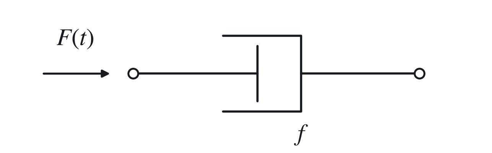

### （3）摩擦力矩

$$
{\color{#c62828} T_c=T_B+T_f=K_c\dot{\theta}+T_f.}
$$

$T_B$ 为粘性摩擦力矩，$K_c$ 为粘性阻尼系数，$T_f$ 为恒值摩擦力矩。

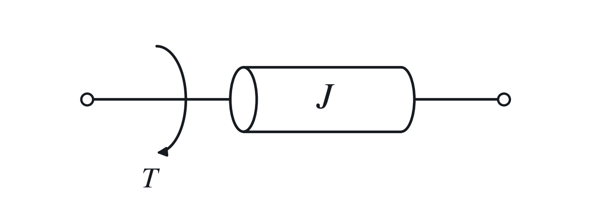

### （4）电容、电感

电容：

$$
i_C=C\frac{\mathrm{d}u_C}{\mathrm{d}t}.
$$

电感：

$$
u_L=L\frac{\mathrm{d}i_L}{\mathrm{d}t}.
$$

## 4. <strong>Laplace 变换</strong>

$$
F(s)=\mathcal{L}\{f(t)\}
\triangleq {\color{#c62828}\int_{0^-}^{\infty}f(t)e^{-st}\,\mathrm{d}t},
\qquad s=\sigma+j\omega.
$$

逆变换：

$$
f(t)=\mathcal{L}^{-1}\{F(s)\}
={\color{#c62828}\frac{1}{2\pi j}
\int_{\sigma-j\infty}^{\sigma+j\infty}F(s)e^{st}\,\mathrm{d}s}.
$$

### 性质

（1）线性性质。

（2）延时性质：

$$
\mathcal{L}\{f(t-\tau)u(t-\tau)\}=e^{-s\tau}F(s),
\qquad \tau\geq0.
$$

（3）

$$
\mathcal{L}\{f(at)\}=\frac{1}{a}F\!\left(\frac{s}{a}\right),
\qquad a>0.
$$

（4）

$$
\mathcal{L}\{e^{-at}f(t)\}=F(s+a).
$$

（5）<strong>微分性质：</strong>

$$
{\color{#c62828}
\mathcal{L}\!\left\{\frac{\mathrm{d}^nf(t)}{\mathrm{d}t^n}\right\}
=s^nF(s)-s^{n-1}f(0^-)-\cdots-f^{(n-1)}(0^-).
}
$$

（6）<strong>积分性质：</strong>

$$
{\color{#c62828}
\mathcal{L}\!\left\{\int_0^t f(\xi)\,\mathrm{d}\xi\right\}
=\frac{F(s)}{s}.
}
$$

（7）卷积性质：

$$
\mathcal{L}\{f_1(t)*f_2(t)\}=F_1(s)F_2(s),
$$

$$
\mathcal{L}\{f_1(t)f_2(t)\}
=\frac{1}{2\pi j}(F_1*F_2)(s).
$$

第二式的卷积为沿满足收敛条件的竖直积分路径计算的复频域卷积。

（8）

$$
\mathcal{L}\{tf(t)\}=-\frac{\mathrm{d}F(s)}{\mathrm{d}s}.
$$

（9）<strong>初值定理：</strong>

$$
{\color{#c62828}\lim_{t\to0^+}f(t)=\lim_{s\to+\infty}sF(s).}
$$

适用于**初值有限、原点不含冲激项**且满足相应变换条件的函数。

<strong>终值定理：</strong>

$$
{\color{#c62828}\lim_{t\to\infty}f(t)=\lim_{s\to0}sF(s).}
$$

条件：对于有理函数 $F(s)$，除原点允许有单极点外，其余极点均位于左半平面，即 $sF(s)$ 的所有极点均位于左半平面。

### 变换对

$$
\mathcal{L}\{1\}=\frac{1}{s},
\qquad
\mathcal{L}\{e^{-at}\}=\frac{1}{s+a},
$$

$$
{\color{#c62828}\mathcal{L}\{\sin\omega t\}=\frac{\omega}{s^2+\omega^2}},
\qquad
{\color{#c62828}\mathcal{L}\{\cos\omega t\}=\frac{s}{s^2+\omega^2}},
$$

$$
\mathcal{L}\{t^n\}=\frac{n!}{s^{n+1}},
\qquad
{\color{#c62828}\mathcal{L}\{\delta(t)\}=1}.
$$

### 分式分解

无重根时：

$$
F(s)=\frac{B(s)}{A(s)}
=\sum_{i=1}^{n}\frac{c_i}{s-s_i},
\qquad
c_i=\left.\frac{B(s)}{A(s)}(s-s_i)\right|_{s=s_i}.
$$

$A(s)=0$ 有 $r$ 重根 $s_i$，则对应项写成

$$
\sum_{k=1}^{r}\frac{c_k}{(s-s_i)^k},
$$

其中

$$
c_{r-j}
=\frac{1}{j!}\lim_{s\to s_i}
\frac{\mathrm{d}^j}{\mathrm{d}s^j}
\left[(s-s_i)^rF(s)\right],
\qquad j=0,1,\ldots,r-1.
$$

## 5. <strong>复数域模型：传递函数</strong>

### （1）定义

$$
G(s)\triangleq\frac{Y(s)}{R(s)}
=\frac{b_ms^m+b_{m-1}s^{m-1}+\cdots+b_1s+b_0}
{a_ns^n+a_{n-1}s^{n-1}+\cdots+a_1s+a_0}.
$$

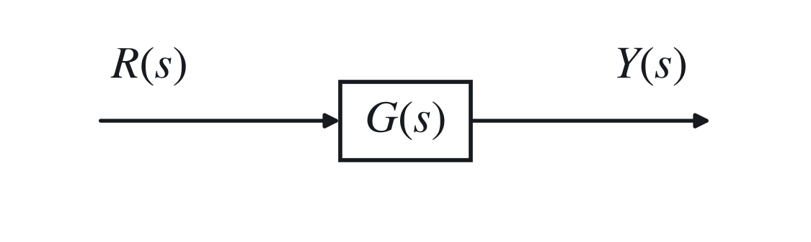

### （2）性质

传递函数反映<strong>零状态</strong>响应，表征系统的固有特性，与输入 $r(t)$ 的形式无关。

对于通常的因果、可实现有理系统，$G(s)$ 分母阶次不小于分子阶次。

$G(s)$ 与系统的<strong>单位脉冲响应</strong>成拉氏变换对。

### （3）其他形式

$$
G(s)=K\frac{\displaystyle\prod_{i=1}^{m}(T_is+1)}
{\displaystyle\prod_{j=1}^{n}(t_js+1)}.
$$

$K$ 为系统增益（传递系数），$T_i$、$t_j$ 为时间常数。（将常数项化为 1。）

$$
G(s)=K_g\frac{\displaystyle\prod_{i=1}^{m}(s-z_i)}
{\displaystyle\prod_{j=1}^{n}(s-p_j)}.
$$

$z_i$ 为系统零点，$p_j$ 为系统极点。（将最高次项系数化为 1。）

### （4）<strong>典型环节</strong>

#### 惯性环节

$$
T\frac{\mathrm{d}y(t)}{\mathrm{d}t}+y(t)=r(t),
\qquad
G(s)=\frac{1}{Ts+1}.
$$

其中 $T$ 为惯性环节的<strong>时间常数</strong>。

如 RC 电路：充电为缓慢上升，故为惯性环节；不同 $T$ 时，上升的速度不同。

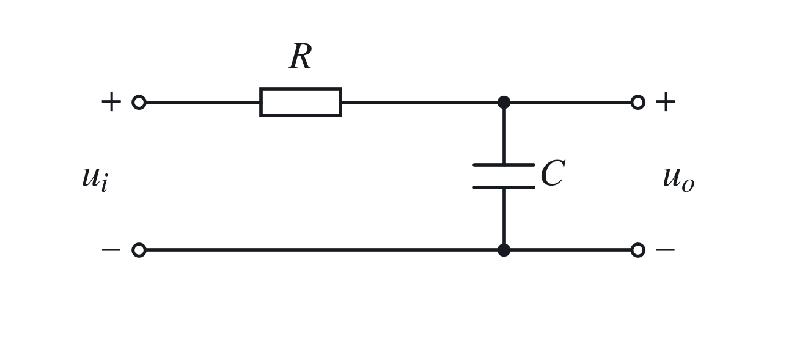

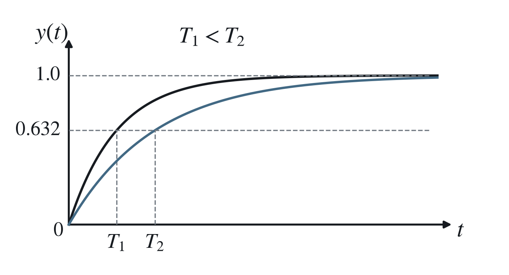

$t=T$ 时，$y(t)\approx0.632$。极点：

$$
{\color{#c62828}s=-\frac{1}{T}.}
$$

#### 积分环节

$$
T\frac{\mathrm{d}y(t)}{\mathrm{d}t}=r(t),
\qquad G(s)=\frac{1}{Ts}.
$$

如电容充电：以电容电流为输入、电容电压为输出时，构成积分关系。极点 $s=0$。

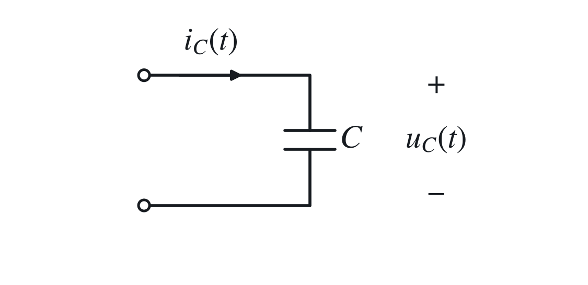

#### 振荡环节

$$
T^2\frac{\mathrm{d}^2y(t)}{\mathrm{d}t^2}
+2T\zeta\frac{\mathrm{d}y(t)}{\mathrm{d}t}
+y(t)=r(t),
\qquad 0<\zeta<1.
$$

$$
{\color{#c62828}
G(s)=\frac{\omega_n^2}{s^2+2\zeta\omega_ns+\omega_n^2}.
}
$$

其中 $T$ 为时间常数，$\zeta$ 为阻尼比，

$$
\omega_n=\frac{1}{T}
$$

为无阻尼自然振荡角频率。

如 RLC 串联电路。

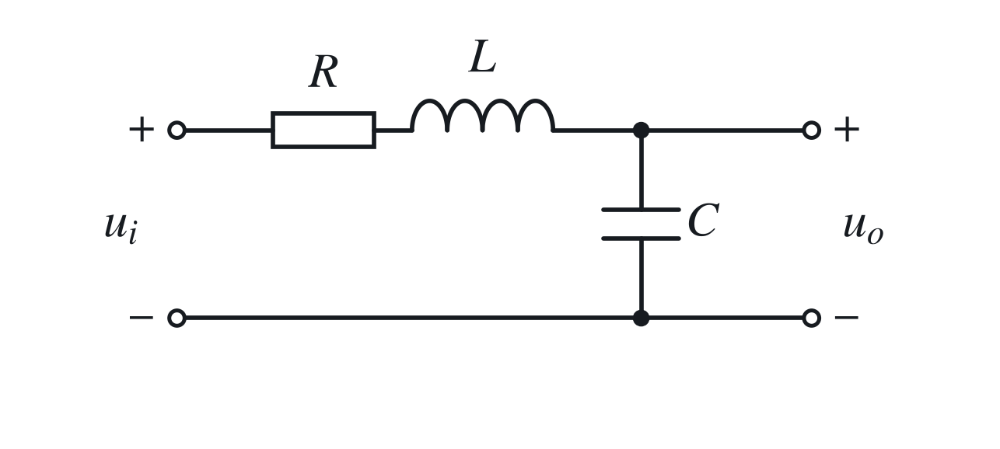

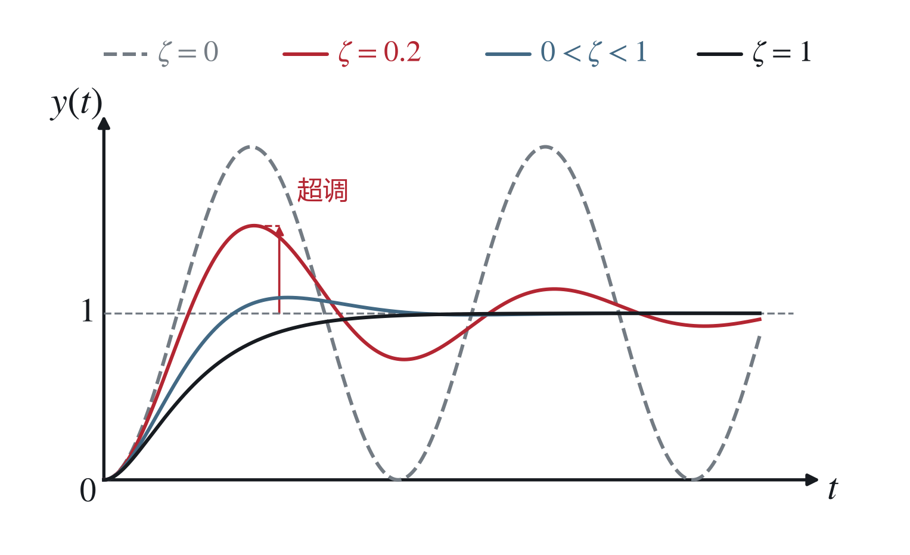

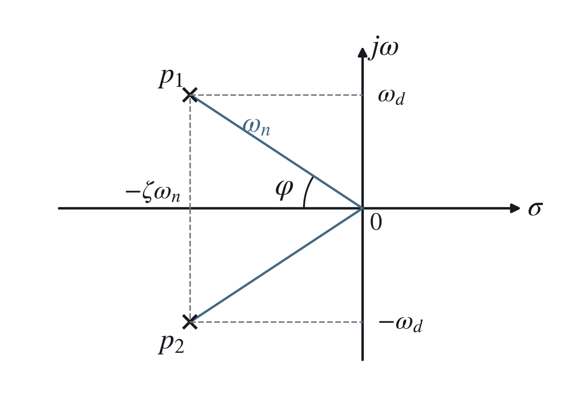

极点：

$$
p_{1,2}=-\zeta\omega_n\pm j\omega_n\sqrt{1-\zeta^2}
=-\zeta\omega_n\pm j\omega_d.
$$

由图中易得

$$
|p_1|=|p_2|=\omega_n,\qquad \zeta=\cos\varphi.
$$

$\zeta$ 越大，超调越小。

#### 微分环节

$$
y(t)=T_d\frac{\mathrm{d}r(t)}{\mathrm{d}t},
\qquad G(s)=T_ds.
$$

理想微分环节不是真有理分式。

$$
\left.\frac{\mathrm{d}r(t)}{\mathrm{d}t}\right|_{t=t_0}
=\lim_{\Delta t\to0}
\frac{r(t_0+\Delta t)-r(t_0)}{\Delta t},
$$

但未来的 $r(t_0+\Delta t)$ 无法获取。

常采用具有惯性环节的微分环节：

$$
G(s)=\frac{T_1s}{T_2s+1}.
$$

低频近似：$s=j\omega$，$\omega\to0$。

如 RC 电路。

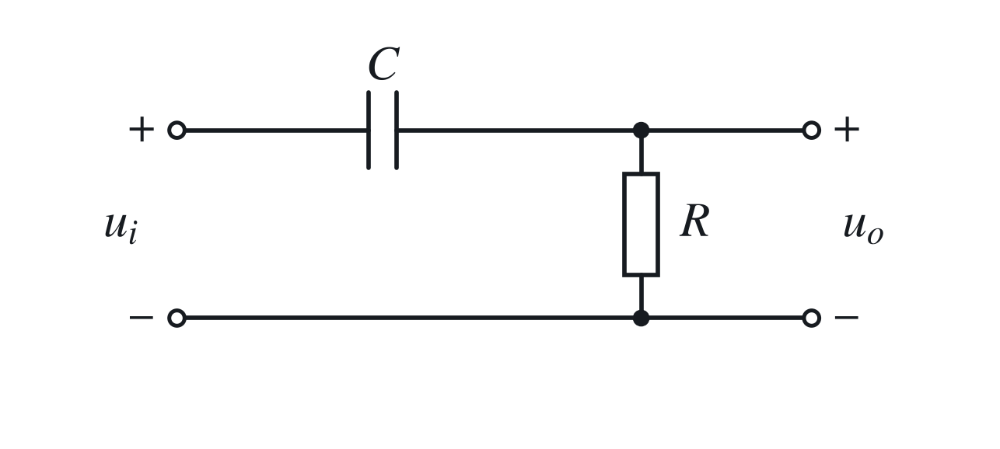

#### 比例环节

$$
y(t)=K_pr(t),\qquad G(s)=K_p.
$$

其中 $K_p$ 为比例系数（增益）。

#### 延迟环节

$$
y(t)=r(t-\tau),\qquad G(s)=e^{-\tau s}.
$$

### （5）稳定的线性时不变系统的正弦响应

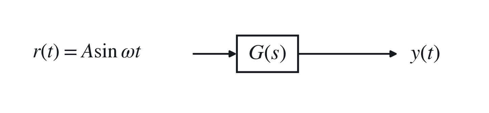

幅值：$A\rightarrow |G(j\omega)|A$。

频率：$\omega\rightarrow\omega$。

相角：$0\rightarrow\angle G(j\omega)$。

正弦输入信号作用下，系统输出的稳态分量与输入量的复幅值之比为

$$
G(j\omega)=\left.G(s)\right|_{s=j\omega},
$$

即<strong>频率特性</strong>。

## 6. 三种输入、输出模型之间的关系

$\mathcal{L}$ 为 Laplace 变换，$\mathcal{F}$ 为 Fourier 变换。

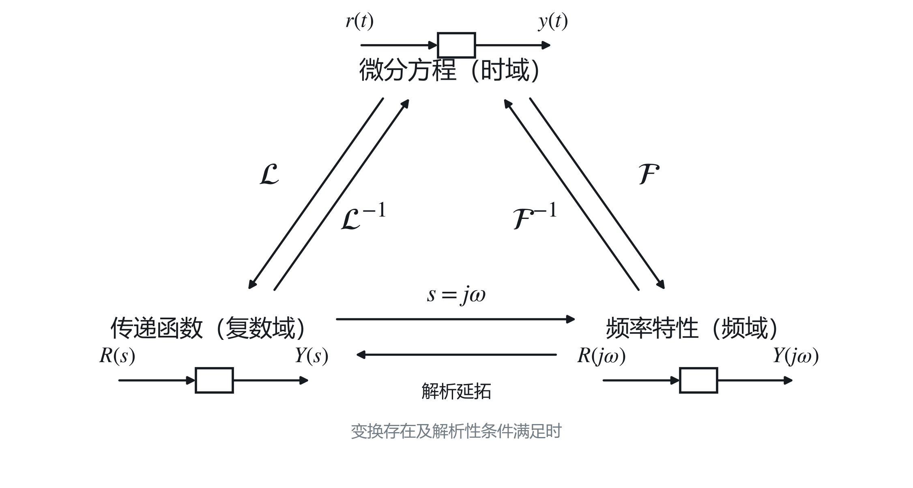

传递函数在虚轴上的取值（存在时）给出频率特性；由频率特性恢复传递函数需满足相应解析性条件。

## 7. 方框图模型

需要假设负载效应可以忽略。

### 基本单元

信号线：$x(t)$ 或 $X(s)$。

分支线。

相加点：代数 $+/-$。

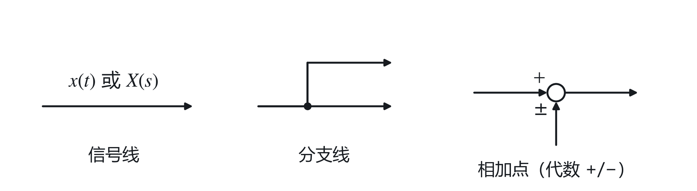

### 基本变换

合并串联：

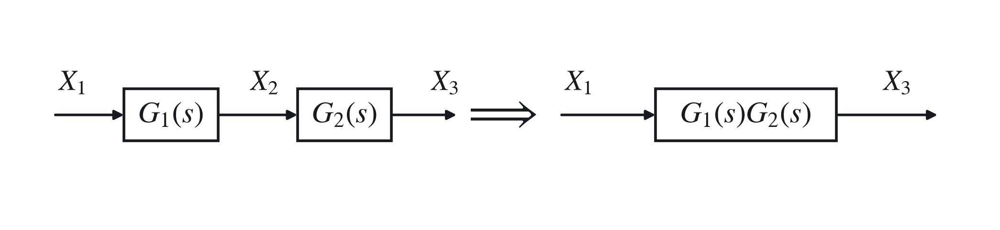

相加点后移：

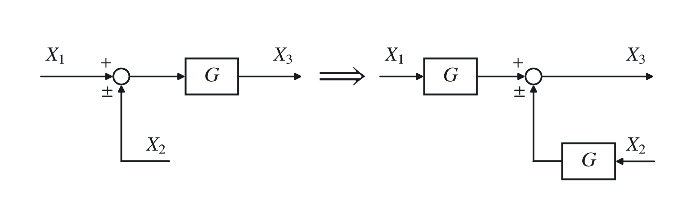

相加点前移：

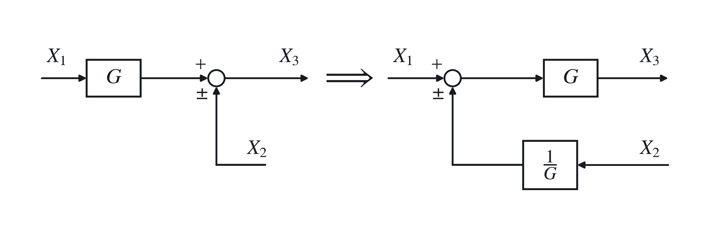

分支点后移：

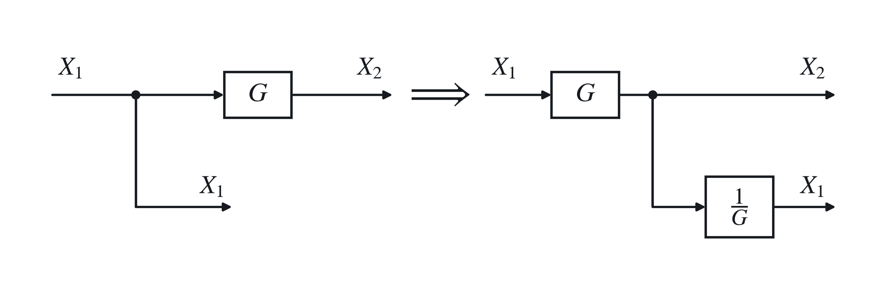

分支点前移：

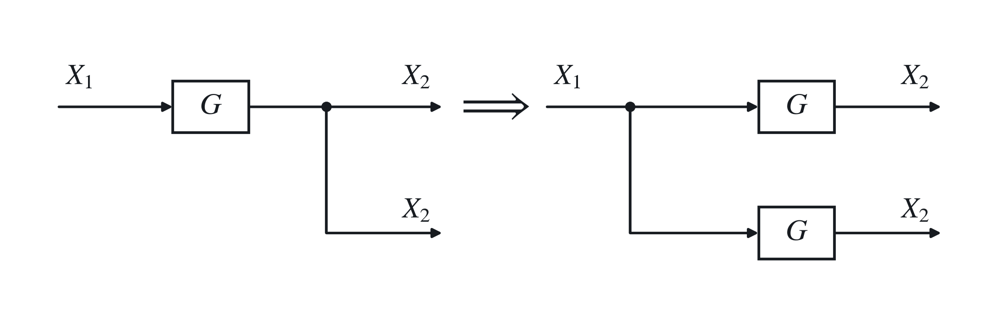

消去反馈回路：

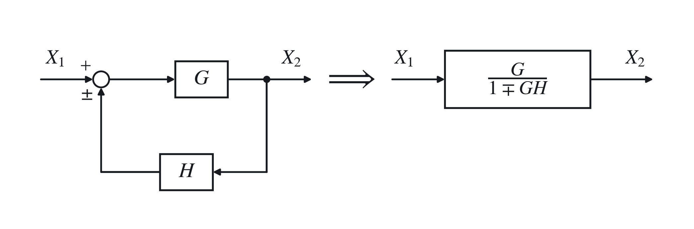

相邻相加点移动：

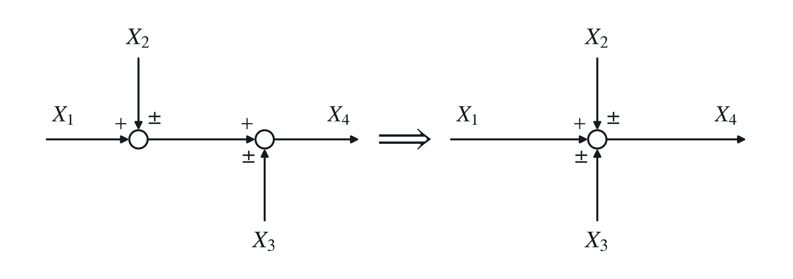

相加点、分支点交换位置：

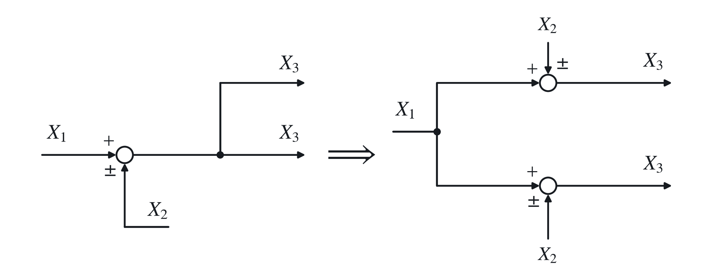

并联方框：

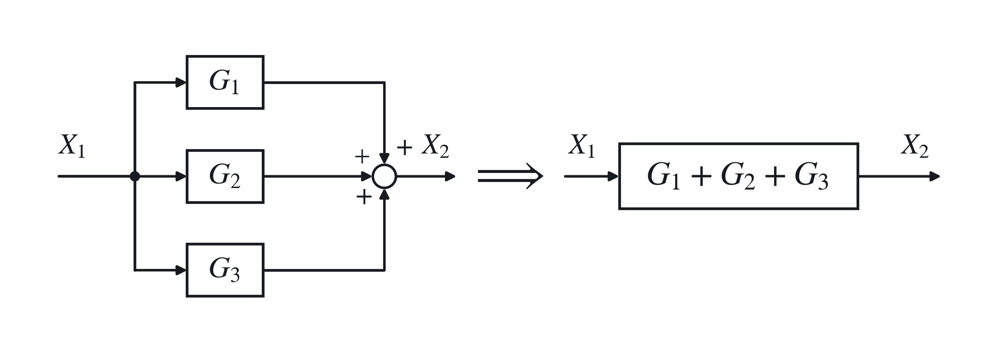

## 8. 信号流图

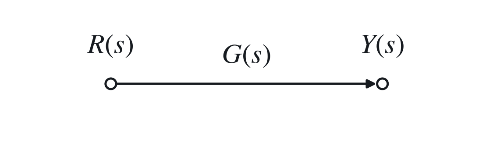

基本元素：

节点：表示系统的变量。

支路：相当于乘法器，信号经过支路时乘以增益。

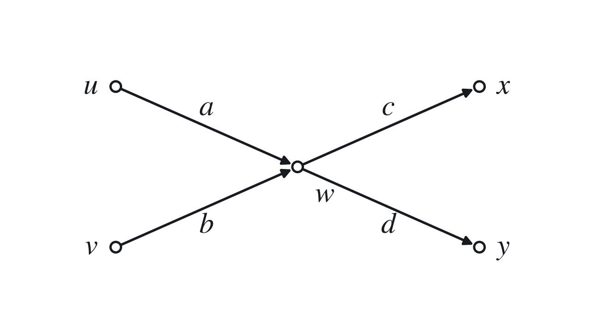

$$
w=ua+vb,\qquad x=cw,\qquad y=dw.
$$

输入节点（源点）：只输出，无输入。

输出节点（阱点）：只输入，无输出；可用传输为 1 的支路引出。

<strong>通路：</strong>沿箭头方向从一个节点沿支路到另一个节点。

<strong>前向通路：</strong>从输入节点到输出节点，每个节点只通过 <strong>1 次</strong>。

<strong>回路：</strong>起点与终点是同一节点，除起终点重合外，每个节点不多于 1 次。

<strong>通路／回路增益：</strong>通路／回路上所有支路的增益之积。

无接触回路：没有公共节点的回路。

### <strong>梅森（Mason）公式</strong>

$$
{\color{#c62828}P=\frac{1}{\Delta}\sum_{k=1}^{n}P_k\Delta_k.}
$$

$P$ 为总增益，$P_k$ 为第 $k$ 条前向通路的通路增益。

$\Delta$ 为信号流图的特征式：

$$
{\color{#c62828}
\Delta=1-\sum_aL_a+\sum_{b,c}L_bL_c
-\sum_{d,e,f}L_dL_eL_f+\cdots.
}
$$

$\sum_aL_a$ 为所有回路增益之和；$\sum_{b,c}L_bL_c$、$\sum_{d,e,f}L_dL_eL_f$ 为每 2、3 个互不接触回路增益乘积之和，每组只计一次。

$\Delta_k$ 为在 $\Delta$ 中除去与第 $k$ 条前向通路相接触回路后的特征式，即第 $k$ 条前向通路特征式的余因子。
