# 二、控制系统的时域分析

## 1. 典型输入信号

### （1）阶跃信号

$$
r(t)=\begin{cases}0,&t<0,\\A,&t\geq0,\end{cases}
\qquad R(s)=\frac{A}{s}.
$$

单位阶跃信号记为 $1(t)$ 或 $u(t)$。

### （2）斜坡信号

$$
r(t)=\begin{cases}0,&t<0,\\At,&t\geq0,\end{cases}
\qquad {\color{#c62828}R(s)=\frac{A}{s^2}}.
$$

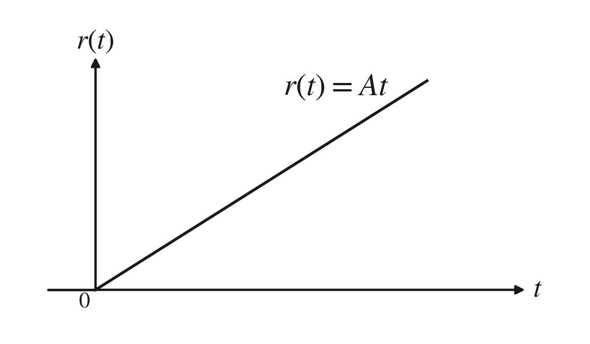

### （3）抛物线信号

$$
r(t)=\begin{cases}0,&t<0,\\\frac12At^2,&t\geq0,\end{cases}
\qquad {\color{#c62828}R(s)=\frac{A}{s^3}}.
$$

### （4）单位脉冲信号

$$
r(t)=\delta(t),\qquad {\color{#c62828}R(s)=1}.
$$

$\delta(t)$ 可由宽度为 $\varepsilon$、高度为 $1/\varepsilon$ 的单位面积矩形脉冲在 $\varepsilon\to0^+$ 时的广义函数极限表示：

$$
\delta_\varepsilon(t)=
\begin{cases}
\frac1\varepsilon,&-\frac\varepsilon2\leq t\leq\frac\varepsilon2,\\
0,&\text{其他}.
\end{cases}
$$

采样特性：

$$
\int_{-\infty}^{+\infty}f(t)\delta(t-a)\,\mathrm{d}t=f(a).
$$

单位脉冲响应反映系统的固有性质。

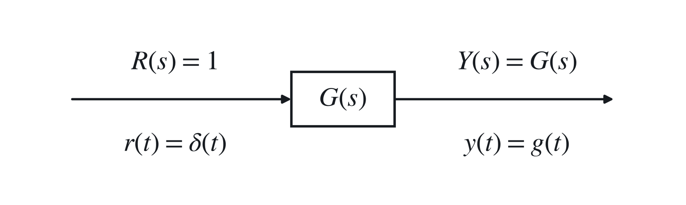

### （5）<strong>四者关系</strong>

脉冲、阶跃、斜坡、抛物线依次通过积分环节得到，为线性定常系统分析中的基本关系。

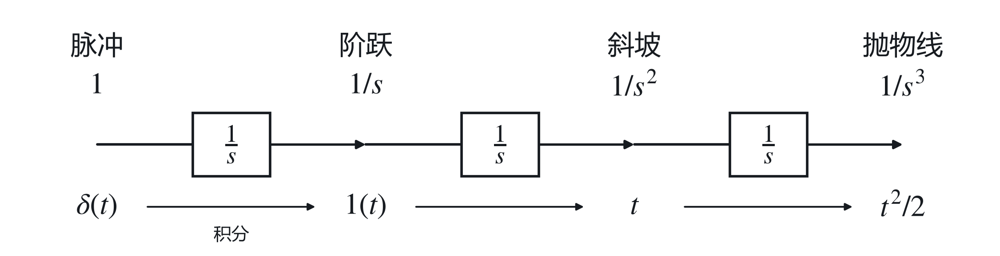

## 2. 单位阶跃响应的瞬态性能指标

（1）延迟时间 $T_d$：系统响应从 0 上升到稳态值的 50% 所需的时间。

（2）上升时间 $T_r$：

- 有振荡系统：响应从 0 首次上升到稳态值所需的时间。
- 无振荡系统：响应从稳态值的 10% 上升到 90% 所需的时间。

（3）峰值时间 $T_p$：系统响应达到最大峰值所需的时间。

（4）最大超调量 $\sigma$：系统响应超出稳态值的最大偏离量。

$$
\sigma\%\triangleq\frac{y(T_p)-y(\infty)}{y(\infty)}\times100\%.
$$

（5）调节时间 $T_s$：系统响应与稳态值之差达到并维持在允许误差带内所需的最小时间。

$$
|y(t)-y(\infty)|\leq |y(\infty)|\delta,\qquad t\geq T_s.
$$

（6）振荡次数 $N$：$T_s$ 内 $y(t)$ 偏离 $y(\infty)$ 的振荡次数。

## 3. 一阶系统时域分析

系统闭环传递函数：

$$
{\color{#c62828}G(s)=\frac{Y(s)}{R(s)}=\frac{1}{Ts+1}.}
$$

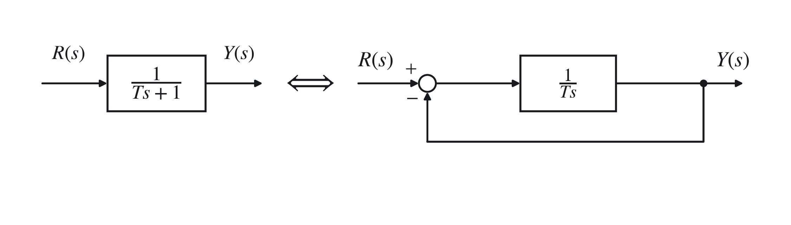

> 定义：在下图负反馈结构中，$G(s)H(s)$ 为开环传递函数，
>
> $$
> \frac{G(s)}{1+G(s)H(s)}
> $$
>
> 为闭环传递函数。
>
> 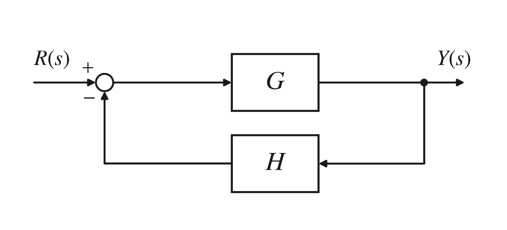

### （1）单位阶跃响应

$$
Y(s)=G(s)R(s)=\frac{1}{(Ts+1)s}
\quad\Rightarrow\quad y(t)=1-e^{-t/T},\qquad t\geq0.
$$

误差：

$$
e(t)=e^{-t/T},\qquad\lim_{t\to\infty}e(t)=0.
$$

特点：为初值为 0、终值为 1 的单调连续上升过程。

稳态误差为 0；$t=0$ 处斜率最大，为 $1/T$。

$t=T$ 时，上升至稳态值的 63.2%。

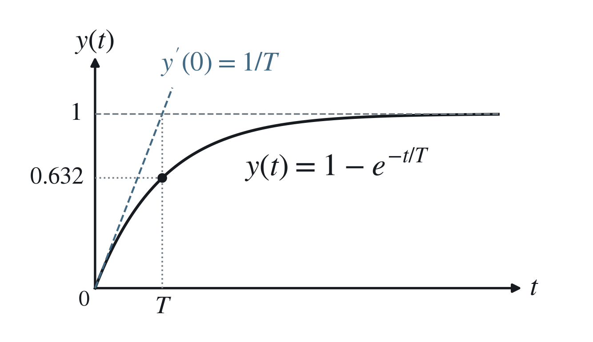

### （2）单位脉冲响应

$$
Y(s)=G(s)R(s)=\frac{1}{Ts+1}
\quad\Rightarrow\quad y(t)=\frac1T e^{-t/T},\qquad t\geq0.
$$

特点：$y(t)$ 为单调连续下降的指数曲线，稳态误差为 0。

动态性能与 $T$ 有关，可反映系统的全部输入输出动态性质。

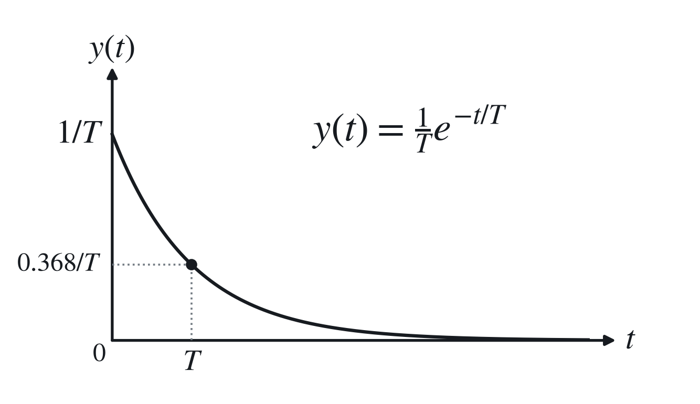

### （3）单位斜坡响应

$$
Y(s)=G(s)R(s)=\frac{1}{(Ts+1)s^2}
\quad\Rightarrow\quad y(t)=t-T(1-e^{-t/T}),\qquad t\geq0.
$$

误差：

$$
e(t)=T(1-e^{-t/T}),\qquad e(\infty)=T.
$$

特点：当 $t\to\infty$ 时，$y(t)$ 趋近于 $r(t-T)$。

减小时间常数 $T$ 可以加快响应速度，减小系统跟踪斜坡信号的稳态误差。

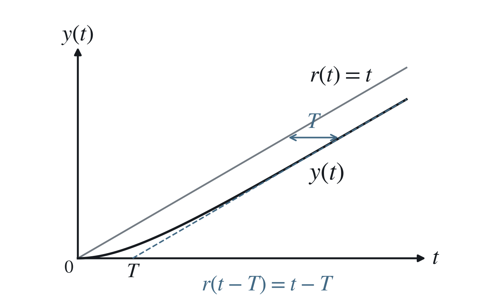

## 4. 二阶系统时域分析

### （1）二阶系统的数学模型

标准二阶系统微分方程：

$$
\ddot y+2\zeta\omega_n\dot y+\omega_n^2y=\omega_n^2r.
$$

标准二阶系统的传递函数（<strong>闭环</strong>）：

$$
\Phi(s)=\frac{Y(s)}{R(s)}
={\color{#c62828}\frac{\omega_n^2}{s^2+2\zeta\omega_ns+\omega_n^2}}.
$$

其中 $\zeta$ 为<strong>阻尼比</strong>，$\omega_n$ 为<strong>自然振荡频率</strong>（无阻尼自然振荡频率）。

开环传递函数：

$$
{\color{#c62828}G(s)=\frac{\omega_n^2}{s(s+2\zeta\omega_n)}.}
$$

特征根（极点）：

$$
{\color{#c62828}s_{1,2}=-\zeta\omega_n\pm\omega_n\sqrt{\zeta^2-1}.}
$$

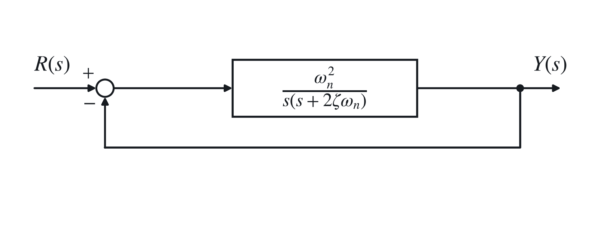

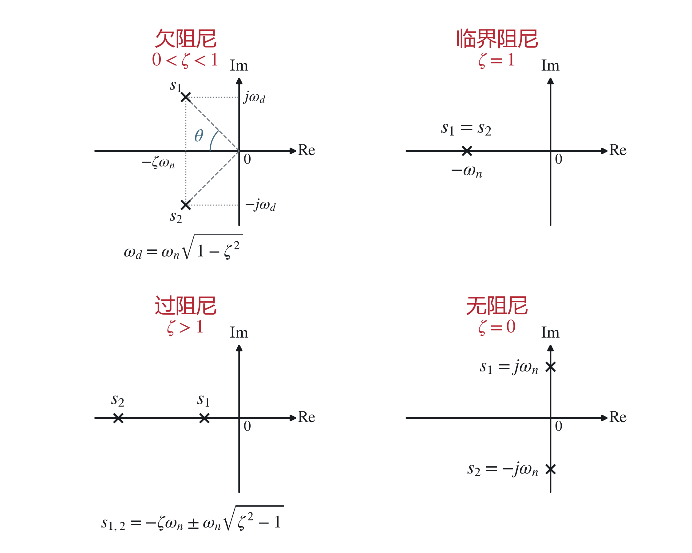

### （2）二阶系统的单位阶跃响应

#### ① <strong>欠阻尼</strong>：$0<\zeta<1$

极点：

$$
s_{1,2}=-\zeta\omega_n\pm j\omega_n\sqrt{1-\zeta^2}
=\sigma\pm j\omega_d.
$$

$\sigma=-\zeta\omega_n$ 为极点实部，衰减速率为 $-\sigma=\zeta\omega_n$。

$$
\omega_d=\omega_n\sqrt{1-\zeta^2}
$$

为阻尼自然振荡频率。

$$
Y(s)=\Phi(s)R(s)\quad\Rightarrow\quad
y(t)=\underbrace{1}_{\color{#c62828}\text{稳态分量}}
-\underbrace{\frac{e^{-\zeta\omega_nt}}{\sqrt{1-\zeta^2}}
\sin(\omega_dt+\theta)}_{\color{#c62828}\text{暂态分量}},\quad t\geq0,
$$

其中 $\theta=\arccos\zeta$。

特点：暂态分量是衰减的正弦振荡，衰减速度取决于 $\zeta\omega_n$。

稳态值为 1，阶跃信号作用下不存在稳态误差。

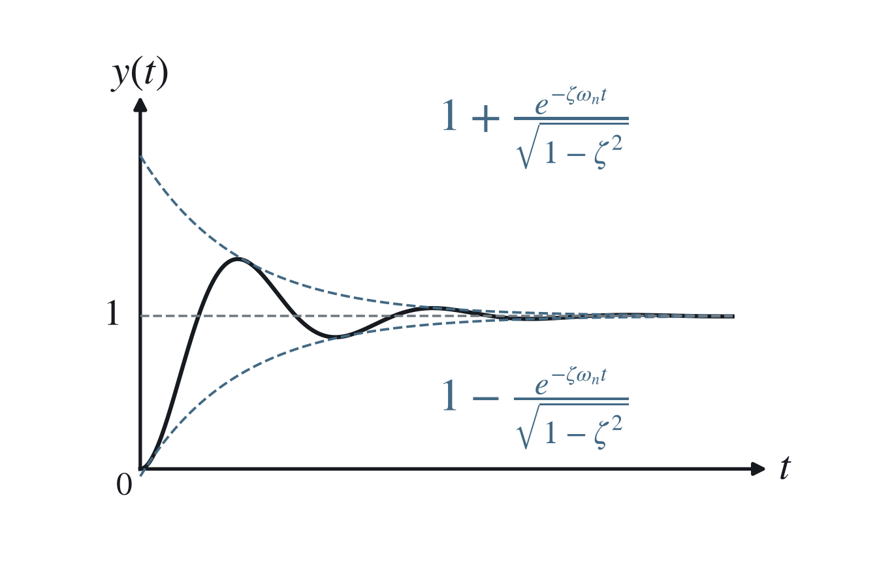

#### ② <strong>无阻尼</strong>：$\zeta=0$

极点 $s_{1,2}=\pm j\omega_n$，$\theta=\pi/2$，

$$
{\color{#c62828}y(t)=1-\cos\omega_nt.}
$$

为一个等幅振荡过程，超调为 100%，$T_s=\infty$。

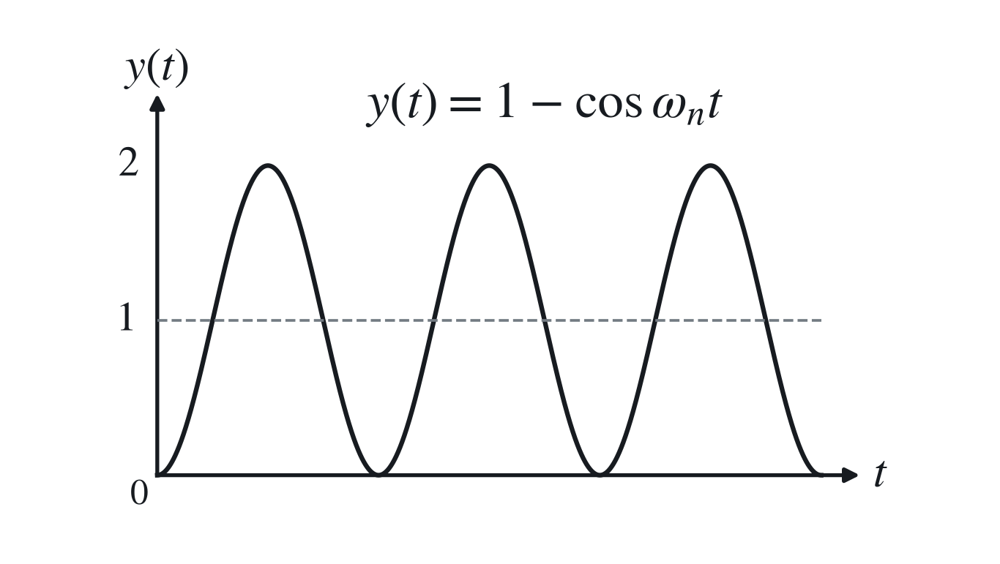

#### ③ <strong>临界阻尼</strong>：$\zeta=1$

极点 $s_{1,2}=-\omega_n$，

$$
{\color{#c62828}y(t)=1-e^{-\omega_nt}(1+\omega_nt)},\qquad t\geq0.
$$

注意：$\color{#c62828}y'(0)=0$，而一阶系统单位阶跃响应 $y'(0)=1/T$。

特点：稳态值为 1 的无超调单调上升过程。

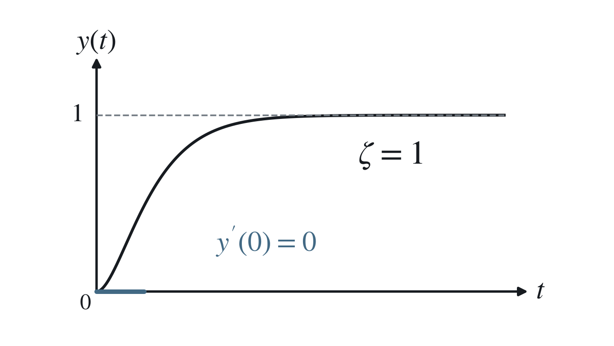

#### ④ <strong>过阻尼</strong>：$\zeta>1$

极点：

$$
s_{1,2}=-\zeta\omega_n\pm\omega_n\sqrt{\zeta^2-1}.
$$

$$
y(t)=1-\frac{1}{2\sqrt{\zeta^2-1}}
\left[\frac{e^{-t/T_1}}{\zeta-\sqrt{\zeta^2-1}}
-\frac{e^{-t/T_2}}{\zeta+\sqrt{\zeta^2-1}}\right],\quad t\geq0,
$$

其中

$$
T_1=\frac{1}{\omega_n(\zeta-\sqrt{\zeta^2-1})},
\qquad T_2=\frac{1}{\omega_n(\zeta+\sqrt{\zeta^2-1})}.
$$

当 $\zeta\gg1$ 时，$T_1\gg T_2$，故 $e^{-t/T_2}$ 衰减远快于 $e^{-t/T_1}$，且 $e^{-t/T_1}$ 项系数也较大，故可以<strong>近似为一阶系统</strong>：

$$
y(t)\approx1-\frac{1}{2\sqrt{\zeta^2-1}}
\frac{e^{-t/T_1}}{\zeta-\sqrt{\zeta^2-1}}.
$$

为稳态值为 1 的单调上升过程。

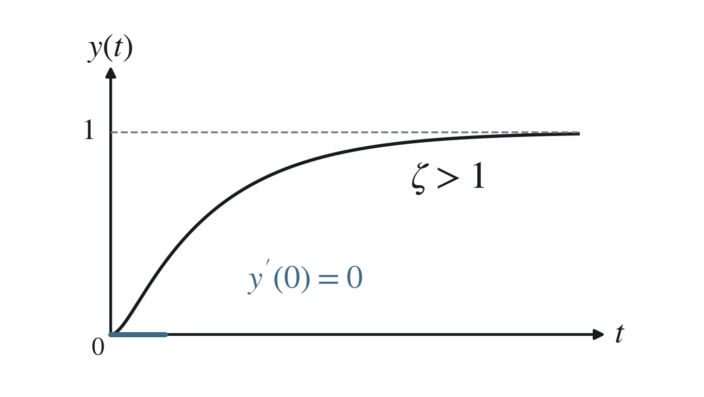

#### ⑤ 负阻尼：$-1<\zeta<0$

$$
s_{1,2}=-\zeta\omega_n\pm j\omega_n\sqrt{1-\zeta^2},
$$

$$
y(t)=1-\frac{e^{-\zeta\omega_nt}}{\sqrt{1-\zeta^2}}
\sin(\omega_dt+\theta),\qquad t\geq0.
$$

为发散的正弦振荡，系统不稳定。

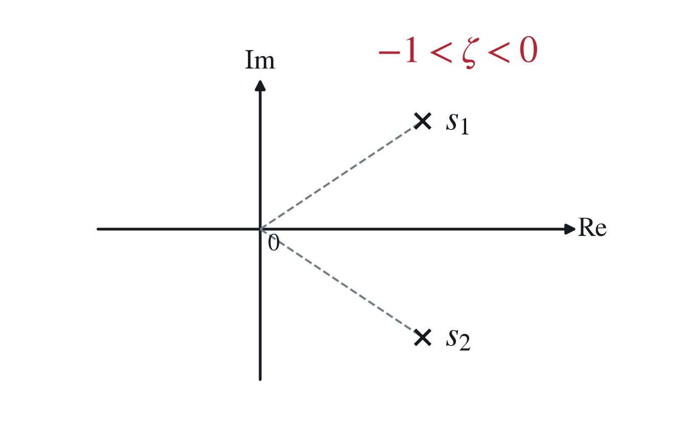

### （3）欠阻尼二阶系统瞬态响应特性

#### ① 峰值时间 $\color{#c62828}T_p$

$$
\left.\frac{\mathrm{d}y(t)}{\mathrm{d}t}\right|_{t=T_p}=0.
$$

由 Laplace 反变换，即 $\mathcal L^{-1}\{sY(s)\}=0$，得 $\sin(\omega_dt)=0$。

即 $t=n\pi/\omega_d$，$n\in\mathbb N$，故

$$
{\color{#c62828}T_p=\frac{\pi}{\omega_d}
=\frac{\pi}{\omega_n\sqrt{1-\zeta^2}}.}
$$

#### ② 超调量 $\color{#c62828}\sigma\%$

$$
\sigma\%=\frac{y(T_p)-y(\infty)}{y(\infty)}\times100\%
=[y(T_p)-1]\times100\%.
$$

得

$$
{\color{#c62828}
\sigma\%=e^{-\zeta\omega_nT_p}\times100\%
=\exp\!\left(-\frac{\zeta\pi}{\sqrt{1-\zeta^2}}\right)\times100\%.
}
$$

$\sigma\%$ 只是 $\zeta$ 的函数，与 $\omega_n$ 无关。

$\zeta\uparrow\Rightarrow\sigma\%\downarrow,\ \omega_nT_p\uparrow$。

#### ③ 上升时间 $\color{#c62828}T_r$

$y(T_r)=1\Rightarrow\omega_dT_r+\varphi=\pi$，故

$$
{\color{#c62828}T_r=\frac{\pi-\varphi}{\omega_d}
=\frac{\pi-\varphi}{\omega_n\sqrt{1-\zeta^2}}},
\qquad\varphi=\arccos\zeta.
$$

当 $\zeta$ 一定，即 $\varphi$ 一定时，$\omega_n\uparrow\Rightarrow T_r\downarrow$。

#### ④ 调节时间 $\color{#c62828}T_s$

$$
|y(t)-y(\infty)|\leq\Delta|y(\infty)|,\quad t\geq T_s,\qquad y(\infty)=1.
$$

用包络线近似替换 $y(t)$，即得

$$
\frac{e^{-\zeta\omega_nt}}{\sqrt{1-\zeta^2}}\leq\Delta,\qquad t\geq T_s.
$$

由包络线得到的调节时间估计为

$$
T_s=\frac{1}{\zeta\omega_n}\ln\frac{1}{\Delta\sqrt{1-\zeta^2}}
=\frac{1}{\zeta\omega_n}
\left[-\ln\Delta-\frac12\ln(1-\zeta^2)\right].
$$

当 $0<\zeta<0.9$ 时，取近似 $\ln0.02\approx-4$、$\ln0.05\approx-3$，得常用估计

$$
{\color{#c62828}T_s(2\%)\approx\frac4{\zeta\omega_n}},
\qquad {\color{#c62828}T_s(5\%)\approx\frac3{\zeta\omega_n}}.
$$

系统阶跃响应的快速性取决于<strong>阻尼比和频率</strong>；超调仅取决于<strong>阻尼比</strong>。

#### ⑤ 延迟时间 $T_d$

$$
y(T_d)=0.5\quad\Rightarrow\quad
\omega_nT_d=\frac1\zeta
\ln\!\left[\frac{2\sin(\omega_dT_d+\varphi)}{\sqrt{1-\zeta^2}}\right].
$$

#### ⑥ 振荡次数 $N$

记振荡周期为 $T_{\mathrm{osc}}=2\pi/\omega_d$，则

$$
N=\frac{T_s}{T_{\mathrm{osc}}}=\frac{T_s\omega_d}{2\pi}
\approx
\begin{cases}
\displaystyle\frac2{\pi\zeta}\sqrt{1-\zeta^2},&\Delta=2\%,\\[4pt]
\displaystyle\frac{1.5}{\pi\zeta}\sqrt{1-\zeta^2},&\Delta=5\%.
\end{cases}
$$

#### ⑦ 二阶工程最佳参数

实际系统常工作在欠阻尼状态，可兼顾超调量和响应时间。

常选 $\zeta=1/\sqrt2\approx0.707$，相应的 $\sigma\%\approx4.3\%$。

### （4）具有零点的二阶系统的单位阶跃响应

$$
T(s)=\frac{Y(s)}{R(s)}
=\frac{\omega_n^2}{s^2+2\zeta\omega_ns+\omega_n^2},
$$

$$
T_z(s)=\frac{Y_z(s)}{R(s)}
=\frac{\omega_n^2(\tau s+1)}{s^2+2\zeta\omega_ns+\omega_n^2}.
$$

记闭环零点 $-z=-1/\tau$（此处 $\tau>0$），则等效方框图为：

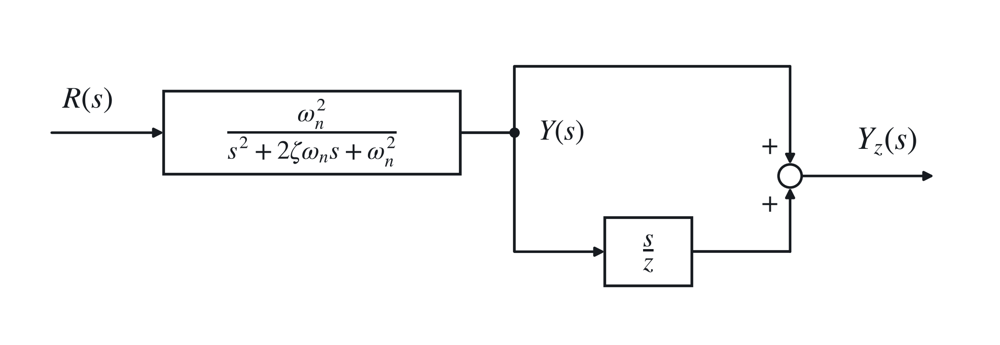

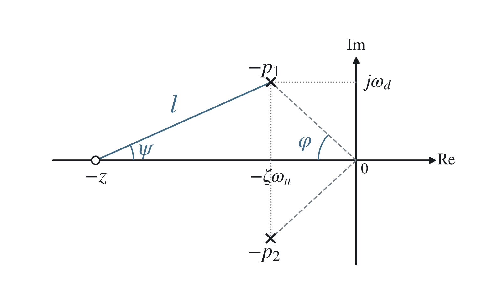

$$
y_z(t)=1-\frac{e^{-\zeta\omega_nt}}{\sqrt{1-\zeta^2}}
\frac{l}{z}\sin(\omega_dt+\varphi+\psi),\qquad t\geq0,
$$

其中

$$
\cos\psi=\frac{z-\zeta\omega_n}{l},
\qquad l=\sqrt{z^2-2\zeta\omega_nz+\omega_n^2},
$$

$\psi$ 取使 $\sin\psi=\omega_d/l>0$ 的相角。

上升时间：$T_{rz}=T_r-\psi/\omega_d$。

峰值时间：$T_{pz}=T_p-\psi/\omega_d$。

超调量：

$$
\sigma_z\%=\frac{l}{z}
\exp\!\left(\frac{\zeta\psi}{\sqrt{1-\zeta^2}}\right)\sigma\%.
$$

<strong>添加零点后峰值时间提前，超调量增大。</strong>

### （5）二阶系统的单位脉冲响应

为单位阶跃响应对时间的导数。

面积即为单位阶跃响应，首个非零过零点即为 $T_p$。

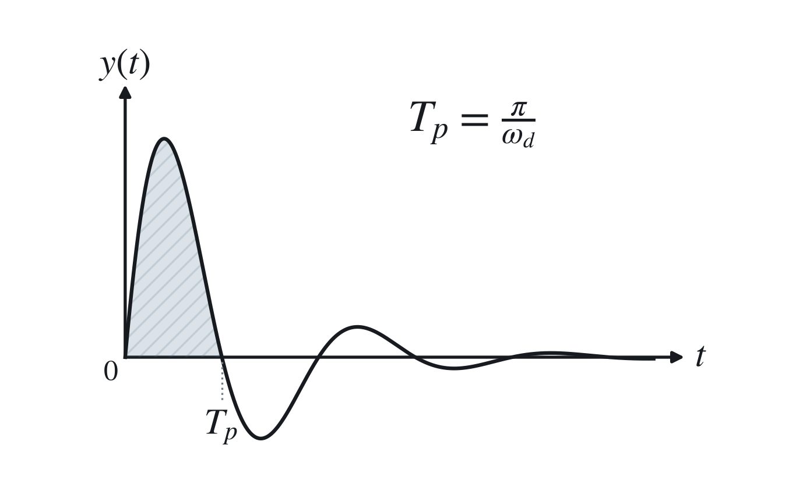

单位斜坡响应同理，稳态误差为 $2\zeta/\omega_n$。

## 5. 高阶系统时域分析

### （1）典型三阶系统的单位阶跃响应：$0<\zeta<1$

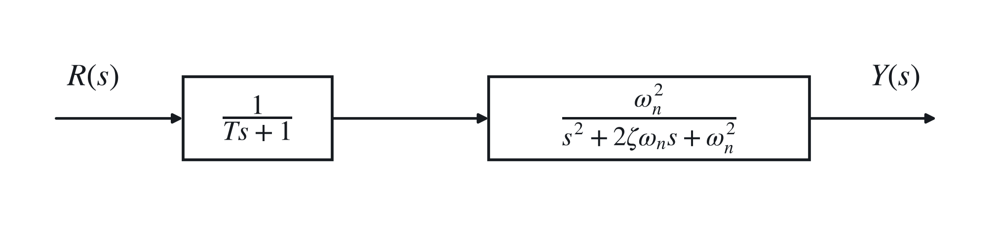

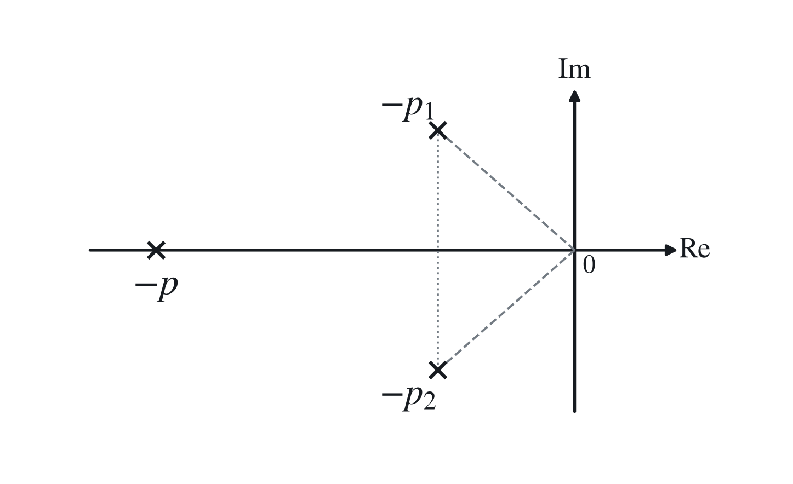

记 $p=1/T$，$\beta=p/(\zeta\omega_n)$，则

$$
\begin{aligned}
y(t)={}&1-\frac{e^{-\beta\zeta\omega_nt}}{\zeta^2\beta(\beta-2)+1}\\
&-\frac{\beta\zeta}{\sqrt{\zeta^2\beta(\beta-2)+1}}
\frac{e^{-\zeta\omega_nt}}{\sqrt{1-\zeta^2}}
\sin(\omega_dt+\gamma),\qquad t\geq0.
\end{aligned}
$$

$\gamma$ 为对应的合成相位。

当 $\beta\to\infty$ 时相当于二阶系统。

$\beta\gg1$ 时，共轭复数极点为<strong>主导极点</strong>，响应呈二阶特性。

$\beta\ll1$ 时，实极点为<strong>主导极点</strong>，响应呈一阶特性。

当 $\beta\geq5$ 或 $\beta\leq1/5$ 时，可按照主导极点估算暂态响应特性。

实极点的影响：振荡性减弱，超调量减小，响应速度变慢（惯性环节）。

### （2）高阶系统的时域响应

若高阶系统闭环极点全部具有负实部，即全部在复数平面的左半平面，则单位阶跃响应的暂态分量最终衰减为 0。

实部为负的极点：

<strong>越靠近虚轴，衰减速度越慢，对过渡过程影响越大。</strong>

越靠近实轴，振荡频率越低。

## 6. 状态空间模型及时域分析

### （1）状态

状态：系统的最小一组变量，即状态变量；由 $t_0$ 时刻的状态变量及 $t>t_0$ 时的输入量，可完全确定系统未来的行为。

状态变量：$x_1(t),x_2(t),\ldots,x_n(t)$；在线性最小状态描述中选取独立的状态坐标。

状态向量：

$$
x(t)=[x_1(t),x_2(t),\ldots,x_n(t)]^{\mathsf T}.
$$

状态空间：由状态向量的各坐标构成的 $n$ 维空间。

### （2）线性定常系统的状态空间表达式

状态方程：

$$
\dot{x}(t)=Ax(t)+Bu(t).
$$

输出方程：

$$
y(t)=Cx(t)+Du(t).
$$

初始条件：$t\geq0$，$x_0=x(0)$。

$u\in\mathbb R^m$ 为输入向量，$y\in\mathbb R^q$ 为输出向量。

$$
A\in\mathbb R^{n\times n}\text{ 为状态矩阵},\qquad
B\in\mathbb R^{n\times m}\text{ 为控制矩阵},
$$

$$
C\in\mathbb R^{q\times n}\text{ 为输出矩阵},\qquad
D\in\mathbb R^{q\times m}\text{ 为前馈矩阵}.
$$

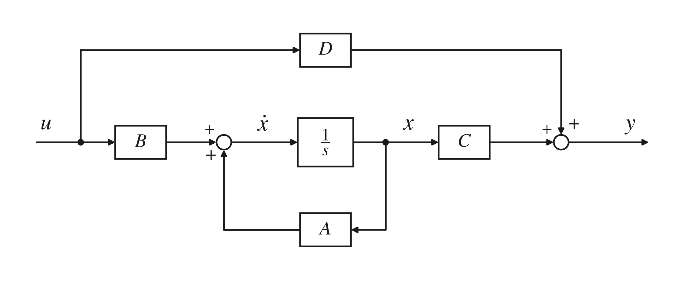

零输入响应为 $\phi(t,t_0,x_0,0)$，零状态响应为 $\phi(t,t_0,0,u)$，系统响应为二者之和。

$t_0=0$ 时，零输入响应具有形式 $x_{0u}(t)=e^{At}x_0$。

### （3）矩阵指数函数

$$
e^{At}=I+At+\frac1{2!}(At)^2+\cdots
=\sum_{k=0}^{\infty}\frac1{k!}A^kt^k.
$$

$$
e^{A(t+\tau)}=e^{At}e^{A\tau},\qquad(e^{At})^{-1}=e^{-At}.
$$

若 $AB=BA$，则

$$
e^{(A+B)t}=e^{At}e^{Bt}=e^{Bt}e^{At}.
$$

$$
\frac{\mathrm{d}}{\mathrm{d}t}e^{At}=Ae^{At}=e^{At}A,
\qquad(e^{At})^m=e^{A(mt)},\quad m=0,1,2,\ldots.
$$

若 $A=\operatorname{diag}(\lambda_1,\ldots,\lambda_n)$，则

$$
e^{At}=\operatorname{diag}(e^{\lambda_1t},\ldots,e^{\lambda_nt}).
$$

特征根法：$A$ 的 $n$ 个特征根 $\lambda_1,\ldots,\lambda_n$ 两两相异，每个特征根的右特征向量组成变换矩阵

$$
P=[v_1,v_2,\ldots,v_n],
$$

则

$$
e^{At}=P\operatorname{diag}(e^{\lambda_1t},\ldots,e^{\lambda_nt})P^{-1}.
$$

拉氏变换法：

$$
e^{At}=\mathcal L^{-1}\{(sI-A)^{-1}\}.
$$

### （4）零状态响应

$$
\dot{x}=Ax+Bu,\qquad x(0)=0,\qquad t\geq0,
\qquad x\in\mathbb R^n,\quad u\in\mathbb R^m,
$$

则零状态响应为

$$
x_{0x}(t)=\int_0^t e^{A(t-\tau)}Bu(\tau)\,\mathrm{d}\tau,\qquad t\geq0.
$$

因此

$$
x(t)=x_{0u}(t)+x_{0x}(t)
=e^{At}x_0+\int_0^t e^{A(t-\tau)}Bu(\tau)\,\mathrm{d}\tau,\qquad t\geq0.
$$
