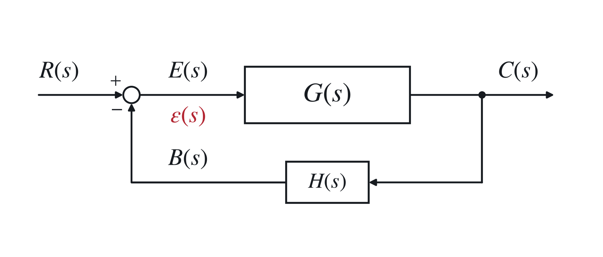
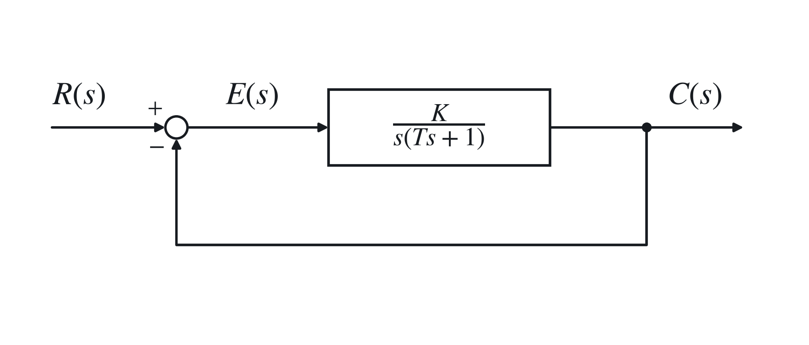
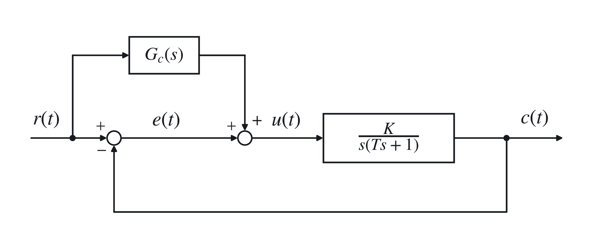
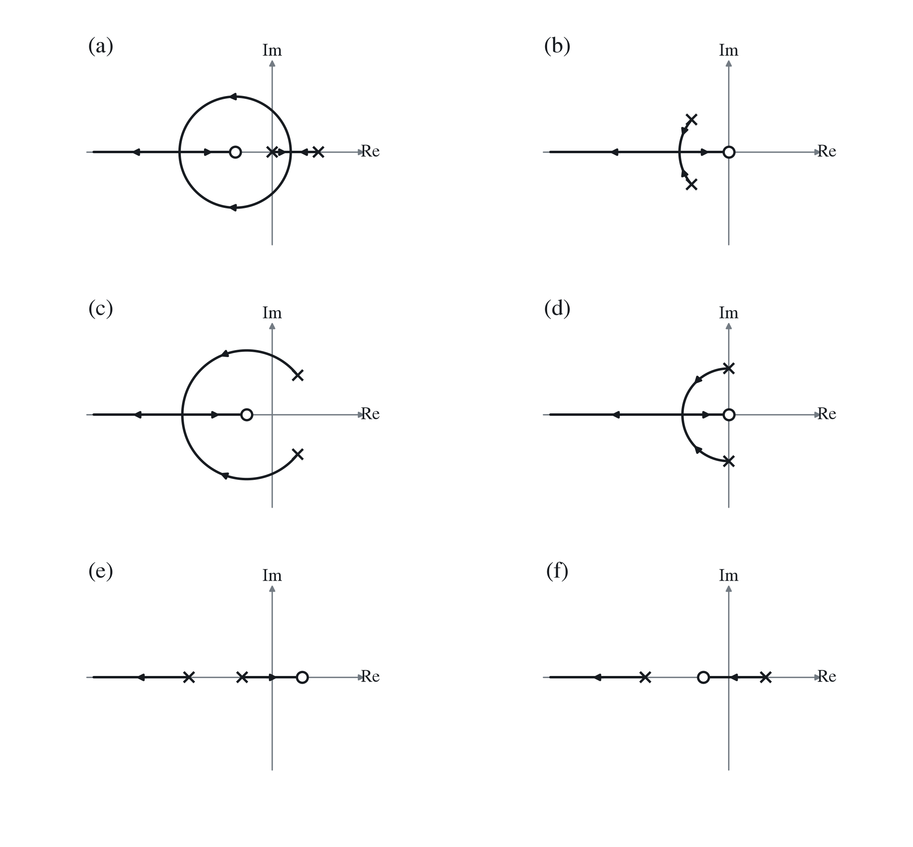
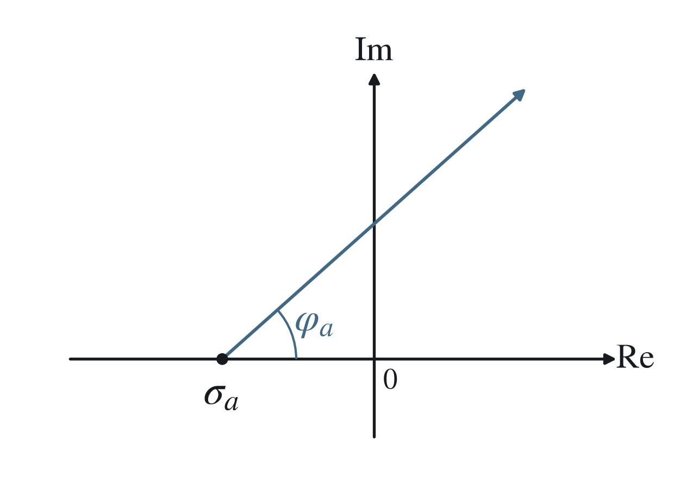
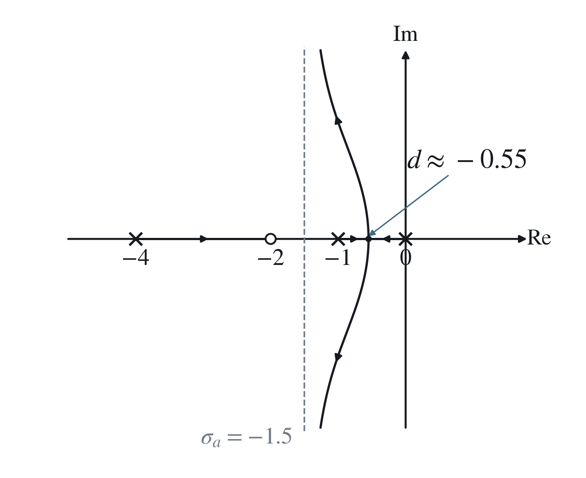

# 三、控制系统的稳定性及稳态误差

## 1. 基于传递函数的稳定性分析

### （1）稳定性

在扰动作用下，系统偏离了原来的平衡状态；扰动消除后，系统能以足够的准确度恢复平衡状态。本节按渐近稳定讨论，临界稳定不计为渐近稳定。

对于线性定常系统，传递函数为

$$
\Phi(s)=\frac{Y(s)}{R(s)}
=\frac{b_ms^m+b_{m-1}s^{m-1}+\cdots+b_0}
{a_ns^n+a_{n-1}s^{n-1}+\cdots+a_0}.
$$

对脉冲输入 $r(t)=\delta(t)$ 的响应为系统的脉冲响应 $k(t)$。对有限维、严格真有理、无隐藏不稳定模态的系统，脉冲响应各模态随时间衰减至 0，对应系统渐近稳定。

### （2）线性定常系统稳定的充要条件

<strong>系统的所有闭环极点均具有负的实部，或所有闭环极点均严格位于左半 $s$ 平面。</strong>

稳定性是系统的一种<strong>固有特性</strong>，只取决于系统的结构和参数。

虚轴上存在简单极点且其他极点位于左半平面时，可出现临界稳定；虚轴上有重复极点时还可能产生发散响应。二者均不属于本节要求的渐近稳定。

### （3）<strong>稳定性判据</strong>

特征方程：

$$
D(s)=a_ns^n+a_{n-1}s^{n-1}+\cdots+a_1s+a_0=0,\qquad a_n>0.
$$

#### ① <strong>必要条件</strong>

$$
a_i>0,\qquad i=0,1,\ldots,n.
$$

#### ② <strong>劳斯（Routh）稳定判据</strong>

下列劳斯表改用降幂下标：

$$
D(s)={\color{#c62828}a_0s^n+a_1s^{n-1}}+\cdots+a_{n-1}s+a_n=0,
\qquad a_0>0.
$$

$$
\begin{array}{c|ccccc}
s^n&a_0&a_2&a_4&a_6&\cdots\\
s^{n-1}&a_1&a_3&a_5&a_7&\cdots\\
s^{n-2}&b_1&b_2&b_3&b_4&\cdots\\
s^{n-3}&c_1&c_2&c_3&\cdots&\\
\vdots&\vdots&&&&\\
s^1&&&&&\\
s^0&&&&&
\end{array}
$$

共 $n+1$ 行，其中

$$
b_1=\frac{a_1a_2-a_0a_3}{a_1},\quad
b_2=\frac{a_1a_4-a_0a_5}{a_1},\quad
b_3=\frac{a_1a_6-a_0a_7}{a_1},\quad\ldots,
$$

$$
c_1=\frac{b_1a_3-a_1b_2}{b_1},\quad
c_2=\frac{b_1a_5-a_1b_3}{b_1},\quad
c_3=\frac{b_1a_7-a_1b_4}{b_1},\quad\ldots.
$$

<strong>系统稳定 ⇔ 劳斯表第一列系数全部大于 0。</strong>

且第一列元素符号改变的次数，等于<strong>右半平面特征根</strong>的个数。

#### ③ 劳斯表的特殊处理

劳斯表某行同乘或同除一个正数，结果不变。

某行第一个元素为 0 而该行不全为 0：以很小的正数 <strong>$\varepsilon$ 代替 0 项</strong>，继续计算劳斯表，再令 $\varepsilon\to0^+$，检验第一列元素符号变化次数。

出现全为 0 的行：用上一行构造辅助多项式，对其求导，用导数的系数代替全 0 行；算完劳斯表，检验第一列变号次数，并检查辅助方程的根。辅助方程的根也是系统的特征根，一般由偶次幂构成，根关于原点对称，系统不满足严格渐近稳定条件。

系统闭环稳定与开环稳定间没有直接的等价关系。

#### ④ 极点、零点与稳定性

稳定性是系统自身的属性，与输入的类型、形式无关。

系统稳定与否只取决于闭环极点，与闭环零点无关；此处不应通过零极点约消隐藏内部不稳定模态。

闭环零点<strong>改变动态性能</strong>，但不改变已经给定的闭环极点所决定的稳定性。

闭环极点<strong>决定模态</strong>，故会决定系统稳定性，也影响动态性能。

## 2. 线性系统的稳态误差

### （1）计算前提

计算稳态误差以系统稳定为前提。对指定输入，原理性稳态误差为零的系统称为“无差系统”，存在原理性稳态误差的系统称为“有差系统”。

计算稳态误差的方法：判断系统稳定性，求误差传递函数，用终值定理。

### （2）按输入端、输出端定义的误差

按输入端定义的误差：负反馈中，希望 $R(s)=B(s)$，即 $E(s)=0$。

$$
{\color{#c62828}
E(s)=R(s)-H(s)C(s)
=\frac{1}{1+G(s)H(s)}R(s).
}
$$

由

$$
C(s)=\frac{G(s)}{1+G(s)H(s)}R(s)
$$

可得，为“给定－反馈”。

按输出端定义的误差：

$$
E'(s)=\frac{R(s)}{H(s)}-C(s),
$$

为“希望输出－实际输出”。

对单位负反馈系统：

$$
{\color{#c62828}E(s)=E'(s)=\frac{1}{1+G(s)}R(s).}
$$

### （3）稳态误差的两种形式

$$
e(t)=\mathcal L^{-1}\{E(s)\}.
$$

由于系统稳定，$e(t)$ 中的暂态分量在 $t\to\infty$ 时为 0。

<strong>稳态误差：</strong>

- <strong>静态误差：</strong>$\color{#c62828}e_{ss}=\lim_{t\to\infty}e(t)=e(\infty)$。
- <strong>动态误差：</strong>误差中的稳态分量 $\color{#c62828}e_s(t)$，可随时间变化。

### （4）线性控制系统的稳态误差

按输出端定义：

$$
{\color{#c62828}e(t)\triangleq y_r(t)-y(t)},
$$

即希望的输出－实际输出。

对负反馈系统，

$$
Y_r(s)=\frac{1}{H(s)}B_r(s)=\frac{1}{H(s)}R(s),
$$

故

$$
\begin{aligned}
E_{\mathrm{out}}(s)
&=Y_r(s)-Y(s)=\frac{1}{H(s)}[R(s)-B(s)]\\
&=\frac{1}{H(s)}E(s)
=\frac{1}{H(s)}\Phi_e(s)R(s)\\
&=\frac{1}{H(s)[1+G(s)H(s)]}R(s).
\end{aligned}
$$

输入端误差传递函数为

$$
{\color{#c62828}\Phi_e(s)=\frac{E(s)}{R(s)}
=\frac{1}{1+G(s)H(s)}}.
$$

输出端误差传递函数为 $\Phi_e(s)/H(s)$。对单位反馈系统，$H(s)=1$，

$$
{\color{#c62828}E_{\mathrm{out}}(s)=E(s)=\frac{1}{1+G(s)}R(s)}.
$$

<strong>稳态误差：</strong>

$$
{\color{#c62828}e_{ss}=\lim_{t\to\infty}e(t).}
$$

<strong>由拉氏变换的终值定理：</strong>

$$
{\color{#c62828}e_{ss}=\lim_{s\to0}sE(s).}
$$

终值定理的应用条件：终值存在；对于有理误差信号，要求 $sE(s)$ 的所有极点严格位于左半平面，不包括原点。

影响 $e_{ss}$ 的因素：系统自身的结构参数、外作用的类型和形式。

> #### 例
>
> 
>
> 为单位反馈系统，故
>
> $$
> \Phi_e(s)=\frac{E(s)}{R(s)}
> =\frac{s(Ts+1)}{s(Ts+1)+K}.
> $$
>
> $r(t)=A1(t)$ 时，
>
> $$
> e_{ss}=\lim_{s\to0}s\Phi_e(s)\frac{A}{s}=0.
> $$
>
> $r(t)=At$ 时，
>
> $$
> e_{ss}=\lim_{s\to0}s\Phi_e(s)\frac{A}{s^2}=\frac{A}{K}.
> $$
>
> $r(t)=At^2/2$ 时，误差无界增长，$e_{ss}=\infty$。

### （5）控制系统的型别

由

$$
E(s)=\frac{R(s)}{1+G(s)H(s)},
$$

记开环传递函数：

$$
G(s)H(s)=
{\color{#c62828}\frac{K}{s^\nu}}
\frac{\displaystyle\prod_i(\tau_is+1)
\prod_k(\tau_k^2s^2+2\zeta_k\tau_ks+1)}
{\displaystyle\prod_j(T_js+1)
\prod_l(T_l^2s^2+2\zeta_lT_ls+1)}.
$$

其中 $\color{#c62828}K=\lim_{s\to0}s^\nu G(s)H(s)$ 为开环放大倍数。

定义：<strong>开环传递函数 $G(s)H(s)$ 包含积分环节的个数 $\nu$ 称为系统的型别。</strong>

$\nu=0$：零型系统；$\nu=1$：Ⅰ型系统；$\nu=2$：Ⅱ型系统。

影响稳态误差的因素：输入信号 $r(t)$ 的形式与大小、开环放大倍数 $K$、积分环节数 $\nu$。

### （6）给定输入下的稳态误差：<strong>静态误差系数法</strong>

> <strong>应用条件：</strong>
>
> 1. 系统稳定。
> 2. 按输入端定义误差。
> 3. $r(t)$ 作用，且 $r(t)$ 无其他前馈通道。
>
> 

#### ① 阶跃输入作用下的稳态误差

令 $r(t)=A$，则 $R(s)=A/s$，

$$
\begin{aligned}
e_{ss}
&=\lim_{s\to0}sE(s)
=\lim_{s\to0}\frac{sR(s)}{1+G(s)H(s)}\\
&=\lim_{s\to0}\frac{A}{1+G(s)H(s)}
=\frac{A}{1+\displaystyle\lim_{s\to0}K/s^\nu}
=\frac{A}{1+K_p}.
\end{aligned}
$$

<strong>定义 $K_p$ 为静态位置误差系数：</strong>

$$
K_p=\lim_{s\to0}G(s)H(s)=\lim_{s\to0}\frac K{s^\nu},
\qquad
e_{ss}=\begin{cases}\frac{A}{1+K},&\nu=0,\\0,&\nu\geq1.\end{cases}
$$

即零型系统能跟踪但有位置误差；Ⅰ型及以上系统能完全跟踪阶跃输入。

#### ② 斜坡输入信号下的稳态误差

令 $r(t)=At$，$R(s)=A/s^2$，则

$$
e_{ss}=\lim_{s\to0}sE(s)
=\lim_{s\to0}\frac{A/s}{1+G(s)H(s)}
=\frac{A}{K_v}.
$$

<strong>定义 $K_v$ 为静态速度误差系数：</strong>

$$
K_v=\lim_{s\to0}sG(s)H(s)
=\lim_{s\to0}\frac K{s^{\nu-1}}
=\begin{cases}0,&\nu=0,\\K,&\nu=1,\\\infty,&\nu\geq2.\end{cases}
$$

$$
e_{ss}=\begin{cases}\infty,&\nu=0,\\A/K_v,&\nu=1,\\0,&\nu\geq2.\end{cases}
$$

即零型不能跟踪；Ⅰ型有稳态误差；Ⅱ型及以上能准确跟踪。

#### ③ 加速度信号输入下的稳态误差

令 $r(t)=At^2/2$，$R(s)=A/s^3$，则

$$
e_{ss}=\frac{A}{\displaystyle\lim_{s\to0}s^2G(s)H(s)}
=\frac{A}{K_a}.
$$

<strong>定义 $K_a$ 为静态加速度误差系数：</strong>

$$
K_a=\lim_{s\to0}s^2G(s)H(s)
=\lim_{s\to0}\frac K{s^{\nu-2}}
=\begin{cases}0,&\nu=0,1,\\K,&\nu=2,\\\infty,&\nu\geq3.\end{cases}
$$

$$
e_{ss}=\begin{cases}\infty,&\nu=0,1,\\A/K_a,&\nu=2,\\0,&\nu\geq3.\end{cases}
$$

即零型、Ⅰ型不能跟踪；Ⅱ型有稳态误差；Ⅲ型及以上能准确跟踪。

#### ④ <strong>★ 静态误差系数与稳态误差计算</strong>

| 型别 | $K_p=\lim_{s\to0}GH$ | $K_v=\lim_{s\to0}sGH$ | $K_a=\lim_{s\to0}s^2GH$ | $r=A1(t)$，$e_{ss}=A/(1+K_p)$ | $r=At$，$e_{ss}=A/K_v$ | $r=At^2/2$，$e_{ss}=A/K_a$ |
| --- | --- | --- | --- | --- | --- | --- |
| 0 | $K$ | $0$ | $0$ | $A/(1+K)$ | $\infty$ | $\infty$ |
| Ⅰ | $\infty$ | $K$ | $0$ | $0$ | $A/K$ | $\infty$ |
| Ⅱ | $\infty$ | $\infty$ | $K$ | $0$ | $0$ | $A/K$ |

系统型别越高，跟踪输入信号的能力越强，但稳定性越难以保证。

## 3. 干扰信号作用下的稳态误差

（1）反映系统的抗扰动能力，与扰动的作用点与作用形式有关。

（2）求出误差传递函数，再用终值定理求出干扰信号作用下的稳态误差，与输入信号的稳态误差相加即可。

## 4. <strong>动态误差系数法</strong>

可得出稳态误差随时间的变化规律。

记偏差信号的误差传递函数

$$
\Phi_e(s)=\frac{E(s)}{R(s)}.
$$

<strong>将 $\Phi_e(s)$ 在 $s=0$ 的邻域内展开为 Taylor 级数：</strong>

$$
\Phi_e(s)=\Phi_e(0)+\frac1{1!}\Phi_e'(0)s
+\frac1{2!}\Phi_e''(0)s^2+\cdots.
$$

记

$$
c_i=\frac1{i!}\Phi_e^{(i)}(0),\qquad i=0,1,2,\ldots,
$$

则

$$
{\color{#c62828}\Phi_e(s)=c_0+c_1s+c_2s^2+\cdots
=\sum_{i=0}^{\infty}c_is^i}.
$$

故

$$
E(s)=c_0R(s)+c_1sR(s)+c_2s^2R(s)+\cdots+c_ns^nR(s)+\cdots.
$$

在零初始条件下作拉氏反变换，对适用输入的稳态部分有

$$
e_s(t)=c_0r(t)+c_1r'(t)+c_2r''(t)+\cdots+c_nr^{(n)}(t)+\cdots.
$$

此式用于暂态消失后的稳态误差；一般不能把局部 Taylor 展开直接当作所有时刻都成立的全响应展开。

事实上，将 $\Phi_e(s)$ 写为 $s$ 的升幂形式与上式对比，系数也可得出；可利用多项式除法。

## 5. <strong>基于根轨迹的稳定性分析</strong>

### （1）根轨迹

当系统某一参数（如 $K^*$）变化时，闭环系统特征方程的根在 $s$ 平面上变化的轨迹。

在未发生零极点约消的代数表达式中：

闭环零点＝前向通道开环零点＋反馈通道开环极点。

闭环极点与开环零点、开环极点及 $K^*$ 均有关。

> $$
> G(s)H(s)=K^*
> \frac{\displaystyle\prod_{i=1}^{m}(s-z_i)}
> {\displaystyle\prod_{j=1}^{n}(s-p_j)}.
> $$
>
> 其中 $K^*$ 为开环根轨迹增益。
>
> $K$ 与 $K^*$ 的关系（无原点零、极点且各因子按常数项归一化时）：
>
> $$
> K=K^*\frac{\displaystyle\prod_{i=1}^{m}|-z_i|}
> {\displaystyle\prod_{j=1}^{n}|-p_j|}.
> $$
>
> 上式按笔记的正增益约定写出；含积分环节时须先提出 $s^{-\nu}$，再计算非零零、极点的乘积。

### （2）<strong>根轨迹方程</strong>

$$
G(s)H(s)=
\frac{K^*(s-z_1)\cdots(s-z_m)}
{(s-p_1)\cdots(s-p_n)}=-1.
$$

<strong>模值条件：</strong>

$$
|G(s)H(s)|
=K^*\frac{\displaystyle\prod_{i=1}^{m}|s-z_i|}
{\displaystyle\prod_{j=1}^{n}|s-p_j|}=1.
$$

<strong>相角条件：</strong>

$$
\angle G(s)H(s)
=\sum_{i=1}^{m}\angle(s-z_i)-\sum_{j=1}^{n}\angle(s-p_j)
=(2k+1)\pi.
$$

### （3）模值条件与相角条件的作用

对 $s$ 平面上不是开环零点或极点的点，总可选择一个正 $K^*$ 使其满足模值条件，但不一定满足相角条件。

满足相角条件的点位于根轨迹上，其 $K^*$ 值由模值条件确定。

### （4）绘制根轨迹

#### 法则 1：起点与终点

根轨迹起始于开环极点，终止于开环零点。

若开环极点个数 $n$ 大于开环零点个数 $m$，则有 $n-m$ 条根轨迹终止于无穷远处。

#### 法则 2：分支数与对称性

根轨迹的分支数＝开环极点数。根轨迹连续，且对称于实轴。

#### 法则 3：实轴上的根轨迹

从实轴上最右端开环零、极点起，奇数开环零、极点到偶数开环零、极点之间的区段是根轨迹。

等价地：实轴上一点右侧的实开环零、极点总数为奇数时，该点属于通常的负反馈根轨迹。

#### 法则 4：根之和

当 $n-m\geq2$ 时，

$$
\sum_{i=1}^{n}p_i=\sum_{i=1}^{n}\lambda_i=C
$$

为常数，由韦达定理易证。$\lambda_i$ 为特征方程 $D(s)$ 的根。

当 $n-m\geq2$ 时，若部分根左移，则另一部分根右移，移动总量为 0。

定理：若系统有 <strong>2 个开环极点、1 个开环零点</strong>，且存在非实根轨迹，则复平面的根轨迹是以该零点为圆心的<strong>圆弧</strong>。

> 

#### 法则 5：<strong>渐近线</strong>

$n>m$ 时，$n-m$ 条根轨迹趋于无穷远处的规律：

与实轴交点：

$$
{\color{#c62828}
\sigma_a=\frac{\displaystyle\sum_{i=1}^{n}p_i
-\displaystyle\sum_{i=1}^{m}z_i}{n-m}.
}
$$

倾角：

$$
{\color{#c62828}
\varphi_a=\frac{(2k+1)\pi}{n-m}},\qquad k=0,1,\ldots,n-m-1.
$$

#### 法则 6：<strong>分离点</strong>

记分离点实轴坐标为 $d$，则

$$
{\color{#c62828}
\sum_{i=1}^{n}\frac{1}{d-p_i}
=\sum_{i=1}^{m}\frac{1}{d-z_i}.
}
$$

对应重根情形；解出候选点后仍需检验根轨迹区段和增益条件。

> 分离点／汇合点：
>
> 记
>
> $$
> G(s)H(s)=\frac{KM(s)}{N(s)},
> $$
>
> 则汇合、分离点为下式的候选根：
>
> $$
> M'(s)N(s)-N'(s)M(s)=0,
> $$
>
> 或等价地
>
> $$
> N'(s)M(s)-M'(s)N(s)=0.
> $$

#### 法则 7：与虚轴的交点

1. 稳定边界的候选点；其余闭环极点均在左半平面等条件满足时，才对应系统临界稳定。
2. 令 $s=j\omega$，代入特征方程 $D(s)=0$ 求解。

#### 法则 8：出射角／入射角

由相角条件求解：

$$
\sum_{i=1}^{m}\angle(s-z_i)-\sum_{j=1}^{n}\angle(s-p_j)
=(2k+1)\pi.
$$

定理：若开环零点集合和极点集合分别关于某条平行于虚轴的直线左右对称，且 $n-m$ 为偶数，则根轨迹也关于该直线左右对称。

### （5）根轨迹法分析系统性能

### （6）参数根轨迹

除 $K^*$ 外，其他参数变化时系统的根轨迹。

#### 例 1

$$
G(s)=\frac{s+a}{4s^2(s+1)}.
$$

当 $a=0\to\infty$ 时，

$$
D(s)=s^3+s^2+\frac14s+\frac a4=0.
$$

<strong>构造等效开环传递函数</strong>（$D(s)$ 相同，将 $a$ 的变化转化为 $K^*$ 的变化）：

$$
G^*(s)=\frac{a/4}{s^3+s^2+s/4}
=\frac{a/4}{s(s+0.5)^2}.
$$

<strong>$G^*(s)$ 用于画根轨迹，求 $\Phi(s)$ 需用 $G(s)$。</strong>

#### 例 2

$$
G(s)=\frac{615(s+26)}{s^2(Ts+1)}.
$$

当 $T=0\to\infty$ 时，

$$
D(s)=Ts^3+s^2+615s+15990=0.
$$

对 $T>0$，可构造

$$
G^*(s)=\frac{\dfrac1T(s^2+615s+15990)}{s^3}.
$$

<strong>构造时将 $1/T$ 放在分子上。</strong> 此时 $T$ 增大对应等效增益 $1/T$ 减小，读图方向应相应反转；$T=0$ 单独取原特征方程的极限。

### （7）零度根轨迹

系统原反馈从负反馈到正反馈时的根轨迹。

由

$$
\Phi(s)=\frac{G(s)}{1-G(s)H(s)}
$$

得 $G(s)H(s)=1$，故

$$
{\color{#c62828}|G(s)H(s)|=1,\qquad
\angle G(s)H(s)=2k\pi}.
$$

基本法则：

- 法则 3 改变：实轴上一点右侧实开环零、极点总数为偶数时，该点属于零度根轨迹；最右端零、极点右侧的实轴也包括在内。
- 法则 5 的渐近线倾角改为 $\varphi_a=2k\pi/(n-m)$。
- 法则 8 改为 $\sum_i\angle(s-z_i)-\sum_j\angle(s-p_j)=2k\pi$。
