# 四、线性系统的频域分析方法

## 1. 频率特性

### （1）正弦信号作用下的稳态输出

输出频率不变，振幅和相位改变。

输入信号为

$$
u_r(t)=A\sin\omega t,
$$

输出的稳态分量为

$$
u_{ccs}(t)=B\sin(\omega t-\alpha).
$$

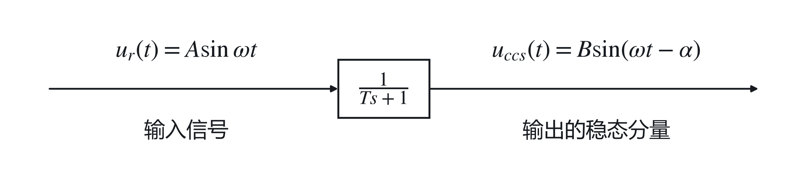

$$
G(s)=\frac1{Ts+1}.
$$

令 $s=j\omega$，则有

$$
G(j\omega)=\frac1{1+jT\omega}.
$$

于是

$$
\begin{cases}
\displaystyle \frac BA=|G(j\omega)|
=\frac1{\sqrt{1+T^2\omega^2}},\\[6pt]
\angle G(j\omega)=-\alpha=-\arctan(\omega T).
\end{cases}
$$

<strong>推广到 $n$ 阶线性定常系统。</strong>

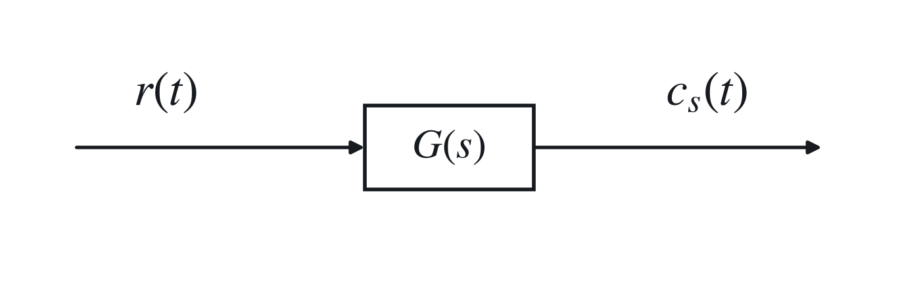

<strong>$G(j\omega)$ 定义为系统的频率特性：</strong>

① 极坐标形式为

$$
G(j\omega)=|G(j\omega)|e^{j\angle G(j\omega)}.
$$

<strong>幅频特性为输出稳态正弦分量与输入正弦信号的振幅之比。</strong> 设二者振幅分别为 $A_c$、$A_r$，则

$$
{\color{#c62828}|G(j\omega)|=\frac{A_c}{A_r}}.
$$

对于上述惯性环节，

$$
{\color{#c62828}|G(j\omega)|=\frac1{\sqrt{1+\omega^2T^2}}}.
$$

<strong>相频特性为输出稳态正弦分量与输入正弦信号的相位差。</strong>

$$
{\color{#c62828}\angle G(j\omega)=\varphi_c-\varphi_r
=-\arctan(\omega T)}.
$$

② 由传递函数求频率特性：

$$
G(j\omega)=\left.G(s)\right|_{s=j\omega}
=\left.\frac1{1+Ts}\right|_{s=j\omega}.
$$

注意：频率特性是从正弦的稳态响应求出的，但表示的是动态特性。

不稳定系统不能通过等待暂态衰减来观察到上述正弦稳态频率响应；但在 $j\omega$ 不是极点时，仍可由传递函数计算 $G(j\omega)$。

### （2）频率特性的几何表示法

#### ① 幅相特性（Nyquist）

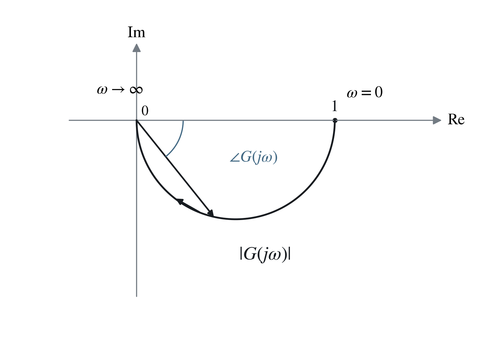

#### ② 对数频率特性（Bode）

对数幅频特性：

$$
L(\omega)=20\lg|G(j\omega)|.
$$

对数相频特性：

$$
\varphi(\omega)=\angle G(j\omega).
$$

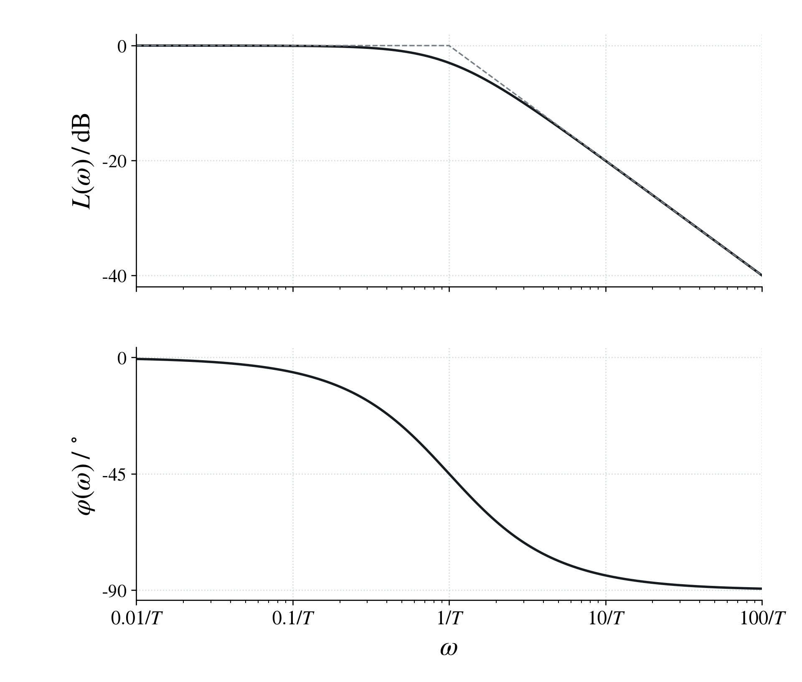

#### ③ 对数幅相特性（Nichols）

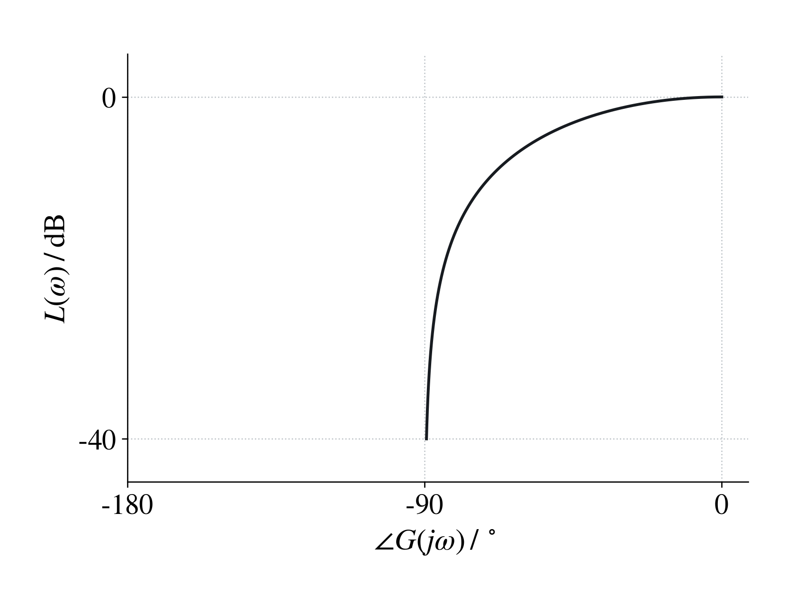

### （3）典型环节的频率特性——Nyquist 图

典型环节按本课程的开环零、极点位置分类：

- 最小相位环节：开环零、极点均在 $s$ 左半平面。
- 非最小相位环节：存在 $s$ 右半平面的开环零点或极点。

以下涉及正增益和时间常数时，取 $K>0$、$T>0$；积分、微分环节的原点零、极点单独讨论。

#### ① 比例环节

$$
G(s)=G(j\omega)=K,
\qquad |G(j\omega)|=K,
\qquad \angle G(j\omega)=0^\circ.
$$

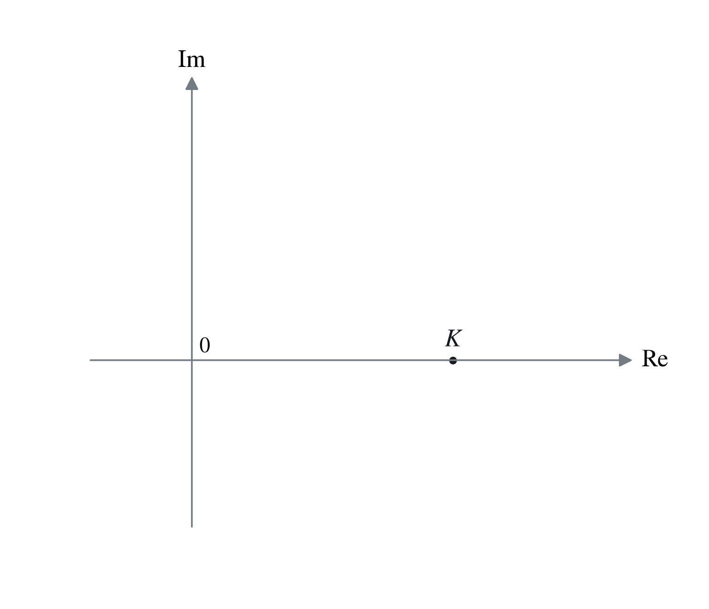

#### ② 微分环节

$$
G(s)=s,\qquad G(j\omega)=j\omega,
$$

$$
|G(j\omega)|=\omega,\qquad
\angle G(j\omega)=90^\circ.
$$

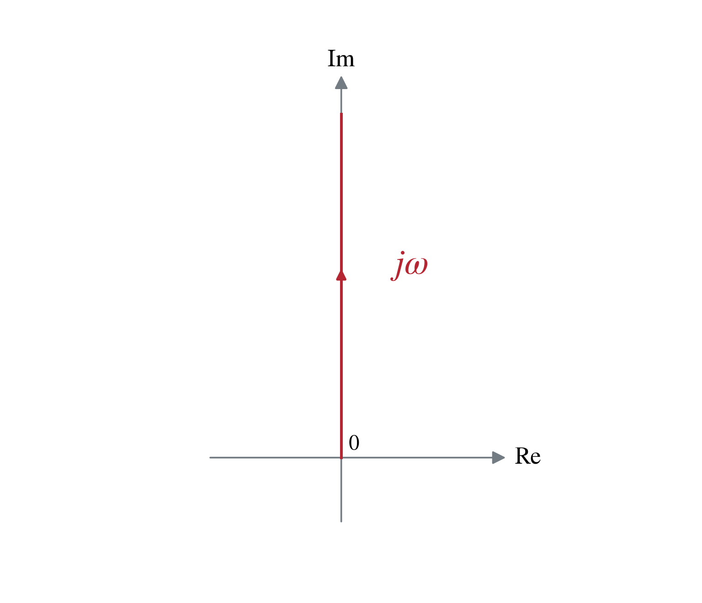

#### ③ 积分环节

$$
G(s)=\frac1s,\qquad G(j\omega)=\frac1{j\omega},
$$

$$
|G(j\omega)|=\frac1\omega,\qquad
\angle G(j\omega)=-90^\circ.
$$

注意：箭头方向为 $\omega$ 从 $0\to\infty$ 时的方向。

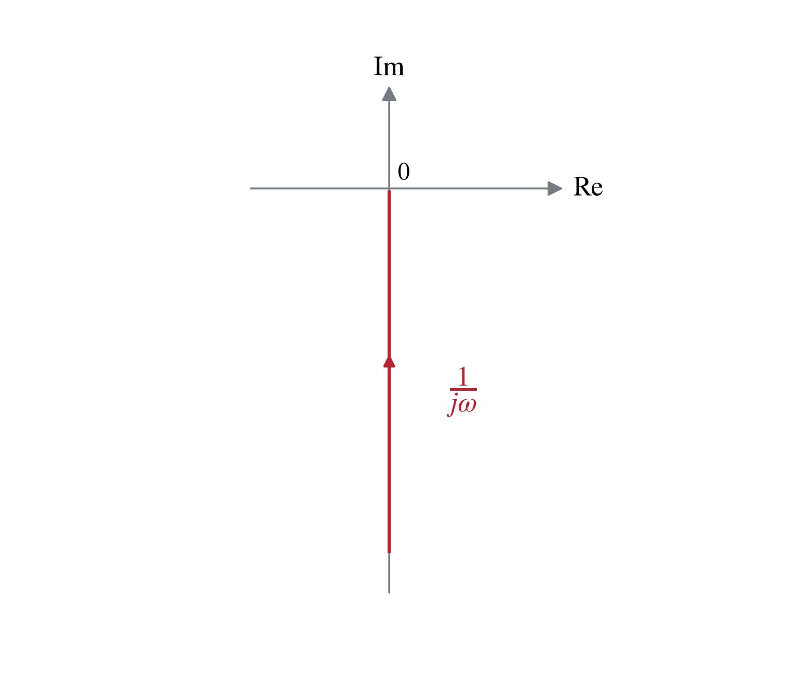

#### ④ 惯性环节

$$
G(s)=\frac1{Ts+1},\qquad
G(j\omega)=\frac1{1+j\omega T},
$$

$$
|G(j\omega)|=\frac1{\sqrt{1+\omega^2T^2}},
\qquad
\angle G(j\omega)=-\arctan(\omega T).
$$

> 易证
>
> $$
> |G(j\omega)|=\cos\bigl(\angle G(j\omega)\bigr),
> $$
>
> 即极坐标下半圆的表达式 $r=\cos\theta$（$-\pi/2\leq\theta\leq0$），故可直接绘出 Nyquist 图。

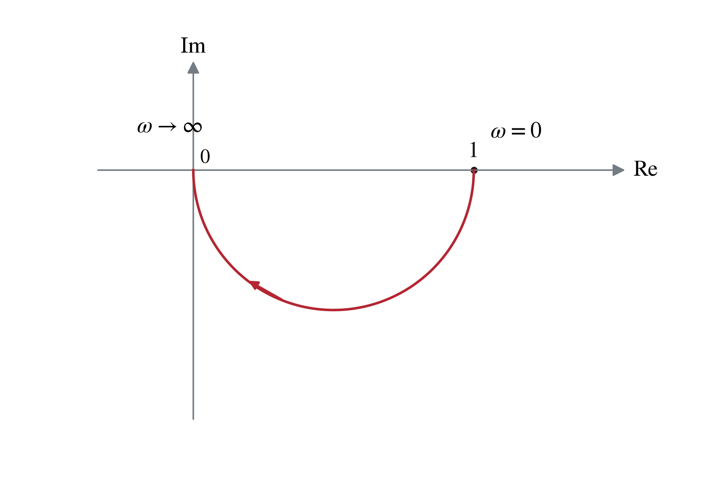

不稳定惯性环节：

$$
G(s)=\frac1{Ts-1},\qquad
G(j\omega)=\frac1{-1+j\omega T},
$$

$$
|G(j\omega)|=\frac1{\sqrt{1+\omega^2T^2}},
\qquad
\angle G(j\omega)=-180^\circ+\arctan(\omega T).
$$

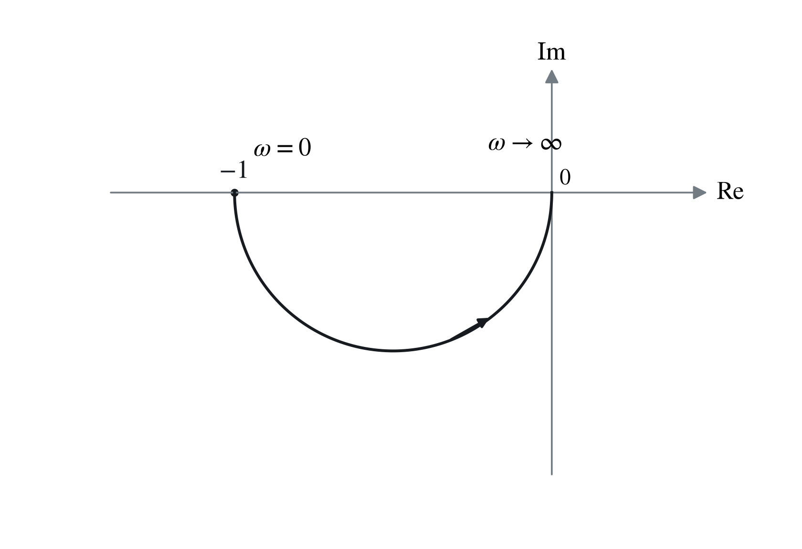

#### ⑤ 一阶微分环节

$$
G(s)=Ts+1,\qquad G(j\omega)=1+j\omega T,
$$

$$
|G(j\omega)|=\sqrt{1+\omega^2T^2},
\qquad
\angle G(j\omega)=\arctan(\omega T).
$$

当

$$
G(s)=Ts-1,\qquad G(j\omega)=-1+j\omega T,
$$

则

$$
|G(j\omega)|=\sqrt{1+\omega^2T^2},
\qquad
\angle G(j\omega)=180^\circ-\arctan(\omega T).
$$

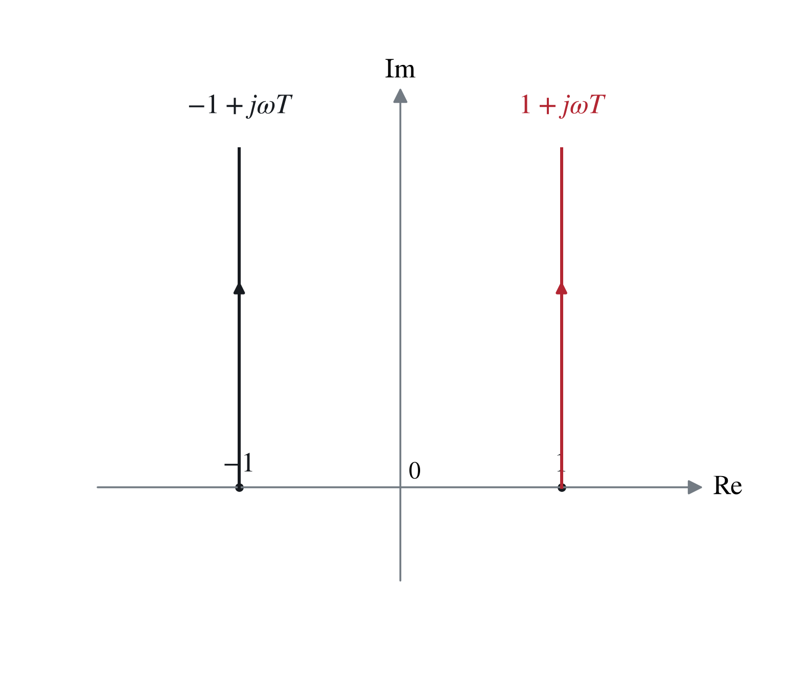

#### ⑥ 振荡环节

$$
G(s)=\frac{\omega_n^2}{s^2+2\zeta\omega_ns+\omega_n^2},
$$

$$
G(j\omega)=
\frac1{1-\dfrac{\omega^2}{\omega_n^2}
+j\,2\zeta\dfrac{\omega}{\omega_n}}.
$$

$$
{\color{#c62828}
|G(j\omega)|=
\frac1{\sqrt{\left(1-\dfrac{\omega^2}{\omega_n^2}\right)^2
+\left(2\zeta\dfrac{\omega}{\omega_n}\right)^2}}
}.
$$

相角须按象限取值。令

$$
\theta(\omega)=
\begin{cases}
\displaystyle
\arctan\frac{2\zeta\omega/\omega_n}{1-\omega^2/\omega_n^2},
&0\leq\omega<\omega_n,\\[6pt]
90^\circ,&\omega=\omega_n,\\[3pt]
\displaystyle
180^\circ+\arctan\frac{2\zeta\omega/\omega_n}{1-\omega^2/\omega_n^2},
&\omega>\omega_n,
\end{cases}
$$

则

$$
{\color{#c62828}\angle G(j\omega)=-\theta(\omega)}.
$$

当 $\omega$ 从 $0$ 到 $\omega_n$ 时，$\angle G$ 从 $0^\circ$ 到 $-90^\circ$；$\omega=\omega_n$ 时，$\angle G=-90^\circ$；当 $\omega$ 从 $\omega_n$ 到 $\infty$ 时，$\angle G$ 从 $-90^\circ$ 趋向 $-180^\circ$。

转折点为 $\omega=\omega_n$，此时

$$
{\color{#c62828}|G(j\omega_n)|=\frac1{2\zeta},
\qquad \angle G(j\omega_n)=-90^\circ}.
$$

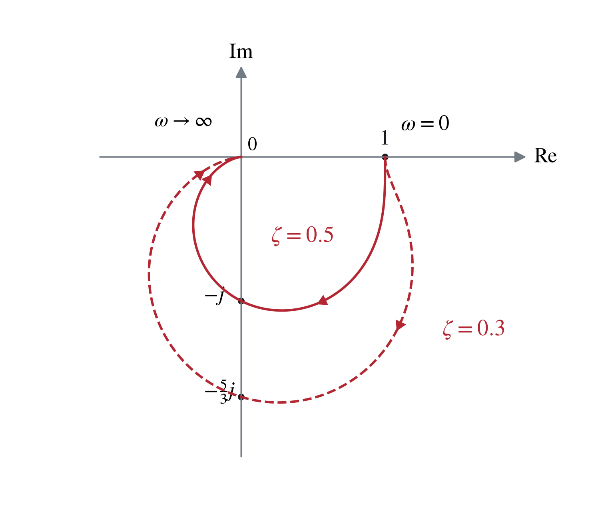

$|G|$ 在变化过程中可能出现最大值，即<strong>谐振现象</strong>。

谐振点：由

$$
\frac{\mathrm d|G|}{\mathrm d\omega}=0
$$

得

$$
{\color{#c62828}
\omega_r=\omega_n\sqrt{1-2\zeta^2},
\qquad
M_r=|G(j\omega_r)|=\frac1{2\zeta\sqrt{1-\zeta^2}}
}.
$$

显然 $\omega_r<\omega_n$，只有当 $0<\zeta<1/\sqrt2$ 时才有谐振峰。

不稳定振荡环节：

$$
G(s)=\frac{\omega_n^2}{s^2-2\zeta\omega_ns+\omega_n^2},
$$

$$
G(j\omega)=
\frac1{1-\dfrac{\omega^2}{\omega_n^2}
-j\,2\zeta\dfrac{\omega}{\omega_n}},
$$

$$
|G(j\omega)|=
\frac1{\sqrt{\left(1-\dfrac{\omega^2}{\omega_n^2}\right)^2
+\left(2\zeta\dfrac{\omega}{\omega_n}\right)^2}},
\qquad
\angle G(j\omega)=\theta(\omega).
$$

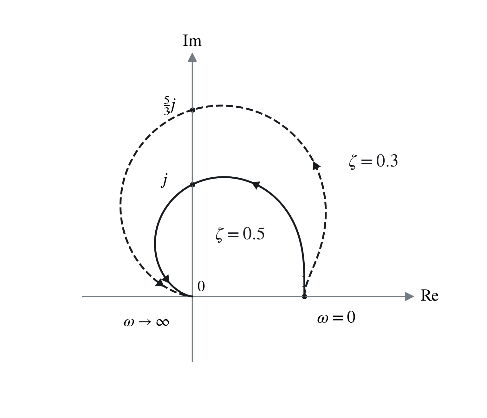

#### ⑦ 二阶微分环节

令 $T=1/\omega_n$，则

$$
G(s)=T^2s^2+2\zeta Ts+1,
$$

$$
G(j\omega)=1-\frac{\omega^2}{\omega_n^2}
+j\,2\zeta\frac{\omega}{\omega_n},
$$

$$
|G(j\omega)|=
\sqrt{\left(1-\frac{\omega^2}{\omega_n^2}\right)^2
+\left(2\zeta\frac{\omega}{\omega_n}\right)^2},
\qquad
\angle G(j\omega)=\theta(\omega).
$$

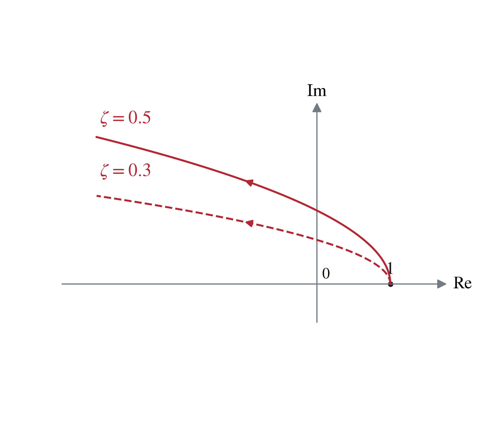

含右半平面零点的情形：

$$
G(s)=T^2s^2-2\zeta Ts+1,
$$

$$
G(j\omega)=1-\frac{\omega^2}{\omega_n^2}
-j\,2\zeta\frac{\omega}{\omega_n},
\qquad
\angle G(j\omega)=-\theta(\omega).
$$

其幅频特性与上式相同。

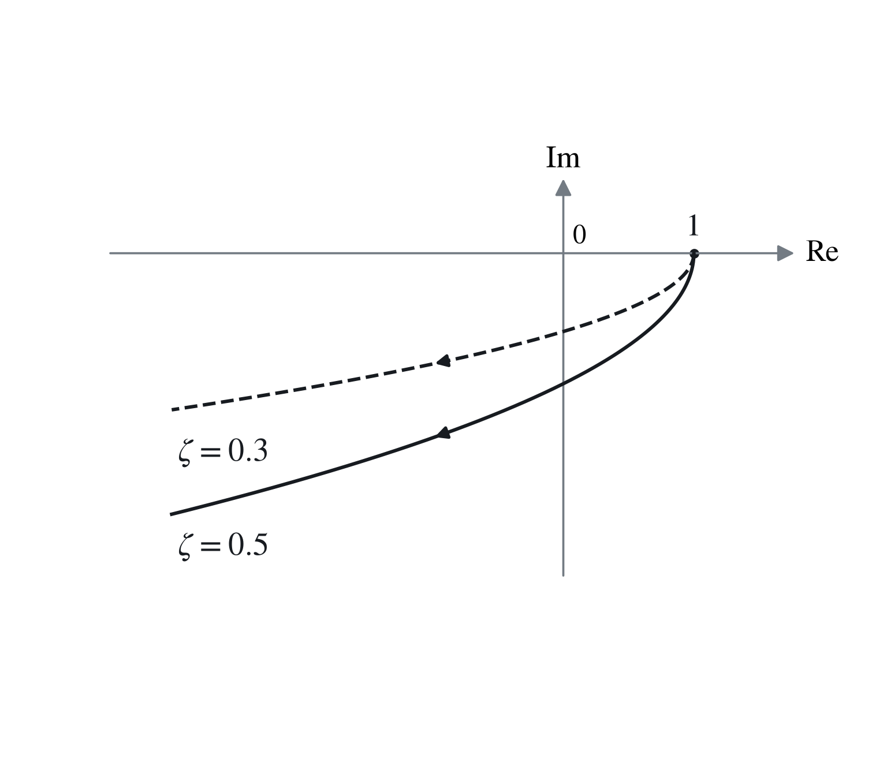

#### ⑧ 延迟环节

$$
G(s)=e^{-\tau s},\qquad G(j\omega)=e^{-j\omega\tau},
$$

$$
|G(j\omega)|=1,\qquad
\angle G(j\omega)=-\tau\omega.
$$

此处相角单位为弧度。

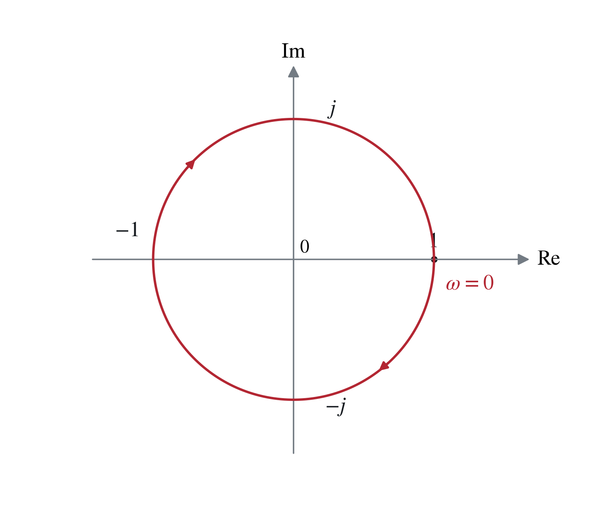

### （4）开环幅相特性曲线的绘制

确定起点、终点、象限、与实轴和虚轴的交点。

> <strong>几个环节串联时：</strong>
>
> $$
> {\color{#c62828}
> G(j\omega)=G_1(j\omega)G_2(j\omega)\cdots
> }
> $$
>
> $$
> {\color{#c62828}
> \begin{cases}
> \angle G(j\omega)=\angle G_1(j\omega)+\angle G_2(j\omega)+\cdots,\\
> |G(j\omega)|=|G_1(j\omega)|\,|G_2(j\omega)|\cdots.
> \end{cases}
> }
> $$
>
> 确定起点（$\omega=0$）：
>
> - 每个积分环节贡献 $-90^\circ$，每个微分环节贡献 $+90^\circ$；其余直流值为正的标准环节不贡献起始相角。
> - 无积分、微分环节时，起点幅值为放大环节的增益 $K$；有净积分环节时为 $\infty$。
>
> 确定终点（$\omega\to\infty$）：
>
> - 若 $n$ 为分母阶次、$m$ 为分子阶次，且按正高频系数的标准形式分解，则终端相角方向为 $(n-m)(-90^\circ)$。
> - 对严格真有理系统（$n>m$），沿该方向趋向原点。

### （5）典型环节的 Bode 图

#### ① 比例环节

$$
G(j\omega)=K,\qquad
L(\omega)=20\lg K,\qquad
\varphi(\omega)=0^\circ.
$$

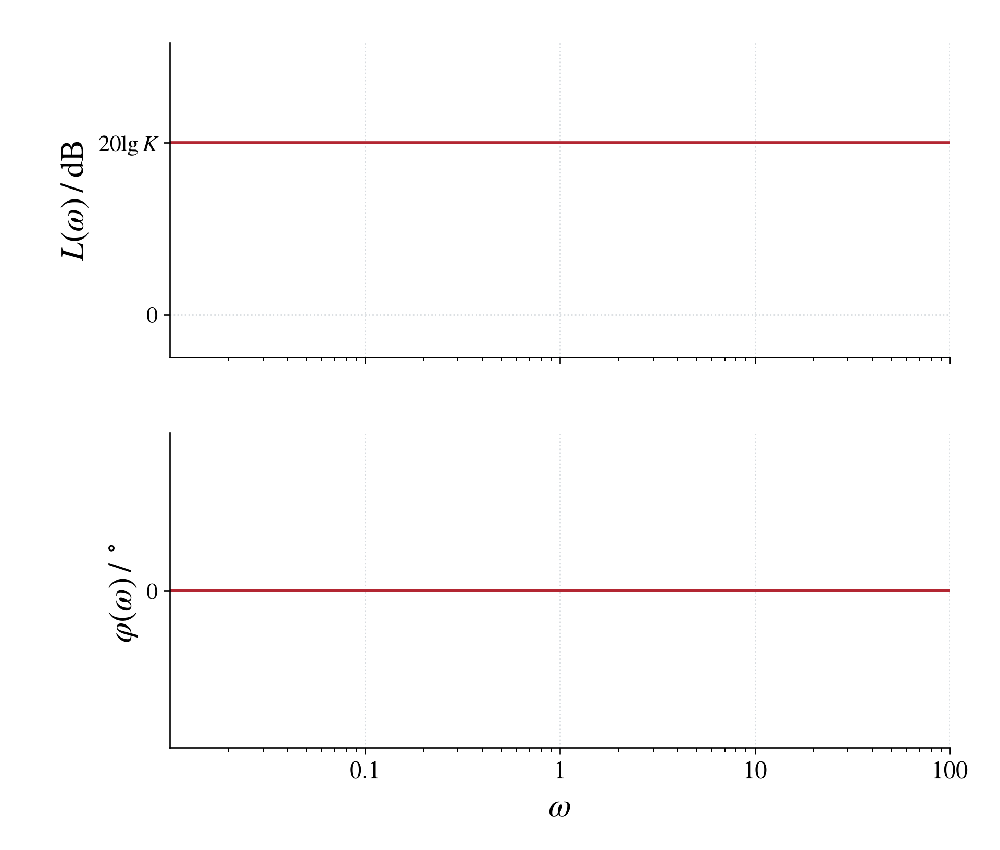

#### ② 微分环节、积分环节

微分环节：

$$
G(j\omega)=j\omega,\qquad
L(\omega)=20\lg\omega,\qquad
\varphi(\omega)=90^\circ.
$$

积分环节：

$$
G(j\omega)=\frac1{j\omega},\qquad
L(\omega)=-20\lg\omega,\qquad
\varphi(\omega)=-90^\circ.
$$

<strong>事实上，横轴间隔为 $\lg\omega$。</strong>

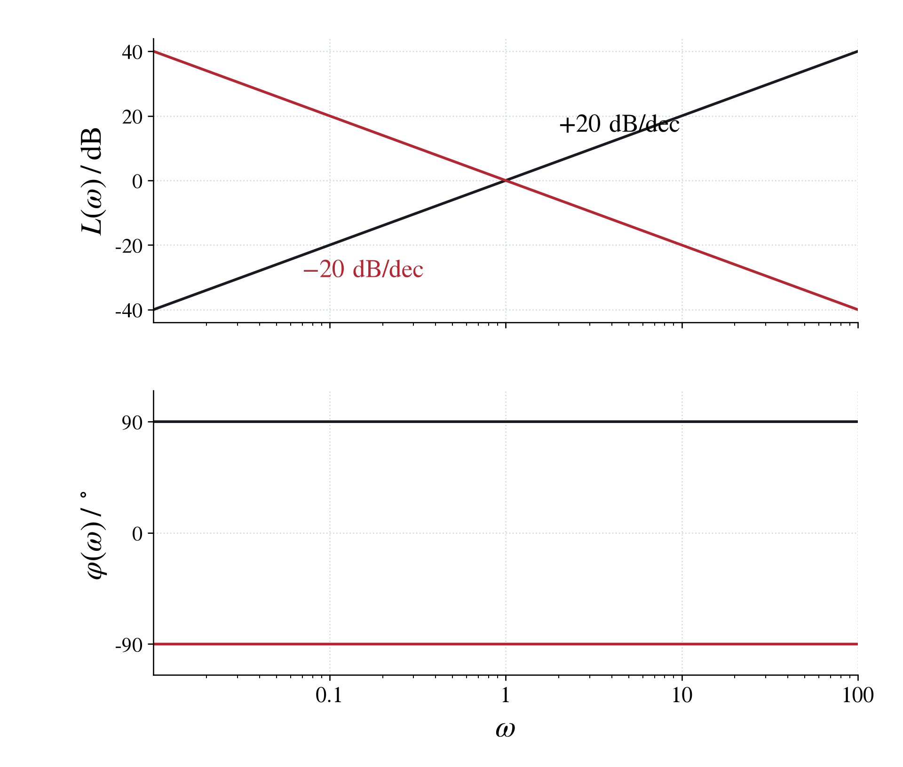

#### ③ 惯性环节

$$
G(j\omega)=\frac1{\pm1+j\omega T}.
$$

两种情形的幅频特性相同：

$$
L(\omega)=-20\lg\sqrt{1+\omega^2T^2}.
$$

相频特性分别为

$$
\varphi(\omega)=
\begin{cases}
-\arctan(\omega T),&G(j\omega)=1/(1+j\omega T),\\
-180^\circ+\arctan(\omega T),&G(j\omega)=1/(-1+j\omega T).
\end{cases}
$$

当 $\omega\ll1/T$ 时，$L(\omega)\approx0$。

当 $\omega\gg1/T$ 时，

$$
L(\omega)\approx-20\left(\lg\omega-\lg\frac1T\right),
$$

为斜率 $-20\,\mathrm{dB/dec}$ 的直线，与 $\omega$ 轴交于 $\omega=1/T$。

故 <strong>$1/T$ 为转折频率。</strong>

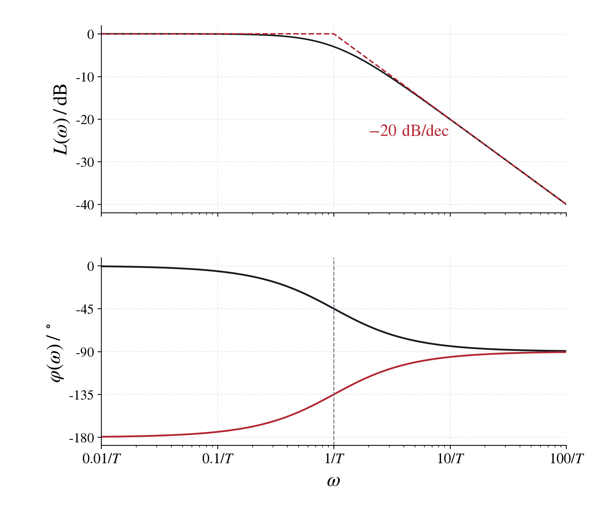

#### ④ 一阶微分环节

$$
G(j\omega)=\pm1+j\omega T,
$$

$$
L(\omega)=20\lg\sqrt{1+\omega^2T^2},
$$

$$
\varphi(\omega)=
\begin{cases}
\arctan(\omega T),&G(j\omega)=1+j\omega T,\\
180^\circ-\arctan(\omega T),&G(j\omega)=-1+j\omega T.
\end{cases}
$$

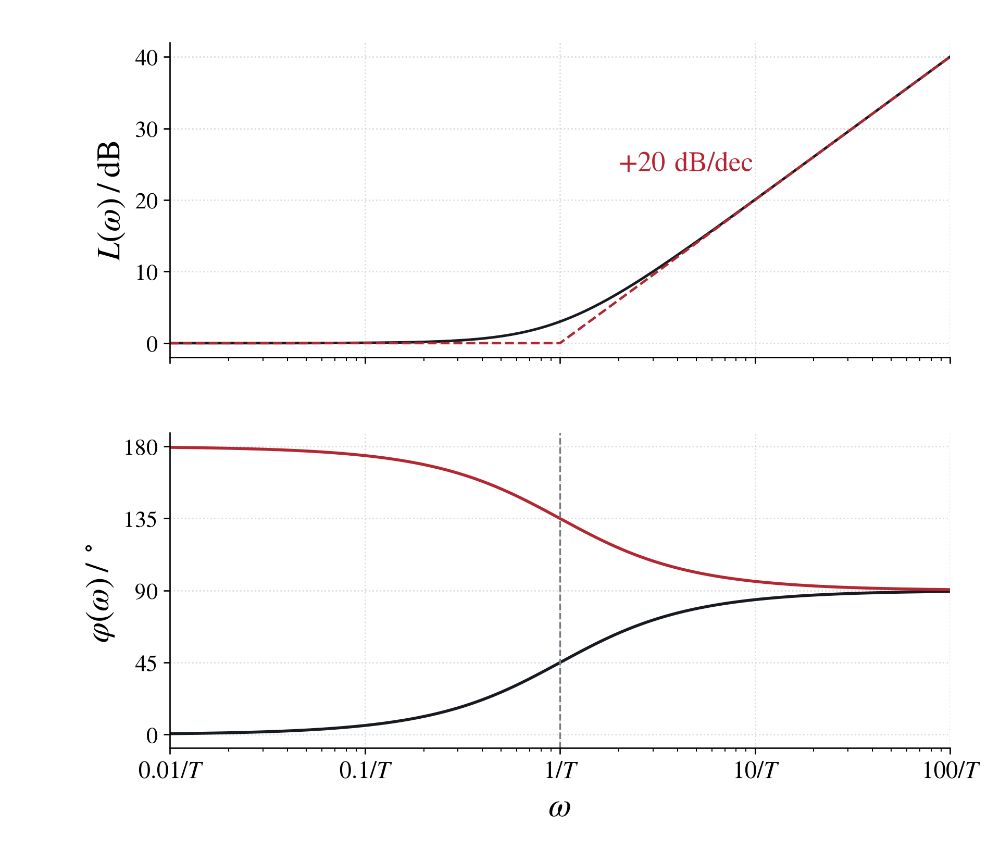

#### ⑤ 振荡环节

$$
G(j\omega)=
\frac1{1-\dfrac{\omega^2}{\omega_n^2}
\pm j\,2\zeta\dfrac{\omega}{\omega_n}},
$$

$$
L(\omega)=-20\lg
\sqrt{\left(1-\frac{\omega^2}{\omega_n^2}\right)^2
+\left(2\zeta\frac{\omega}{\omega_n}\right)^2}.
$$

相频特性为

$$
\varphi(\omega)=
\begin{cases}
-\theta(\omega),&\text{分母虚部取正号},\\
\theta(\omega),&\text{分母虚部取负号},
\end{cases}
$$

其中 $\theta(\omega)$ 的象限取值见本章振荡环节。后一条也可连续表示为 $\theta(\omega)-360^\circ$，与图中从 $-360^\circ$ 趋向 $-180^\circ$ 的分支一致。

若出现谐振现象，则 $L(\omega)$ 取最大值时

$$
\omega_r=\omega_n\sqrt{1-2\zeta^2}.
$$

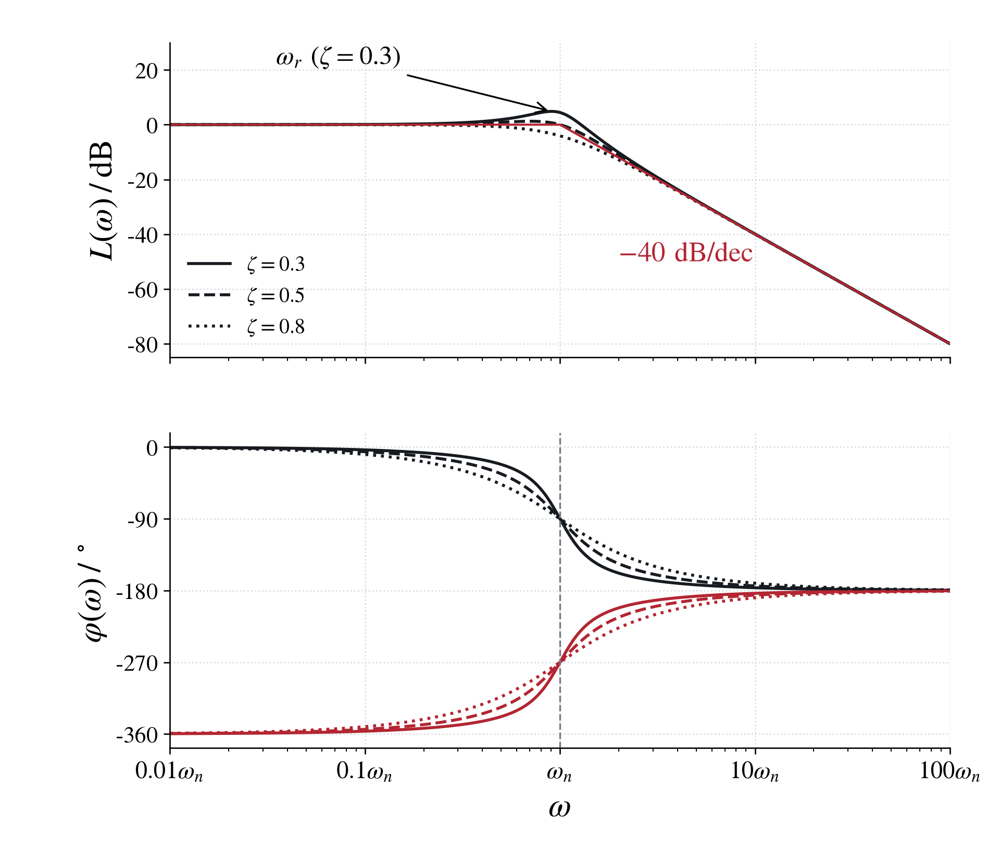

#### ⑥ 二阶微分环节

$$
G(j\omega)=1-\frac{\omega^2}{\omega_n^2}
\pm j\,2\zeta\frac{\omega}{\omega_n},
$$

$$
L(\omega)=20\lg
\sqrt{\left(1-\frac{\omega^2}{\omega_n^2}\right)^2
+\left(2\zeta\frac{\omega}{\omega_n}\right)^2},
$$

$$
\varphi(\omega)=
\begin{cases}
\theta(\omega),&\text{虚部取正号},\\
-\theta(\omega),&\text{虚部取负号}.
\end{cases}
$$

后一条相位也可连续表示为 $360^\circ-\theta(\omega)$，与图中从 $360^\circ$ 趋向 $180^\circ$ 的分支一致。

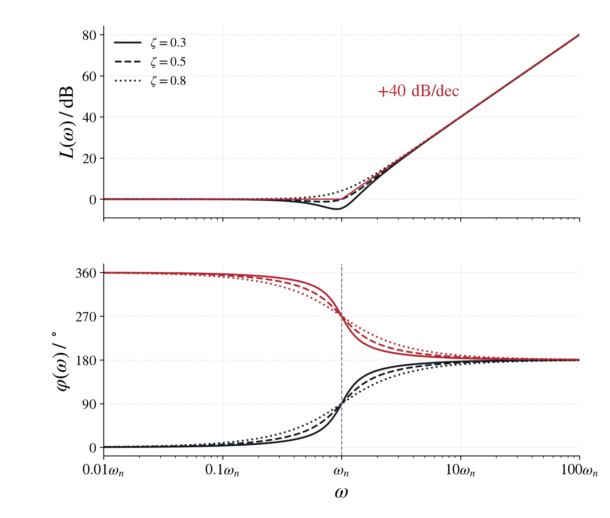

#### ⑦ 延迟环节

$$
G(j\omega)=e^{-j\omega\tau},
$$

$$
L(\omega)=0,\qquad
\varphi(\omega)=-\frac{180^\circ}{\pi}\tau\omega
\approx-57.3^\circ\tau\omega.
$$

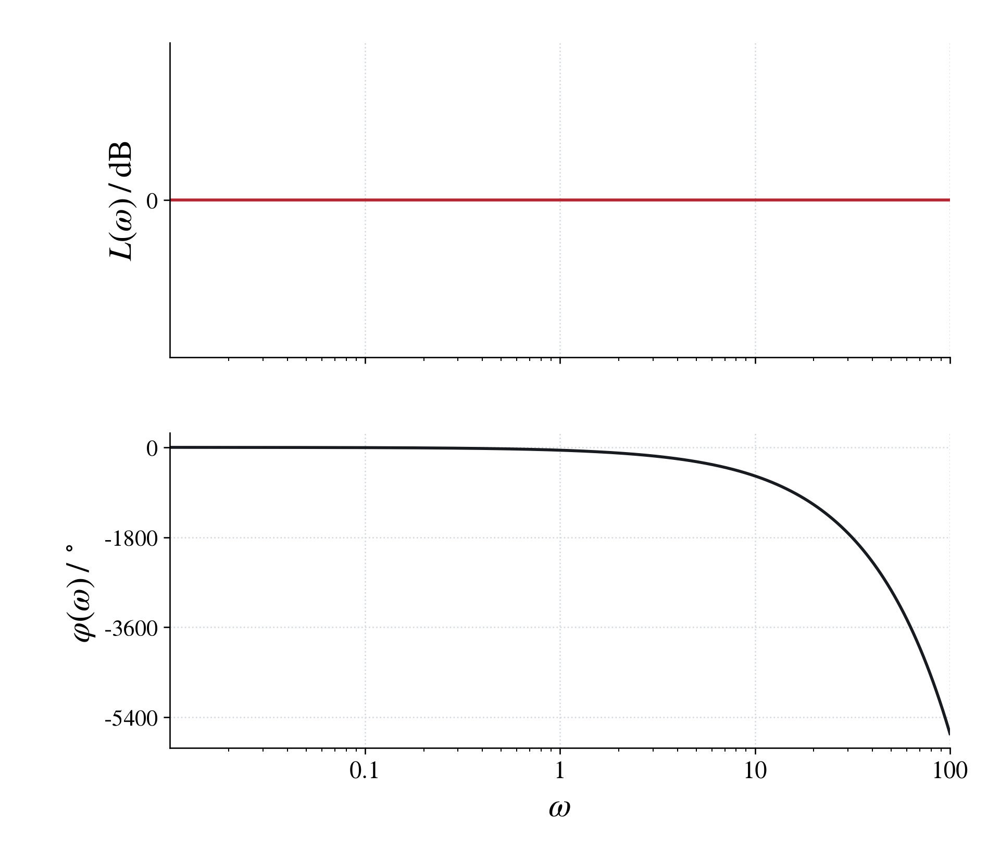

### （6）绘制系统开环 Bode 图

若

$$
G(s)H(s)=G_1(s)G_2(s)\cdots,
$$

则

$$
L(\omega)=L_1(\omega)+L_2(\omega)+\cdots,
$$

$$
\varphi(\omega)=\varphi_1(\omega)+\varphi_2(\omega)+\cdots,
$$

<strong>即相叠加。</strong>

绘制步骤：

1. 化为频率特性标准型，即典型环节相乘。
2. 列出转折频率。
3. 确定基准线：基准点为 <strong>$(\omega=1,\ 20\lg K)$</strong>，斜率为 $20\,\mathrm{dB/dec}$ 的整数倍；有 $\nu$ 个净积分环节时为 $-20\nu\,\mathrm{dB/dec}$。
4. 叠加作图。
5. 修正、检查。

> #### 剪切频率
>
> 若
>
> $$
> G(s)=\frac K{Ts+1},
> $$
>
> $L(\omega)$ 穿过 $0\,\mathrm{dB}$ 时的频率 $\omega_c$ 称为剪切频率，也称增益交越频率。
>
> 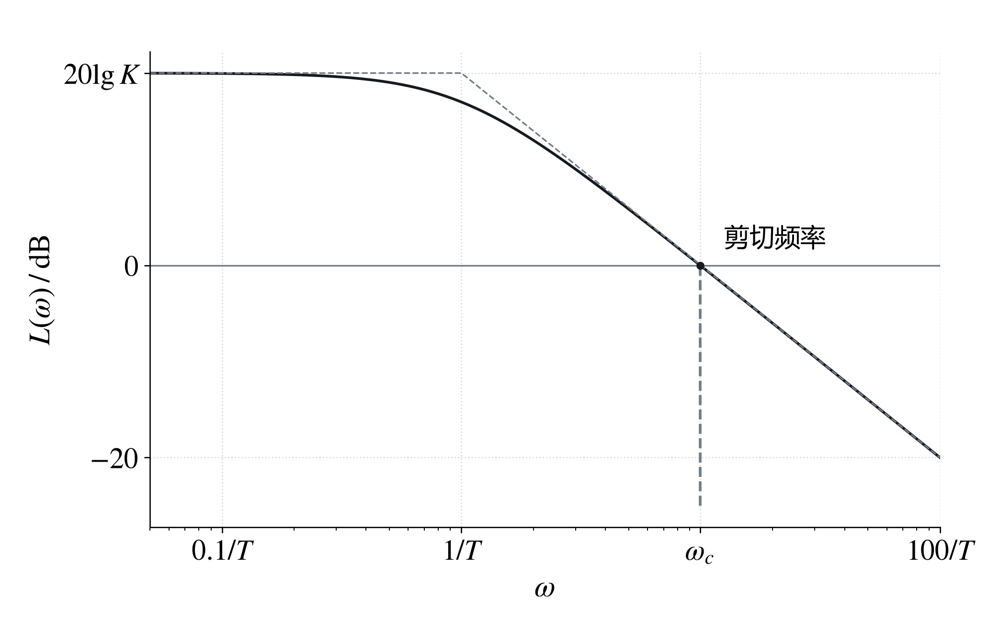
>
> 例：
>
> $$
> G(s)=\frac Ks.
> $$
>
> 则 $L(\omega)$ 曲线过 $(1,20\lg K)$，过该点的直线为
>
> $$
> L(\omega)=-20\lg\omega+20\lg K.
> $$
>
> 故
>
> $$
> {\color{#c62828}\omega_c=K}.
> $$
>
> 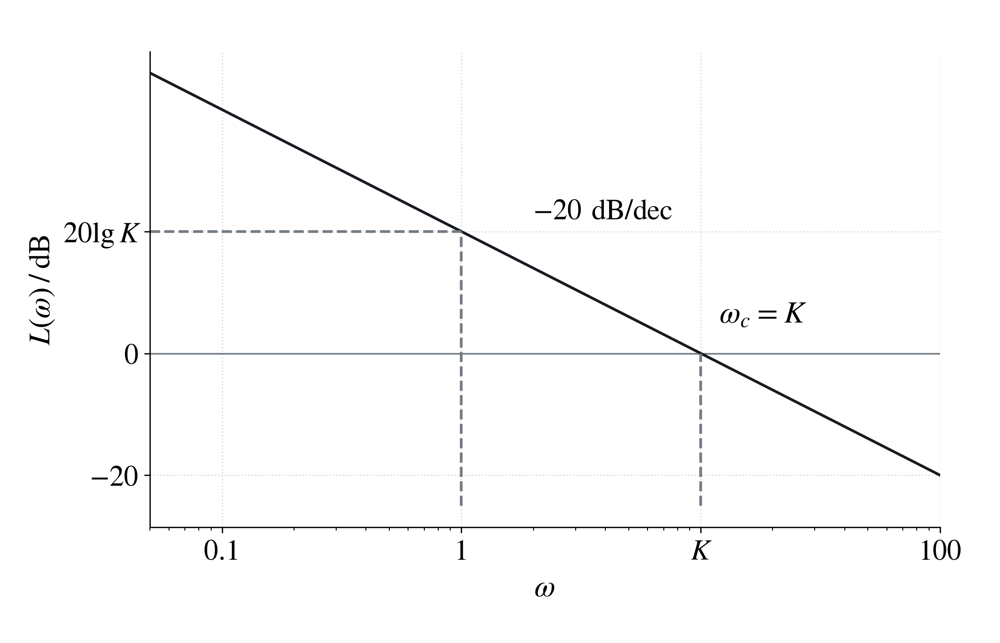

> #### 修正
>
> 例如对某个振荡环节：
>
> $$
> G(s)=\frac K{\dfrac1{\omega_n^2}s^2
> +2\zeta\dfrac s{\omega_n}+1},
> \qquad
> \omega_r=\omega_n\sqrt{1-2\zeta^2}.
> $$
>
> 在 $\omega_n$ 处，相对幅频渐近线的修正值为
>
> $$
> 20\lg\frac1{2\zeta}.
> $$
>
> 存在谐振峰时，在 $\omega_r$ 处的修正值为
>
> $$
> 20\lg\frac1{2\zeta\sqrt{1-\zeta^2}}.
> $$
>
> 两处的实际对数幅值均还需加上 $20\lg K$。
>
> 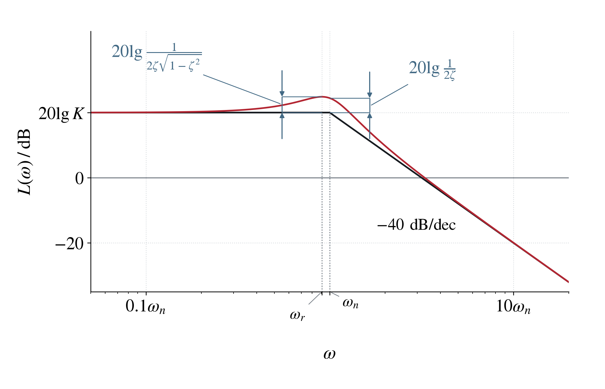

## 2. 频率域稳定判据

由开环频率特性直接判定闭环系统的稳定性。

> 代数稳定判据 Routh 则是根据特征方程 $D(s)=0$ 判断。

### （1）Nyquist 判据

以下按实系数、负反馈系统讨论；特征多项式没有虚轴根时使用严格稳定判据。相角变化均指连续展开的相角变化。

#### ① 特征多项式的相角变化

闭环系统若稳定，则特征方程 $D(s)=0$ 的 $n$ 个根全在左半平面。

当 $\omega$ 从 $0\to+\infty$ 变化时，

$$
D(j\omega)=(j\omega-s_1)(j\omega-s_2)\cdots(j\omega-s_n)
$$

的相角变化为 $n\pi/2$，即

$$
{\color{#c62828}
\Delta\angle D(j\omega)=n\frac\pi2,\qquad\omega:0\to+\infty
}.
$$

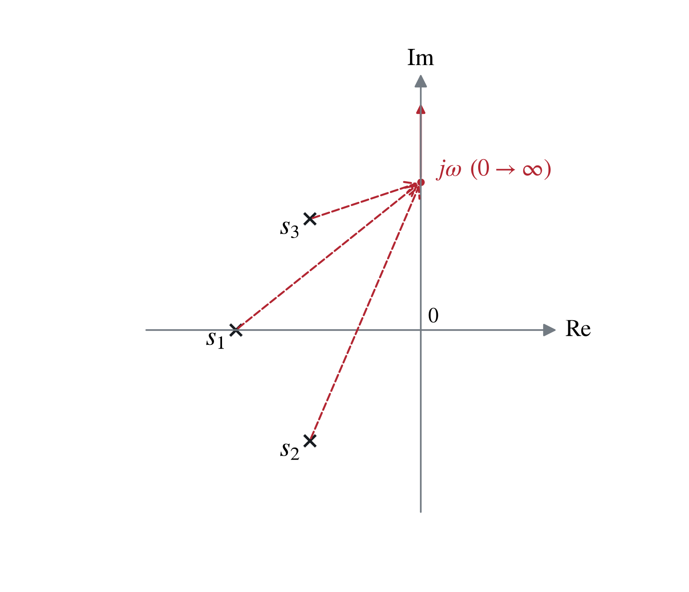

若右半平面存在根，右半平面实根对相角变化的贡献为 $-\pi/2$，共轭根对的合计贡献按每根 $-\pi/2$ 计；此时总相角变化不再为 $n\pi/2$。

因此

$$
{\color{#c62828}
\text{闭环系统稳定}
\iff
\Delta\angle D(j\omega)=n\frac\pi2,\qquad \omega:0\to+\infty
}.
$$

#### ② 辅助函数

记开环传递函数

$$
G(s)H(s)=\frac{KM(s)}{N(s)},
$$

则闭环特征方程为

$$
D(s)=N(s)+KM(s)=0.
$$

记辅助函数

$$
{\color{#c62828}
F(s)=1+G(s)H(s)=\frac{D(s)}{N(s)}
}.
$$

一般 $\deg M<\deg N$，此时 $\deg D=\deg N=n$。

**（i）若开环稳定**

$N(s)=0$ 的根 $p_1,\ldots,p_n$ 全在左半平面，

$$
\Delta\angle N(j\omega)=n\frac\pi2,\qquad\omega:0\to+\infty.
$$

故

$$
{\color{#c62828}
\text{闭环稳定}
\iff
\Delta\angle F(j\omega)
=\Delta\angle D(j\omega)-\Delta\angle N(j\omega)=0
}.
$$

**（ii）若开环不稳定**

有 <strong>$P$ 个极点在右半平面</strong>，此时

$$
\Delta\angle N(j\omega)
={\color{#c62828}(n-P)\frac\pi2+P\left(-\frac\pi2\right)}
=(n-2P)\frac\pi2,
\qquad \omega:0\to+\infty.
$$

故

$$
{\color{#c62828}
\text{闭环稳定}\iff\Delta\angle F(j\omega)=P\pi
}.
$$

**（iii）若开环传递函数串联 $\nu$ 个积分环节**

$$
G(s)H(s)=\frac{KM(s)}{s^\nu N(s)}.
$$

将原来沿 $j\omega$ 轴的变化路线改为：从 $A(\varepsilon,0)$ 沿右上四分之一小圆弧到 $B(0,j\varepsilon)$，再沿正虚轴到 $j\infty$；$\varepsilon$ 为充分小的正数。

即将 $\omega:0\to\infty$ 对应的路径改为

$$
{\color{#c62828}
(0^+,j0)\to(0,j0^+)\to(0,j\infty)
}.
$$

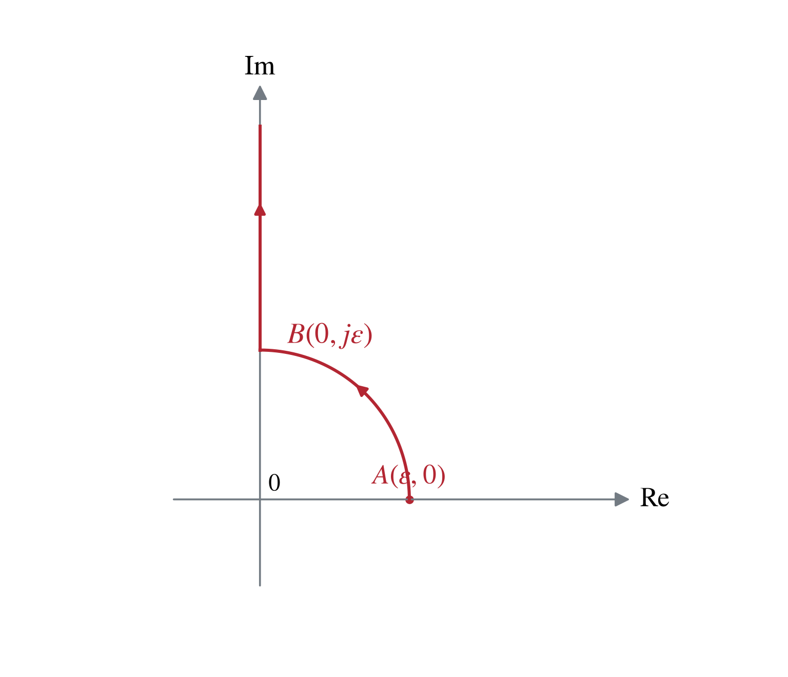

这样从判据围道中避开原点的 $\nu$ 个极点，$P$ 仍只计严格右半平面的开环极点；并非实际移动系统的极点。

沿增补路径仍有

$$
{\color{#c62828}
\text{闭环稳定}\iff\Delta\angle F=P\pi
}.
$$

#### ③ Nyquist 判据

<strong>对于 $\nu=0$ 的系统，若开环频率特性 $G(j\omega)H(j\omega)$ 的 Nyquist 曲线在 $\omega:0\to+\infty$ 时，绕 $(-1,j0)$ 转过的连续角度为 $P\pi$，则闭环系统稳定，否则不稳定。</strong>

<strong>当 $\nu\neq0$ 时，需增补曲线：补充 $(0^+,j0)\to(0,j0^+)$ 段的映射。对低频系数为正的标准形式，从 $\mathrm{Re}$ 正方向起，以趋于无穷大的半径顺时针画过 $\nu\pi/2$。</strong>

例：

$$
G(s)H(s)=\frac{K(s+1)}{s^2(2s+1)},\qquad K>0.
$$

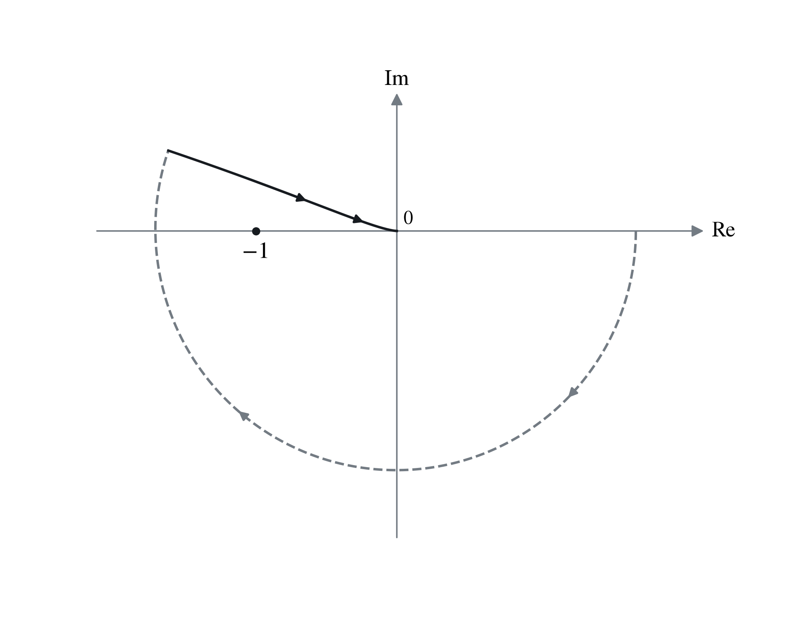

增补的 Nyquist 曲线绕 $(-1,j0)$ 转过 $-2\pi$，而 $P=0$，系统不稳定。

$$
\boxed{\color{#c62828}Z=P-2N}
$$

- $Z$ 为右半平面闭环极点个数。
- $P$ 为右半平面开环极点个数。
- $N$ 为上述增补后的**正频率曲线**绕 $(-1,j0)$ 的有向圈数，逆时针为正；可用正、负穿越次数计算：

$$
N=N_+-N_-.
$$

其中 $N_+$ 为正穿越次数，$N_-$ 为负穿越次数；端点半穿越按 $\pm1/2$ 计数。计算结果 $Z$ 不可能小于 $0$。

> 正穿越：曲线沿频率增大的方向，从上向下穿过实轴上 $(-\infty,-1)$ 这一段；负穿越方向相反。
>
> 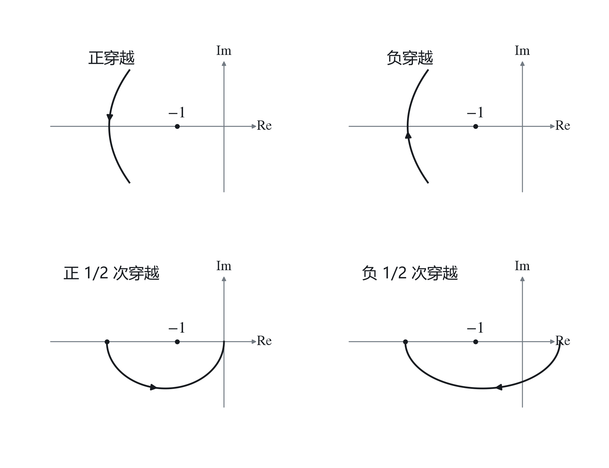

这里的 $N$ 使用正频率半曲线的约定，不能与完整正、负频率 Nyquist 曲线的圈数混用。若采用完整曲线并令逆时针圈数为 $N_{\mathrm{full}}$，则

$$
N_{\mathrm{full}}=2N,\qquad Z=P-N_{\mathrm{full}}.
$$

若曲线经过 $(-1,j0)$，闭环存在虚轴特征根，需单独分析临界情形，不能直接作为严格稳定处理。
